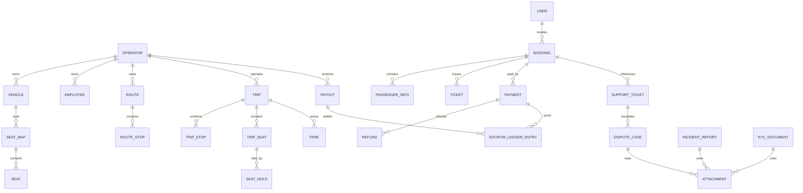

# 04. Database Design - Hệ thống đặt vé xe khách

## 1. Thông tin tài liệu

### 1.1. Metadata

| Thuộc tính        | Giá trị                     |
| ----------------- | --------------------------- |
| Tên tài liệu      | Database Design             |
| Mã tài liệu       | 04-database-design          |
| Dự án             | Hệ thống đặt vé xe khách    |
| Phiên bản         | v1.4                        |
| Trạng thái        | Approved                    |
| Người viết        | AI Agent, Nguyễn Hồng Khanh |
| Người duyệt       | Nguyễn Hồng Khanh           |
| Ngày tạo          | 11/05/2026                  |
| Cập nhật gần nhất | 13/05/2026                  |

### 1.2. Lịch sử thay đổi

| Phiên bản | Ngày       | Người cập nhật              | Nội dung thay đổi                                                                                                                                                                                                                                         |
| --------- | ---------- | --------------------------- | --------------------------------------------------------------------------------------------------------------------------------------------------------------------------------------------------------------------------------------------------------- |
| v1.4      | 13/05/2026 | AI Agent, Nguyễn Hồng Khanh | Đóng DB-OP-01..05: chốt MongoDB replica set cho operational DB V1, ledger append-only typed, retention/storage policy baseline, session/idempotency/callback retention và catalog seed Admin Ops                                                          |
| v1.3      | 13/05/2026 | AI Agent, Nguyễn Hồng Khanh | Viết lại toàn bộ Database Design từ các tài liệu Approved 01/02/03; bổ sung collection/table logical, field contract, index, constraint, SeatHold DB-authoritative hybrid, idempotency, ledger, file metadata, audit/retention và OP còn thiếu quyết định |
| v1.2      | 12/05/2026 | AI Agent                    | Đồng bộ quyết định LLD: SeatHold DB-authoritative hybrid và S3-compatible file storage                                                                                                                                                                    |
| v1.1      | 11/05/2026 | AI Agent                    | Tạo bản nháp Database Design từ SRS/HLD                                                                                                                                                                                                                   |

### 1.3. Trạng thái sử dụng

Tài liệu này ở trạng thái `Draft`. Nội dung v1.4 đã đóng các DB-OP phát sinh trong v1.3 và đủ để reviewer kiểm tra mô hình dữ liệu V1, nhưng chưa được dùng như nguồn triển khai chính thức cho migration production cho đến khi được chuyển sang `Review` / `Approved`.

Tài liệu này KHÔNG dựa vào source code hiện tại. Các tên `collection` / `table` bên dưới là logical record-set để phục vụ thiết kế. Từ v1.4, operational database target cho V1 được chốt là MongoDB replica set; cú pháp physical index/migration vẫn phải được viết trong migration script sau, không viết trong tài liệu này.

---

## 2. Mục lục

1. Thông tin tài liệu
2. Mục lục
3. Giới thiệu
4. Nguồn đầu vào và phạm vi thiết kế
5. Baseline quyết định dữ liệu
6. Nguyên tắc thiết kế database
7. Phân loại dữ liệu và ownership
8. Danh mục collection / table logical
9. Field contract theo nhóm dữ liệu
10. Reference, snapshot và lịch sử trạng thái
11. Index, unique constraint và query pattern
12. Transaction, lock, TTL và idempotency
13. Thiết kế SeatHold và TripSeat
14. Thiết kế booking, ticket và payment
15. Thiết kế escrow ledger, commission và payout
16. File metadata, attachment và object storage
17. Reporting, job, outbox và reconciliation
18. Retention, archive, soft delete và backup priority
19. Migration, seed và schema versioning
20. Traceability, rủi ro và OP đã xử lý
21. Phụ lục

---

## 3. Giới thiệu

### 3.1. Mục đích

Tài liệu này chuyển SRS v1.20, HLD v1.13 và LLD v1.2 đã `Approved` thành thiết kế dữ liệu cho Backend V1 của hệ thống đặt vé xe khách managed marketplace.

Tài liệu chốt ở mức Database Design:

- Nhóm collection / table logical, owner capability và tenant boundary.
- Field contract tối thiểu cho dữ liệu nghiệp vụ, snapshot, audit, ledger và job.
- Reference strategy, unique constraint, index và query pattern chính.
- Boundary transaction, idempotency, TTL, lock và state history cho luồng rủi ro cao.
- Cách cụ thể hóa SeatHold DB-authoritative hybrid, payment callback, ticket issuance, ledger, payout và attachment metadata.

### 3.2. Ngoài phạm vi

| Ngoài phạm vi                                                                         | Tài liệu / owner nhận                 |
| ------------------------------------------------------------------------------------- | ------------------------------------- |
| Contract request / response, webhook VNPay, error code chi tiết                       | `05-api-specification.md`             |
| Permission matrix, token/session TTL, re-auth, masking rule chi tiết, secret handling | `07-security-permission-design.md`    |
| Test case đồng thời, provider failure, backup/restore rehearsal                       | `08-test-plan-acceptance-criteria.md` |
| Deployment target, backup schedule, monitoring/logging/alert stack, incident runbook  | `09-deployment-operation-standard.md` |
| Physical database engine, queue engine, syntax migration cụ thể                       | Quyết định kỹ thuật / ADR sau review  |

---

## 4. Nguồn đầu vào và phạm vi thiết kế

### 4.1. Nguồn được dùng

| Ưu tiên | Nguồn                                            | Trạng thái | Cách dùng trong tài liệu này                                                                       |
| ------- | ------------------------------------------------ | ---------- | -------------------------------------------------------------------------------------------------- |
| 1       | `@SDLC/01-srs-he-thong-dat-ve-xe-khach` v1.20 | Approved   | Nguồn nghiệp vụ chính: entity, FR, NFR, UC, BR, AC, state và decisions log.                        |
| 2       | `@SDLC/02-hld-he-thong-dat-ve-xe-khach` v1.13 | Approved   | Nguồn ownership, consistency class, transaction boundary, handoff DB.                              |
| 3       | `@SDLC/03-lld-he-thong-dat-ve-xe-khach` v1.2  | Approved   | Nguồn service boundary, idempotency, state transition, job, adapter contract và handoff DB.        |
| 4       | `@SDLC/00-quy-chuan-cho-lap-trinh-vien` v1.0  | Approved   | Quy chuẩn trạng thái tài liệu, điều kiện dùng tài liệu để triển khai.                              |
| 5       | `@context/PROJECT-STATE`                         | Context    | Dùng để xác nhận trạng thái tài liệu và ghi OP/blocker sau chỉnh sửa.                              |
| 6       | `@context/DOMAIN-MAP`                            | Context    | Dùng để định vị module/thuật ngữ; không dùng làm nguồn nghiệp vụ nếu không trace được về 01/02/03. |

### 4.2. Quy tắc xử lý mâu thuẫn nguồn

| Tình huống                                                                           | Cách xử lý trong DB Design                                                                                                                     |
| ------------------------------------------------------------------------------------ | ---------------------------------------------------------------------------------------------------------------------------------------------- |
| SRS chốt nghiệp vụ, HLD/LLD chốt boundary chi tiết hơn                               | Giữ nghĩa nghiệp vụ của SRS, dùng HLD/LLD để cụ thể hóa database boundary.                                                                     |
| Context hoặc source code khác với Approved docs                                      | Không dùng để thiết kế; ghi OP nếu ảnh hưởng quyết định.                                                                                       |
| Tài liệu Approved chốt MongoDB cho audit/reporting và reviewer yêu cầu đóng DB-OP-01 | Chọn MongoDB replica set làm operational database target V1; những phần ngoài DB như queue/worker/deployment vẫn theo tài liệu nhận tương ứng. |
| Thiếu retention period, scan policy, signed URL TTL hoặc token TTL                   | Dùng baseline v1.4 trong §12, §16 và §18; Security/Operation có thể siết chặt hơn nhưng không được yếu hơn baseline này.                       |

---

## 5. Baseline quyết định dữ liệu

| ID       | Quyết định bắt buộc                                                                                                                                         | Nguồn                                |
| -------- | ----------------------------------------------------------------------------------------------------------------------------------------------------------- | ------------------------------------ |
| DB-BL-01 | Platform là managed marketplace ba lớp: Marketplace, Operator OS, Platform admin; Platform không vận hành xe trực tiếp.                                     | SRS `MQ-05`, HLD-DEC-01              |
| DB-BL-02 | Dữ liệu vận hành theo Operator phải có `operatorId` hoặc tenant key tương đương và được enforce ở backend.                                                  | SRS `DM-01`, `BR-08`, HLD-DATA-02    |
| DB-BL-03 | SeatHold TTL mặc định là 10 phút ở cấp Platform, không per-Operator trong v1.                                                                               | SRS `OQ-06`, `BR-02`, HLD-DEC-06     |
| DB-BL-04 | SeatHold dùng DB-authoritative hybrid: database giữ invariant cuối cùng cho active hold / booked seat; lock service nếu có chỉ giảm contention.             | HLD-DEC-16, LLD-OP-02                |
| DB-BL-05 | Checkout Marketplace v1 là pay-first; `PENDING_CONFIRMATION` giữ cho ngoại lệ / phase sau.                                                                  | SRS `OQ-07`, HLD-DEC-07              |
| DB-BL-06 | `Fare` / `FareRule` là record-set riêng; `Trip` tham chiếu rule đang hiệu lực; booking lưu fare snapshot; segment fare ngoài baseline v1.                   | SRS `OQ-08`, `BR-40..41`, HLD-DEC-08 |
| DB-BL-07 | Booking lưu snapshot bắt buộc: trip, Operator, route, stop point, seat, fare, promotion, refund policy, passenger, contact, amount.                         | SRS `BR-24`, HLD-DATA-04, LLD §8.7   |
| DB-BL-08 | Payment provider đầu tiên là VNPay Sandbox qua adapter; callback/webhook phải idempotent.                                                                   | SRS `OQ-05`, `BR-27`, LLD §9.6       |
| DB-BL-09 | Payment success phải cập nhật payment, booking, TripSeat, ticket và escrow trong consistency boundary phù hợp.                                              | SRS `BR-28`, HLD §7.3, LLD §9.6      |
| DB-BL-10 | Commission mặc định là 5% cho Operator mới; Admin có thể override theo Operator bằng rule hiệu lực.                                                         | SRS `OQ-18`, `BR-31`, HLD-DEC-13     |
| DB-BL-11 | Payout T+3 sau Trip `COMPLETED`, không minimum threshold, bank transfer, Admin xác nhận thủ công.                                                           | SRS `OQ-16`, `BR-32..33`, HLD-DEC-12 |
| DB-BL-12 | AuditLog v1 lưu trong MongoDB cùng cluster, append-only, không xóa cứng production.                                                                         | SRS `OQ-14`, HLD-DATA-07             |
| DB-BL-13 | Reporting v1 dùng MongoDB aggregation và async job cho report lớn; chưa tách data warehouse.                                                                | SRS `OQ-15`, HLD-DEC-11              |
| DB-BL-14 | Object/file storage dùng S3-compatible qua `FileStorageProvider`; production AWS S3 private bucket, local/dev MinIO; DB chỉ lưu metadata/object key.        | HLD-OQ-01, LLD-OP-04                 |
| DB-BL-15 | Employee offline chỉ hỗ trợ read cache manifest và queued operational actions có giới hạn cho check-in / no-show / journey log / incident.                  | HLD-OQ-04, LLD-OP-03                 |
| DB-BL-16 | Operational database V1 dùng MongoDB replica set; dùng multi-document transaction khi mutation ảnh hưởng nhiều collection trong cùng consistency boundary.  | DB-OP-01 closed 13/05/2026           |
| DB-BL-17 | SeatHold/TripSeat dùng MongoDB conditional update theo status/version, unique index, partial unique index khi cần và TTL index chỉ cho cleanup.             | DB-OP-01 closed 13/05/2026           |
| DB-BL-18 | Escrow ledger V1 dùng append-only typed ledger entry, không dùng double-entry accounting ở V1; nếu cần báo cáo kế toán chuẩn sẽ sinh view/export từ ledger. | DB-OP-02 closed 13/05/2026           |
| DB-BL-19 | File private dùng scan gate, signed URL ngắn hạn, content type/size allowlist và lifecycle baseline trong §16/§18.                                          | DB-OP-03 closed 13/05/2026           |
| DB-BL-20 | Catalog seed V1 do Admin Ops quản lý bằng seed package có source metadata, review record và version; không phụ thuộc runtime vào nguồn ngoài.               | DB-OP-05 closed 13/05/2026           |
| DB-BL-21 | Session TTL, idempotency retention và provider callback safe payload retention dùng baseline §12.2 và §18.1.                                                | DB-OP-04 closed 13/05/2026           |

---

## 6. Nguyên tắc thiết kế database

| ID         | Nguyên tắc                                                                                                                                                         | Áp dụng                                                                                           |
| ---------- | ------------------------------------------------------------------------------------------------------------------------------------------------------------------ | ------------------------------------------------------------------------------------------------- |
| DB-PRIN-01 | Mỗi record-set nghiệp vụ có owner capability duy nhất cho state transition chính.                                                                                  | Trip, SeatHold, Booking, Ticket, Payment, Refund, Payout, Dispute.                                |
| DB-PRIN-02 | Dữ liệu tenant phải có `operatorId` ở record gốc hoặc reference bắt buộc về record gốc có `operatorId`.                                                            | Operator OS, Employee, Trip, Booking, Ticket, Report, Finance.                                    |
| DB-PRIN-03 | Giao dịch tiền, vé và ghế dùng id nội bộ bất biến và business code duy nhất để đối soát.                                                                           | BookingCode, TicketCode, PaymentCode, RefundCode, PayoutCode, provider transaction id.            |
| DB-PRIN-04 | Dữ liệu snapshot đã áp vào booking là immutable; sửa sai bằng adjustment / state history / audit, không update ngược snapshot cũ.                                  | Fare, policy, promotion, commission, route/trip snapshot.                                         |
| DB-PRIN-05 | Dữ liệu tài chính, ticket, KYC, dispute, audit và state history không xóa cứng trong production.                                                                   | Soft delete / archive theo policy, không hard delete.                                             |
| DB-PRIN-06 | Dữ liệu cá nhân được lưu tối thiểu, query/export theo scope, không ghi plaintext secret/token/OTP/QR raw/payment sensitive data vào log.                           | PassengerInfo, Contact, Manifest, Audit, Report export.                                           |
| DB-PRIN-07 | State transition quan trọng phải có history hoặc append-only trail đủ để truy vết actor, reason, before/after và thời điểm.                                        | Booking, Ticket, Payment, Refund, Payout, Dispute, Trip, Policy.                                  |
| DB-PRIN-08 | Query nóng phải có MongoDB index trước khi mở luồng production.                                                                                                    | Search trip, hold seat, booking lookup, manifest, payment callback, reconciliation, audit search. |
| DB-PRIN-09 | Job và callback phải có idempotency key, lock scope, checkpoint và trạng thái để retry an toàn.                                                                    | Payment, refund, payout, notification, report, reconciliation.                                    |
| DB-PRIN-10 | Thời gian lưu trong database dùng UTC; UI chuyển đổi sang Asia/Ho_Chi_Minh.                                                                                        | Trip time, hold expiry, payment callback, audit, job.                                             |
| DB-PRIN-11 | Multi-collection mutation thuộc consistency boundary phải chạy trong MongoDB transaction trên replica set hoặc bị từ chối nếu môi trường không hỗ trợ transaction. | SeatHold, create booking, payment success, refund result, payout confirm.                         |

---

## 7. Phân loại dữ liệu và ownership

### 7.1. Nhóm dữ liệu theo ownership

| Nhóm dữ liệu                  | Owner capability          | Tenant boundary                                 | Ghi chú                                                         |
| ----------------------------- | ------------------------- | ----------------------------------------------- | --------------------------------------------------------------- |
| Identity & Access             | IAM                       | Theo actor; Operator/Employee có `operatorId`   | Không dùng public User auth cho Operator/Employee.              |
| Operator Profile & KYC        | Operator Profile & KYC    | `operatorId`                                    | KYC và bank account là dữ liệu nhạy cảm, có audit.              |
| Platform Catalog & Policy     | Catalog / Policy          | Platform-owned; một số record có scope Operator | Catalog chuẩn do Admin quản lý; Operator có thể đề xuất.        |
| Transport Resource            | Vehicle / Route / SeatMap | `operatorId`                                    | Vehicle, SeatMap, Route luôn tenant-scoped.                     |
| Trip / Fare / Inventory       | Trip / Fare / Inventory   | `operatorId`                                    | TripSeat là tài nguyên giao dịch.                               |
| Booking & Ticket              | Booking & Ticket          | `operatorId` từ Trip/Booking                    | User/Guest ownership và Operator tenant cùng tồn tại.           |
| Payment / Refund / Escrow     | Payment / Refund / Escrow | `operatorId` từ Booking/Trip                    | Đối soát theo booking, payment, provider transaction, Operator. |
| Commission / Payout           | Commission / Payout       | `operatorId`                                    | Payout dựa trên ledger checkpoint, Admin confirm.               |
| Promotion                     | Promotion                 | Platform hoặc `operatorId`                      | Operator promotion không vượt tenant/guardrail.                 |
| Employee Operations           | Employee Operations       | `operatorId` + assignment                       | Offline queued operation có scope assignment.                   |
| Support / Complaint / Dispute | Support / Trust / Dispute | `operatorId` khi liên quan trip/booking         | Guest chỉ sau xác minh booking/ticket.                          |
| Review / Scorecard            | Support / Trust / Dispute | `operatorId`                                    | Guest không gửi review v1.                                      |
| Notification                  | Notification              | Theo recipient scope                            | Mandatory notification không tắt hoàn toàn.                     |
| Audit / Operation Log         | Audit                     | Theo target scope; Admin đọc theo quyền         | Append-only, không xóa cứng production.                         |
| Reporting / Export            | Reporting                 | Operator/Admin scope                            | Report lớn async, export file qua object storage.               |

### 7.2. Phân loại theo consistency

| Class                      | Record-set                                                                                                     | Yêu cầu database                                                                                      |
| -------------------------- | -------------------------------------------------------------------------------------------------------------- | ----------------------------------------------------------------------------------------------------- |
| Strong consistency         | `trip_seats`, `seat_holds`, `bookings`, `payments`, `tickets`, `escrow_ledger_entries`                         | Conditional write / transaction / unique invariant; không tạo partial hold; không issue ticket trùng. |
| Idempotent eventual update | `payment_events`, `refunds`, `notification_deliveries`, `payouts`, `background_jobs`, `reconciliation_records` | Idempotency key, retry count, checkpoint, manual review khi lệch.                                     |
| Snapshot immutable         | Booking snapshot, ticket snapshot, fare/policy/promotion/commission snapshot                                   | Không update ngược; correction bằng adjustment/history.                                               |
| Append-only trail          | `audit_logs`, `state_transition_logs`, `operation_logs`, `escrow_ledger_entries`                               | Không update nội dung nghiệp vụ; có thể append correction.                                            |
| Derived/read model         | Search read model, report aggregate, scorecard, export file                                                    | Có thể stale ngắn hạn; không ảnh hưởng transaction core.                                              |

---

## 8. Danh mục collection / table logical

### 8.1. Identity & Access

| Record-set     | Key chính        | Field tối thiểu                                                                                    | Index / constraint chính                                                     |
| -------------- | ---------------- | -------------------------------------------------------------------------------------------------- | ---------------------------------------------------------------------------- |
| `users`        | `userId`         | email/phone normalized, passwordHash, status, profile, verified flags, createdAt, updatedAt        | Unique email/phone khi có; index status.                                     |
| `admins`       | `adminId`        | username/email, passwordHash, status, roleCodes, createdByAdminId                                  | Unique username/email; Admin không tự đăng ký public.                        |
| `operators`    | `operatorId`     | login username, passwordHash, tenant status, profileStatus, kycStatus, publicStatus                | Unique username; index kycStatus/publicStatus.                               |
| `employees`    | `employeeId`     | `operatorId`, username, passwordHash, roleCode, status, profile, assignedBy                        | Unique `{ operatorId, username }`; index `{ operatorId, roleCode, status }`. |
| `roles`        | `roleId`         | actorType, roleCode, permissionCodes, status                                                       | Unique `{ actorType, roleCode }`.                                            |
| `permissions`  | `permissionCode` | scope, action, description, status                                                                 | Unique permissionCode.                                                       |
| `sessions`     | `sessionId`      | actorType, actorId, operatorId if any, tokenHash/refreshHash, device, status, expiresAt, revokedAt | Index actor/status/expiresAt; không lưu raw token.                           |
| `login_events` | `loginEventId`   | actorType, identifierMasked, result, reason, ip/device if allowed, createdAt                       | Index actor/time/result; dùng cho FR-IAM-09 và security log.                 |

### 8.2. Operator Profile & KYC

| Record-set                  | Key chính           | Field tối thiểu                                                                                                                                          | Index / constraint chính                                            |
| --------------------------- | ------------------- | -------------------------------------------------------------------------------------------------------------------------------------------------------- | ------------------------------------------------------------------- |
| `operator_profiles`         | `operatorProfileId` | `operatorId`, legalName, businessRegistration, transportLicenseSummary, representative, hotline/email/address, publicName, description, logoAttachmentId | Unique `operatorId`; index public status.                           |
| `kyc_documents`             | `kycDocumentId`     | `operatorId`, documentType, attachmentId, status, scanStatus, submittedAt, reviewedAt, reviewerAdminId, reason                                           | Index `{ operatorId, status }`, documentType.                       |
| `bank_accounts`             | `bankAccountId`     | `operatorId`, bankName, accountNumberMasked, accountHolder, status, effectiveFrom, effectiveTo, approvedByAdminId, auditReason                           | Index `{ operatorId, status, effectiveFrom }`; không log plaintext. |
| `operator_status_histories` | `historyId`         | `operatorId`, fromStatus, toStatus, actor, reason, createdAt                                                                                             | Append-only; index `{ operatorId, createdAt }`.                     |

### 8.3. Catalog, Policy và public content

| Record-set             | Key chính         | Field tối thiểu                                                                                               | Index / constraint chính                                       |
| ---------------------- | ----------------- | ------------------------------------------------------------------------------------------------------------- | -------------------------------------------------------------- |
| `provinces`            | `provinceId`      | code, nameVi, status                                                                                          | Unique code/name.                                              |
| `wards`                | `wardId`          | provinceId, code, nameVi, status                                                                              | Unique `{ provinceId, code }`; index provinceId.               |
| `stop_points`          | `stopPointId`     | name, provinceId, wardId, location, type, ownerScope, operatorId if private, status                           | Index location, province/ward/status; tenant index if private. |
| `stop_point_proposals` | `proposalId`      | `operatorId`, proposedData, status, reviewedByAdminId, reason                                                 | Index `{ operatorId, status }`.                                |
| `vehicle_types`        | `vehicleTypeId`   | code, name, seatKind, status                                                                                  | Unique code.                                                   |
| `amenities`            | `amenityId`       | code, name, iconRef, status                                                                                   | Unique code.                                                   |
| `content_pages`        | `contentPageId`   | slug, title, bodyRef, status, version                                                                         | Unique slug/status as applicable.                              |
| `policy_versions`      | `policyVersionId` | policyType, scope, operatorId if override, version, effectiveFrom, effectiveTo, config, actor, reason, status | Unique active/effective rule per scope; history append-only.   |

### 8.4. Transport Resource

| Record-set    | Key chính     | Field tối thiểu                                                                                        | Index / constraint chính                                                  |
| ------------- | ------------- | ------------------------------------------------------------------------------------------------------ | ------------------------------------------------------------------------- |
| `vehicles`    | `vehicleId`   | `operatorId`, plateNumber, vehicleTypeId, amenityIds, status, description, currentSeatMapId            | Unique `{ operatorId, plateNumber }`; index `{ operatorId, status }`.     |
| `seat_maps`   | `seatMapId`   | `operatorId`, vehicleId or vehicleTypeId, version, layout, status, compatibilityInfo                   | Index `{ operatorId, status }`; immutable version once used by sold trip. |
| `seats`       | `seatId`      | `seatMapId`, seatCode, seatType, row/column/layoutRef, status                                          | Unique `{ seatMapId, seatCode }`.                                         |
| `routes`      | `routeId`     | `operatorId`, originStopPointId, destinationStopPointId, routeName, distance/duration if known, status | Index `{ operatorId, status }`, origin/destination.                       |
| `route_stops` | `routeStopId` | `routeId`, stopPointId, stopOrder, pickupAllowed, dropoffAllowed, plannedOffset                        | Unique `{ routeId, stopOrder }`; index `{ routeId, stopPointId }`.        |

### 8.5. Trip, Fare, Inventory và SeatHold

| Record-set   | Key chính    | Field tối thiểu                                                                                                                 | Index / constraint chính                                                                     |
| ------------ | ------------ | ------------------------------------------------------------------------------------------------------------------------------- | -------------------------------------------------------------------------------------------- |
| `trips`      | `tripId`     | `operatorId`, routeId, vehicleId, seatMapVersionId, departureAtUtc, arrivalAtUtc, saleWindow, status, publishedAt, lockedReason | Index search origin/destination/date/status; index `{ operatorId, status, departureAtUtc }`. |
| `trip_stops` | `tripStopId` | `tripId`, stopPointId, stopOrder, plannedAtUtc, pickupAllowed, dropoffAllowed, status                                           | Unique `{ tripId, stopOrder }`; index stopPoint/time.                                        |
| `trip_seats` | `tripSeatId` | `operatorId`, `tripId`, seatId, seatCode, status, activeHoldId, bookingId, ticketId, version, blockedReason                     | Unique `{ tripId, seatCode }`; index `{ tripId, status }`; strong invariant.                 |
| `seat_holds` | `seatHoldId` | `operatorId`, `tripId`, actorType, userId/guestSessionId, seatRefs, status, expiresAt, idempotencyKey, consumedBookingId        | TTL/expiry index `expiresAt`; unique idempotency per actor/session/trip/seat list.           |
| `fares`      | `fareId`     | `operatorId`, routeId, tripId optional, seatType, basePriceVnd, status, effectiveFrom, effectiveTo                              | Index route/trip/effective/status; non-negative VND.                                         |
| `fare_rules` | `fareRuleId` | `operatorId`, scope, routeId/tripId/seatType, condition, price/adjustment, effectiveFrom, effectiveTo, status                   | Index scope/effective; no segment fare baseline v1.                                          |

### 8.6. Booking & Ticket

| Record-set              | Key chính          | Field tối thiểu                                                                                                                                                                                                 | Index / constraint chính                                                                             |
| ----------------------- | ------------------ | --------------------------------------------------------------------------------------------------------------------------------------------------------------------------------------------------------------- | ---------------------------------------------------------------------------------------------------- |
| `bookings`              | `bookingId`        | bookingCode, `operatorId`, tripId, userId or guestSessionId, contactSnapshot, passengerSnapshot, tripSnapshot, fareSnapshot, promotionSnapshot, refundPolicySnapshot, amountSnapshot, status, paymentDeadlineAt | Unique bookingCode; index user/time, guest lookup hash, operator/status/time, trip/status.           |
| `passenger_infos`       | `passengerInfoId`  | bookingId, ticketId optional, fullName, phone/email if needed, passengerType, note, privacyFlags                                                                                                                | Index bookingId; PII access controlled.                                                              |
| `saved_passengers`      | `savedPassengerId` | userId, passengerInfo, status, createdAt                                                                                                                                                                        | Index userId; optional by FR-MKT-13.                                                                 |
| `tickets`               | `ticketId`         | ticketCode, bookingId, `operatorId`, tripId, tripSeatId, passengerInfoId, pickupTripStopId, dropoffTripStopId, status, issuedAt                                                                                 | Unique ticketCode; unique active ticket per tripSeat when not cancelled/refunded; index trip/status. |
| `ticket_qr_tokens`      | `qrTokenId`        | ticketId, tokenHash, status, issuedAt, revokedAt, rotationVersion                                                                                                                                               | Unique tokenHash; no raw QR secret in logs.                                                          |
| `state_transition_logs` | `stateLogId`       | entityType, entityId, operatorId if any, fromState, toState, actor, reason, requestId, createdAt                                                                                                                | Index target/time, actor/time; append-only.                                                          |

### 8.7. Promotion

| Record-set               | Key chính         | Field tối thiểu                                                                                                       | Index / constraint chính                                              |
| ------------------------ | ----------------- | --------------------------------------------------------------------------------------------------------------------- | --------------------------------------------------------------------- |
| `promotions`             | `promotionId`     | ownerScope, operatorId if Operator, code, status, validFrom, validTo, guardrailRef, budget/usage config if applicable | Unique code per scope/time as policy allows; index scope/status/time. |
| `promotion_rules`        | `promotionRuleId` | promotionId, condition, discountType, discountValue, maxDiscount, eligibleActor, route/trip scope                     | Index promotionId; validate VND and non-negative.                     |
| `promotion_redemptions`  | `redemptionId`    | promotionId, bookingId, userId/guestSessionId, operatorId, amountDiscounted, status, idempotencyKey                   | Unique booking/promotion application; index promotion/time.           |
| `promotion_usage_limits` | `usageLimitId`    | promotionId, scopeKey, usedCount, reservedCount, limitCount, version                                                  | Conditional update for reserve/commit/release.                        |

### 8.8. Payment, Refund, Escrow, Commission và Payout

| Record-set               | Key chính          | Field tối thiểu                                                                                                                                                 | Index / constraint chính                                                               |
| ------------------------ | ------------------ | --------------------------------------------------------------------------------------------------------------------------------------------------------------- | -------------------------------------------------------------------------------------- |
| `payments`               | `paymentId`        | paymentCode, bookingId, operatorId, provider, amountVnd, currency, status, providerRequestRef, providerTransactionId, callbackDigest, expiresAt                 | Unique paymentCode; unique provider transaction when present; index booking/status.    |
| `payment_events`         | `paymentEventId`   | paymentId, provider, providerTransactionId, eventType, payloadDigest, safePayloadRef, verifiedResult, receivedAt, idempotencyKey                                | Unique `{ provider, providerTransactionId, payloadDigest }`; no sensitive raw payload. |
| `refunds`                | `refundId`         | refundCode, bookingId, ticketId optional, paymentId, operatorId, amountVnd, feeVnd, status, reason, requestedBy, approvedBy                                     | Unique refundCode; index payment/status/operator.                                      |
| `escrow_ledger_entries`  | `ledgerEntryId`    | ledgerCode, operatorId, bookingId, paymentId, refundId, payoutId, entryType, direction, amountVnd, commissionSnapshot, referenceCode, idempotencyKey, createdAt | Unique ledgerCode/idempotency; index operator/time, booking, payout.                   |
| `commission_rules`       | `commissionRuleId` | scope, operatorId if override, percent, fixedFeeVnd if any, effectiveFrom, effectiveTo, status, actor, reason                                                   | Unique active rule per scope/effective period; default 5%.                             |
| `payouts`                | `payoutId`         | payoutCode, operatorId, periodStart, periodEnd, eligibleAt, ledgerCheckpoint, bankAccountSnapshot, amountVnd, status, reviewedBy, confirmedBy, proofRef         | Unique payoutCode; unique `{ operatorId, ledgerCheckpoint }`; index status/eligibleAt. |
| `reconciliation_records` | `reconciliationId` | scopeType, scopeId, provider, expectedState, observedState, amountDiff, status, jobId, reason, createdAt                                                        | Index scope/status/time; manual review path.                                           |

### 8.9. Employee Operations

| Record-set                  | Key chính            | Field tối thiểu                                                                                                   | Index / constraint chính                                      |
| --------------------------- | -------------------- | ----------------------------------------------------------------------------------------------------------------- | ------------------------------------------------------------- |
| `employee_assignments`      | `assignmentId`       | operatorId, employeeId, tripId, roleCode, dutyType, validFrom, validTo, status                                    | Index employee/time/status, trip/role.                        |
| `manifest_snapshots`        | `manifestSnapshotId` | operatorId, tripId, generatedAt, version, ticketRefs, maskedPassengerData, scope                                  | Index trip/version; read cache source for Employee.           |
| `check_in_events`           | `checkInEventId`     | operatorId, tripId, ticketId, employeeId, assignmentId, result, source, localOperationId, occurredAt              | Unique operation key; index trip/time/ticket.                 |
| `journey_logs`              | `journeyLogId`       | operatorId, tripId, employeeId, status/eventType, occurredAt, note, source, localOperationId                      | Index trip/time/status.                                       |
| `incident_reports`          | `incidentReportId`   | operatorId, tripId, employeeId, severity, incidentType, description, attachmentIds, status, occurredAt            | Index operator/status/time, trip.                             |
| `offline_operation_records` | `offlineOperationId` | operatorId, employeeId, assignmentId, localOperationId, serverIdempotencyKey, baseVersion, status, conflictReason | Unique `{ employeeId, localOperationId }`; index status/time. |

### 8.10. Support, Complaint, Dispute, Review và Scorecard

| Record-set            | Key chính           | Field tối thiểu                                                                                                                         | Index / constraint chính                                       |
| --------------------- | ------------------- | --------------------------------------------------------------------------------------------------------------------------------------- | -------------------------------------------------------------- |
| `support_tickets`     | `supportTicketId`   | supportTicketCode, userId/guestSessionId, operatorId, bookingId/ticketId/paymentId/tripId refs, status, category, assignedTo, createdAt | Unique supportTicketCode; index actor/status, operator/status. |
| `complaints`          | `complaintId`       | complaintCode, supportTicketId optional, booking/ticket/trip/payment refs, operatorId, status, severity                                 | Unique complaintCode; index operator/status.                   |
| `dispute_cases`       | `disputeCaseId`     | disputeCode, sourceRef, operatorId, bookingId/ticketId/paymentId, status, deadlineAt, decision, decisionReason, decidedByAdminId        | Unique disputeCode; index status/deadline/operator.            |
| `case_messages`       | `caseMessageId`     | caseType, caseId, actor, messageSafeBody, attachmentIds, createdAt                                                                      | Index case/time; sanitize and scope.                           |
| `reviews`             | `reviewId`          | userId, operatorId, tripId, bookingId, ticketId, rating, content, moderationStatus, scorecardEligible                                   | Unique eligible review per user/ticket; Guest not allowed v1.  |
| `operator_scorecards` | `scorecardId`       | operatorId, metricPeriod, ratingAvg, validReviewCount, cancelRate, refundDisputeRate, checkInNoShowRate, dataCompleteness               | Unique `{ operatorId, metricPeriod }`.                         |
| `scorecard_metrics`   | `scorecardMetricId` | operatorId, metricType, sourceRef, value, period, calculatedAt                                                                          | Index operator/metric/period.                                  |

### 8.11. Notification, Audit, Job và Export

| Record-set                 | Key chính             | Field tối thiểu                                                                                                                             | Index / constraint chính                                   |
| -------------------------- | --------------------- | ------------------------------------------------------------------------------------------------------------------------------------------- | ---------------------------------------------------------- |
| `notifications`            | `notificationId`      | eventId, type, mandatory, recipientActor, recipientContactRef, safeData, status, createdAt                                                  | Unique mandatory event recipient if required.              |
| `notification_deliveries`  | `deliveryId`          | notificationId, channel, templateVersion, status, providerRef, retryCount, idempotencyKey, sentAt                                           | Unique `{ eventId, recipient, channel, templateVersion }`. |
| `notification_preferences` | `preferenceId`        | actorType, actorId, notificationType, channel, enabled, updatedAt                                                                           | Unique actor/type/channel; mandatory override not allowed. |
| `notification_templates`   | `templateId`          | notificationType, channel, language, version, status, allowedVariables                                                                      | Unique type/channel/language/version.                      |
| `audit_logs`               | `auditLogId`          | actor, action, targetType, targetId, operatorId if any, beforeDigest/afterDigest or safe diff, reason, result, requestId, createdAt         | Append-only; index actor/time, target/time, action/time.   |
| `operation_logs`           | `operationLogId`      | operatorId, tripId, actor, operationType, targetRef, result, source, createdAt                                                              | Append-only; index trip/time.                              |
| `background_jobs`          | `jobId`               | jobType, scope, lockKey, checkpoint, status, retryCount, errorSafePayload, createdBy, startedAt, finishedAt                                 | Unique active lockKey/scope; index status/time.            |
| `idempotency_records`      | `idempotencyRecordId` | key, actor/scope, requestDigest, resultRef, status, expiresAt, createdAt                                                                    | Unique key per scope; TTL by policy when safe.             |
| `outbox_events`            | `outboxEventId`       | eventType, aggregateType, aggregateId, scope, payloadSafeRef, status, retryCount, idempotencyKey                                            | Unique event id; index status/time.                        |
| `report_exports`           | `reportExportId`      | reportType, actor, scope, status, jobId, fileAttachmentId, filtersDigest, requestedAt, expiresAt                                            | Index actor/status/time; file via FileStorageProvider.     |
| `attachments`              | `attachmentId`        | ownerType, ownerId, operatorId if any, purpose, objectKey, storageProvider, contentType, size, checksum, scanStatus, retentionClass, status | Unique objectKey; index owner/purpose/status.              |

---

## 9. Field contract theo nhóm dữ liệu

### 9.1. Field chung

| Field                     | Bắt buộc                             | Ghi chú                                                                              |
| ------------------------- | ------------------------------------ | ------------------------------------------------------------------------------------ |
| `id` / `<entity>Id`       | Có                                   | Internal immutable id, không dùng làm mã public nếu không cần.                       |
| `<entity>Code`            | Có với entity public/đối soát        | Booking, ticket, payment, refund, payout, support, dispute, ledger.                  |
| `operatorId`              | Có với tenant data                   | Không lấy từ client làm source of truth.                                             |
| `status`                  | Có với entity có state               | Chỉ dùng state đã chốt ở SRS §17 hoặc state phụ trợ được ghi rõ.                     |
| `createdAt`, `updatedAt`  | Có                                   | UTC. Append-only record có thể không update nghiệp vụ, nhưng vẫn có metadata insert. |
| `createdBy`, `updatedBy`  | Có khi actor thao tác                | Lưu actor type/id/scope, không lưu secret.                                           |
| `version`                 | Có với record cần conditional update | TripSeat, usage limit, policy, mutable aggregate.                                    |
| `deletedAt`, `archivedAt` | Chỉ khi policy cho phép              | Không áp dụng hard delete cho dữ liệu tiền/vé/audit/KYC/dispute production.          |
| `requestId`               | Có với mutation/job                  | Trace request/job/callback.                                                          |
| `idempotencyKey`          | Có với mutation rủi ro cao           | Hold, booking, payment, refund, ticket issuance, notification, payout, job.          |

### 9.2. Field tiền tệ

| Field                                                                                 | Quy tắc                                                                      |
| ------------------------------------------------------------------------------------- | ---------------------------------------------------------------------------- |
| `currency`                                                                            | V1 chỉ `VND`.                                                                |
| `amountVnd`, `basePriceVnd`, `discountVnd`, `feeVnd`, `commissionVnd`, `netAmountVnd` | Không âm trừ ledger adjustment có direction/type rõ.                         |
| `amountSnapshot`                                                                      | Lưu breakdown: giá gốc, giảm giá, phí, tổng phải trả, basis hoàn tiền.       |
| `providerTransactionId`                                                               | Unique theo provider khi có; dùng đối soát callback.                         |
| `commissionSnapshot`                                                                  | Lưu rule id/version/percent/effective time đã áp dụng, không tính lại ngược. |

### 9.3. Field dữ liệu cá nhân và secret

| Loại dữ liệu                    | Quy tắc DB                                                                                    |
| ------------------------------- | --------------------------------------------------------------------------------------------- |
| Mật khẩu                        | Chỉ lưu password hash, không lưu plaintext.                                                   |
| OTP/token/session/QR raw secret | Không ghi raw vào audit/log/report; chỉ lưu hash/reference khi cần verify server-side.        |
| Số điện thoại hành khách        | Lưu đủ chỉ khi cần cho booking/support; manifest mặc định dùng masked form theo policy.       |
| Contact Guest                   | Gắn với booking/guest session, chỉ dùng cho lookup/notification sau xác minh.                 |
| Bank account                    | Lưu snapshot phục vụ payout và masked display; thao tác đổi phải có audit.                    |
| Provider callback payload       | Lưu digest và safe payload/reference đã redacted; không lưu dữ liệu nhạy cảm không cần thiết. |

---

## 10. Reference, snapshot và lịch sử trạng thái

### 10.1. Reference strategy

| Quy tắc   | Nội dung                                                                                                                             |
| --------- | ------------------------------------------------------------------------------------------------------------------------------------ |
| DB-REF-01 | Record nội bộ tham chiếu nhau bằng immutable id; client/public dùng business code khi cần.                                           |
| DB-REF-02 | Record thuộc Operator phải lưu `operatorId` trực tiếp nếu thường xuyên query theo tenant, kể cả khi có thể suy ra từ Trip/Booking.   |
| DB-REF-03 | Reference xuyên capability không được cho phép update state ngoài owner capability; module khác chỉ đọc hoặc phát command qua owner. |
| DB-REF-04 | Denormalized snapshot được phép để bảo vệ giao dịch cũ, nhưng phải ghi rõ nguồn gốc và version.                                      |
| DB-REF-05 | Attachment, QR token, provider transaction và export file chỉ lưu reference/object key/hash; không embed binary hoặc raw secret.     |

### 10.2. Booking snapshot contract

| Snapshot               | Field tối thiểu                                                                          |
| ---------------------- | ---------------------------------------------------------------------------------------- |
| `operatorSnapshot`     | operatorId, publicName, policy/display fields cần hiện trên vé, hotline nếu được phép.   |
| `tripSnapshot`         | tripId, tripCode nếu có, departureAtUtc, arrivalAtUtc, statusAtBooking, sale policy.     |
| `routeSnapshot`        | routeId, origin/destination, ordered stops liên quan, pickup/dropoff selected.           |
| `seatSnapshot`         | tripSeatId, seatId, seatCode, seatType, seatMapVersionId.                                |
| `fareSnapshot`         | fareId/ruleId, basePriceVnd, applied price, effective time, no segment fare baseline v1. |
| `promotionSnapshot`    | promotionId/code, discount, rule summary, redemptionId nếu commit.                       |
| `refundPolicySnapshot` | policyVersionId, cancel/refund terms, fee basis, deadline basis.                         |
| `passengerSnapshot`    | passenger name/contact fields cần thiết, note hợp lệ, privacy flags.                     |
| `amountSnapshot`       | base, discount, fee, payable, currency VND, refund basis.                                |

### 10.3. State history

| Entity                    | History bắt buộc                    | Ghi chú                                                                 |
| ------------------------- | ----------------------------------- | ----------------------------------------------------------------------- |
| Trip                      | Có                                  | Mở bán, khóa, hủy, đổi giờ/xe/stop sau khi bán vé phải có reason/audit. |
| TripSeat                  | Có qua state log hoặc operation log | AVAILABLE/HOLDING/BOOKED/CHECKED_IN/BLOCKED.                            |
| SeatHold                  | Có                                  | ACTIVE/CONSUMED/RELEASED/EXPIRED, linked booking nếu consumed.          |
| Booking                   | Có                                  | Booking status enum SRS §17.6.                                          |
| Ticket                    | Có                                  | Ticket status enum SRS §17.7, check-in/no-show có operation log.        |
| Payment                   | Có                                  | Payment status enum SRS §17.8, callback digest.                         |
| Refund                    | Có                                  | Refund status enum SRS §17.9, reason và actor.                          |
| Payout                    | Có                                  | Payout status enum SRS §17.10, Admin confirmation.                      |
| Support/Complaint/Dispute | Có                                  | State machine SRS §17.11..17.12.                                        |
| NotificationDelivery      | Có                                  | Retry status SRS §17.13.                                                |
| BackgroundJob             | Có                                  | Job state SRS §17.14.                                                   |

---

## 11. Index, unique constraint và query pattern

### 11.1. Index bắt buộc theo luồng nghiệp vụ

| Luồng / query             | Record-set                                                                  | Index / constraint logical                                                                           |
| ------------------------- | --------------------------------------------------------------------------- | ---------------------------------------------------------------------------------------------------- |
| Marketplace search        | `trips`, `trip_stops`, `trip_seats`, `fares`, `operator_scorecards`         | origin/destination/date/status, stopPoint/time, trip/status, fare effective, scorecard operator.     |
| Trip detail               | `trips`, `trip_stops`, `trip_seats`, `fares`, `operator_profiles`           | tripId, tripId+stopOrder, tripId+seat status, fare scope/effective.                                  |
| SeatHold                  | `trip_seats`, `seat_holds`, `idempotency_records`                           | unique `{ tripId, seatCode }`, active hold invariant, expiresAt, idempotency key.                    |
| Create booking            | `seat_holds`, `bookings`, `promotion_usage_limits`, `promotion_redemptions` | hold owner/status/expiresAt, unique bookingCode, conditional usage update, unique booking/promotion. |
| Payment callback          | `payments`, `payment_events`, `reconciliation_records`                      | paymentCode, unique provider transaction, unique callback digest, scope/status.                      |
| Ticket issuance/check-in  | `tickets`, `ticket_qr_tokens`, `check_in_events`                            | unique ticketCode, unique tokenHash, unique check-in operation.                                      |
| Guest lookup              | `bookings`, `tickets`                                                       | bookingCode/ticketCode plus contact verification hash; no broad lookup by phone only.                |
| Operator booking/manifest | `bookings`, `tickets`, `employee_assignments`, `manifest_snapshots`         | operatorId/trip/status/time, employee assignment, manifest version.                                  |
| Refund                    | `refunds`, `payments`, `escrow_ledger_entries`                              | refundCode, payment/status, ledger references.                                                       |
| Payout                    | `payouts`, `escrow_ledger_entries`, `bank_accounts`                         | operator/eligibleAt/status, ledger checkpoint, active bank account snapshot.                         |
| Support/dispute           | `support_tickets`, `complaints`, `dispute_cases`, `case_messages`           | actor/status, operator/status, deadline, case/time.                                                  |
| Notification retry        | `notifications`, `notification_deliveries`                                  | event recipient uniqueness, delivery status/retry time.                                              |
| Audit search              | `audit_logs`, `operation_logs`                                              | actor/time, target/time, action/time, operator/time.                                                 |
| Report/export             | `background_jobs`, `report_exports`, source records                         | job scope/status/checkpoint, actor/status/time, report filter indexes.                               |

### 11.2. Unique constraints rủi ro cao

| Constraint                                                             | Mục đích                                    |
| ---------------------------------------------------------------------- | ------------------------------------------- |
| `users.email/phone` khi có                                             | Tránh trùng định danh User.                 |
| `{ operatorId, employees.username }`                                   | Employee login trong tenant.                |
| `{ operatorId, vehicles.plateNumber }`                                 | Tránh trùng xe trong Operator.              |
| `{ seatMapId, seatCode }`                                              | Seat code ổn định trong seat map version.   |
| `{ tripId, seatCode }` trên `trip_seats`                               | Một ghế logical duy nhất trên một chuyến.   |
| Active hold / booked invariant trên `trip_seats`                       | Không có hai actor giữ/mua cùng ghế.        |
| `bookingCode`, `ticketCode`, `paymentCode`, `refundCode`, `payoutCode` | Đối soát và lookup public/admin.            |
| `{ provider, providerTransactionId }` khi có                           | Callback payment/refund không ghi trùng.    |
| `ticket_qr_tokens.tokenHash`                                           | QR token không trùng và verify server-side. |
| `{ eventId, recipient, channel, templateVersion }`                     | Không gửi trùng notification bắt buộc.      |
| `{ operatorId, ledgerCheckpoint }` trên payout                         | Không tạo payout trùng kỳ/checkpoint.       |
| `{ employeeId, localOperationId }`                                     | Offline operation không apply trùng.        |

---

## 12. Transaction, lock, TTL và idempotency

### 12.1. Boundary transaction

| Boundary         | Record-set tham gia                                                                                                                                      | Yêu cầu                                                                                                        |
| ---------------- | -------------------------------------------------------------------------------------------------------------------------------------------------------- | -------------------------------------------------------------------------------------------------------------- |
| SeatHold         | `trip_seats`, `seat_holds`, `idempotency_records`                                                                                                        | Atomic all-or-nothing theo danh sách ghế; không tạo hold một phần.                                             |
| Create booking   | `seat_holds`, `bookings`, `passenger_infos`, `promotion_redemptions`, `promotion_usage_limits`, `state_transition_logs`                                  | Validate hold ACTIVE và snapshot; consume hold; booking `PENDING_PAYMENT`; promotion reserve/commit nhất quán. |
| Payment success  | `payments`, `payment_events`, `bookings`, `tickets`, `ticket_qr_tokens`, `trip_seats`, `escrow_ledger_entries`, `state_transition_logs`, `outbox_events` | Idempotent; không issue ticket/ledger trùng; mismatch vào `RECONCILING`.                                       |
| Refund result    | `refunds`, `bookings`, `tickets`, `escrow_ledger_entries`, `reconciliation_records`, `audit_logs`                                                        | Policy snapshot; ledger đối ứng; manual review khi lệch.                                                       |
| Payout confirm   | `payouts`, `escrow_ledger_entries`, `bank_accounts`, `audit_logs`, `notification_deliveries`                                                             | Chỉ Admin confirm; bank snapshot; không `PAID` nếu thiếu proof/reference.                                      |
| Check-in         | `tickets`, `trip_seats`, `check_in_events`, `operation_logs`                                                                                             | Server-side QR verify; idempotent theo ticket/trip/employee/operation key.                                     |
| Dispute decision | `dispute_cases`, `refunds`, `escrow_ledger_entries`, `audit_logs`, `notifications`                                                                       | Decision reason/evidence; Admin arbiter; notification bắt buộc.                                                |

### 12.2. TTL và expiry

| Dữ liệu                   | TTL / expiry                                | Quy tắc                                                                                                                         |
| ------------------------- | ------------------------------------------- | ------------------------------------------------------------------------------------------------------------------------------- |
| SeatHold                  | 10 phút từ `createdAt` / `expiresAt`        | TTL cleanup chỉ là cơ chế hỗ trợ; mọi mutation phải kiểm `status` và `expiresAt` tại DB.                                        |
| Booking payment deadline  | Gắn với hold/payment deadline đã lưu        | Booking hết hạn không được thanh toán bằng hold cũ.                                                                             |
| Payment                   | Theo provider request/deadline              | Payment cũ không được dùng để xác nhận vé sau `EXPIRED`.                                                                        |
| Session                   | Theo actor baseline v1.4                    | User 30 ngày refresh/session, Operator 14 ngày, Employee 7 ngày, Admin 12 giờ; tất cả có revoke/force logout.                   |
| Guest checkout session    | 2 giờ hoặc đến khi booking/payment terminal | Sau expiry chỉ cho lookup bằng booking/ticket code + contact verification.                                                      |
| Idempotency record        | Theo risk class                             | SeatHold/create booking 24 giờ; payment/refund/payout/reconciliation 24 tháng; notification 90 ngày; offline operation 30 ngày. |
| Provider callback payload | Theo payment risk class                     | Không lưu raw payload nhạy cảm trong DB; lưu digest lâu dài cùng payment event, safe/redacted payload 24 tháng.                 |
| Report export file        | Theo retention class                        | Private export object hết hạn sau 30 ngày; metadata giữ 24 tháng để audit export.                                               |

### 12.3. Idempotency key matrix

| Nghiệp vụ             | Logical key                                                  | Conflict behavior                                                                |
| --------------------- | ------------------------------------------------------------ | -------------------------------------------------------------------------------- |
| SeatHold              | actor/session + tripId + sorted seatCodes + client key       | Trả hold hiện có nếu requestDigest khớp; khác digest trả `IDEMPOTENCY_CONFLICT`. |
| Create booking        | seatHoldId + actor/session + client key                      | Trả booking đã tạo nếu snapshot input tương thích; khác digest từ chối.          |
| Create payment        | bookingId + method/provider + client key                     | Trả payment còn hợp lệ; không tạo mới nếu booking paid/expired/cancelled.        |
| Payment callback      | provider + providerTransactionId + paymentId + payloadDigest | Chỉ apply state transition một lần; lệch amount/status vào reconciliation.       |
| Ticket issuance       | bookingId + passengerInfoId + tripSeatId                     | Không tạo trùng ticket/QR.                                                       |
| Refund request        | booking/ticket/payment + reason scope + actor + client key   | Trả refund hiện có hoặc từ chối nếu state đã đổi không tương thích.              |
| Notification delivery | eventId + recipient + channel + templateVersion              | Không gửi trùng notification bắt buộc.                                           |
| Payout candidate      | operatorId + payout period + ledger checkpoint               | Không tạo payout trùng checkpoint.                                               |
| Job rerun             | jobType + scope + checkpoint                                 | Chỉ xử lý phần chưa hoàn tất hoặc idempotent update.                             |
| Offline operation     | employeeId + localOperationId + assignmentId                 | Apply một lần; conflict nếu baseVersion/assignment không còn hợp lệ.             |

---

## 13. Thiết kế SeatHold và TripSeat

### 13.1. Invariant bắt buộc

| ID             | Invariant                                                                                                                                   |
| -------------- | ------------------------------------------------------------------------------------------------------------------------------------------- |
| DB-SEAT-INV-01 | Một `{ tripId, seatCode }` chỉ có một `trip_seat` logical.                                                                                  |
| DB-SEAT-INV-02 | `trip_seat.status = BOOKED` không được chuyển về `AVAILABLE` bằng hold expiry.                                                              |
| DB-SEAT-INV-03 | Không được có hai `SeatHold ACTIVE` chưa hết hạn cùng giữ một ghế trên cùng trip.                                                           |
| DB-SEAT-INV-04 | Create SeatHold cho nhiều ghế là all-or-nothing; một ghế lỗi thì toàn bộ request fail.                                                      |
| DB-SEAT-INV-05 | SeatHold `CONSUMED` không làm ghế tự do; ghế vẫn được giữ cho booking `PENDING_PAYMENT` đến khi payment success hoặc expiry/release hợp lệ. |
| DB-SEAT-INV-06 | `BLOCKED` do Operator/Admin hoặc bán ngoài kênh không bị release bởi hold/job thường.                                                       |

### 13.2. Thuật toán logical tạo SeatHold

| Bước | Xử lý DB                                                                                                      |
| ---- | ------------------------------------------------------------------------------------------------------------- |
| 1    | Normalize idempotency key và sorted seat list; kiểm record idempotency trước.                                 |
| 2    | Validate trip `OPEN_FOR_SALE`, sale window, seat list cùng trip, pickup/dropoff hợp lệ.                       |
| 3    | Optional: lấy lock ngắn hạn theo `tripId + seatCodes` để giảm contention nếu hạ tầng có hỗ trợ.               |
| 4    | Conditional read/update `trip_seats`: chỉ cho phép giữ seat đang `AVAILABLE` và không có active hold/booking. |
| 5    | Nếu số ghế update được khác số ghế yêu cầu, rollback/revert toàn bộ và trả conflict.                          |
| 6    | Insert `seat_holds` trạng thái `ACTIVE`, `expiresAt = createdAt + 10 phút`, actor/session, idempotencyKey.    |
| 7    | Gán `activeHoldId` vào các `trip_seats`, trạng thái `HOLDING`, tăng `version`.                                |
| 8    | Ghi state log/outbox event seat update sau khi commit thành công.                                             |

Ghi chú triển khai MongoDB: SeatHold nhiều ghế phải chạy trong transaction trên replica set. `trip_seats` dùng unique index `{ tripId, seatCode }`, conditional update theo `status`, `activeHoldId`, `version` và kiểm `expiresAt`; `seat_holds.expiresAt` có TTL index để cleanup nhưng TTL index KHÔNG phải nguồn quyết định nghiệp vụ. Nếu dùng partial unique index cho active hold helper, điều kiện partial chỉ áp dụng cho `status = ACTIVE`; service/repository vẫn phải validate `expiresAt` trong mọi mutation.

### 13.3. Consume, release và expire

| Operation       | Điều kiện                                                       | Ghi DB                                                                                                           |
| --------------- | --------------------------------------------------------------- | ---------------------------------------------------------------------------------------------------------------- |
| Consume hold    | SeatHold `ACTIVE`, chưa hết hạn, actor/session khớp             | SeatHold -> `CONSUMED`, link `bookingId`; booking `PENDING_PAYMENT`; trip seats tiếp tục `HOLDING` theo booking. |
| Release hold    | Actor đổi ghế/hủy chọn trước booking hoặc system release hợp lệ | SeatHold -> `RELEASED`; trip seats về `AVAILABLE` nếu activeHoldId khớp và không `BOOKED`/`BLOCKED`.             |
| Expire hold     | `expiresAt < now`, chưa payment success/booking confirmed       | SeatHold -> `EXPIRED`; booking nếu có -> `EXPIRED`; trip seats về `AVAILABLE` nếu chưa `BOOKED`/`BLOCKED`.       |
| Payment success | Payment verified, booking valid                                 | Trip seats -> `BOOKED`; tickets issued; SeatHold không release nữa.                                              |
| Operator block  | Operator/Admin block hoặc bán ngoài kênh                        | TripSeat -> `BLOCKED`, reason/audit; không nhận hold mới.                                                        |

---

## 14. Thiết kế booking, ticket và payment

### 14.1. Booking lifecycle data

| Phase                  | DB requirement                                                                                                  |
| ---------------------- | --------------------------------------------------------------------------------------------------------------- |
| Create booking         | Tạo booking `PENDING_PAYMENT` từ SeatHold hợp lệ; bookingCode unique; snapshot immutable; contact Guest nếu có. |
| Payment pending        | Booking giữ paymentDeadlineAt; không cho payment mới nếu expired/cancelled/paid.                                |
| Payment success        | Booking `PAID` rồi `CONFIRMED` sau khi ticket issuance thành công.                                              |
| Payment failure/expiry | Payment `FAILED`/`EXPIRED`; booking release theo policy nếu chưa success.                                       |
| Cancel/refund          | Load policy snapshot, update ticket/booking/refund/ledger/state log.                                            |
| Guest lookup           | Query bằng booking/ticket code + contact verification; không lookup rộng bằng phone/email.                      |

### 14.2. Ticket và QR storage

| Thiết kế        | Quy tắc                                                                                      |
| --------------- | -------------------------------------------------------------------------------------------- |
| Ticket code     | Unique, public-safe, không chứa dữ liệu nhạy cảm.                                            |
| QR token        | Token không đoán được; DB lưu hash/reference, không lưu raw token trong log/audit.           |
| Ticket snapshot | Lưu trip, seat, passenger, pickup/dropoff, issue time, status.                               |
| Check-in        | Verify server-side bằng token/code; ticket cancelled/refunded/checked-in/invalid bị từ chối. |
| Revoke/rotate   | `ticket_qr_tokens.status`, `revokedAt`, `rotationVersion`; exact policy thuộc Security.      |

### 14.3. Payment data

| Field group        | Nội dung                                                                                          |
| ------------------ | ------------------------------------------------------------------------------------------------- |
| Internal reference | paymentId, paymentCode, bookingId, operatorId, amountVnd, currency `VND`.                         |
| Provider reference | provider = VNPay Sandbox baseline, providerRequestRef, providerTransactionId, callback timestamp. |
| Verification       | signature/source result, amount match result, payloadDigest, safe payload reference.              |
| Status             | INITIATED, PROCESSING, SUCCESS, FAILED, EXPIRED, CANCELLED, RECONCILING.                          |
| Reconciliation     | reconciliation record khi callback trễ/trùng/lệch amount/status hoặc booking state không khớp.    |

---

## 15. Thiết kế escrow ledger, commission và payout

### 15.1. Ledger model logical

Approved docs yêu cầu ledger traceability, commission snapshot, refund/adjustment, payout checkpoint và reconciliation. Từ v1.4, V1 chốt dùng mô hình append-only typed ledger entry với `entryType`, `direction` và amount VND. Không triển khai double-entry accounting trong V1; nếu Finance/Legal cần báo cáo kế toán chuẩn, hệ thống sinh view/export đối soát từ ledger append-only và không làm thay đổi nguồn dữ liệu giao dịch.

| Ledger entry type     | Khi ghi                                | Reference bắt buộc                                       |
| --------------------- | -------------------------------------- | -------------------------------------------------------- |
| `PAYMENT_SUCCESS`     | Payment `SUCCESS` verified             | bookingId, paymentId, operatorId, amountVnd.             |
| `COMMISSION_SNAPSHOT` | Payment success hoặc booking confirmed | bookingId, commissionRuleId/version, percent/amount.     |
| `REFUND_REQUESTED`    | Refund request đủ điều kiện            | refundId, bookingId/ticketId/paymentId, policy snapshot. |
| `REFUND_SUCCESS`      | Refund thành công                      | refundId, paymentId, amountVnd, provider/manual ref.     |
| `ADJUSTMENT`          | Admin/dispute điều chỉnh               | reason, adminId, disputeId/support ref nếu có.           |
| `PAYOUT_HOLD`         | Payout candidate tạo checkpoint        | payoutId, ledger range/checkpoint.                       |
| `PAYOUT_PAID`         | Admin xác nhận chuyển khoản thành công | payoutId, bankAccountSnapshot, proof/reference.          |
| `PAYOUT_CANCELLED`    | Hủy payout candidate                   | payoutId, reason, adminId.                               |

Invariant ledger V1:

- Ledger entry chỉ append, không update/xóa nội dung tiền sau khi ghi.
- Mọi entry có `operatorId`, `amountVnd >= 0`, `direction`, `entryType`, `referenceCode`, `idempotencyKey` và ít nhất một reference nghiệp vụ.
- Correction dùng `ADJUSTMENT` entry có reason, actor, audit và reference tới entry/case liên quan.
- Payout amount được tính từ ledger checkpoint đã đóng; không tính từ balance mutable.
- `payouts.ledgerCheckpoint` lưu khoảng ledger, tổng debit/credit theo type và digest để phát hiện lệch khi review.

### 15.2. Commission

| Quy tắc               | Thiết kế DB                                                                  |
| --------------------- | ---------------------------------------------------------------------------- |
| Default 5%            | `commission_rules` có Platform default effective rule.                       |
| Override per-Operator | `commission_rules.operatorId` + effective time + status; Admin actor/reason. |
| Snapshot              | Booking/payment ledger lưu rule id/version/percent/amount đã áp dụng.        |
| Không áp ngược        | Rule mới chỉ áp cho giao dịch sau effectiveFrom; booking cũ giữ snapshot.    |

### 15.3. Payout

| Phase          | DB requirement                                                                              |
| -------------- | ------------------------------------------------------------------------------------------- |
| Candidate      | Job T+3 sau Trip `COMPLETED` đọc ledger eligible theo operator và checkpoint.               |
| Review         | Payout `PENDING_REVIEW`; Admin đối chiếu ledger, refund/dispute, bank account snapshot.     |
| Hold           | Nếu ledger lệch, refund/dispute chưa đóng hoặc bank account cần xác minh, payout `ON_HOLD`. |
| Ready/transfer | Admin chuyển `READY_TO_TRANSFER` -> `TRANSFERRING`; lưu actor/time.                         |
| Paid           | Chỉ `PAID` khi Admin xác nhận bank transfer thành công và có proof/reference.               |
| Reconcile      | `FAILED`/lệch tiền tạo `reconciliation_records`; không auto paid.                           |

---

## 16. File metadata, attachment và object storage

### 16.1. Storage boundary

| Quy tắc    | Nội dung                                                                                                                                               |
| ---------- | ------------------------------------------------------------------------------------------------------------------------------------------------------ |
| DB-FILE-01 | Operational DB không lưu binary file.                                                                                                                  |
| DB-FILE-02 | DB chỉ lưu metadata/object key/checksum/owner/purpose/status.                                                                                          |
| DB-FILE-03 | Object storage dùng S3-compatible qua `FileStorageProvider`; production AWS S3 private bucket, local/dev MinIO.                                        |
| DB-FILE-04 | Không public bucket/public-read cho KYC, dispute, incident evidence hoặc report export.                                                                |
| DB-FILE-05 | Upload signed URL TTL mặc định 15 phút; download signed URL cho private file mặc định 5 phút; report export signed URL mặc định 10 phút.               |
| DB-FILE-06 | Private file phải qua scan gate trước khi cho actor ngoài uploader/Admin đọc; local/dev được dùng mock scan nhưng production không bỏ qua scan gate.   |
| DB-FILE-07 | Allowlist v1: PDF, JPEG, PNG, WebP cho KYC/support/dispute/incident; CSV, XLSX, PDF cho report export.                                                 |
| DB-FILE-08 | Size limit v1: 10 MB/file cho KYC/support/dispute/incident attachment; 100 MB/file cho report export.                                                  |
| DB-FILE-09 | Object lifecycle baseline: pending upload chưa confirm sau 24 giờ bị cleanup; rejected/quarantined file giữ 30 ngày; report export object giữ 30 ngày. |

### 16.2. Attachment metadata

| Field                                | Mục đích                                                                                                                             |
| ------------------------------------ | ------------------------------------------------------------------------------------------------------------------------------------ |
| `purpose`                            | KYC, dispute evidence, complaint/support, incident evidence, report export, logo/public asset.                                       |
| `ownerType`, `ownerId`, `operatorId` | Enforce tenant/scope khi đọc hoặc ký URL.                                                                                            |
| `objectKey`, `storageProvider`       | Tham chiếu object storage; objectKey unique.                                                                                         |
| `contentType`, `size`, `checksum`    | Validate upload và đối soát file.                                                                                                    |
| `scanStatus`                         | `PENDING`, `CLEAN`, `REJECTED`, `FAILED`, `QUARANTINED`; private file chỉ đọc được khi `CLEAN` hoặc Admin có quyền xử lý quarantine. |
| `retentionClass`                     | `SHORT_EXPORT`, `CASE_EVIDENCE`, `KYC_LEGAL`, `PUBLIC_ASSET`; period theo §18.1.                                                     |
| `status`                             | Pending upload, confirmed, rejected, archived theo policy được chốt ở tài liệu nhận.                                                 |

---

## 17. Reporting, job, outbox và reconciliation

### 17.1. Background jobs

| Job                       | Record-set chính                                             | DB requirement                                                |
| ------------------------- | ------------------------------------------------------------ | ------------------------------------------------------------- |
| Expire SeatHold           | `background_jobs`, `seat_holds`, `trip_seats`                | Lock scope trip/seat; checkpoint; không release ghế `BOOKED`. |
| Booking/payment expiry    | `bookings`, `payments`                                       | Check state mới nhất trước khi expire.                        |
| VNPay callback processing | `payment_events`, `payments`, `reconciliation_records`       | Idempotent theo provider transaction + payment id + digest.   |
| Refund reconciliation     | `refunds`, `escrow_ledger_entries`, `reconciliation_records` | Manual review khi lệch tiền.                                  |
| Notification retry        | `notification_deliveries`                                    | Retry budget, unique delivery key.                            |
| Report aggregation/export | `background_jobs`, `report_exports`, `attachments`           | Permission snapshot at request time; file metadata; async.    |
| Scorecard calculation     | `operator_scorecards`, `scorecard_metrics`                   | Chỉ dùng review hợp lệ và dữ liệu đủ tin cậy.                 |
| Payout candidate          | `payouts`, `escrow_ledger_entries`                           | Unique ledger checkpoint; ON_HOLD khi có blocker.             |

### 17.2. Job state contract

`background_jobs.status` dùng tập trạng thái SRS §17.14: `PENDING`, `RUNNING`, `SUCCEEDED`, `PARTIAL`, `FAILED`, `RETRYING`, `MANUAL_REVIEW`.

Field tối thiểu: `jobType`, `scope`, `lockKey`, `checkpoint`, `status`, `retryCount`, `maxRetry`, `errorCode`, `errorSafePayload`, `createdBy`, `startedAt`, `finishedAt`, `nextRunAt`, `resultSummary`.

### 17.3. Outbox/event record

Nếu implementation dùng outbox, `outbox_events` phải:

- Được tạo trong cùng consistency boundary với state change nghiệp vụ quan trọng.
- Không chứa PII/payment sensitive data ngoài quyền người nhận.
- Có idempotency key và retry status.
- Không thay thế source-of-truth; client phải query API để lấy state cuối cùng.

---

## 18. Retention, archive, soft delete và backup priority

### 18.1. Quy tắc retention baseline v1.4

| Dữ liệu                                                | Chính sách DB v1.4                                                                                           |
| ------------------------------------------------------ | ------------------------------------------------------------------------------------------------------------ |
| Booking, Ticket, Payment, Refund, EscrowLedger, Payout | Không xóa cứng production; giữ tối thiểu 10 năm; archive lạnh sau 24 tháng nếu cần.                          |
| AuditLog                                               | Append-only trong MongoDB cùng cluster ở v1; giữ tối thiểu 10 năm; không xóa cứng production.                |
| KYC, BankAccount, Dispute, Attachment evidence         | Giữ tối thiểu 10 năm sau khi Operator offboard hoặc case đóng, tùy mốc nào muộn hơn.                         |
| SupportTicket / Complaint / CaseMessage                | Giữ tối thiểu 5 năm sau khi case đóng; attachment theo retentionClass của case.                              |
| Session                                                | User 30 ngày, Operator 14 ngày, Employee 7 ngày, Admin 12 giờ; revoked session metadata giữ 12 tháng.        |
| Login / security event                                 | Giữ tối thiểu 12 tháng; sự kiện nhạy cảm có audit riêng theo audit retention.                                |
| Idempotency record - low risk                          | SeatHold/create booking giữ 24 giờ; notification giữ 90 ngày; offline operation giữ 30 ngày.                 |
| Idempotency record - financial                         | Payment/refund/payout/reconciliation giữ 24 tháng; ledger reference giữ theo ledger.                         |
| Provider callback safe payload                         | Digest giữ theo payment event; safe/redacted payload giữ 24 tháng; không lưu raw sensitive payload trong DB. |
| NotificationDelivery                                   | Giữ 18 tháng để tra soát gửi thông báo bắt buộc và lỗi provider.                                             |
| Report export                                          | Object private hết hạn sau 30 ngày; metadata/export audit giữ 24 tháng.                                      |
| Public content / catalog                               | Không xóa nếu đang được snapshot tham chiếu; dùng deactivate/status + version.                               |

### 18.2. Soft delete / archive rule

| Rule      | Nội dung                                                                                                             |
| --------- | -------------------------------------------------------------------------------------------------------------------- |
| DB-RET-01 | Hard delete production bị cấm với dữ liệu tiền, vé, KYC, dispute, audit và state history.                            |
| DB-RET-02 | Soft delete không được làm mất khả năng đối soát booking-payment-refund-ledger-payout.                               |
| DB-RET-03 | Archive phải giữ reference chain và audit trail.                                                                     |
| DB-RET-04 | Public/profile/content có thể deactivate bằng `status`, không xóa nếu đang được snapshot tham chiếu.                 |
| DB-RET-05 | Xóa/ẩn dữ liệu cá nhân theo policy phải không phá vỡ audit pháp lý và đối soát tài chính; cần Security/Legal review. |

### 18.3. Backup priority

| Priority | Record-set                                                                                                                                          |
| -------- | --------------------------------------------------------------------------------------------------------------------------------------------------- |
| P0       | `bookings`, `tickets`, `payments`, `refunds`, `escrow_ledger_entries`, `payouts`, `audit_logs`, `kyc_documents`, `bank_accounts`, `dispute_cases`.  |
| P1       | `trips`, `trip_seats`, `seat_holds`, `fares`, `fare_rules`, `policy_versions`, `commission_rules`, `state_transition_logs`.                         |
| P2       | `notifications`, `notification_deliveries`, `support_tickets`, `complaints`, `reviews`, `operator_scorecards`, `background_jobs`, `report_exports`. |
| P3       | Derived/read model/cache có thể rebuild từ P0/P1/P2 nếu source đầy đủ.                                                                              |

---

## 19. Migration, seed và schema versioning

### 19.1. Migration strategy

| ID        | Nội dung                                                                                                                             |
| --------- | ------------------------------------------------------------------------------------------------------------------------------------ |
| DB-MIG-01 | Chốt logical schema, enum state, index và constraint từ tài liệu Approved trước khi tạo migration.                                   |
| DB-MIG-02 | Migration phải tạo unique constraint/index trước khi bật API ghi dữ liệu rủi ro cao.                                                 |
| DB-MIG-03 | Index liên quan SeatHold, payment callback, booking lookup và tenant query phải có test trước production.                            |
| DB-MIG-04 | Mọi migration thay đổi snapshot/ledger/audit phải có rollback hoặc forward-fix plan, không phá dữ liệu đã ghi.                       |
| DB-MIG-05 | Không backfill từ source code legacy trong tài liệu này; nếu có dữ liệu legacy thật, cần migration plan riêng được duyệt.            |
| DB-MIG-06 | Schema version phải ghi vào migration log để API/worker biết version tương thích.                                                    |
| DB-MIG-07 | MongoDB migration phải chạy trên replica set và xác minh transaction support trước khi tạo transaction-core indexes.                 |
| DB-MIG-08 | Seed catalog phải có `seedPackageVersion`, `sourceName`, `sourceVersion`, `sourceUpdatedAt`, `reviewedBy`, `reviewedAt` và checksum. |

### 19.2. Seed data tối thiểu

| Seed                                                                  | Nguồn yêu cầu                                                                                                                                                        |
| --------------------------------------------------------------------- | -------------------------------------------------------------------------------------------------------------------------------------------------------------------- |
| Admin bootstrap account                                               | `FR-IAM-02b`; không public signup.                                                                                                                                   |
| Platform default policy: SeatHold TTL 10 phút                         | `OQ-06`, `BR-02`.                                                                                                                                                    |
| Platform default refund policy baseline                               | `OQ-13`; giá trị chi tiết theo policy được Admin cấu hình.                                                                                                           |
| Platform default commission 5%                                        | `OQ-18`, `BR-31`.                                                                                                                                                    |
| Payout policy T+3, no minimum threshold, bank transfer/manual confirm | `OQ-16`, `BR-32`.                                                                                                                                                    |
| Employee role codes                                                   | `TICKET_STAFF`, `DRIVER`, `SUPPORT_STAFF` từ `OQ-04`.                                                                                                                |
| Trip/booking/payment/refund/payout/job enum sets                      | SRS §17.                                                                                                                                                             |
| Catalog tối thiểu                                                     | Admin Ops seed package: Province/Ward từ nguồn hành chính Việt Nam do Admin Ops freeze; StopPoint/VehicleType/Amenity từ danh mục vận hành nội bộ đã reviewer duyệt. |

Seed catalog V1:

- Không gọi trực tiếp nguồn dữ liệu bên ngoài ở runtime.
- Province/Ward seed được import từ seed package do Admin Ops quản lý, kèm metadata nguồn và checksum.
- StopPoint seed ban đầu chỉ gồm điểm đón/trả/bến xe do Admin Ops duyệt; Operator đề xuất điểm mới qua `stop_point_proposals`.
- Mọi thay đổi catalog sau seed dùng version/status, không sửa ngầm record đã được booking snapshot tham chiếu.

---

## 20. Traceability, rủi ro và OP đã xử lý

### 20.1. Traceability nhanh

| DB topic                                    | Nguồn Approved                                              | Section trong tài liệu này         |
| ------------------------------------------- | ----------------------------------------------------------- | ---------------------------------- |
| Tenant boundary                             | SRS `DM-01`, `BR-08`, HLD-DATA-02, LLD-PRIN-07              | §6, §7, §8, §11                    |
| SeatHold 10 phút và DB-authoritative hybrid | SRS `OQ-06`, `BR-01..03`, HLD-DEC-16, LLD-OP-02             | §12, §13                           |
| Booking snapshot                            | SRS §9.4, `BR-24`, HLD §9.4, LLD §8.7                       | §10, §14                           |
| Payment callback idempotency                | SRS `BR-27..28`, HLD §7.3, LLD §9.6                         | §12, §14, §17                      |
| Ticket QR                                   | SRS `BR-29`, HLD §9.4, LLD §9.7                             | §8.6, §14                          |
| Escrow/commission/payout                    | SRS `BR-30..33`, `OQ-16`, `OQ-18`, HLD-DEC-12/13, LLD §9.12 | §15                                |
| KYC/file storage                            | SRS `OQ-19`, HLD-OQ-01, LLD-OP-04                           | §8.2, §16                          |
| Audit append-only                           | SRS `OQ-14`, `BR-58..59`, HLD-DATA-07, LLD §13              | §8.11, §18                         |
| Reporting async                             | SRS `OQ-15`, `BR-56`, HLD §12, LLD §8.14                    | §17                                |
| Employee offline limited queue              | HLD-OQ-04, LLD-OP-03, LLD §9.10                             | §8.9, §12, §17                     |
| DB-OP closure                               | Yêu cầu reviewer ngày 13/05/2026                            | §5, §12, §15, §16, §18, §19, §20.3 |

### 20.2. Rủi ro còn lại

| ID         | Rủi ro                                                                                             | Mức        | Giảm thiểu                                                                                              |
| ---------- | -------------------------------------------------------------------------------------------------- | ---------- | ------------------------------------------------------------------------------------------------------- |
| DB-RISK-01 | MongoDB transaction/index triển khai sai làm lệch invariant dù DB target đã chốt.                  | Cao        | Bắt buộc replica set, transaction test, migration check index và concurrency test trước production.     |
| DB-RISK-02 | SeatHold invariant triển khai sai gây bán trùng ghế.                                               | Rất cao    | Bắt buộc conditional write/transaction + concurrency test; không để TTL job là nguồn đúng sai duy nhất. |
| DB-RISK-03 | Payment callback trùng/lệch tạo ticket hoặc ledger trùng.                                          | Rất cao    | Unique provider transaction/digest, idempotency record, reconciliation path.                            |
| DB-RISK-04 | Ledger append-only typed không thay thế hệ kế toán chính thức nếu sau này cần chuẩn kế toán riêng. | Trung bình | V1 dùng ledger giao dịch để đối soát; báo cáo kế toán chuẩn nếu có sẽ sinh view/export từ ledger.       |
| DB-RISK-05 | Retention/file scan/signed URL TTL baseline có thể cần siết chặt khi Security/Legal review.        | Trung bình | Security/Operation được phép siết chặt, nhưng không được yếu hơn baseline §16/§18.                      |
| DB-RISK-06 | Query report lớn ảnh hưởng luồng booking/payment.                                                  | Cao        | Async job, report export, index, read model khi cần; không chạy report lớn trên đường nóng.             |
| DB-RISK-07 | Operator/Employee vượt tenant hoặc assignment do thiếu `operatorId` index/filter.                  | Rất cao    | Bắt buộc tenant field/index, repository scope và test tenant boundary.                                  |

### 20.3. Open Points đã xử lý

| ID       | Quyết định xử lý                                                                                                                                      | Tác động còn lại                                                                     | Owner xác nhận               | Trạng thái        |
| -------- | ----------------------------------------------------------------------------------------------------------------------------------------------------- | ------------------------------------------------------------------------------------ | ---------------------------- | ----------------- |
| DB-OP-01 | ĐÃ CHỐT: operational database V1 dùng MongoDB replica set; dùng transaction, conditional update, unique/partial index và TTL index theo §12/§13.      | Migration script phải kiểm replica set, index và transaction support trước khi chạy. | Nguyễn Hồng Khanh + AI Agent | Closed 13/05/2026 |
| DB-OP-02 | ĐÃ CHỐT: ledger V1 dùng append-only typed ledger entry; không triển khai double-entry accounting trong V1.                                            | Finance/Legal nếu cần báo cáo kế toán chuẩn sẽ dùng view/export từ ledger.           | Nguyễn Hồng Khanh + AI Agent | Closed 13/05/2026 |
| DB-OP-03 | ĐÃ CHỐT: retention/file scan/signed URL/content type/size/object lifecycle dùng baseline §16 và §18.                                                  | Security/Operation có thể siết chặt, không được yếu hơn baseline.                    | Nguyễn Hồng Khanh + AI Agent | Closed 13/05/2026 |
| DB-OP-04 | ĐÃ CHỐT: session TTL, idempotency retention và provider callback safe payload retention dùng baseline §12.2 và §18.1.                                 | Security Design sẽ triển khai chi tiết token/re-auth dựa trên baseline này.          | Nguyễn Hồng Khanh + AI Agent | Closed 13/05/2026 |
| DB-OP-05 | ĐÃ CHỐT: catalog seed V1 dùng Admin Ops seed package có source metadata, checksum, review record và version; không phụ thuộc runtime vào nguồn ngoài. | Admin Ops phải cung cấp seed package đầu tiên trước migration staging.               | Nguyễn Hồng Khanh + AI Agent | Closed 13/05/2026 |

---

## 21. Phụ lục

### 21.1. ERD logical rút gọn

### 21.2. State enum nguồn SRS

| Entity               | State set                                                                                                                                                    |
| -------------------- | ------------------------------------------------------------------------------------------------------------------------------------------------------------ |
| Trip                 | `DRAFT`, `OPEN_FOR_SALE`, `SOLD_OUT`, `LOCKED`, `BOARDING`, `DEPARTED`, `IN_PROGRESS`, `COMPLETED`, `CANCELLED`, `INCIDENT`                                  |
| TripSeat             | `AVAILABLE`, `HOLDING`, `BOOKED`, `CHECKED_IN`, `BLOCKED`                                                                                                    |
| SeatHold             | `ACTIVE`, `CONSUMED`, `RELEASED`, `EXPIRED`                                                                                                                  |
| Booking              | `PENDING_PAYMENT`, `PENDING_CONFIRMATION`, `PAID`, `CONFIRMED`, `PARTIALLY_CANCELLED`, `CANCELLED`, `EXPIRED`, `REFUND_PENDING`, `REFUNDED`, `REFUND_FAILED` |
| Ticket               | `VALID`, `CANCELLED`, `CHECKED_IN`, `NO_SHOW`, `USED`, `REFUNDED`                                                                                            |
| Payment              | `INITIATED`, `PROCESSING`, `SUCCESS`, `FAILED`, `EXPIRED`, `CANCELLED`, `RECONCILING`                                                                        |
| Refund               | `REQUESTED`, `APPROVED`, `PROCESSING`, `SUCCESS`, `FAILED`, `REJECTED`                                                                                       |
| Payout               | `PENDING_REVIEW`, `ON_HOLD`, `READY_TO_TRANSFER`, `TRANSFERRING`, `PAID`, `FAILED`, `CANCELLED`                                                              |
| Support / Complaint  | `OPEN`, `TRIAGED`, `WAITING_USER`, `WAITING_OPERATOR`, `IN_PROGRESS`, `ESCALATED_TO_DISPUTE`, `RESOLVED`, `CLOSED`                                           |
| DisputeCase          | `OPEN`, `WAITING_USER_EVIDENCE`, `WAITING_OPERATOR_RESPONSE`, `UNDER_REVIEW`, `ESCALATED`, `RESOLVED_REFUND`, `RESOLVED_NO_REFUND`, `CLOSED`                 |
| NotificationDelivery | `PENDING`, `SENT`, `FAILED`, `RETRYING`, `SKIPPED`                                                                                                           |
| BackgroundJob        | `PENDING`, `RUNNING`, `SUCCEEDED`, `PARTIAL`, `FAILED`, `RETRYING`, `MANUAL_REVIEW`                                                                          |
