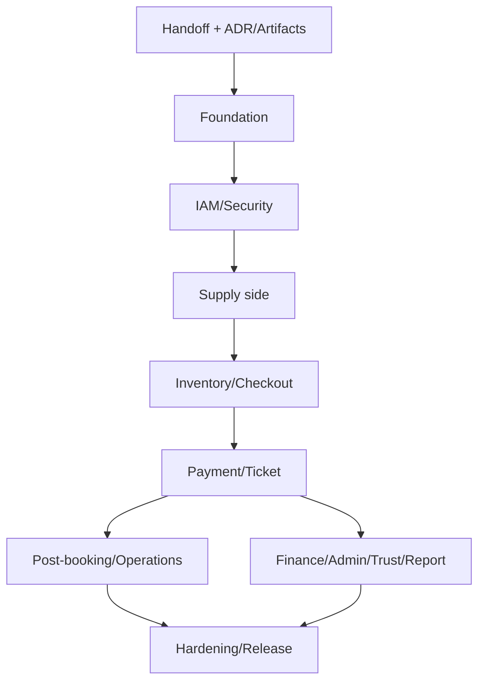

# 11. Project Task Breakdown - Hệ thống đặt vé xe khách

## 1. Thông tin tài liệu

### 1.1. Metadata

| Thuộc tính   | Giá trị                          |
| ------------ | -------------------------------- |
| Tên tài liệu | Project Task Breakdown           |
| Mã tài liệu  | 11-project-task-breakdown        |
| Dự án        | Hệ thống đặt vé xe khách         |
| Phiên bản    | v1.0                             |
| Trạng thái   | Draft                            |
| Người viết   | AI Agent                         |
| Người duyệt  | Nguyễn Hồng Khanh                |
| Ngày tạo     | 11/05/2026                       |
| Ngày cập nhật | 13/05/2026                      |

### 1.2. Lịch sử thay đổi

| Phiên bản | Ngày       | Người cập nhật | Nội dung thay đổi |
| --------- | ---------- | -------------- | ----------------- |
| v1.0      | 13/05/2026 | AI Agent       | Viết lại task breakdown cho Backend V1 dựa trên SRS/HLD/LLD/DB/API/Security/Test/ADR/Operation; thêm milestone, dependency, artifact, DoR/DoD và release gate. |
| v0.1      | 11/05/2026 | AI Agent       | Tạo bản nháp Project Task Breakdown. |

### 1.3. Trạng thái sử dụng

Tài liệu này là bản `Draft`, dùng làm backlog handoff cho Backend V1. Task ở đây chưa thay thế issue tracker chính thức. Khi đưa vào GitHub Issues/Linear/công cụ khác, phải giữ trace về Task ID và nguồn SDLC.

---

## 2. Mục lục

1. Thông tin tài liệu
2. Mục lục
3. Giới thiệu
4. Nguồn đầu vào và phạm vi backlog
5. Quy ước task
6. Milestone và dependency tổng quan
7. Task handoff và artifact
8. Task Backend V1 theo milestone
9. Task test, security và operation
10. Definition of Ready / Done
11. Release gate và handoff sang implementation
12. OP và rủi ro kế hoạch

---

## 3. Giới thiệu

### 3.1. Mục đích

Tài liệu này chuyển bộ tài liệu SDLC đã có thành backlog triển khai đủ rõ cho Backend V1. Mục tiêu không phải mô tả lại toàn bộ nghiệp vụ, mà là chia việc theo dependency, artifact và gate để đội backend có thể bắt đầu rewrite có kiểm soát.

### 3.2. Nguyên tắc chia task

| Nguyên tắc | Nội dung |
| ---------- | -------- |
| Traceable | Mỗi task phải trace về FR/UC/BR/NFR hoặc tài liệu thiết kế. |
| Backend-first | Ưu tiên backend core: data invariant, API contract, security, job, payment, audit. |
| Vertical slice khi an toàn | Build theo lát end-to-end sau khi foundation đủ: search -> hold -> booking -> payment -> ticket. |
| P0 trước UI polish | Tiền, vé, ghế, quyền, PII, audit và provider failure là nhóm P0. |
| Không dùng legacy làm source of truth | Source chính là tài liệu Approved và ADR/Operation handoff. |
| Artifact trước automation | OpenAPI, seed, DB index manifest, provider mock và fixture phải có owner. |

---

## 4. Nguồn đầu vào và phạm vi backlog

### 4.1. Nguồn được dùng

| Nguồn | Vai trò |
| ----- | ------- |
| SRS v1.20 | FR, UC, BR, NFR, AC, decisions log. |
| HLD v1.13 | Architecture boundary, module dependency, adapter, job/realtime. |
| LLD v1.2 | Logical module pattern, use-case design, implementation order. |
| DB Design v1.4 | Record-set, index, transaction, retention, migration/seed. |
| API Spec v1.1 | Endpoint, DTO, error, idempotency, webhook, realtime, job API. |
| Security v1.0 | Auth/session/RBAC/tenant/MFA/rate limit/file/security audit. |
| Test Plan v1.0 | Test suite, seed data, evidence, release gate. |
| ADR v1.0 | Decision handoff and tech OP. |
| Operation v1.0 | Environment, CI/staging, migration, observability, incident. |
| DOMAIN-MAP | Target module groups. |

### 4.2. Phạm vi V1 trong task breakdown

| Nhóm | Có trong backlog V1 | Ghi chú |
| ---- | ------------------- | ------- |
| Backend foundation | Có | Config, DB, error, logging, audit, idempotency, job base. |
| IAM/Security | Có | Actor-specific auth, session, RBAC, tenant, Guest verification, Admin MFA. |
| Marketplace core | Có | Search/detail, SeatHold, booking, payment, ticket, guest lookup. |
| Operator OS backend | Có | Operator/KYC, vehicle, route, stop point, trip, fare, employee assignment. |
| Employee operations | Có | Manifest, check-in, journey log, incident, limited offline sync. |
| Admin governance | Có | KYC decision, catalog/policy, payment/refund/payout/dispute/audit/report. |
| Notification/report/file/job | Có | Email/in-app baseline, private storage, export job, background jobs. |
| Frontend/mobile UI implementation | Không chi tiết | Chờ 06 UI/UX Flow; chỉ ghi API/handoff task. |
| Production cloud setup | Không chi tiết | Chờ OPS-OP/ADR-OP; chỉ ghi readiness tasks. |

---

## 5. Quy ước task

### 5.1. Task fields

| Field | Ý nghĩa |
| ----- | ------- |
| Task ID | `TASK-<GROUP>-NNN`. |
| Task | Công việc cần làm. |
| Output | Artifact hoặc capability bàn giao. |
| Source | Tài liệu/FR/UC/BR/NFR nguồn. |
| Dependency | Task hoặc quyết định cần xong trước. |
| Owner | Vai trò đề xuất: BE, QA, DevOps, Reviewer, FE, Mobile. |
| Priority | `P0`, `P1`, `P2`. |
| Status | `Draft`, `Ready`, `Blocked`, `In Progress`, `Done`. |

### 5.2. Priority

| Priority | Ý nghĩa |
| -------- | ------- |
| P0 | Chặn core backend hoặc có rủi ro tiền/vé/ghế/quyền/PII/audit. |
| P1 | Cần trước Backend V1 release/staging UAT hoặc vận hành ổn định. |
| P2 | Cải thiện scale/ops/report/UI handoff; có thể làm sau core nếu không chặn. |

### 5.3. Status rule

Task chỉ chuyển `Ready` khi:

- Nguồn SDLC đã rõ.
- Dependency và acceptance/test tối thiểu đã biết.
- Nếu task phụ thuộc ADR `Proposed`, reviewer đã xác nhận hoặc risk accept rõ.
- Không cần hỏi lại nghiệp vụ để code phần scope của task.

---

## 6. Milestone và dependency tổng quan

### 6.1. Milestone Backend V1

| Milestone | Mục tiêu | Exit criteria |
| --------- | -------- | ------------- |
| M0 - Handoff | Chốt artifact và decision package đủ code. | ADR/09/11/guide, OpenAPI/DB/seed/mock/test artifact plan có owner. |
| M1 - Foundation | Backend runtime, config, DB, error, logging, audit/job/idempotency base. | Health, env validation, migration/index seed, request pipeline, audit base pass. |
| M2 - IAM/Security | Actor auth/session/RBAC/tenant/Guest verification/Admin MFA. | Security P0 tests pass; tenant/assignment guard reusable. |
| M3 - Supply side | Operator/KYC/catalog/vehicle/route/stop point/trip/fare. | Approved Operator tạo trip/fare hợp lệ và mở bán. |
| M4 - Inventory/checkout | Search/detail, TripSeat, SeatHold, booking snapshot. | Concurrency SeatHold và create booking P0 pass. |
| M5 - Payment/ticket | VNPay payment/callback, ticket/QR, escrow, notification. | Pay-first checkout phát hành vé an toàn, callback idempotent. |
| M6 - Post-booking/operations | Guest lookup, cancel/refund request, Employee manifest/check-in/offline, support. | Sau mua và vận hành chuyến đủ backend V1. |
| M7 - Admin/finance/trust/report | Manual refund/dispute, commission/payout/reconciliation, report/export/audit. | Admin xử lý tiền/tranh chấp/report với audit/job evidence. |
| M8 - Hardening/release | Performance, reliability, security, ops, staging evidence. | Test Plan exit criteria cho Backend V1 đạt. |

### 6.2. Dependency chain

---

## 7. Task handoff và artifact

| Task ID | Task | Output | Source | Dependency | Owner | Priority | Status |
| ------- | ---- | ------ | ------ | ---------- | ----- | -------- | ------ |
| TASK-HO-001 | Reviewer xác nhận ADR-010 backend framework target hoặc mở lại lựa chọn. | Decision record update/risk accept. | ADR-OP-01 | None | Reviewer/Tech Lead | P0 | Blocked |
| TASK-HO-002 | Reviewer xác nhận ADR-011 cache/queue target hoặc mở lại lựa chọn. | Decision record update/risk accept. | ADR-OP-02 | None | Reviewer/Tech Lead | P0 | Blocked |
| TASK-HO-003 | Pin runtime/package manager/Docker image cho implementation environment. | Runtime/version policy. | ADR-OP-04, OPS-OP-05 | TASK-HO-001 | DevOps/BE | P1 | Draft |
| TASK-HO-004 | Tạo OpenAPI 3.1 artifact derived từ API Spec. | `openapi` artifact, contract check. | API-OP-05, API §6..§25 | TASK-HO-001 | BE/QA | P0 | Draft |
| TASK-HO-005 | Tạo shared enum/error code manifest. | State enum, error prefix/code list, actor/surface constants. | SRS §17, API §8.5, Security §18 | TASK-HO-004 | BE | P0 | Draft |
| TASK-HO-006 | Tạo DB migration/index manifest từ DB Design. | Migration/index checklist and runnable plan. | DB §11..§19 | TASK-HO-001 | BE/DB | P0 | Draft |
| TASK-HO-007 | Tạo seed package V1. | Admin/policy/catalog/operator/test seed package. | DB §19.2, Test §6.2 | TASK-HO-006 | BE/QA/Admin Ops | P0 | Draft |
| TASK-HO-008 | Tạo provider mock contract. | VNPay, email/in-app, storage, routing mock behavior. | API §20, 09 §13, Test §11.3 | TASK-HO-004 | BE/QA | P0 | Draft |
| TASK-HO-009 | Tạo Backend V1 smoke checklist. | Smoke checklist local/staging/post-deploy. | 09 §16.3, Test §13 | TASK-HO-004..008 | QA/DevOps/BE | P1 | Draft |

---

## 8. Task Backend V1 theo milestone

### 8.1. M1 - Foundation

| Task ID | Task | Output | Source | Dependency | Owner | Priority | Status |
| ------- | ---- | ------ | ------ | ---------- | ----- | -------- | ------ |
| TASK-FND-001 | Thiết lập application shell theo modular application core. | Module convention, request pipeline, health endpoint. | ADR-002, LLD §6.1 | TASK-HO-001 | BE | P0 | Draft |
| TASK-FND-002 | Thiết lập environment validation. | Config validation fail-fast. | 09 §7.3, Security §6 | TASK-FND-001, TASK-HO-003 | BE/DevOps | P0 | Draft |
| TASK-FND-003 | Thiết lập MongoDB connection và migration runner. | Replica set check, migration log, schema version. | DB-OP-01, DB §19 | TASK-HO-006 | BE/DB | P0 | Draft |
| TASK-FND-004 | Thiết lập index/constraint creation baseline. | Index manifest execution + test. | DB §11, §12, §19 | TASK-FND-003 | BE/DB/QA | P0 | Draft |
| TASK-FND-005 | Thiết lập response/error envelope. | Success/error envelope, requestId, safe message. | API §8 | TASK-FND-001 | BE | P0 | Draft |
| TASK-FND-006 | Thiết lập idempotency base. | Idempotency records, digest, conflict behavior. | API §9.2, DB §12.3 | TASK-FND-003 | BE | P0 | Draft |
| TASK-FND-007 | Thiết lập structured logging và redaction. | Request/job/provider log safe payload. | Security §11, 09 §14 | TASK-FND-005 | BE | P0 | Draft |
| TASK-FND-008 | Thiết lập audit log base. | Append-only audit writer/query skeleton. | Security §14, DB §18 | TASK-FND-003, TASK-FND-007 | BE | P0 | Draft |
| TASK-FND-009 | Thiết lập job/worker base. | Job record, lock/checkpoint/retry/manual review state. | SRS BR-62, DB §17 | TASK-HO-002, TASK-FND-003 | BE | P0 | Draft |
| TASK-FND-010 | Thiết lập file storage adapter base. | S3-compatible port, MinIO/mock, signed URL skeleton. | ADR-014, DB §16, Security §12 | TASK-FND-002 | BE | P1 | Draft |

### 8.2. M2 - IAM, session và security

| Task ID | Task | Output | Source | Dependency | Owner | Priority | Status |
| ------- | ---- | ------ | ------ | ---------- | ----- | -------- | ------ |
| TASK-IAM-001 | Implement actor context resolver. | `actorType`, `actorId`, `operatorId`, roles, assignment context. | LLD §7.2, API §7.1 | TASK-FND-005 | BE | P0 | Draft |
| TASK-IAM-002 | Implement User auth + email OTP baseline. | Register/login/verify/session for User. | SRS OQ-09, API §11, Security §6 | TASK-IAM-001 | BE | P0 | Draft |
| TASK-IAM-003 | Implement Operator auth boundary. | Operator login/session, no public reset reuse. | API §7.2, Security §6 | TASK-IAM-001 | BE | P0 | Draft |
| TASK-IAM-004 | Implement Employee auth boundary. | Employee login/session, operator/assignment scope. | SRS OQ-04, Security §8.2 | TASK-IAM-001 | BE | P0 | Draft |
| TASK-IAM-005 | Implement Admin auth + MFA baseline. | Admin login, MFA required, session TTL 12h. | Security §6/§9 | TASK-IAM-001 | BE | P0 | Draft |
| TASK-IAM-006 | Implement session refresh/revoke/force logout. | Refresh/revoke APIs and account lock behavior. | API §7.3, Security §6 | TASK-IAM-002..005 | BE | P0 | Draft |
| TASK-IAM-007 | Implement RBAC permission guard. | Permission code model + enforcement. | Security §7/§8 | TASK-IAM-006 | BE | P0 | Draft |
| TASK-IAM-008 | Implement tenant/ownership guard. | Operator data filter/enforcement. | SRS BR-08, Security §7.2 | TASK-IAM-007 | BE | P0 | Draft |
| TASK-IAM-009 | Implement assignment guard. | Employee operation scope enforcement. | SRS BR-09/44, Security §7.2 | TASK-IAM-008 | BE | P0 | Draft |
| TASK-IAM-010 | Implement Guest session and verification. | Guest checkout session, lookup verification, anti-enumeration. | SRS BR-21, Security §10 | TASK-IAM-001 | BE | P0 | Draft |
| TASK-IAM-011 | Implement sensitive action challenge. | Re-auth/OTP/MFA challenge contract. | API §7.4, Security §9 | TASK-IAM-006 | BE | P0 | Draft |
| TASK-IAM-012 | Implement rate limit baseline. | Login/OTP/search/hold/payment/lookup/upload limit. | SRS BR-61, Security §15 | TASK-FND-007 | BE | P0 | Draft |

### 8.3. M3 - Supply side, catalog và trip setup

| Task ID | Task | Output | Source | Dependency | Owner | Priority | Status |
| ------- | ---- | ------ | ------ | ---------- | ----- | -------- | ------ |
| TASK-CAT-001 | Implement catalog seed/import/version. | Province/Ward/StopPoint/VehicleType/Amenity seed with metadata. | DB §19.2, SRS DP-08 | TASK-FND-003, TASK-HO-007 | BE/Admin Ops | P0 | Draft |
| TASK-CAT-002 | Implement policy version base. | SeatHold TTL/refund/commission/payout policy version. | SRS BR-23/31/32, DB §10 | TASK-CAT-001 | BE | P0 | Draft |
| TASK-OPR-001 | Implement Operator onboarding/profile. | Operator profile, status, public/private fields. | SRS FR-OPR-01..06, API §14.1 | TASK-IAM-003, TASK-CAT-001 | BE | P0 | Draft |
| TASK-OPR-002 | Implement KYC document flow. | Upload intent/confirm, KYC status, Admin decision hook. | SRS OQ-19, API §14.1/§19 | TASK-FND-010, TASK-OPR-001 | BE | P0 | Draft |
| TASK-OPR-003 | Implement Operator bank account sensitive flow. | Bank account version, re-auth, audit. | SRS BR-37, Security §9 | TASK-IAM-011, TASK-OPR-001 | BE | P0 | Draft |
| TASK-TRN-001 | Implement vehicle and seat map. | Vehicle, SeatMap, seat codes, version. | SRS UC-12, DB §8.4 | TASK-OPR-001 | BE | P0 | Draft |
| TASK-TRN-002 | Implement route and route stop. | Route/RouteStop with tenant/catalog validation. | SRS UC-13, API §14.2 | TASK-CAT-001, TASK-TRN-001 | BE | P0 | Draft |
| TASK-TRN-003 | Implement StopPoint proposal flow. | Operator proposal, Admin approval path. | SRS BR-38, API §14.2/§18.2 | TASK-CAT-001, TASK-IAM-008 | BE | P1 | Draft |
| TASK-TRP-001 | Implement trip base. | Trip state, sale window, vehicle/route validation. | SRS UC-14, HLD §8 | TASK-TRN-001, TASK-TRN-002 | BE | P0 | Draft |
| TASK-TRP-002 | Implement fare/fare rule. | Fare VND, history/version, no segment fare baseline. | SRS OQ-08, BR-40/41 | TASK-TRP-001, TASK-CAT-002 | BE | P0 | Draft |
| TASK-TRP-003 | Implement open/lock/cancel sale command. | Trip `OPEN_FOR_SALE`, KYC/status/impact guards. | SRS BR-11/12/36/39 | TASK-OPR-002, TASK-TRP-002 | BE | P0 | Draft |
| TASK-TRP-004 | Implement trip change after sale impact analysis. | Reason, affected booking/hold/payment count, notification hook. | SRS BR-10/20, HLD §10.3 | TASK-TRP-003 | BE | P1 | Draft |

### 8.4. M4 - Marketplace, inventory và checkout

| Task ID | Task | Output | Source | Dependency | Owner | Priority | Status |
| ------- | ---- | ------ | ------ | ---------- | ----- | -------- | ------ |
| TASK-MKT-001 | Implement search query. | Search API with visible trips only. | SRS FR-MKT-01..04, API §12.1 | TASK-TRP-003, TASK-IAM-012 | BE | P0 | Draft |
| TASK-MKT-002 | Implement trip detail public view. | Trip detail, fare, stop, seat summary, Operator signal. | SRS UC-03, API §12.1 | TASK-MKT-001 | BE | P0 | Draft |
| TASK-MKT-003 | Implement public Operator profile view. | Safe public Operator profile. | SRS FR-MKT-05, BR-22 | TASK-OPR-001 | BE | P1 | Draft |
| TASK-SEAT-001 | Implement TripSeat generation. | Trip seats from seat map/fare/trip. | DB §13, LLD §9.4 | TASK-TRP-003 | BE | P0 | Draft |
| TASK-SEAT-002 | Implement SeatHold create. | All-or-nothing hold, TTL 10m, idempotency. | SRS BR-01..03, API §12.2, DB §13 | TASK-SEAT-001, TASK-FND-006 | BE | P0 | Draft |
| TASK-SEAT-003 | Implement SeatHold release/expire job. | Expire job, release safe, no release BOOKED. | DB §12.2/§17 | TASK-SEAT-002, TASK-FND-009 | BE | P0 | Draft |
| TASK-SEAT-004 | Implement seat realtime event. | Scoped event after hold/release/status update. | API §21, ADR-012 | TASK-SEAT-002 | BE | P1 | Draft |
| TASK-BOOK-001 | Implement booking create from SeatHold. | Booking `PENDING_PAYMENT`, snapshot, consume hold. | SRS BR-24..26, API §12.3 | TASK-SEAT-002, TASK-CAT-002 | BE | P0 | Draft |
| TASK-BOOK-002 | Implement promotion apply snapshot. | Promotion validation/redemption/snapshot. | SRS BR-15/47, API §12.3 | TASK-BOOK-001 | BE | P1 | Draft |
| TASK-BOOK-003 | Implement booking expiry/deadline behavior. | Expire booking/payment deadline, no old payment. | SRS BR-03/27, DB §12.2 | TASK-BOOK-001, TASK-FND-009 | BE | P0 | Draft |

### 8.5. M5 - Payment, ticket, escrow và notification

| Task ID | Task | Output | Source | Dependency | Owner | Priority | Status |
| ------- | ---- | ------ | ------ | ---------- | ----- | -------- | ------ |
| TASK-PAY-001 | Implement payment provider port + VNPay Sandbox adapter. | Create payment, mapping, signature verify. | SRS OQ-05, API §20.1, Security §13.1 | TASK-HO-008, TASK-BOOK-001 | BE | P0 | Draft |
| TASK-PAY-002 | Implement create payment API. | Payment `INITIATED/PROCESSING`, amount snapshot. | API §12.4, SRS BR-27 | TASK-PAY-001, TASK-BOOK-003 | BE | P0 | Draft |
| TASK-PAY-003 | Implement VNPay callback ingress. | Verify, safe payload, enqueue/dispatch processing. | API §20.1, Security §13.1 | TASK-PAY-002, TASK-FND-009 | BE | P0 | Draft |
| TASK-PAY-004 | Implement payment success transaction. | Payment SUCCESS, booking/ticket/seat/ledger/outbox. | DB §12.1, LLD §9.6 | TASK-PAY-003 | BE | P0 | Draft |
| TASK-PAY-005 | Implement payment failure/expired/reconciling. | Failed/expired/reconciling states and records. | SRS §17.8, API §22.2 | TASK-PAY-003 | BE | P0 | Draft |
| TASK-TCK-001 | Implement ticket issuance. | Ticket per passenger/seat, no duplicate. | SRS BR-04/25, DB §14.2 | TASK-PAY-004 | BE | P0 | Draft |
| TASK-TCK-002 | Implement QR token service. | Non-guessable token hash/reference, server verify. | SRS BR-29, Security §11 | TASK-TCK-001 | BE | P0 | Draft |
| TASK-TCK-003 | Implement User/Guest ticket view. | Safe ticket detail, masked PII, QR display payload. | API §12.5, Security §10 | TASK-TCK-001, TASK-IAM-010 | BE | P0 | Draft |
| TASK-LED-001 | Implement escrow ledger entry on payment success. | Append-only typed ledger entry. | DB-OP-02, DB §15 | TASK-PAY-004 | BE | P0 | Draft |
| TASK-NOTI-001 | Implement notification event/delivery base. | In-app/email baseline, delivery state, idempotency. | SRS BR-52..54, API §13 | TASK-FND-009, TASK-HO-008 | BE | P1 | Draft |
| TASK-NOTI-002 | Implement ticket/payment notifications. | Mandatory notification after payment/ticket. | SRS NTF catalog, Test NOTI | TASK-NOTI-001, TASK-TCK-001 | BE | P1 | Draft |

### 8.6. M6 - Post-booking, Employee operations và support

| Task ID | Task | Output | Source | Dependency | Owner | Priority | Status |
| ------- | ---- | ------ | ------ | ---------- | ----- | -------- | ------ |
| TASK-GST-001 | Implement Guest lookup. | Booking/ticket code + contact verification, anti-enumeration. | SRS UC-35, Security §10 | TASK-TCK-003, TASK-IAM-010 | BE | P0 | Draft |
| TASK-RFD-001 | Implement passenger cancel/refund request. | Policy snapshot, refund request, re-auth if needed. | SRS UC-08, API §13 | TASK-TCK-001, TASK-IAM-011 | BE | P0 | Draft |
| TASK-RFD-002 | Implement refund state and ledger adjustment base. | Refund record, status, ledger hook. | DB §15, SRS §17.9 | TASK-RFD-001, TASK-LED-001 | BE | P0 | Draft |
| TASK-EMP-001 | Implement Employee account management. | Operator manages employee roles/status. | SRS UC-16, Security §8.2 | TASK-IAM-004, TASK-OPR-001 | BE | P0 | Draft |
| TASK-EMP-002 | Implement assignment service. | Employee assignment to trip/task. | SRS FR-EMP-02..04 | TASK-EMP-001, TASK-TRP-003 | BE | P0 | Draft |
| TASK-EMP-003 | Implement manifest API. | Passenger list scoped by assignment, phone masked. | SRS UC-19, Security §11.2 | TASK-EMP-002, TASK-TCK-001 | BE | P0 | Draft |
| TASK-EMP-004 | Implement check-in QR/manual code. | Server-side verify, idempotent check-in/no-show. | SRS UC-20, LLD §9.10 | TASK-EMP-003, TASK-TCK-002 | BE | P0 | Draft |
| TASK-EMP-005 | Implement trip status/journey log. | Boarding/departed/in-progress/log with operation log. | SRS UC-21..22 | TASK-EMP-004 | BE | P1 | Draft |
| TASK-EMP-006 | Implement incident report with attachment. | Incident metadata, attachment, notification hook. | SRS BR-45, DB §16 | TASK-EMP-005, TASK-FND-010 | BE | P1 | Draft |
| TASK-EMP-007 | Implement limited offline sync API. | Whitelisted queued operations, conflict handling. | HLD-DEC-15, API §16.2 | TASK-EMP-004, TASK-FND-006 | BE/Mobile | P0 | Draft |
| TASK-SUP-001 | Implement support/complaint base. | Support ticket, complaint, case message, attachment. | SRS UC-09, API §17.1 | TASK-GST-001, TASK-FND-010 | BE | P1 | Draft |

### 8.7. M7 - Admin, finance, trust, reporting

| Task ID | Task | Output | Source | Dependency | Owner | Priority | Status |
| ------- | ---- | ------ | ------ | ---------- | ----- | -------- | ------ |
| TASK-ADM-001 | Implement Admin Operator/KYC decision. | Approve/reject/request info, audit, notification. | SRS UC-23, API §18.1 | TASK-OPR-002, TASK-IAM-005 | BE | P0 | Draft |
| TASK-ADM-002 | Implement catalog/policy admin. | Catalog version/status, policy/commission version. | SRS UC-24..25 | TASK-CAT-002, TASK-IAM-005 | BE | P0 | Draft |
| TASK-DSP-001 | Implement dispute case workflow. | Dispute state machine, evidence, scoped participants. | SRS UC-27, BR-50/51 | TASK-SUP-001, TASK-RFD-002 | BE | P0 | Draft |
| TASK-DSP-002 | Implement Admin manual refund decision. | Reason, MFA/re-auth, audit, ledger/refund update. | SRS BR-35, Security §9 | TASK-DSP-001, TASK-IAM-011 | BE | P0 | Draft |
| TASK-FIN-001 | Implement reconciliation records/API. | Payment/refund/payout mismatch list/detail/resolve. | API §22.2, DB §17 | TASK-PAY-005, TASK-RFD-002 | BE | P0 | Draft |
| TASK-FIN-002 | Implement commission rule/snapshot. | Default 5%, override by effective rule. | SRS OQ-18, BR-31 | TASK-ADM-002, TASK-LED-001 | BE | P0 | Draft |
| TASK-PAYOUT-001 | Implement payout candidate job. | T+3, no minimum, ledger checkpoint, ON_HOLD. | SRS OQ-16, DB §15.3 | TASK-FIN-002, TASK-FND-009 | BE | P0 | Draft |
| TASK-PAYOUT-002 | Implement Admin bank transfer confirmation. | Proof/reference, MFA/re-auth, audit, notification. | SRS BR-32/33, API §18.3 | TASK-PAYOUT-001, TASK-IAM-011 | BE | P0 | Draft |
| TASK-REV-001 | Implement review/scorecard base. | User review eligibility, scorecard calculation job. | SRS BR-18/55 | TASK-TCK-001, TASK-FND-009 | BE | P2 | Draft |
| TASK-RPT-001 | Implement Operator reports. | Async report/export, tenant scoped. | SRS UC-17, DB §17 | TASK-LED-001, TASK-FND-010 | BE | P1 | Draft |
| TASK-RPT-002 | Implement Admin reports. | System report/export, audit/export control. | SRS UC-29, API §18.4 | TASK-RPT-001, TASK-IAM-011 | BE | P1 | Draft |
| TASK-AUD-001 | Implement audit query/export API. | Cursor/filter/export, reason/masking. | API §22.3, Security §14.3 | TASK-FND-008, TASK-IAM-011 | BE | P0 | Draft |

---

## 9. Task test, security và operation

### 9.1. Test automation tasks

| Task ID | Task | Output | Source | Dependency | Owner | Priority | Status |
| ------- | ---- | ------ | ------ | ---------- | ----- | -------- | ------ |
| TASK-QA-001 | Build seed/fixture harness. | Deterministic fixtures for Test §6.2. | Test §6.2 | TASK-HO-007 | QA/BE | P0 | Draft |
| TASK-QA-002 | Build API contract test harness. | API envelope/error/idempotency tests. | API §8/§9, Test §5.3 | TASK-HO-004 | QA/BE | P0 | Draft |
| TASK-QA-003 | Build SeatHold concurrency suite. | Concurrent hold/expiry/payment race tests. | Test §9.3/§11.2 | TASK-SEAT-002 | QA/BE | P0 | Draft |
| TASK-QA-004 | Build payment callback suite. | Success/fail/duplicate/wrong signature/amount mismatch. | Test §9.5 | TASK-PAY-003 | QA/BE | P0 | Draft |
| TASK-QA-005 | Build security negative suite. | RBAC/tenant/Guest/rate/log/CSRF tests. | Test §10, Security §16 | TASK-IAM-007..012 | QA/Security/BE | P0 | Draft |
| TASK-QA-006 | Build job/idempotency/retry suite. | Worker lock/retry/manual review/rerun tests. | Test §9.14/§11.3 | TASK-FND-009 | QA/BE | P0 | Draft |
| TASK-QA-007 | Build end-to-end backend checkout suite. | Search -> hold -> booking -> payment -> ticket. | Test §12.1 | TASK-PAY-004, TASK-TCK-001 | QA/BE | P0 | Draft |
| TASK-QA-008 | Build performance baseline suite. | Search/detail/checkout/callback/report baseline. | Test §11.1 | TASK-MKT-001, TASK-PAY-004 | QA/DevOps | P1 | Draft |

### 9.2. Security hardening tasks

| Task ID | Task | Output | Source | Dependency | Owner | Priority | Status |
| ------- | ---- | ------ | ------ | ---------- | ----- | -------- | ------ |
| TASK-SEC-001 | Log redaction scan/check. | Test/build gate for secrets in logs. | Security §11.3, Test SEC-012 | TASK-FND-007 | Security/BE/QA | P0 | Draft |
| TASK-SEC-002 | File security validation. | Type/size/checksum/scan/signed URL tests. | Security §12 | TASK-FND-010 | Security/BE/QA | P1 | Draft |
| TASK-SEC-003 | Admin sensitive action review. | MFA/re-auth/permission/audit evidence. | Security §9, Test §10 | TASK-IAM-011 | Security/QA | P0 | Draft |
| TASK-SEC-004 | Guest anti-enumeration review. | Generic response/rate limit evidence. | Security §10 | TASK-GST-001 | Security/QA | P0 | Draft |
| TASK-SEC-005 | Provider callback security review. | VNPay signature/amount/source/idempotency evidence. | Security §13.1 | TASK-PAY-003 | Security/QA | P0 | Draft |

### 9.3. Operation tasks

| Task ID | Task | Output | Source | Dependency | Owner | Priority | Status |
| ------- | ---- | ------ | ------ | ---------- | ----- | -------- | ------ |
| TASK-OPS-001 | Build local dependency environment. | Local runbook with Mongo replica set, Redis, MinIO/mock. | 09 §8 | TASK-HO-003 | DevOps/BE | P0 | Draft |
| TASK-OPS-002 | Build CI pipeline baseline. | Static/unit/integration/security/API stages. | 09 §9 | TASK-OPS-001, TASK-QA-001 | DevOps/BE/QA | P0 | Draft |
| TASK-OPS-003 | Build staging deployment runbook. | Staging deploy/migration/smoke checklist. | 09 §10/§16 | TASK-OPS-002 | DevOps/BE | P1 | Draft |
| TASK-OPS-004 | Build observability baseline. | Structured logs, metrics, alert placeholders. | 09 §14 | TASK-FND-007 | DevOps/BE | P1 | Draft |
| TASK-OPS-005 | Build backup/restore rehearsal. | Backup/restore report and consistency check. | 09 §15 | TASK-FND-003 | DevOps/DB/QA | P1 | Draft |
| TASK-OPS-006 | Build incident runbook artifacts. | P0/P1 runbooks for seat/payment/ticket/tenant/secret/DB/queue. | 09 §17 | TASK-OPS-004 | DevOps/BE/QA | P1 | Draft |
| TASK-OPS-007 | Close production OP package. | Hosting, secret manager, monitoring stack, RPO/RTO. | OPS-OP-01..04 | TASK-OPS-003 | Reviewer/DevOps | P1 | Blocked |

---

## 10. Definition of Ready / Done

### 10.1. Definition of Ready

| Nhóm | Ready khi |
| ---- | --------- |
| Backend feature | Source SDLC rõ, API/DB/Security impact rõ, dependency xong, test P0 xác định. |
| DB/migration | Collection/index/constraint/source version rõ, rollback/forward-fix plan có. |
| Provider integration | Adapter contract/mock/sandbox behavior rõ, secret/callback rule rõ. |
| Security feature | Permission/actor/scope/rate/audit/re-auth rule rõ. |
| Job/worker | Job state, idempotency key, lock/checkpoint/retry/manual review rõ. |
| Operation | Environment, config/secret, evidence và smoke/rollback checklist rõ. |

### 10.2. Definition of Done

| Nhóm | Done khi |
| ---- | -------- |
| Backend feature | API/DTO validation, service/policy/repository/adapter boundary, error code, audit/log, test pass. |
| DB/migration | Migration/index chạy được, test invariant, migration log, rollback/forward-fix note. |
| Security | RBAC/tenant/assignment/Guest/rate/log tests pass; no secret/PII leak. |
| Payment/finance | Idempotency, signature/amount check, ledger/reconciliation/audit tests pass. |
| Job/worker | Lock/checkpoint/retry/manual review/rerun tests pass. |
| Artifact | Artifact có owner, source trace, validation/check trong CI hoặc review checklist. |
| Operation | Smoke, rollback, monitoring/log evidence và runbook cập nhật. |

### 10.3. No-go trước khi merge/release

| No-go | Áp dụng |
| ----- | ------- |
| API đổi contract nhưng API Spec/OpenAPI/test không cập nhật. | Mọi endpoint/DTO/error/state. |
| Code bỏ qua DB invariant cho SeatHold/payment/ticket/ledger. | Core transaction. |
| Log chứa password/OTP/token/QR raw secret/provider secret/payment sensitive payload. | Mọi môi trường. |
| Tenant/assignment guard không có negative test. | Operator/Employee/Admin data. |
| Provider callback không idempotent hoặc thiếu signature/amount check. | Payment/refund. |
| Migration không tạo index/constraint trước write path. | DB release. |

---

## 11. Release gate và handoff sang implementation

### 11.1. Gate để bắt đầu code Backend V1

| Gate | Điều kiện | Tình trạng hiện tại |
| ---- | --------- | ------------------- |
| START-G1 | SRS/HLD/LLD/DB/API/Security/Test baseline có trong `PROJECT-STATE`. | Đạt theo nguồn hiện tại. |
| START-G2 | ADR framework/queue Proposed được reviewer xác nhận hoặc risk accept. | Chưa đạt: TASK-HO-001/002. |
| START-G3 | Runtime/package manager strategy được pin cho CI. | Chưa đạt: TASK-HO-003. |
| START-G4 | OpenAPI/DB/seed/mock artifact plan có owner. | Chưa đạt: TASK-HO-004..008. |
| START-G5 | Local dependency environment có MongoDB transaction support. | Chưa đạt: TASK-OPS-001. |

### 11.2. Gate cho Backend V1 staging candidate

| Gate | Điều kiện |
| ---- | --------- |
| STAGE-G1 | M1..M5 P0 task Done. |
| STAGE-G2 | IAM/Security P0 negative tests pass. |
| STAGE-G3 | Checkout E2E backend pass với VNPay mock/Sandbox. |
| STAGE-G4 | Migration/index/seed run trên staging pass. |
| STAGE-G5 | Smoke checklist và rollback plan sẵn. |

### 11.3. Gate cho production readiness

| Gate | Điều kiện |
| ---- | --------- |
| PROD-G1 | OPS-OP-01..04 đóng. |
| PROD-G2 | P0/P1 tests pass theo Test Plan §13. |
| PROD-G3 | Backup/restore rehearsal và consistency check pass. |
| PROD-G4 | Payment provider production onboarding/callback/secret/alert đã test. |
| PROD-G5 | Legal/operation/support policy sẵn sàng cho bán vé thật. |

---

## 12. OP và rủi ro kế hoạch

### 12.1. Open Points

| ID | Vấn đề | Đề xuất xử lý | Chặn |
| -- | ------ | ------------- | ---- |
| TASK-OP-01 | Issue tracker chính thức chưa chốt. | Chọn GitHub Issues/Linear/công cụ khác, import Task ID. | Project execution |
| TASK-OP-02 | Owner cụ thể cho BE/QA/DevOps/Security/Admin Ops chưa chốt. | Reviewer gán owner khi chuyển task sang tracker. | Planning |
| TASK-OP-03 | ADR-010/011 còn `Proposed`. | Reviewer accept hoặc risk accept trước rewrite source chính thức. | Code start |
| TASK-OP-04 | Runtime/package manager/Docker image chưa pin. | Đóng TASK-HO-003. | CI reproducibility |
| TASK-OP-05 | Production hosting/secret/monitoring/RPO/RTO chưa chốt. | Đóng TASK-OPS-007 trước production. | Production release |
| TASK-OP-06 | 06 UI/UX Flow còn skeleton. | Không chặn backend core; chặn FE/Mobile UX polish và một số copy/state detail. | FE/Mobile |

### 12.2. Rủi ro kế hoạch

| ID | Rủi ro | Mức | Giảm thiểu |
| -- | ------ | --- | ---------- |
| TASK-RISK-01 | Bắt đầu code khi ADR-010/011 chưa được xác nhận làm rewrite lệch target. | Cao | Đóng START-G2 trước source rewrite. |
| TASK-RISK-02 | Làm transport/resource trước IAM/tenant guard gây leak tenant sau này. | Rất cao | M2 phải xong trước M3/M4 write path. |
| TASK-RISK-03 | Làm payment trước SeatHold/booking invariant làm phát hành vé sai. | Rất cao | M4 phải pass concurrency trước M5. |
| TASK-RISK-04 | OpenAPI/DB/seed/mock artifact làm muộn khiến FE/Mobile/QA lệch contract. | Cao | TASK-HO-004..008 thuộc M0/P0. |
| TASK-RISK-05 | Test P0 làm sau cùng mới phát hiện lỗi kiến trúc. | Cao | QA harness chạy song song từ M1/M2. |
| TASK-RISK-06 | Production OP bị bỏ quên vì không chặn local/staging. | Cao | PROD gate và TASK-OPS-007 giữ Blocked đến khi reviewer chốt. |

