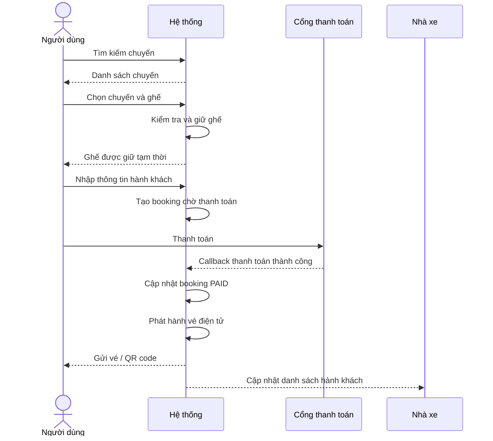
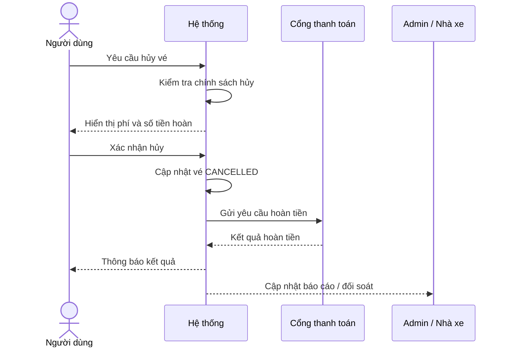
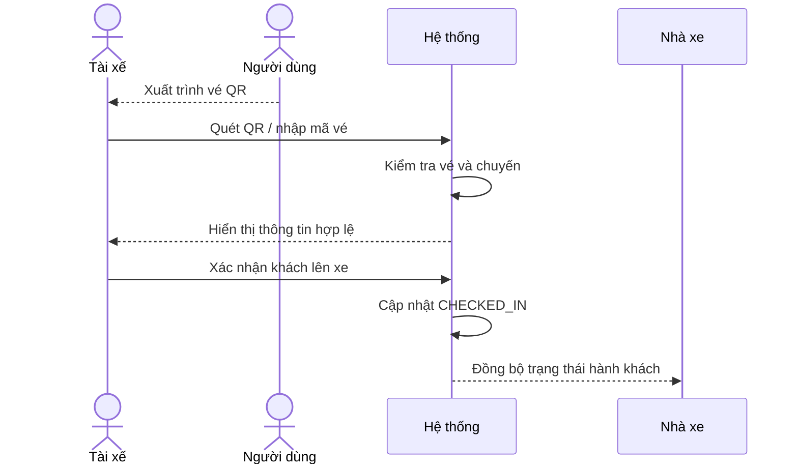

# 01. Software Requirements Specification - Hệ thống đặt vé xe khách

## 1. Thông tin tài liệu

### 1.1. Metadata

| Thuộc tính   | Giá trị                                                        |
| ------------ | -------------------------------------------------------------- |
| Tên tài liệu | Software Requirements Specification - Hệ thống đặt vé xe khách |
| Mã tài liệu  | 01-srs-he-thong-dat-ve-xe-khach                                |
| Dự án        | Hệ thống đặt vé xe khách                                       |
| Phiên bản    | v1.5                                                           |
| Trạng thái   | Draft                                                          |
| Người viết   | Nguyễn Hồng Khanh, Nguyễn Xuân Trường, Lê Võ Thanh Uy          |
| Người duyệt  | Nguyễn Hồng Khanh                                              |
| Ngày tạo     | 05/05/2026                                                     |

### 1.2. Lịch sử thay đổi

| Phiên bản | Ngày       | Người cập nhật              | Nội dung thay đổi                                                                                                                                                                                                                                                                                                                                                                                                         |
| --------- | ---------- | --------------------------- | ------------------------------------------------------------------------------------------------------------------------------------------------------------------------------------------------------------------------------------------------------------------------------------------------------------------------------------------------------------------------------------------------------------------------- |
| v1.0      | 05/05/2026 | AI Agent, Nguyễn Hồng Khanh | Tạo bản đầu từ tài liệu ý tưởng `he-thong-dat-ve-xe-khach.md` và đối chiếu với code backend hiện có                                                                                                                                                                                                                                                                                                                       |
| v1.1      | 08/05/2026 | Nguyễn Hồng Khanh           | Hiệu chỉnh 7.4 bỏ Tài xế (Drive) thay bằng Nhân viên nhà xe (Employee) và hiệu chỉnh một số điểm.                                                                                                                                                                                                                                                                                                                         |
| v1.2      | 10/05/2026 | AI Agent, Nguyễn Hồng Khanh | Chốt OQ-01..04 (state enum + Employee) và đồng bộ FR: §10.1 cập nhật `FR-AUTH-04`, §10.3 cập nhật `FR-OP-13..15` và thêm `FR-OP-21..23`, §10.4 đổi tên thành "Nhân viên nhà xe (Employee)" và đổi prefix `FR-DRIVER-*` → `FR-EMP-*` (18 FR có cột Role áp dụng), §10.5 thêm `FR-ADMIN-21..22`, §24 đánh dấu OQ-01..04 đã chốt                                                                                             |
| v1.3      | 10/05/2026 | AI Agent, Nguyễn Hồng Khanh | Chốt MQ-01..05 (định vị marketplace). Tái cấu trúc §4 (6 mục con: định vị, vai trò 3 bên, mô hình doanh thu, 3 lớp dịch vụ, boundary, kiến trúc triển khai), §5 (4 nhóm mục tiêu: sản phẩm, nền tảng, tin cậy / compliance, vận hành), §6 (4 nhóm phạm vi: Marketplace layer, Operator OS layer, Platform admin layer, Ngoài phạm vi). §24 ghi nhận MQ-01..05 đã chốt và bổ sung OQ-16..20 phái sinh từ marketplace model |
| v1.4      | 10/05/2026 | Nguyễn Xuân Trường          | Hiệu chỉnh mục 7 Actor và vai trò theo cấu trúc thống nhất; làm rõ quan hệ giữa Người dùng, Nhà xe, Admin toàn hệ thống và Nhân viên nhà xe trong mô hình marketplace; cập nhật Employee gồm 3 role `TICKET_STAFF`, `DRIVER`, `SUPPORT_STAFF` và gom nhóm quyền của nhân viên nhà xe theo chức năng vận hành.                                                                                                             |
| v1.5      | 10/05/2026 | AI Agent, Lê Võ Thanh Uy    | liệt kê các giả định, ràng buộc, phụ thuộc cần có.                                                                                                                                                                                                                                                                                                                                                                        |
| v1.6      | 10/05/2026 | Nguyễn Hồng Khanh           | Hiệu chỉnh lỗi định dạng file thủ công, Điều chỉnh mục 6.2 sửa role cho Employee còn lỗi ở phiên bản trước đó                                                                                                                                                                                                                                                                                                             |

---

## 2. Mục lục

1. Thông tin tài liệu
2. Mục lục
3. Giới thiệu
4. Tổng quan hệ thống
5. Mục tiêu hệ thống
6. Phạm vi chức năng
7. Actor và vai trò
8. Giả định, ràng buộc, phụ thuộc
9. Mô hình dữ liệu mức cao
10. Functional Requirements
11. Non-Functional Requirements
12. Use Case tổng quan
13. Use Case chi tiết
14. Business Rules
15. Phân quyền chức năng
16. Luồng nghiệp vụ chính
17. Trạng thái dữ liệu quan trọng
18. Thông báo hệ thống
19. Báo cáo và thống kê
20. Tiêu chí nghiệm thu
21. Module triển khai
22. Rủi ro và biện pháp giảm thiểu
23. Trạng thái triển khai hiện tại
24. Open Questions / TBD
25. Phụ lục

---

## 3. Giới thiệu

### 3.1. Mục đích tài liệu

Tài liệu này mô tả yêu cầu phần mềm cho hệ thống đặt vé xe khách trực tuyến. Tài liệu là nguồn chính thức cho thiết kế, lập trình, kiểm thử và nghiệm thu hệ thống. Tài liệu được viết theo ISO/IEC/IEEE 29148:2018, tailoring nội bộ theo `00a-quy-chuan-cho-lap-trinh-vien.md`.

### 3.2. Đối tượng đọc

| Đối tượng      | Mục đích đọc                                         |
| -------------- | ---------------------------------------------------- |
| Lập trình viên | Hiểu yêu cầu để triển khai backend, frontend, mobile |
| Kiến trúc sư   | Cơ sở để viết HLD, LLD, Database Design, API Spec    |
| QA / Tester    | Cơ sở để viết Test Plan và Acceptance Criteria       |
| Quản lý dự án  | Lập kế hoạch task, ưu tiên module, theo dõi tiến độ  |
| Người duyệt    | Xác nhận tài liệu phù hợp với mục tiêu nghiệp vụ     |

### 3.3. Phạm vi tài liệu

Tài liệu mô tả: phạm vi hệ thống, actor, mô hình dữ liệu mức cao, yêu cầu chức năng (FR), yêu cầu phi chức năng (NFR), use case tổng quan và chi tiết, business rule, phân quyền, luồng nghiệp vụ chính, trạng thái dữ liệu, thông báo, báo cáo, tiêu chí nghiệm thu, gợi ý module triển khai và rủi ro.

Tài liệu KHÔNG mô tả: chi tiết kiến trúc kỹ thuật (xem `02-hld-...`), thiết kế chi tiết module (xem `03-lld-...`), schema database cụ thể (xem `04-database-design.md`), contract API cụ thể (xem `05-api-specification.md`).

### 3.4. Tài liệu tham chiếu

#### 3.4.1. Tham chiếu chính

Các tài liệu cung cấp quy chuẩn chung và phương pháp luận cho dự án.

| Mã                      | Tên                                     | Vai trò                                |
| :---------------------- | :-------------------------------------- | :------------------------------------- |
| ISO/IEC/IEEE 15289:2019 | Content of life-cycle information items | Chuẩn nền cho cấu trúc tài liệu        |
| ISO/IEC/IEEE 29148:2018 | Requirements engineering                | Chuẩn nền cho viết và kiểm tra yêu cầu |
| 00                      | Quy chuẩn SDLC cho lập trình viên       | Quy chuẩn nội bộ cao nhất              |

#### 3.4.2. Tham chiếu phụ

Các tài liệu cụ thể liên quan đến nghiệp vụ và hiện trạng kỹ thuật của dự án.

| Mã                             | Tên                            | Vai trò                                    |
| :----------------------------- | :----------------------------- | :----------------------------------------- |
| `he-thong-dat-ve-xe-khach.md`  | Tài liệu ý tưởng nghiệp vụ     | Nguồn nghiệp vụ ban đầu                    |
| `context/PROJECT-STRUCTURE.md` | Cấu trúc thư mục code hiện tại | Đối chiếu với code backend/frontend/mobile |
| `context/TECH-STACK.md`        | Tech stack đang sử dụng        | Ràng buộc kỹ thuật                         |

### 3.5. Định nghĩa và viết tắt

| Thuật ngữ | Định nghĩa                                                |
| --------- | --------------------------------------------------------- |
| FR        | Functional Requirement - yêu cầu chức năng                |
| NFR       | Non-Functional Requirement - yêu cầu phi chức năng        |
| BR        | Business Rule - quy tắc nghiệp vụ                         |
| UC        | Use Case - trường hợp sử dụng                             |
| AC        | Acceptance Criteria - tiêu chí nghiệm thu                 |
| RBAC      | Role-Based Access Control - phân quyền theo vai trò       |
| OTP       | One-Time Password - mã xác thực một lần                   |
| QR        | Quick Response code - mã vạch hai chiều dùng để check-in  |
| Operator  | Nhà xe - đơn vị vận hành dịch vụ xe khách                 |
| Trip      | Chuyến xe cụ thể theo ngày giờ                            |
| Route     | Tuyến đường giữa hai điểm đầu cuối                        |
| StopPoint | Điểm đón hoặc điểm trả khách                              |
| Booking   | Đơn đặt vé, có thể chứa nhiều ticket                      |
| Ticket    | Vé điện tử cho một ghế của một hành khách trên một chuyến |

---

## 4. Tổng quan hệ thống

### 4.1. Định vị nền tảng

Hệ thống là một **managed marketplace** kết nối ba bên: **hành khách**, **nhà xe (Operator)** và **nền tảng (Platform)**. Platform không sở hữu xe, không thuê tài xế, không trực tiếp vận hành chuyến đi. Platform cung cấp công nghệ, kênh phân phối, hệ thống thanh toán và cơ chế đảm bảo tin cậy giữa hành khách và nhà xe.

```text
Hành khách (User)        Nhà xe (Operator) + Nhân viên (Employee)
        |                            |
        |                            |
        +--------- Platform ---------+
                       |
             (Admin toàn hệ thống)
```

### 4.2. Vai trò ba bên trong giao dịch

| Bên            | Vai trò trong giao dịch vận tải                                                                                                                                     |
| -------------- | ------------------------------------------------------------------------------------------------------------------------------------------------------------------- |
| Hành khách     | Bên mua dịch vụ vận tải. Trả tiền cho Platform thông qua cổng thanh toán.                                                                                           |
| Nhà xe         | Bên cung cấp dịch vụ vận tải. Sở hữu xe, tuyến, chuyến và chịu trách nhiệm vận hành. Hợp đồng vận tải là giữa hành khách và nhà xe.                                 |
| Platform       | Trung gian công nghệ và thanh toán. Giữ tiền của hành khách trong tài khoản escrow đến khi chuyến hoàn thành, sau đó chuyển cho nhà xe theo chu kỳ T+N (xem MQ-01). |
| Admin Platform | Người vận hành nền tảng. Phê duyệt nhà xe (KYC), cấu hình chính sách, là **arbiter cuối cùng** trong tranh chấp (xem MQ-03).                                        |

### 4.3. Mô hình doanh thu

Platform thu **commission % trên mỗi giao dịch vé bán thành công** (xem MQ-04). Tỷ lệ commission cấu hình được per-Operator hoặc theo tier. Có thể bổ sung service fee phụ thu hành khách ở các phiên bản sau. Subsidy cho promotion (Platform bù tiền) chưa hỗ trợ ở v1.

### 4.4. Ba lớp dịch vụ Platform cung cấp

Platform là một **managed marketplace** (xem MQ-05) gồm 3 lớp dịch vụ:

| Lớp                  | Vai trò                                                                                                                                                                                                                                                                                                                        | Người dùng chính    |
| -------------------- | ------------------------------------------------------------------------------------------------------------------------------------------------------------------------------------------------------------------------------------------------------------------------------------------------------------------------------ | ------------------- |
| Marketplace layer    | Tìm kiếm, đặt vé, thanh toán, vé điện tử, đánh giá, khiếu nại, dispute resolution, public catalog                                                                                                                                                                                                                              | Hành khách          |
| Operator OS layer    | Bộ công cụ vận hành cho nhà xe: hồ sơ nhà xe, xe và sơ đồ ghế, tuyến và điểm đón/trả, chuyến, giá vé, đơn vé, tài chính (escrow balance, payout, đối soát), nhân viên và phân quyền nội bộ, app/portal cho nhân viên (lịch chuyến, danh sách hành khách, soát vé QR, nhật trình xe, báo cáo vận hành, sự cố), analytics nhà xe | Operator + Employee |
| Platform admin layer | Quản trị nền tảng: KYC nhà xe, cấu hình commission và payout, kiểm duyệt nội dung và đánh giá, dispute resolution, audit log, báo cáo toàn hệ thống, cấu hình danh mục chuẩn (tỉnh thành, bến xe, điểm dừng, loại xe, tiện ích)                                                                                                | Admin Platform      |

### 4.5. Boundary của Platform

Platform **CÓ trách nhiệm**: cung cấp công nghệ, xử lý thanh toán, giữ escrow, payout cho Operator, dispute resolution, kiểm duyệt nội dung, KYC nhà xe, audit log, đảm bảo an toàn dữ liệu hành khách.

Platform **KHÔNG trực tiếp** sở hữu xe, vận hành tuyến, ký hợp đồng lao động với tài xế, bảo dưỡng xe, chịu trách nhiệm chất lượng vận tải (đó là trách nhiệm của Operator).

### 4.6. Kiến trúc triển khai

Hệ thống gồm 3 ứng dụng client và 1 backend:

| Client              | Đối tượng                                   |
| ------------------- | ------------------------------------------- |
| Web user portal     | Hành khách (Marketplace layer)              |
| Web operator portal | Operator (Operator OS layer)                |
| Web admin portal    | Admin Platform (Platform admin layer)       |
| Mobile app (Expo)   | Hành khách + Employee (soát vé, nhật trình) |

Backend: NestJS 11 + MongoDB (mongoose) + Redis (ioredis) + Bull queue + Socket.IO + JWT + Helmet + OSRM. Chi tiết tại `context/TECH-STACK.md`.

---

## 5. Mục tiêu hệ thống

### 5.1. Mục tiêu sản phẩm

- Số hóa quy trình đặt vé xe khách từ tìm kiếm, đặt chỗ, thanh toán đến check-in.
- Giảm tình trạng đặt trùng ghế, sai thông tin chuyến, sai thông tin hành khách.
- Cung cấp trải nghiệm đặt vé nhanh, minh bạch, an toàn cho hành khách.
- Cung cấp bộ Operator OS đầy đủ giúp nhà xe nhỏ và vừa số hóa hoàn toàn việc vận hành mà không cần phần mềm thứ ba.
- Cung cấp app / portal cho Employee để soát vé QR, ghi nhật trình, báo cáo lộ trình, sự cố theo thời gian thực.

### 5.2. Mục tiêu nền tảng (marketplace)

- Onboard nhà xe đa dạng quy mô vào nền tảng theo quy trình KYC chuẩn.
- Tăng GMV (gross merchandise value — tổng giá trị vé bán qua nền tảng) và take rate (% commission trung bình).
- Giữ chân Operator qua chất lượng Operator OS và minh bạch tài chính (escrow balance, lịch sử payout, đối soát).
- Cung cấp catalog tuyến / nhà xe / chuyến chuẩn hóa để hành khách so sánh và chọn lựa.
- Đảm bảo tin cậy giao dịch hai chiều: hành khách an tâm vì có Platform bảo đảm, nhà xe an tâm vì payout đúng hạn và data isolation chặt.

### 5.3. Mục tiêu tin cậy và compliance

- Mọi giao dịch tài chính có log đầy đủ, đối soát được theo mã giao dịch, truy vết từ booking - payment - escrow - payout / refund.
- Đảm bảo data isolation giữa các Operator (Operator A không thấy data Operator B trong bất kỳ tình huống nào).
- Audit log cho mọi thao tác nhạy cảm của Admin và Operator.
- KYC nhà xe theo chuẩn nội bộ và quy định pháp luật áp dụng cho dịch vụ vận tải hành khách.
- Platform có quyền kiểm tra và chặn giá vé vượt khung trần / sàn theo quy định pháp luật vào các dịp quan trọng (xem MQ-02).

### 5.4. Mục tiêu vận hành

- Hỗ trợ hệ thống đặt vé sẵn sàng cao trong các dịp cao điểm (lễ, Tết).
- Báo cáo doanh thu, tỷ lệ lấp đầy ghế, hiệu suất tuyến, chất lượng dịch vụ và scorecard nhà xe đầy đủ ở 2 cấp độ: Operator và Platform.
- Dispute resolution rõ ràng: thời gian xử lý, các mức leo thang, trách nhiệm các bên.

---

## 6. Phạm vi chức năng

### 6.1. Trong phạm vi — Marketplace layer (cho hành khách)

- Đăng ký, đăng nhập, xác thực, quản lý hồ sơ hành khách.
- Tìm kiếm chuyến xe theo điểm đi, điểm đến, ngày đi, số lượng khách.
- Lọc / sắp xếp theo nhà xe, giờ khởi hành, giá vé, loại xe, tiện ích, điểm đón / trả, đánh giá.
- Xem chi tiết chuyến: nhà xe, loại xe, tiện ích, điểm đón / trả, sơ đồ ghế, giá vé, chính sách hủy.
- Xem profile nhà xe: thông tin, đánh giá, scorecard, tuyến tiêu biểu.
- Chọn ghế, giữ ghế tạm thời, đặt vé.
- Áp dụng mã giảm giá nếu thỏa điều kiện.
- Thanh toán qua cổng thanh toán tích hợp; tiền được giữ ở **escrow account của Platform** đến khi chuyến hoàn thành.
- Phát hành vé điện tử có mã vé / QR code.
- Quản lý lịch sử đặt vé, hủy vé, yêu cầu hoàn tiền theo chính sách.
- Đánh giá chuyến đi / nhà xe sau khi chuyến hoàn thành.
- Tạo và theo dõi khiếu nại / yêu cầu hỗ trợ.
- Nhận thông báo (email / SMS / push / in-app) cho các sự kiện quan trọng.

### 6.2. Trong phạm vi — Operator OS layer (cho nhà xe và nhân viên)

**Quản lý hồ sơ và tài chính nhà xe:**

- Đăng ký nhà xe, gửi hồ sơ KYC (giấy phép, hợp đồng, tài khoản nhận tiền) và chờ admin phê duyệt.
- Quản lý hồ sơ doanh nghiệp: tên, logo, mô tả, hotline, email, địa chỉ.
- Xem **escrow balance** (số tiền Platform đang giữ thuộc về Operator), lịch sử payout, lịch sử commission, đối soát giao dịch.
- Yêu cầu payout sớm (nếu Platform hỗ trợ) hoặc nhận theo chu kỳ T+N tự động.

**Quản lý hạ tầng vận tải (Operator tự quản lý trong tenant của mình):**

- Quản lý phương tiện: danh sách xe, biển số, loại xe, sơ đồ ghế, tiện ích.
- Quản lý tuyến đường: tạo tuyến, gắn vào catalog điểm đón / trả chuẩn của Platform.
- Quản lý chuyến xe: tạo chuyến theo ngày giờ, lịch lặp lại, gán xe, gán nhân viên (Employee có role DRIVER), mở / khóa bán.
- Cấu hình giá vé: theo tuyến / chuyến / loại ghế / thời điểm / chặng. Operator tự định giá theo kê khai pháp luật, Platform có thể cảnh báo hoặc chặn nếu vượt khung trần / sàn áp dụng (MQ-02).
- Tạo chương trình khuyến mãi của riêng nhà xe (nếu được Platform cho phép).

**Quản lý nhân viên (Operator OS, không phải Platform admin):**

- **Tạo và quản trị tài khoản:** Tạo mới, cập nhật thông tin, khóa hoặc mở khóa tài khoản Employee thuộc phạm vi quản lý của nhà xe.
- **Gán vai trò hệ thống:** Phân định quyền hạn cho Employee theo 3 nhóm role chính:
  - `TICKET_STAFF`: Nhân viên bán vé và điều phối khách.
  - `DRIVER`: Tài xế vận hành chuyến xe.
  - `SUPPORT_STAFF`: Nhân viên hỗ trợ và phụ xe.
- **Phân quyền chi tiết:** Thiết lập quyền hạn chuyên sâu cho Employee dựa trên role đã gán và phạm vi công việc cụ thể.
- **Điều động nhân sự:** Phân công nhân viên có role `DRIVER` trực tiếp vào danh sách vận hành các chuyến xe.

**Quản lý đơn vé và vận hành:**

- Xem danh sách booking / ticket thuộc nhà xe theo chuyến / ngày / trạng thái.
- Xác nhận đơn nếu dùng phương thức thanh toán sau (nếu mở).
- Xử lý yêu cầu hủy / đổi vé trong phạm vi quyền được Platform cấu hình.
- Phản hồi đánh giá và khiếu nại của hành khách.
- Xem nhật trình xe và báo cáo vận hành mà Employee gửi về (lộ trình thực tế, sự cố, chi phí phát sinh).

**App / Portal cho Employee:**

- Đăng nhập theo phân quyền Operator cấp.
- Xem lịch chuyến / công việc được phân công.
- Xem chi tiết chuyến và danh sách hành khách (số điện thoại có thể được mask).
- Soát vé QR / nhập mã vé để check-in hành khách (nếu role DRIVER hoặc được phân quyền).
- Cập nhật trạng thái chuyến và trạng thái hành khách.
- Ghi nhật trình xe và báo cáo vận hành đầy đủ (lộ trình thực tế, thời gian, điểm dừng, chi phí, tình trạng xe / hành khách).
- Báo cáo sự cố (tai nạn, hỏng xe, kẹt xe, trễ giờ, khách không hợp tác).
- Đồng bộ realtime hoặc khi có mạng nếu offline.

**Báo cáo nhà xe:**

- Doanh thu theo ngày / tuần / tháng / tuyến / chuyến / xe.
- Tỷ lệ lấp đầy ghế, tỷ lệ hủy, tỷ lệ hoàn tiền.
- Hiệu suất Employee theo chuyến được phân công.
- Đánh giá trung bình và phản hồi khách hàng.

### 6.3. Trong phạm vi — Platform admin layer

- KYC: phê duyệt, từ chối, yêu cầu bổ sung, khóa / mở khóa nhà xe.
- Quản lý tài khoản người dùng và tài khoản admin nội bộ.
- Giám sát Employee toàn hệ thống (read-only) phục vụ kiểm duyệt và audit (`FR-ADMIN-21`).
- Cấu hình **commission engine**: % commission mặc định, override per-Operator hoặc theo tier.
- Cấu hình **payout policy**: chu kỳ T+N, ngưỡng tối thiểu, kênh chuyển tiền.
- Cấu hình danh mục chuẩn: tỉnh / thành, bến xe, điểm đón / trả, loại xe, tiện ích.
- Cấu hình chính sách: phí nền tảng, phí hủy vé, chính sách hoàn tiền, thời gian giữ ghế, thời gian cho phép hủy vé.
- Kiểm tra và áp khung giá trần / sàn theo quy định pháp luật vào các dịp quan trọng (MQ-02).
- Giám sát giao dịch thanh toán, escrow, payout, refund.
- Xử lý hoàn tiền thủ công khi cần; **Platform có quyền refund đơn phương** với tư cách arbiter cuối cùng (MQ-03), thao tác này phải có audit log và thông báo Operator.
- Quản lý khiếu nại và dispute resolution: phân công, theo dõi, đóng ticket, leo thang.
- Kiểm duyệt đánh giá, nội dung vi phạm, banner, FAQ, nội dung tĩnh.
- Quản lý chương trình khuyến mãi cấp Platform.
- Cấu hình trạng thái bảo trì hệ thống.
- Xem trạng thái tích hợp: cổng thanh toán, SMS, email, push notification.
- Khóa chuyến / nhà xe khi vi phạm nghiêm trọng.
- Xem báo cáo toàn hệ thống và audit log.

### 6.4. Ngoài phạm vi phiên bản đầu

- API integration cho Operator lớn đã có hệ thống vận hành riêng (mô hình hybrid C — chưa hỗ trợ ở v1).
- Subsidy promotion (Platform bù tiền cho khuyến mãi).
- Tối ưu lộ trình bằng AI theo thời gian thực.
- Bán vé liên tuyến phức tạp có trung chuyển nhiều chặng giữa nhiều nhà xe.
- Quản lý bảo dưỡng xe chuyên sâu.
- Quản lý lương, chấm công, hợp đồng lao động của Employee (Platform không thuê tài xế của Operator).
- Tích hợp thiết bị IoT trên xe ở mức phần cứng (GPS, OBD).
- Multi-currency, multi-language ở phiên bản đầu.
- Tự nghiên cứu / phát hành dịch vụ vận tải dưới brand của Platform (Platform là marketplace, không phải hãng vận tải).

---

## 7. Actor và vai trò

### 7.1. Người dùng (User)

**Mô tả actor:** Người dùng là khách hàng / hành khách sử dụng nền tảng để tìm kiếm chuyến xe, đặt vé, thanh toán, nhận vé điện tử và theo dõi các giao dịch liên quan đến hành trình của mình.

**Phạm vi trách nhiệm:** Người dùng chịu trách nhiệm cung cấp thông tin đặt vé và thông tin hành khách chính xác, thực hiện thanh toán theo phương thức được hỗ trợ, xuất trình vé hợp lệ khi lên xe và tuân thủ chính sách hủy / hoàn tiền của hệ thống, nhà xe và nền tảng.

**Quyền hạn / chức năng chính:** Người dùng có thể đăng ký, đăng nhập, cập nhật hồ sơ cá nhân, tìm kiếm / lọc / xem chi tiết chuyến xe, chọn ghế, đặt vé, thanh toán, xem vé điện tử và lịch sử đặt vé, hủy vé hoặc yêu cầu hoàn tiền theo chính sách, đánh giá chuyến đi và gửi khiếu nại / yêu cầu hỗ trợ.

**Giới hạn quyền / quan hệ với actor khác:** Người dùng chỉ được truy cập dữ liệu tài khoản, booking, ticket, đánh giá và khiếu nại của chính mình. Người dùng không có quyền quản lý dữ liệu vận hành của nhà xe, dữ liệu nhân viên nhà xe hoặc cấu hình quản trị nền tảng.

### 7.2. Nhà xe (Operator)

**Mô tả actor:** Nhà xe là đơn vị vận tải cung cấp dịch vụ xe khách trên nền tảng. Nhà xe sở hữu và vận hành xe, tuyến, chuyến, nhân sự vận hành, giá vé và chất lượng dịch vụ vận tải trong phạm vi doanh nghiệp của mình.

**Phạm vi trách nhiệm:** Nhà xe chịu trách nhiệm đăng ký / duy trì hồ sơ doanh nghiệp hợp lệ, quản lý hạ tầng vận tải, cấu hình tuyến / chuyến / giá vé, tổ chức nhân sự vận hành, thực hiện chuyến đi, xử lý nghiệp vụ đơn vé thuộc nhà xe và phối hợp giải quyết phản hồi / khiếu nại của hành khách.

**Quyền hạn / chức năng chính:** Nhà xe có thể quản lý hồ sơ nhà xe, xe, sơ đồ ghế, tiện ích, tuyến đường, điểm đón / trả, chuyến xe, giá vé, chương trình khuyến mãi nếu được cho phép, danh sách booking / ticket thuộc nhà xe, doanh thu / đối soát, báo cáo vận hành và tài khoản nhân viên nhà xe. Nhà xe có quyền tạo, cập nhật, khóa / mở khóa tài khoản Employee, gán role phù hợp và phân công nhân viên cho chuyến hoặc công việc cụ thể.

**Giới hạn quyền / quan hệ với actor khác:** Nhà xe chỉ được xem và quản lý dữ liệu thuộc phạm vi nhà xe của mình; không được truy cập dữ liệu của nhà xe khác hoặc cấu hình quản trị toàn hệ thống. Hoạt động của nhà xe chịu sự phê duyệt, giám sát và chính sách vận hành của Admin toàn hệ thống.

### 7.3. Admin toàn hệ thống (Admin)

**Mô tả actor:** Admin toàn hệ thống là vai trò quản trị nền tảng, đại diện cho Platform trong việc vận hành, kiểm soát và giám sát toàn bộ hệ thống đặt vé xe khách.

**Phạm vi trách nhiệm:** Admin chịu trách nhiệm phê duyệt và giám sát nhà xe, cấu hình chính sách nền tảng, quản lý danh mục chuẩn, giám sát giao dịch thanh toán / escrow / payout / refund, xử lý tranh chấp, kiểm duyệt nội dung, quản lý rủi ro vận hành và bảo đảm khả năng truy vết thông qua audit log.

**Quyền hạn / chức năng chính:** Admin có thể quản lý tài khoản người dùng, nhà xe và tài khoản admin nội bộ; phê duyệt, từ chối, khóa hoặc mở khóa nhà xe; cấu hình danh mục hệ thống, chính sách phí, chính sách hủy / hoàn tiền, commission và payout; giám sát giao dịch, doanh thu, hoàn tiền, khiếu nại, báo cáo vi phạm, báo cáo toàn hệ thống và nhật ký thao tác. Admin có thể xem / giám sát dữ liệu Employee toàn hệ thống phục vụ kiểm duyệt, xử lý vi phạm, khiếu nại và audit.

**Giới hạn quyền / quan hệ với actor khác:** Admin có quyền truy cập toàn hệ thống nhưng các thao tác nhạy cảm phải được phân quyền, xác thực và ghi audit log. Admin không trực tiếp sở hữu xe, vận hành chuyến đi hoặc thay thế trách nhiệm vận tải của nhà xe; việc can thiệp vào dữ liệu vận hành phải tuân theo chính sách nền tảng.

### 7.4. Nhân viên nhà xe (Employee)

**Mô tả actor:** Nhân viên nhà xe là tài khoản nhân sự thuộc một nhà xe cụ thể, do nhà xe tạo và quản lý trong Operator OS. Employee được sử dụng để thực hiện các tác vụ vận hành chuyến đi, soát vé, hỗ trợ hành khách và ghi nhận thông tin vận hành theo quyền được cấp.

Employee gồm ba role chuẩn:

- `TICKET_STAFF`: nhân viên vé / soát vé, phụ trách kiểm tra vé, xác nhận hành khách và hỗ trợ thông tin lên xe trong phạm vi được phân công.
- `DRIVER`: tài xế, phụ trách điều khiển phương tiện, cập nhật trạng thái chuyến, ghi nhận nhật trình và báo cáo tình huống phát sinh trong quá trình di chuyển.
- `SUPPORT_STAFF`: nhân viên hỗ trợ, phụ trách hỗ trợ vận hành, tiếp nhận thông tin sự cố, phối hợp với nhà xe / hành khách và theo dõi các nhiệm vụ hỗ trợ được giao.

**Phạm vi trách nhiệm:** Employee thực hiện công việc theo nhà xe, role và chuyến / nhiệm vụ được phân công. Mỗi Employee phải gắn với một Operator; dữ liệu hiển thị cho Employee được giới hạn theo tenant nhà xe, phạm vi công việc và chính sách bảo vệ dữ liệu cá nhân.

**Quyền hạn / chức năng chính:**

- **Quản lý tài khoản cá nhân:** đăng nhập vào cổng / ứng dụng dành cho nhân viên nhà xe, xem thông tin cá nhân, trạng thái tài khoản và cập nhật thông tin trong phạm vi được phép.
- **Thực hiện nhiệm vụ được phân công:** xem lịch chuyến hoặc công việc được giao, xem chi tiết xe, biển số, tuyến, giờ đi, điểm đón / trả và ghi chú vận hành liên quan.
- **Xác nhận hành khách:** xem danh sách hành khách trong phạm vi được phân quyền, tìm hành khách theo tên / số điện thoại / mã vé, quét QR hoặc nhập mã vé để xác nhận hành khách lên xe và cập nhật trạng thái hành khách. Nhóm chức năng này áp dụng chính cho `TICKET_STAFF` và `DRIVER`, hoặc `SUPPORT_STAFF` nếu được nhà xe phân quyền hỗ trợ.
- **Cập nhật trạng thái chuyến đi:** cập nhật trạng thái chuyến như chuẩn bị, đang đón khách, đang chạy, tạm dừng, hoàn thành hoặc gặp sự cố. `DRIVER` là role chịu trách nhiệm chính; các role khác chỉ thực hiện khi được nhà xe phân quyền rõ ràng.
- **Ghi nhận nhật trình và báo cáo sự cố:** ghi nhận lộ trình thực tế, thời gian di chuyển, điểm dừng, tình trạng xe, tình trạng hành khách, chi phí phát sinh nếu có; xử lý ban đầu và báo cáo các tình huống như tai nạn, hư hỏng xe, chậm chuyến, thay đổi lộ trình, sự cố kỹ thuật hoặc vấn đề phát sinh trong quá trình vận hành.

**Giới hạn quyền / quan hệ với actor khác:** Employee không được quản lý hồ sơ nhà xe, cấu hình giá vé, cấu hình chính sách, xử lý payout / refund hoặc xem dữ liệu ngoài phạm vi được phân công. Nhà xe là actor quản lý trực tiếp tài khoản, role và phân quyền của Employee. Admin toàn hệ thống có thể giám sát dữ liệu Employee để phục vụ kiểm duyệt, xử lý vi phạm, khiếu nại và audit, nhưng việc quản lý vận hành hằng ngày thuộc trách nhiệm của nhà xe.

## 8. Giả định, ràng buộc, phụ thuộc

Phần này chốt các điều kiện nền để hệ thống có thể vận hành như một website đặt vé xe khách thực tế. Logic nghiệp vụ tham chiếu mô hình nhà xe đã hoạt động như FUTA Bus Lines: khách có thể tra cứu lịch trình, chọn chuyến, chọn ghế / giường, chọn điểm đón trả, nhập thông tin hành khách, thanh toán, nhận vé điện tử, tra cứu vé, liên hệ hỗ trợ, và làm việc với văn phòng / tổng đài khi phát sinh đổi hủy.

### 8.1. Giả định

| ID    | Giả định                                                                                                                                          | Ý nghĩa đối với hệ thống                                                                                                                     |
| ----- | ------------------------------------------------------------------------------------------------------------------------------------------------- | -------------------------------------------------------------------------------------------------------------------------------------------- |
| AS-01 | Hệ thống v1 vận hành theo mô hình managed marketplace: Platform không sở hữu xe, không trực tiếp chạy chuyến, không thuê tài xế.                  | Nhà xe chịu trách nhiệm vận tải thực tế; Platform chịu trách nhiệm công nghệ, thanh toán, kiểm soát giao dịch, dữ liệu và hỗ trợ tranh chấp. |
| AS-02 | Mỗi nhà xe phải được KYC và được Admin phê duyệt trước khi mở bán công khai.                                                                      | Không cho nhà xe chưa xác minh tạo chuyến bán vé cho hành khách.                                                                             |
| AS-03 | Mỗi chuyến xe thuộc đúng một nhà xe, dùng một xe cụ thể hoặc một cấu hình xe tương đương đã được nhà xe khai báo.                                 | Tất cả booking, vé, doanh thu, check-in và khiếu nại phải truy vết được về Operator.                                                         |
| AS-04 | Một tuyến có điểm đầu, điểm cuối và có thể có nhiều điểm đón / trả trung gian như bến xe, văn phòng, trạm dừng, điểm dọc đường.                   | Search và booking phải cho khách chọn đúng điểm đón / trả hợp lệ theo chuyến.                                                                |
| AS-05 | Hành khách có thể đặt một hoặc nhiều ghế / giường trong cùng một booking; mỗi ghế / giường phát hành một ticket riêng hoặc một ticket item riêng. | Booking là đơn giao dịch; Ticket là quyền lên xe của từng hành khách / từng ghế.                                                             |
| AS-06 | Chọn ghế là chức năng bắt buộc trong luồng đặt vé online, tương tự các hệ thống nhà xe lớn.                                                       | Không nên chỉ đặt theo số lượng khách nếu hệ thống muốn tránh tranh chấp vị trí ghế.                                                         |
| AS-07 | Ghế được giữ tạm thời trong thời gian cấu hình, khuyến nghị 5 đến 15 phút, trước khi thanh toán thành công.                                       | Cần Redis lock / TTL để chống bán trùng ghế và tự giải phóng ghế khi khách bỏ dở thanh toán.                                                 |
| AS-08 | V1 cần ít nhất một phương thức thanh toán online có callback / webhook xác nhận kết quả.                                                          | Có thể bắt đầu với VNPay, MoMo, ZaloPay hoặc cổng ngân hàng; provider cụ thể vẫn là Open Question.                                           |
| AS-09 | Vé điện tử được phát hành sau khi thanh toán thành công hoặc sau khi nhà xe xác nhận nếu có luồng thanh toán sau.                                 | Vé phải có mã vé / QR code, thông tin chuyến, ghế, điểm đón / trả và trạng thái hiện tại.                                                    |
| AS-10 | Hệ thống cần hỗ trợ khách không đăng nhập tra cứu vé bằng mã vé / số điện thoại / email, nhưng thao tác nhạy cảm vẫn cần xác minh.                | Phù hợp hành vi thực tế của khách mua vé nhanh nhưng vẫn bảo vệ dữ liệu cá nhân.                                                             |
| AS-11 | Nhà xe có thể thay đổi giờ chạy, xe, tài xế, điểm đón / trả hoặc hủy chuyến khi có sự cố vận hành.                                                | Mọi thay đổi sau khi đã bán vé phải có thông báo cho khách và có lịch sử audit.                                                              |
| AS-12 | Chính sách hủy / đổi / hoàn tiền có thể khác nhau theo nhà xe, tuyến, thời điểm trước giờ khởi hành, loại vé và chương trình khuyến mãi.          | Không hard-code một công thức hoàn tiền duy nhất; cần policy engine có thể cấu hình.                                                         |
| AS-13 | Check-in được thực hiện bằng QR code / mã vé bởi Employee được phân quyền, thường là tài xế, phụ xe hoặc nhân viên bến / văn phòng.               | App / portal nhân viên phải hoạt động được trong điều kiện mạng yếu và đồng bộ lại khi có mạng.                                              |
| AS-14 | Hệ thống v1 chỉ phục vụ thị trường Việt Nam, tiền tệ VND, ngôn ngữ chính tiếng Việt, múi giờ mặc định Asia/Ho_Chi_Minh.                           | Giảm phạm vi xử lý đa tiền tệ, đa ngôn ngữ, thuế quốc tế ở phiên bản đầu.                                                                    |
| AS-15 | Dữ liệu tỉnh thành, bến xe, văn phòng, trạm dừng và tọa độ có thể được chuẩn hóa bởi Platform nhưng nhà xe có quyền đề xuất bổ sung.              | Tránh trùng dữ liệu địa điểm và giúp search / routing ổn định.                                                                               |
| AS-16 | Platform cần có kênh hỗ trợ khách hàng tối thiểu: ticket hỗ trợ trong hệ thống, email, hotline hoặc thông tin liên hệ nhà xe.                     | Website có thể hoạt động thật chỉ khi khách có nơi xử lý sai vé, đổi hủy, trễ chuyến, thanh toán lỗi.                                        |
| AS-17 | Doanh thu vé online được ghi nhận qua Payment, giữ theo escrow của Platform, sau đó payout cho Operator theo chu kỳ T+N.                          | Cần phân biệt tiền khách đã trả, tiền còn giữ, tiền đã hoàn và tiền đã thanh toán cho nhà xe.                                                |
| AS-18 | Hóa đơn / chứng từ thanh toán có thể chưa tự động hóa đầy đủ ở v1 nhưng hệ thống phải lưu dữ liệu để tra cứu và đối soát.                         | Cần mã booking, mã payment, mã hoàn tiền, thông tin người mua và lịch sử giao dịch.                                                          |
| AS-19 | Nhà xe có thể vẫn bán vé qua nhiều kênh khác ngoài Platform như quầy vé, tổng đài, đại lý hoặc nhân viên điều phối.                               | Nếu mở bán đa kênh, Platform phải có cơ chế nhập / khóa ghế thủ công hoặc đồng bộ tồn ghế để tránh overbooking.                              |
| AS-20 | Mỗi chuyến cần có thời điểm ngừng bán online trước giờ khởi hành, có thể cấu hình theo nhà xe / tuyến.                                            | Tránh khách đặt sát giờ khi nhà xe đã chốt danh sách hành khách hoặc xe đã rời điểm đón.                                                     |
| AS-21 | Một số hành khách có thể không lên xe dù vé hợp lệ.                                                                                               | Cần trạng thái `NO_SHOW`, quy trình xử lý ghế trống sau giờ đón và quy định có / không hoàn tiền.                                            |
| AS-22 | Hệ thống cần lưu bằng chứng vận hành cho các tình huống tranh chấp.                                                                               | Cần lưu lịch sử thông báo, log check-in, thay đổi chuyến, ảnh sự cố, nội dung trao đổi hỗ trợ.                                               |
| AS-23 | Mọi cấu hình chính sách quan trọng phải có hiệu lực theo thời gian, không áp dụng ngược cho vé đã bán.                                            | Cần versioning cho chính sách giá, hủy đổi, phí, commission và payout.                                                                       |
| AS-24 | Dữ liệu sản xuất cần được sao lưu, khôi phục và lưu giữ theo chính sách dữ liệu rõ ràng.                                                          | Website bán vé thật cần khả năng khôi phục sau lỗi hệ thống và truy vết giao dịch cũ.                                                        |

### 8.2. Ràng buộc

| ID    | Ràng buộc                                                                                                                               | Quy tắc áp dụng                                                                                              |
| ----- | --------------------------------------------------------------------------------------------------------------------------------------- | ------------------------------------------------------------------------------------------------------------ |
| CO-01 | Không bán trùng ghế / giường trên cùng một chuyến.                                                                                      | Seat lock phải dùng cơ chế atomic, có TTL, kiểm tra lại trước khi tạo payment và trước khi phát hành ticket. |
| CO-02 | Không cho thanh toán booking đã hết hạn, đã hủy hoặc đã thanh toán thành công.                                                          | Payment callback phải idempotent để tránh ghi nhận thanh toán trùng.                                         |
| CO-03 | Không phát hành vé nếu payment chưa thành công, trừ luồng thanh toán sau được cấu hình rõ.                                              | Mặc định v1 nên ưu tiên thanh toán online trước để giảm rủi ro giữ ghế ảo.                                   |
| CO-04 | Không cho hủy vé theo luồng thường nếu vé đã check-in, chuyến đã hoàn thành hoặc quá thời hạn hủy.                                      | Các ngoại lệ phải đi qua Admin / dispute flow và có audit log.                                               |
| CO-05 | Không cho nhà xe tự ý sửa thông tin quan trọng của chuyến đã bán vé mà không thông báo khách.                                           | Thay đổi giờ chạy, xe, sơ đồ ghế, điểm đón / trả, hủy chuyến phải tạo event thông báo.                       |
| CO-06 | Nếu đổi xe làm thay đổi sơ đồ ghế, hệ thống phải map lại ghế hoặc yêu cầu xử lý đổi ghế / hoàn tiền.                                    | Tránh trường hợp khách mua ghế A1 nhưng xe thay thế không có A1.                                             |
| CO-07 | Nhà xe chỉ xem và xử lý dữ liệu thuộc tenant của mình.                                                                                  | Mọi query backend cho Operator / Employee phải filter theo `operatorId`.                                     |
| CO-08 | Employee chỉ xem chuyến, danh sách khách và số điện thoại trong phạm vi được phân quyền.                                                | Số điện thoại nên được mask theo policy, chỉ mở đầy đủ khi có lý do vận hành.                                |
| CO-09 | Admin có quyền toàn hệ thống nhưng thao tác nhạy cảm phải có audit log.                                                                 | Áp dụng cho refund thủ công, khóa nhà xe, đổi chính sách giá, sửa booking, đổi trạng thái payment.           |
| CO-10 | Mọi giao dịch tài chính phải có mã tham chiếu duy nhất và trạng thái đối soát.                                                          | Cần mapping booking code, payment code, provider transaction id, refund id, payout id.                       |
| CO-11 | Giá vé phải là VND, không âm, có lịch sử thay đổi và không vượt khung chính sách đã cấu hình.                                           | Giá đã bán trên vé không được thay đổi ngược sau khi thanh toán.                                             |
| CO-12 | Khuyến mãi, voucher và phí dịch vụ phải được tách dòng trong booking total.                                                             | Cần minh bạch giá gốc, giảm giá, phí, số tiền khách trả, số tiền hoàn.                                       |
| CO-13 | Vé điện tử phải có mã duy nhất, QR code không đoán được và có thể xác thực server-side.                                                 | Không chỉ encode thông tin thô trong QR; cần token hoặc mã tra cứu an toàn.                                  |
| CO-14 | Tất cả thời gian lưu trong database nên dùng UTC; hiển thị cho người dùng theo Asia/Ho_Chi_Minh.                                        | Tránh sai giờ khởi hành, giờ hết hạn giữ ghế, giờ hủy vé.                                                    |
| CO-15 | Dữ liệu cá nhân phải được bảo vệ theo nguyên tắc tối thiểu hóa truy cập.                                                                | Họ tên, số điện thoại, email, lịch sử chuyến, payment không được lộ qua public API.                          |
| CO-16 | Website phải hiển thị rõ điều kiện hủy / đổi trước khi khách thanh toán.                                                                | Đây là điều kiện bắt buộc để giảm tranh chấp sau giao dịch.                                                  |
| CO-17 | Search chỉ hiển thị chuyến đang mở bán, còn ghế phù hợp và chưa hết thời gian bán.                                                      | Không hiển thị chuyến DRAFT, LOCKED, CANCELLED, COMPLETED hoặc đã hết chỗ.                                   |
| CO-18 | Chuyến đã khởi hành hoặc đã hoàn thành không được bán thêm vé online.                                                                   | Ngoại lệ bán tại quầy nếu có phải là phạm vi khác và cần chính sách riêng.                                   |
| CO-19 | Hệ thống phải hoạt động ổn định vào dịp cao điểm như lễ, Tết.                                                                           | Cần cache search, rate limit, queue callback và giám sát payment / notification.                             |
| CO-20 | Các chính sách vận tải, giá, hủy vé, hóa đơn và bảo vệ dữ liệu phải tuân thủ pháp luật Việt Nam và hợp đồng giữa Platform với Operator. | SRS không thay thế tư vấn pháp lý; cần rà soát pháp chế trước khi production.                                |
| CO-21 | Nếu nhà xe bán vé ngoài Platform, mọi ghế đã bán ngoài hệ thống phải được khóa hoặc đồng bộ trước khi mở bán online.                    | Không được coi tồn ghế trên Platform là nguồn sự thật duy nhất nếu nhà xe vẫn vận hành đa kênh.              |
| CO-22 | Không cho khách chọn điểm đón / trả không thuộc chuyến hoặc nằm ngoài thời gian phục vụ của chuyến.                                     | Điểm đón / trả phải được validate theo route stop, trip stop, pickup window và cấu hình nhà xe.              |
| CO-23 | Không được thay đổi chính sách hủy / giá / phí đã áp dụng cho booking sau khi khách thanh toán.                                         | Booking phải lưu snapshot chính sách tại thời điểm mua vé.                                                   |
| CO-24 | Không được xóa cứng booking, payment, ticket, refund, audit log trong môi trường production.                                            | Chỉ cho soft delete / archive theo quyền admin và chính sách lưu trữ.                                        |
| CO-25 | Khi chuyến bị hủy bởi nhà xe, hệ thống phải dừng bán ngay và kích hoạt luồng đổi chuyến hoặc hoàn tiền.                                 | Không để khách tiếp tục thanh toán cho chuyến đã hủy hoặc không còn khả năng vận hành.                       |
| CO-26 | Khi notification gửi thất bại, hệ thống phải retry và hiển thị trạng thái gửi cho admin / nhà xe khi cần.                               | Vé vẫn phải tra cứu được trong hệ thống dù email / SMS gửi lỗi.                                              |
| CO-27 | Các thao tác thủ công của admin hoặc nhà xe làm ảnh hưởng tiền / vé / ghế phải ghi rõ người thực hiện, lý do và thời điểm.              | Cần để audit, xử lý khiếu nại và đối soát nội bộ.                                                            |

### 8.3. Phụ thuộc (chưa chính thức)

| ID    | Phụ thuộc                                                                                                         | Mức độ ảnh hưởng                                                                              |
| ----- | ----------------------------------------------------------------------------------------------------------------- | --------------------------------------------------------------------------------------------- |
| DP-01 | Backend NestJS, MongoDB, Redis, Bull queue, Socket.IO, JWT, Helmet.                                               | Lõi API, lưu dữ liệu, khóa ghế, queue xử lý callback / notification, realtime vận hành.       |
| DP-02 | Frontend Next.js, React, Ant Design, Tailwind, React Query, Zustand.                                              | Web hành khách, operator portal, admin portal.                                                |
| DP-03 | Mobile Expo / React Native.                                                                                       | App hành khách và app / portal nhân viên cho check-in, nhật trình, báo sự cố.                 |
| DP-04 | Redis hoặc lock service tương đương.                                                                              | Bắt buộc cho seat locking, chống double booking và chống spam thanh toán.                     |
| DP-05 | Payment gateway.                                                                                                  | Bắt buộc cho thanh toán online, callback, tra soát giao dịch và hoàn tiền.                    |
| DP-06 | Email / SMS / push notification provider.                                                                         | Bắt buộc để gửi vé điện tử, OTP, nhắc giờ đi, thông báo đổi / hủy chuyến.                     |
| DP-07 | OSRM hoặc dịch vụ bản đồ / routing.                                                                               | Phục vụ tính khoảng cách, thời gian hành trình, gợi ý điểm đón / trả và tuyến trung chuyển.   |
| DP-08 | Dữ liệu địa lý chuẩn: tỉnh thành, bến xe, văn phòng, trạm dừng, tọa độ.                                           | Ảnh hưởng trực tiếp đến search, route, stop point và trải nghiệm đặt vé.                      |
| DP-09 | Quy trình KYC và hợp đồng với nhà xe.                                                                             | Bắt buộc để xác định nhà xe được bán vé, nhận payout và chịu trách nhiệm vận tải.             |
| DP-10 | Chính sách hủy / đổi / hoàn tiền của Platform và từng Operator.                                                   | Bắt buộc trước khi mở bán vì ảnh hưởng số tiền hoàn, dispute và chăm sóc khách hàng.          |
| DP-11 | Cơ chế đối soát, escrow và payout.                                                                                | Bắt buộc để vận hành marketplace có thu commission và trả tiền cho nhà xe.                    |
| DP-12 | Dịch vụ lưu file / object storage.                                                                                | Cần cho giấy tờ KYC, ảnh sự cố, minh chứng khiếu nại, file báo cáo nếu có.                    |
| DP-13 | Công cụ logging, monitoring, alerting.                                                                            | Cần để phát hiện lỗi thanh toán, lỗi giữ ghế, lỗi gửi vé và sự cố vận hành.                   |
| DP-14 | Hạ tầng bảo mật: HTTPS, secret management, backup, phân quyền môi trường.                                         | Bắt buộc trước production để bảo vệ dữ liệu cá nhân và giao dịch tài chính.                   |
| DP-15 | Nội dung pháp lý và vận hành: điều khoản sử dụng, chính sách riêng tư, chính sách hủy đổi, hotline / kênh hỗ trợ. | Bắt buộc để website có thể bán vé thật và xử lý tranh chấp.                                   |
| DP-16 | Cơ chế quản lý tồn ghế đa kênh hoặc quy trình vận hành quầy / tổng đài.                                           | Bắt buộc nếu nhà xe không bán độc quyền qua Platform.                                         |
| DP-17 | Dịch vụ sinh, lưu và xác thực QR code / ticket token.                                                             | Bắt buộc để check-in an toàn và tránh vé giả / vé bị sửa.                                     |
| DP-18 | Reconciliation job cho payment, refund, payout và notification.                                                   | Cần để xử lý callback trễ, giao dịch lệch trạng thái, hoàn tiền treo, gửi thông báo thất bại. |
| DP-19 | Chính sách retention và archive dữ liệu.                                                                          | Cần để biết dữ liệu nào lưu bao lâu, ai được truy cập, khi nào được ẩn / xóa theo quy định.   |
| DP-20 | Quy trình vận hành nội bộ của Operator.                                                                           | Cần chốt ai có quyền mở bán, chốt chuyến, đổi xe, gọi khách, xác nhận no-show và xử lý sự cố. |

---

## 9. Mô hình dữ liệu mức cao

### 9.1. Thực thể chính (Chưa chính thức)

| Thực thể     | Mô tả                                                       |
| ------------ | ----------------------------------------------------------- |
| User         | Tài khoản người dùng đặt vé                                 |
| Operator     | Nhà xe / doanh nghiệp vận tải                               |
| Employee     | Nhân viên thuộc nhà xe (bao gồm tài xế và các vai trò khác) |
| Admin        | Tài khoản quản trị toàn hệ thống                            |
| Bus          | Xe khách cụ thể (biển số, loại xe, sơ đồ ghế)               |
| BusType      | Loại xe: ghế ngồi, giường nằm, limousine, cabin             |
| Seat         | Ghế hoặc giường trên xe                                     |
| SeatMap      | Sơ đồ ghế của xe / loại xe                                  |
| Route        | Tuyến đường, gồm điểm đi và điểm đến chính                  |
| StopPoint    | Điểm đón / điểm trả khách                                   |
| Trip         | Chuyến xe cụ thể theo ngày giờ                              |
| TripStop     | Điểm dừng của chuyến theo thứ tự                            |
| Fare         | Giá vé theo tuyến / chuyến / loại ghế / thời điểm           |
| Booking      | Đơn đặt vé                                                  |
| Ticket       | Vé điện tử cho từng ghế / hành khách                        |
| Payment      | Giao dịch thanh toán                                        |
| Refund       | Giao dịch hoàn tiền                                         |
| Promotion    | Mã giảm giá / chương trình khuyến mãi                       |
| Review       | Đánh giá của người dùng                                     |
| Complaint    | Khiếu nại / yêu cầu hỗ trợ                                  |
| Notification | Thông báo gửi tới actor                                     |
| AuditLog     | Nhật ký thao tác hệ thống                                   |

### 9.2. Quan hệ dữ liệu chính

- Một `Operator` có nhiều `Bus`, `Employee`, `Route`, `Trip`.
- Một `Bus` có một `SeatMap`, nhiều `Seat`.
- Một `Route` có nhiều `StopPoint` và nhiều `Trip`.
- Một `Trip` sử dụng một `Bus`, có thể gán một hoặc nhiều `Employee` với role `DRIVER`.
- Một `Trip` có nhiều `Booking`.
- Một `Booking` có một hoặc nhiều `Ticket`.
- Một `Ticket` gắn với một `Seat` trên một `Trip`.
- Một `Booking` có một hoặc nhiều `Payment` và có thể có `Refund`.
- Một `User` có nhiều `Booking`, `Review`, `Complaint`.

---

## 10. Functional Requirements

### 10.1. Authentication & Account

| ID         | Yêu cầu chức năng                                                                                                                                                                                                | Actor         |
| ---------- | ---------------------------------------------------------------------------------------------------------------------------------------------------------------------------------------------------------------- | ------------- |
| FR-AUTH-01 | Hệ thống cho phép người dùng đăng ký tài khoản bằng số điện thoại / email.                                                                                                                                       | Người dùng    |
| FR-AUTH-02 | Hệ thống cho phép đăng nhập bằng số điện thoại / email và mật khẩu hoặc OTP.                                                                                                                                     | Tất cả actor  |
| FR-AUTH-03 | Hệ thống hỗ trợ quên mật khẩu và đặt lại mật khẩu.                                                                                                                                                               | Tất cả actor  |
| FR-AUTH-04 | Hệ thống phân quyền theo vai trò chính: người dùng, nhà xe, admin, nhân viên nhà xe (Employee). Vai trò Employee có thể được nhà xe phân thành nhiều role con: DRIVER, phụ xe, điều phối viên, nhân viên hỗ trợ. | Admin, Nhà xe |
| FR-AUTH-05 | Hệ thống cho phép cập nhật thông tin cá nhân, số điện thoại, email.                                                                                                                                              | Tất cả actor  |
| FR-AUTH-06 | Hệ thống cho phép khóa, mở khóa, vô hiệu hóa tài khoản theo quyền hạn.                                                                                                                                           | Admin, Nhà xe |
| FR-AUTH-07 | Hệ thống ghi nhận lịch sử đăng nhập và thiết bị đăng nhập.                                                                                                                                                       | Tất cả actor  |
| FR-AUTH-08 | Hệ thống yêu cầu xác thực bổ sung cho thao tác nhạy cảm: hoàn tiền, đổi mật khẩu, thay đổi tài khoản nhận tiền.                                                                                                  | Admin, Nhà xe |

### 10.2. Người dùng

| ID         | Yêu cầu chức năng                                                                                              | Actor      |
| ---------- | -------------------------------------------------------------------------------------------------------------- | ---------- |
| FR-USER-01 | Người dùng có thể tìm kiếm chuyến xe theo điểm đi, điểm đến, ngày đi, số lượng khách.                          | Người dùng |
| FR-USER-02 | Người dùng có thể lọc chuyến xe theo nhà xe, giờ khởi hành, giá vé, loại xe, tiện ích, điểm đón/trả, đánh giá. | Người dùng |
| FR-USER-03 | Người dùng có thể sắp xếp kết quả theo giá, giờ đi, đánh giá, thời gian di chuyển.                             | Người dùng |
| FR-USER-04 | Người dùng có thể xem chi tiết chuyến xe gồm lộ trình, điểm đón/trả, ghế trống, giá vé, chính sách hủy.        | Người dùng |
| FR-USER-05 | Người dùng có thể xem thông tin nhà xe, đánh giá, tiện ích, điều khoản dịch vụ.                                | Người dùng |
| FR-USER-06 | Người dùng có thể chọn một hoặc nhiều ghế còn trống.                                                           | Người dùng |
| FR-USER-07 | Hệ thống giữ ghế tạm thời trong thời gian cấu hình khi người dùng tiến hành đặt vé.                            | Người dùng |
| FR-USER-08 | Người dùng có thể nhập thông tin hành khách: họ tên, số điện thoại, email, ghi chú.                            | Người dùng |
| FR-USER-09 | Người dùng có thể chọn điểm đón và điểm trả hợp lệ theo chuyến xe.                                             | Người dùng |
| FR-USER-10 | Người dùng có thể áp dụng mã giảm giá nếu thỏa điều kiện.                                                      | Người dùng |
| FR-USER-11 | Người dùng có thể thanh toán đơn vé qua phương thức được hỗ trợ.                                               | Người dùng |
| FR-USER-12 | Hệ thống phát hành vé điện tử sau khi thanh toán thành công hoặc sau khi đơn được xác nhận.                    | Người dùng |
| FR-USER-13 | Người dùng có thể xem mã vé / QR code, thông tin chuyến, ghế, điểm đón/trả.                                    | Người dùng |
| FR-USER-14 | Người dùng có thể xem lịch sử đặt vé và trạng thái từng vé.                                                    | Người dùng |
| FR-USER-15 | Người dùng có thể hủy vé theo chính sách của chuyến / nhà xe / nền tảng.                                       | Người dùng |
| FR-USER-16 | Người dùng có thể gửi yêu cầu hoàn tiền nếu vé đủ điều kiện.                                                   | Người dùng |
| FR-USER-17 | Người dùng có thể nhận thông báo thay đổi giờ chạy, đổi xe, hủy chuyến, hoàn tiền.                             | Người dùng |
| FR-USER-18 | Người dùng có thể đánh giá chuyến đi sau khi chuyến hoàn thành.                                                | Người dùng |
| FR-USER-19 | Người dùng có thể gửi khiếu nại / yêu cầu hỗ trợ về vé, thanh toán, chất lượng dịch vụ.                        | Người dùng |
| FR-USER-20 | Người dùng có thể lưu thông tin hành khách thường dùng để đặt vé nhanh hơn.                                    | Người dùng |

### 10.3. Nhà xe

| ID       | Yêu cầu chức năng                                                                                                                                                                | Actor              |
| -------- | -------------------------------------------------------------------------------------------------------------------------------------------------------------------------------- | ------------------ |
| FR-OP-01 | Nhà xe có thể tạo và cập nhật hồ sơ nhà xe: tên, logo, giấy phép, thông tin liên hệ, tài khoản nhận tiền.                                                                        | Nhà xe             |
| FR-OP-02 | Nhà xe có thể quản lý danh sách xe.                                                                                                                                              | Nhà xe             |
| FR-OP-03 | Nhà xe có thể tạo loại xe và sơ đồ ghế.                                                                                                                                          | Nhà xe             |
| FR-OP-04 | Nhà xe có thể quản lý tiện ích xe: wifi, nước uống, điều hòa, rèm, sạc, chăn, cabin riêng.                                                                                       | Nhà xe             |
| FR-OP-05 | Nhà xe có thể tạo và cập nhật tuyến đường.                                                                                                                                       | Nhà xe             |
| FR-OP-06 | Nhà xe có thể cấu hình điểm đón/trả cho từng tuyến.                                                                                                                              | Nhà xe             |
| FR-OP-07 | Nhà xe có thể tạo chuyến xe theo ngày giờ cụ thể.                                                                                                                                | Nhà xe             |
| FR-OP-08 | Nhà xe có thể tạo lịch chuyến lặp lại theo ngày / tuần / tháng.                                                                                                                  | Nhà xe             |
| FR-OP-09 | Nhà xe có thể cấu hình giá vé theo chuyến, loại ghế, thời điểm hoặc chặng.                                                                                                       | Nhà xe             |
| FR-OP-10 | Nhà xe có thể khóa / mở bán ghế hoặc chuyến.                                                                                                                                     | Nhà xe             |
| FR-OP-11 | Nhà xe có thể xem danh sách đơn đặt vé theo chuyến.                                                                                                                              | Nhà xe             |
| FR-OP-12 | Nhà xe có thể xác nhận, từ chối hoặc cập nhật trạng thái đơn nếu dùng phương thức thanh toán sau.                                                                                | Nhà xe             |
| FR-OP-13 | Nhà xe có thể phân công Employee có role DRIVER (tài xế chính / phụ) cho chuyến.                                                                                                 | Nhà xe             |
| FR-OP-14 | Nhà xe có thể quản lý tài khoản nhân viên (Employee) thuộc nhà xe, bao gồm tài xế và các vai trò khác.                                                                           | Nhà xe             |
| FR-OP-15 | Nhà xe có thể cập nhật thay đổi chuyến: giờ khởi hành, xe, tài xế / nhân viên phụ trách, điểm đón/trả, trạng thái chuyến.                                                        | Nhà xe             |
| FR-OP-16 | Hệ thống gửi thông báo tới hành khách khi nhà xe thay đổi thông tin quan trọng của chuyến.                                                                                       | Nhà xe, Người dùng |
| FR-OP-17 | Nhà xe có thể xử lý yêu cầu hủy / đổi vé trong phạm vi quyền được cấu hình.                                                                                                      | Nhà xe             |
| FR-OP-18 | Nhà xe có thể xem báo cáo doanh thu, số vé bán, tỷ lệ lấp đầy ghế.                                                                                                               | Nhà xe             |
| FR-OP-19 | Nhà xe có thể tạo chương trình khuyến mãi riêng nếu được admin cho phép.                                                                                                         | Nhà xe             |
| FR-OP-20 | Nhà xe có thể phản hồi đánh giá / khiếu nại của người dùng.                                                                                                                      | Nhà xe             |
| FR-OP-21 | Nhà xe có thể tạo, cập nhật, khóa / mở khóa tài khoản Employee và gán role cụ thể (DRIVER, phụ xe, điều phối viên, nhân viên hỗ trợ ...) trong phạm vi nhà xe.                   | Nhà xe             |
| FR-OP-22 | Nhà xe có thể phân quyền chi tiết cho từng Employee theo role và phạm vi công việc (chuyến được phân công, dữ liệu hành khách được xem ...).                                     | Nhà xe             |
| FR-OP-23 | Nhà xe có thể xem nhật trình xe và báo cáo vận hành mà Employee gửi về (lộ trình thực tế, thời gian di chuyển, điểm dừng, sự cố, chi phí phát sinh, tình trạng xe / hành khách). | Nhà xe             |

### 10.4. Nhân viên nhà xe (Employee)

Phần này áp dụng cho actor **Employee (nhân viên nhà xe)**. Một số yêu cầu áp dụng cho mọi Employee, một số chỉ áp dụng cho Employee có role cụ thể (ví dụ DRIVER). Cột `Role áp dụng` ghi rõ phạm vi.

| ID        | Yêu cầu chức năng                                                                                                                                                       | Role áp dụng                               | Actor                   |
| --------- | ----------------------------------------------------------------------------------------------------------------------------------------------------------------------- | ------------------------------------------ | ----------------------- |
| FR-EMP-01 | Employee có thể đăng nhập vào cổng / ứng dụng dành cho nhân viên nhà xe theo quyền được nhà xe cấp.                                                                     | Mọi role                                   | Employee                |
| FR-EMP-02 | Employee có thể xem thông tin cá nhân và trạng thái tài khoản của mình.                                                                                                 | Mọi role                                   | Employee                |
| FR-EMP-03 | Employee có thể xem các chuyến hoặc công việc được phân công.                                                                                                           | Mọi role                                   | Employee                |
| FR-EMP-04 | Employee có thể xem chi tiết chuyến được phân công: xe, biển số, tuyến, giờ đi, điểm đón / trả, ghi chú vận hành.                                                       | Mọi role                                   | Employee                |
| FR-EMP-05 | Employee có thể xem danh sách hành khách trong phạm vi được phân quyền (số điện thoại có thể được mask theo chính sách).                                                | DRIVER, phụ xe, điều phối viên             | Employee                |
| FR-EMP-06 | Employee có thể tìm hành khách theo tên, số điện thoại, mã vé.                                                                                                          | DRIVER, phụ xe                             | Employee                |
| FR-EMP-07 | Employee có thể quét QR code hoặc nhập mã vé để xác nhận hành khách lên xe.                                                                                             | DRIVER (bắt buộc), phụ xe (tùy phân quyền) | Employee                |
| FR-EMP-08 | Employee có thể cập nhật trạng thái hành khách: chưa lên, đã lên, vắng mặt, hủy.                                                                                        | DRIVER, phụ xe                             | Employee                |
| FR-EMP-09 | Employee có thể cập nhật trạng thái chuyến: chuẩn bị, đang đón khách, đang chạy, tạm dừng, hoàn thành, gặp sự cố.                                                       | DRIVER (chuyến được phân công)             | Employee                |
| FR-EMP-10 | Employee có thể xem ghi chú đặc biệt của hành khách nếu có.                                                                                                             | DRIVER, phụ xe                             | Employee                |
| FR-EMP-11 | Employee có thể gọi nhanh cho hành khách hoặc điều phối nhà xe nếu được cấp quyền.                                                                                      | DRIVER, phụ xe, điều phối viên             | Employee                |
| FR-EMP-12 | Employee có thể ghi chép nhật trình xe trong quá trình vận hành: thời điểm khởi hành thực tế, thời điểm đến từng điểm dừng, số km, tình trạng xe.                       | DRIVER                                     | Employee                |
| FR-EMP-13 | Employee có thể báo cáo đầy đủ thông tin vận hành chuyến đi: lộ trình thực tế, thời gian di chuyển, điểm dừng, chi phí phát sinh, tình trạng xe, tình trạng hành khách. | DRIVER                                     | Employee                |
| FR-EMP-14 | Employee có thể xử lý ban đầu và báo cáo kịp thời các tình huống phát sinh: tai nạn, hư hỏng xe, chậm chuyến, thay đổi lộ trình, sự cố kỹ thuật, sự cố trong di chuyển. | DRIVER, phụ xe                             | Employee                |
| FR-EMP-15 | Employee có thể gửi báo cáo sự cố cụ thể với mức độ ưu tiên: kẹt xe, tai nạn, hỏng xe, trễ giờ, khách không hợp tác.                                                    | DRIVER, phụ xe                             | Employee                |
| FR-EMP-16 | Employee có thể gửi thông tin vận hành (nhật trình, báo cáo, sự cố) về nhà xe theo thời gian thực hoặc đồng bộ khi có mạng.                                             | DRIVER, phụ xe                             | Employee                |
| FR-EMP-17 | Hệ thống đồng bộ dữ liệu check-in, nhật trình và báo cáo của Employee về nhà xe và admin theo thời gian thực.                                                           | DRIVER (nguồn)                             | Employee, Nhà xe, Admin |
| FR-EMP-18 | Employee chỉ được xem dữ liệu thuộc phạm vi nhà xe của mình và phạm vi công việc được phân công.                                                                        | Mọi role                                   | Employee                |

### 10.5. Admin toàn hệ thống

| ID          | Yêu cầu chức năng                                                                                                                         | Actor |
| ----------- | ----------------------------------------------------------------------------------------------------------------------------------------- | ----- |
| FR-ADMIN-01 | Admin có thể xem dashboard tổng quan toàn hệ thống.                                                                                       | Admin |
| FR-ADMIN-02 | Admin có thể quản lý tài khoản người dùng.                                                                                                | Admin |
| FR-ADMIN-03 | Admin có thể phê duyệt, từ chối, khóa hoặc mở khóa nhà xe.                                                                                | Admin |
| FR-ADMIN-04 | Admin có thể kiểm duyệt hồ sơ pháp lý của nhà xe.                                                                                         | Admin |
| FR-ADMIN-05 | Admin có thể quản lý tài khoản admin nội bộ theo vai trò.                                                                                 | Admin |
| FR-ADMIN-06 | Admin có thể cấu hình danh mục tỉnh/thành, bến xe, điểm đón/trả, loại xe, tiện ích.                                                       | Admin |
| FR-ADMIN-07 | Admin có thể cấu hình phí nền tảng, phí hủy vé, chính sách hoàn tiền.                                                                     | Admin |
| FR-ADMIN-08 | Admin có thể giám sát giao dịch thanh toán.                                                                                               | Admin |
| FR-ADMIN-09 | Admin có thể xử lý hoàn tiền thủ công khi cần.                                                                                            | Admin |
| FR-ADMIN-10 | Admin có thể xem, phân loại, xử lý khiếu nại của người dùng.                                                                              | Admin |
| FR-ADMIN-11 | Admin có thể kiểm duyệt đánh giá và nội dung vi phạm.                                                                                     | Admin |
| FR-ADMIN-12 | Admin có thể cấu hình banner, thông báo, nội dung tĩnh, câu hỏi thường gặp.                                                               | Admin |
| FR-ADMIN-13 | Admin có thể xem báo cáo doanh thu theo thời gian, nhà xe, tuyến, phương thức thanh toán.                                                 | Admin |
| FR-ADMIN-14 | Admin có thể xuất dữ liệu báo cáo ra Excel / CSV / PDF nếu được phân quyền.                                                               | Admin |
| FR-ADMIN-15 | Admin có thể truy vết audit log đối với thao tác nhạy cảm.                                                                                | Admin |
| FR-ADMIN-16 | Admin có thể cấu hình trạng thái bảo trì hệ thống.                                                                                        | Admin |
| FR-ADMIN-17 | Admin có thể quản lý chương trình khuyến mãi toàn hệ thống.                                                                               | Admin |
| FR-ADMIN-18 | Admin có thể cấu hình hạn mức, thời gian giữ ghế, thời gian cho phép hủy vé.                                                              | Admin |
| FR-ADMIN-19 | Admin có thể xem trạng thái tích hợp cổng thanh toán, SMS, email, push notification.                                                      | Admin |
| FR-ADMIN-20 | Admin có thể khóa chuyến / nhà xe khi phát hiện vi phạm nghiêm trọng.                                                                     | Admin |
| FR-ADMIN-21 | Admin có thể xem và giám sát dữ liệu Employee của tất cả nhà xe trên toàn hệ thống phục vụ kiểm duyệt, xử lý vi phạm, khiếu nại và audit. | Admin |
| FR-ADMIN-22 | Các thao tác quản lý trực tiếp Employee (khóa, đổi role, xóa) của admin phải tuân theo phân quyền được cấu hình và phải ghi audit log.    | Admin |

### 10.6. Đặt vé và thanh toán

| ID         | Yêu cầu chức năng                                                                               | Actor                     |
| ---------- | ----------------------------------------------------------------------------------------------- | ------------------------- |
| FR-BOOK-01 | Hệ thống phải kiểm tra ghế còn trống trước khi cho phép chọn ghế.                               | Người dùng                |
| FR-BOOK-02 | Hệ thống phải khóa ghế tạm thời khi người dùng bắt đầu đặt vé.                                  | Người dùng                |
| FR-BOOK-03 | Hệ thống phải tự động giải phóng ghế khi hết thời gian giữ ghế mà chưa thanh toán.              | Hệ thống                  |
| FR-BOOK-04 | Hệ thống phải tính tổng tiền gồm giá vé, phí dịch vụ, giảm giá, phí khác nếu có.                | Người dùng                |
| FR-BOOK-05 | Hệ thống phải tạo đơn đặt vé ở trạng thái chờ thanh toán trước khi chuyển sang cổng thanh toán. | Người dùng                |
| FR-BOOK-06 | Hệ thống phải cập nhật trạng thái đơn khi nhận kết quả thanh toán từ cổng thanh toán.           | Hệ thống                  |
| FR-BOOK-07 | Hệ thống phải phát hành vé sau khi thanh toán thành công.                                       | Hệ thống                  |
| FR-BOOK-08 | Hệ thống phải xử lý trường hợp thanh toán thành công nhưng callback bị trễ hoặc lỗi.            | Hệ thống                  |
| FR-BOOK-09 | Hệ thống phải ngăn thanh toán trùng cho cùng một đơn.                                           | Hệ thống                  |
| FR-BOOK-10 | Hệ thống phải hỗ trợ tra cứu giao dịch theo mã đơn, mã giao dịch, số điện thoại.                | Người dùng, Nhà xe, Admin |
| FR-BOOK-11 | Hệ thống phải hỗ trợ hủy vé theo chính sách đã cấu hình.                                        | Người dùng, Nhà xe, Admin |
| FR-BOOK-12 | Hệ thống phải tạo yêu cầu hoàn tiền khi vé đủ điều kiện.                                        | Người dùng, Admin         |
| FR-BOOK-13 | Hệ thống phải ghi nhận lịch sử thay đổi trạng thái đơn / vé.                                    | Hệ thống                  |
| FR-BOOK-14 | Hệ thống phải gửi thông báo sau khi đặt vé, thanh toán, hủy vé, hoàn tiền.                      | Hệ thống                  |

### 10.7. Thông báo

| ID         | Yêu cầu chức năng                                                              | Actor              |
| ---------- | ------------------------------------------------------------------------------ | ------------------ |
| FR-NOTI-01 | Hệ thống gửi thông báo xác nhận đặt vé thành công.                             | Người dùng         |
| FR-NOTI-02 | Hệ thống gửi thông báo nhắc giờ khởi hành trước chuyến đi.                     | Người dùng         |
| FR-NOTI-03 | Hệ thống gửi thông báo khi chuyến bị thay đổi hoặc hủy.                        | Người dùng, Tài xế |
| FR-NOTI-04 | Hệ thống gửi thông báo cho nhà xe khi có đơn mới hoặc yêu cầu hỗ trợ.          | Nhà xe             |
| FR-NOTI-05 | Hệ thống gửi thông báo cho tài xế khi được phân công chuyến.                   | Tài xế             |
| FR-NOTI-06 | Hệ thống cho phép admin gửi thông báo toàn hệ thống hoặc theo nhóm người nhận. | Admin              |
| FR-NOTI-07 | Hệ thống lưu lịch sử thông báo đã gửi, trạng thái gửi thành công / thất bại.   | Hệ thống           |

### 10.8. Hỗ trợ và khiếu nại

| ID        | Yêu cầu chức năng                                                                                             | Actor      |
| --------- | ------------------------------------------------------------------------------------------------------------- | ---------- |
| FR-SUP-01 | Người dùng có thể tạo yêu cầu hỗ trợ liên quan đến vé / chuyến / thanh toán.                                  | Người dùng |
| FR-SUP-02 | Nhà xe có thể phản hồi yêu cầu liên quan đến chuyến thuộc nhà xe.                                             | Nhà xe     |
| FR-SUP-03 | Admin có thể phân công, theo dõi và đóng yêu cầu hỗ trợ.                                                      | Admin      |
| FR-SUP-04 | Hệ thống lưu toàn bộ lịch sử trao đổi trong ticket hỗ trợ.                                                    | Hệ thống   |
| FR-SUP-05 | Người dùng có thể đính kèm hình ảnh / tệp minh chứng nếu được hỗ trợ.                                         | Người dùng |
| FR-SUP-06 | Hệ thống phân loại khiếu nại theo nhóm: thanh toán, hoàn tiền, chất lượng xe, tài xế, trễ giờ, sai thông tin. | Admin      |

---

## 11. Non-Functional Requirements

### 11.1. Hiệu năng

| ID          | Yêu cầu phi chức năng                                                                                       |
| ----------- | ----------------------------------------------------------------------------------------------------------- |
| NFR-PERF-01 | Thời gian phản hồi tìm kiếm chuyến xe phổ biến không vượt quá 3 giây trong điều kiện tải bình thường.       |
| NFR-PERF-02 | Thời gian tải trang chi tiết chuyến không vượt quá 2 giây trong điều kiện tải bình thường.                  |
| NFR-PERF-03 | Hệ thống phải xử lý đồng thời nhiều người dùng chọn ghế mà không bán trùng ghế.                             |
| NFR-PERF-04 | Các thao tác thanh toán, callback thanh toán và phát hành vé phải được xử lý theo cơ chế an toàn giao dịch. |
| NFR-PERF-05 | Báo cáo dữ liệu lớn nên được xử lý bất đồng bộ để không làm nghẽn hệ thống chính.                           |

### 11.2. Tính sẵn sàng và độ tin cậy

| ID           | Yêu cầu phi chức năng                                                                                  |
| ------------ | ------------------------------------------------------------------------------------------------------ |
| NFR-AVAIL-01 | Hệ thống đặt vé nên đạt mức sẵn sàng tối thiểu 99.5% mỗi tháng.                                        |
| NFR-AVAIL-02 | Khi cổng thanh toán lỗi, hệ thống phải hiển thị trạng thái rõ ràng và cho phép kiểm tra lại giao dịch. |
| NFR-AVAIL-03 | Hệ thống phải có cơ chế retry đối với thông báo, callback và tác vụ nền quan trọng.                    |
| NFR-AVAIL-04 | Hệ thống phải có cơ chế khôi phục khi service phụ trợ bị gián đoạn tạm thời.                           |

### 11.3. Bảo mật

| ID         | Yêu cầu phi chức năng                                                                                                              |
| ---------- | ---------------------------------------------------------------------------------------------------------------------------------- |
| NFR-SEC-01 | Mật khẩu phải được băm bằng thuật toán an toàn (`bcryptjs` đang dùng), không lưu plaintext.                                        |
| NFR-SEC-02 | Giao tiếp giữa client và server phải sử dụng HTTPS.                                                                                |
| NFR-SEC-03 | Hệ thống phải áp dụng RBAC để kiểm soát quyền truy cập theo vai trò.                                                               |
| NFR-SEC-04 | API nhạy cảm phải có kiểm tra quyền và xác thực token (JWT).                                                                       |
| NFR-SEC-05 | Thao tác nhạy cảm như hoàn tiền, khóa nhà xe, thay đổi tài khoản nhận tiền phải được ghi audit log.                                |
| NFR-SEC-06 | Hệ thống cần giới hạn tốc độ request đối với đăng nhập, OTP, tìm kiếm và thanh toán (`@nestjs/throttler` đang dùng).               |
| NFR-SEC-07 | Hệ thống cần bảo vệ khỏi các lỗi phổ biến như SQL/NoSQL Injection, XSS, CSRF, IDOR (`helmet` đang dùng cho HTTP security headers). |
| NFR-SEC-08 | Dữ liệu thanh toán nhạy cảm không được lưu nếu không cần thiết; nếu lưu phải mã hóa và tuân thủ yêu cầu của cổng thanh toán.       |

### 11.4. Bảo vệ dữ liệu cá nhân

| ID          | Yêu cầu phi chức năng                                                                                |
| ----------- | ---------------------------------------------------------------------------------------------------- |
| NFR-PRIV-01 | Chỉ thu thập dữ liệu cá nhân cần thiết cho đặt vé và vận hành chuyến.                                |
| NFR-PRIV-02 | Người dùng có thể xem và cập nhật thông tin cá nhân của mình.                                        |
| NFR-PRIV-03 | Nhà xe và tài xế chỉ được xem thông tin hành khách cần thiết cho chuyến.                             |
| NFR-PRIV-04 | Dữ liệu cá nhân trong log nên được che / mask khi không cần hiển thị đầy đủ.                         |
| NFR-PRIV-05 | Hệ thống phải có chính sách lưu trữ và xóa / ẩn dữ liệu theo quy định nội bộ hoặc pháp luật áp dụng. |

### 11.5. Khả năng mở rộng

| ID           | Yêu cầu phi chức năng                                                                                |
| ------------ | ---------------------------------------------------------------------------------------------------- |
| NFR-SCALE-01 | Hệ thống phải hỗ trợ mở rộng số lượng nhà xe, tuyến xe, chuyến xe và người dùng.                     |
| NFR-SCALE-02 | Các thành phần tìm kiếm, đặt vé, thanh toán, thông báo nên có khả năng mở rộng độc lập.              |
| NFR-SCALE-03 | Dữ liệu tìm kiếm chuyến nên được tối ưu bằng index / cache phù hợp (Redis đang có sẵn).              |
| NFR-SCALE-04 | Tác vụ gửi thông báo và báo cáo nên xử lý qua hàng đợi để tăng khả năng chịu tải (Bull đang có sẵn). |

### 11.6. Khả dụng và trải nghiệm người dùng

| ID        | Yêu cầu phi chức năng                                                                   |
| --------- | --------------------------------------------------------------------------------------- |
| NFR-UX-01 | Giao diện tìm kiếm và đặt vé phải dễ dùng trên cả desktop và mobile.                    |
| NFR-UX-02 | Người dùng phải thấy rõ giá vé, phí, điểm đón/trả, chính sách hủy trước khi thanh toán. |
| NFR-UX-03 | Quy trình đặt vé nên hoàn thành trong số bước tối thiểu hợp lý.                         |
| NFR-UX-04 | Thông báo lỗi phải rõ ràng, có hướng dẫn xử lý tiếp theo.                               |
| NFR-UX-05 | Vé điện tử phải dễ đọc, có mã vé / QR code và thông tin chuyến đầy đủ.                  |

### 11.7. Tương thích

| ID          | Yêu cầu phi chức năng                                                                      |
| ----------- | ------------------------------------------------------------------------------------------ |
| NFR-COMP-01 | Website phải tương thích với các trình duyệt phổ biến phiên bản hiện đại.                  |
| NFR-COMP-02 | Mobile app phải hỗ trợ các phiên bản Android / iOS theo Expo SDK 55.                       |
| NFR-COMP-03 | Email thông báo phải hiển thị tốt trên các trình đọc email phổ biến.                       |
| NFR-COMP-04 | QR code trên vé phải quét được bằng ứng dụng tài xế trong điều kiện ánh sáng thông thường. |

### 11.8. Bảo trì và vận hành

| ID           | Yêu cầu phi chức năng                                                                     |
| ------------ | ----------------------------------------------------------------------------------------- |
| NFR-MAINT-01 | Mã nguồn cần được tổ chức theo module nghiệp vụ rõ ràng (NestJS module pattern).          |
| NFR-MAINT-02 | API cần có tài liệu cho frontend / mobile / đối tác tích hợp (Swagger đang dùng).         |
| NFR-MAINT-03 | Hệ thống phải có logging, monitoring và alert cho lỗi nghiêm trọng (`winston` đang dùng). |
| NFR-MAINT-04 | Hệ thống phải hỗ trợ cấu hình môi trường dev, staging, production (đã có `.env.*`).       |
| NFR-MAINT-05 | Các thay đổi cấu hình quan trọng phải có lịch sử thay đổi.                                |

### 11.9. Sao lưu và khôi phục

| ID            | Yêu cầu phi chức năng                                                   |
| ------------- | ----------------------------------------------------------------------- |
| NFR-BACKUP-01 | Dữ liệu quan trọng phải được sao lưu định kỳ.                           |
| NFR-BACKUP-02 | Hệ thống phải có quy trình khôi phục dữ liệu khi có sự cố.              |
| NFR-BACKUP-03 | Backup phải được kiểm tra định kỳ để đảm bảo có thể phục hồi.           |
| NFR-BACKUP-04 | Dữ liệu giao dịch, booking, ticket và payment phải được ưu tiên bảo vệ. |

### 11.10. Tuân thủ và kiểm toán

| ID           | Yêu cầu phi chức năng                                                                               |
| ------------ | --------------------------------------------------------------------------------------------------- |
| NFR-AUDIT-01 | Hệ thống phải lưu audit log cho thao tác admin và nhà xe có ảnh hưởng đến vé, tiền, quyền truy cập. |
| NFR-AUDIT-02 | Audit log phải có thông tin người thao tác, thời gian, IP / thiết bị nếu có, nội dung trước / sau.  |
| NFR-AUDIT-03 | Báo cáo tài chính phải có khả năng đối soát theo mã giao dịch.                                      |
| NFR-AUDIT-04 | Các thao tác hoàn tiền phải truy vết được từ booking, payment đến refund.                           |

---

## 12. Use Case tổng quan

### 12.1. Sơ đồ Use Case

```mermaid
flowchart LR
    User[Người dùng]
    Operator[Nhà xe]
    Admin[Admin toàn hệ thống]
    Driver[Tài xế]

    UC01((Đăng ký / đăng nhập))
    UC02((Tìm kiếm chuyến xe))
    UC03((Xem chi tiết chuyến))
    UC04((Chọn ghế))
    UC05((Đặt vé))
    UC06((Thanh toán))
    UC07((Nhận vé điện tử))
    UC08((Hủy vé / hoàn tiền))
    UC09((Đánh giá chuyến đi))
    UC10((Gửi khiếu nại))

    UC11((Quản lý hồ sơ nhà xe))
    UC12((Quản lý xe và sơ đồ ghế))
    UC13((Quản lý tuyến và điểm đón/trả))
    UC14((Quản lý chuyến xe))
    UC15((Quản lý giá vé))
    UC16((Quản lý đơn vé))
    UC17((Phân công tài xế))
    UC18((Xem báo cáo nhà xe))

    UC19((Xem lịch chuyến))
    UC20((Xem danh sách hành khách))
    UC21((Check-in hành khách))
    UC22((Cập nhật trạng thái chuyến))
    UC23((Báo cáo sự cố))

    UC24((Quản lý người dùng))
    UC25((Phê duyệt nhà xe))
    UC26((Cấu hình hệ thống))
    UC27((Quản lý thanh toán / hoàn tiền))
    UC28((Quản lý khiếu nại))
    UC29((Xem báo cáo toàn hệ thống))
    UC30((Quản lý audit log))

    User --> UC01
    User --> UC02
    User --> UC03
    User --> UC04
    User --> UC05
    User --> UC06
    User --> UC07
    User --> UC08
    User --> UC09
    User --> UC10

    Operator --> UC01
    Operator --> UC11
    Operator --> UC12
    Operator --> UC13
    Operator --> UC14
    Operator --> UC15
    Operator --> UC16
    Operator --> UC17
    Operator --> UC18

    Driver --> UC01
    Driver --> UC19
    Driver --> UC20
    Driver --> UC21
    Driver --> UC22
    Driver --> UC23

    Admin --> UC01
    Admin --> UC24
    Admin --> UC25
    Admin --> UC26
    Admin --> UC27
    Admin --> UC28
    Admin --> UC29
    Admin --> UC30
```



### 12.2. Danh sách Use Case

| ID    | Use Case                                 | Actor chính  | Mức ưu tiên |
| ----- | ---------------------------------------- | ------------ | ----------- |
| UC-01 | Đăng ký tài khoản người dùng             | Người dùng   | Cao         |
| UC-02 | Đăng nhập hệ thống                       | Tất cả actor | Cao         |
| UC-03 | Tìm kiếm chuyến xe                       | Người dùng   | Cao         |
| UC-04 | Xem chi tiết chuyến xe                   | Người dùng   | Cao         |
| UC-05 | Chọn ghế và giữ ghế                      | Người dùng   | Cao         |
| UC-06 | Đặt vé                                   | Người dùng   | Cao         |
| UC-07 | Thanh toán vé                            | Người dùng   | Cao         |
| UC-08 | Nhận và xem vé điện tử                   | Người dùng   | Cao         |
| UC-09 | Hủy vé và yêu cầu hoàn tiền              | Người dùng   | Cao         |
| UC-10 | Đánh giá chuyến đi                       | Người dùng   | Trung bình  |
| UC-11 | Gửi khiếu nại / yêu cầu hỗ trợ           | Người dùng   | Trung bình  |
| UC-12 | Quản lý hồ sơ nhà xe                     | Nhà xe       | Cao         |
| UC-13 | Quản lý xe và sơ đồ ghế                  | Nhà xe       | Cao         |
| UC-14 | Quản lý tuyến đường và điểm đón/trả      | Nhà xe       | Cao         |
| UC-15 | Tạo và quản lý chuyến xe                 | Nhà xe       | Cao         |
| UC-16 | Cấu hình giá vé                          | Nhà xe       | Cao         |
| UC-17 | Quản lý đơn đặt vé                       | Nhà xe       | Cao         |
| UC-18 | Phân công tài xế                         | Nhà xe       | Cao         |
| UC-19 | Xem báo cáo nhà xe                       | Nhà xe       | Trung bình  |
| UC-20 | Xem lịch chuyến được phân công           | Tài xế       | Cao         |
| UC-21 | Xem danh sách hành khách                 | Tài xế       | Cao         |
| UC-22 | Check-in hành khách                      | Tài xế       | Cao         |
| UC-23 | Cập nhật trạng thái chuyến đi            | Tài xế       | Cao         |
| UC-24 | Báo cáo sự cố chuyến đi                  | Tài xế       | Trung bình  |
| UC-25 | Quản lý người dùng                       | Admin        | Cao         |
| UC-26 | Phê duyệt và quản lý nhà xe              | Admin        | Cao         |
| UC-27 | Cấu hình danh mục và chính sách hệ thống | Admin        | Cao         |
| UC-28 | Quản lý thanh toán và hoàn tiền          | Admin        | Cao         |
| UC-29 | Quản lý khiếu nại                        | Admin        | Trung bình  |
| UC-30 | Xem báo cáo toàn hệ thống                | Admin        | Trung bình  |
| UC-31 | Quản lý audit log                        | Admin        | Trung bình  |

---

## 13. Use Case chi tiết

Mỗi Use Case dưới đây trình bày: actor, mục tiêu, tiền điều kiện, kích hoạt, hậu điều kiện, ưu tiên, luồng chính và luồng thay thế / ngoại lệ.

### UC-01: Đăng ký tài khoản người dùng

| Thuộc tính     | Nội dung                                         |
| -------------- | ------------------------------------------------ |
| Actor chính    | Người dùng                                       |
| Mục tiêu       | Tạo tài khoản để đặt vé và quản lý vé            |
| Tiền điều kiện | Người dùng chưa có tài khoản hoặc chưa đăng nhập |
| Kích hoạt      | Người dùng chọn chức năng đăng ký                |
| Hậu điều kiện  | Tài khoản được tạo và có thể đăng nhập           |
| Ưu tiên        | Cao                                              |

Luồng chính:

1. Người dùng mở màn hình đăng ký.
2. Người dùng nhập họ tên, số điện thoại / email, mật khẩu.
3. Hệ thống kiểm tra định dạng và trùng lặp thông tin.
4. Hệ thống gửi OTP xác thực nếu được cấu hình.
5. Người dùng nhập OTP.
6. Hệ thống xác thực OTP.
7. Hệ thống tạo tài khoản người dùng.
8. Hệ thống thông báo đăng ký thành công.

Luồng thay thế / ngoại lệ:

- A1: Số điện thoại / email đã tồn tại → hệ thống yêu cầu đăng nhập hoặc dùng thông tin khác.
- A2: OTP sai / hết hạn → hệ thống cho phép gửi lại OTP theo giới hạn.
- A3: Mật khẩu không đạt yêu cầu → hệ thống hiển thị quy tắc mật khẩu.

### UC-02: Đăng nhập hệ thống

| Thuộc tính     | Nội dung                                   |
| -------------- | ------------------------------------------ |
| Actor chính    | Người dùng, Nhà xe, Admin, Tài xế          |
| Mục tiêu       | Truy cập hệ thống theo đúng vai trò        |
| Tiền điều kiện | Actor đã có tài khoản hợp lệ               |
| Kích hoạt      | Actor nhập thông tin đăng nhập             |
| Hậu điều kiện  | Actor vào được giao diện tương ứng vai trò |
| Ưu tiên        | Cao                                        |

Luồng chính:

1. Actor mở màn hình đăng nhập.
2. Actor nhập email / số điện thoại và mật khẩu hoặc OTP.
3. Hệ thống xác thực thông tin.
4. Hệ thống kiểm tra trạng thái tài khoản.
5. Hệ thống xác định vai trò và quyền hạn.
6. Hệ thống chuyển actor đến dashboard / giao diện phù hợp.

Luồng thay thế / ngoại lệ:

- A1: Sai thông tin đăng nhập → hệ thống báo lỗi, đếm số lần sai (`failedLoginAttempts`), khóa tài khoản tạm thời nếu vượt ngưỡng (`lockUntil`).
- A2: Tài khoản bị khóa (`isBlocked = true`) → hệ thống hiển thị lý do và hướng dẫn liên hệ hỗ trợ.
- A3: Actor đăng nhập từ thiết bị lạ → hệ thống yêu cầu xác thực bổ sung nếu bật.

### UC-03: Tìm kiếm chuyến xe

| Thuộc tính     | Nội dung                                       |
| -------------- | ---------------------------------------------- |
| Actor chính    | Người dùng                                     |
| Mục tiêu       | Tìm các chuyến xe phù hợp nhu cầu di chuyển    |
| Tiền điều kiện | Hệ thống có dữ liệu tuyến / chuyến đang mở bán |
| Kích hoạt      | Người dùng nhập điểm đi, điểm đến, ngày đi     |
| Hậu điều kiện  | Danh sách chuyến phù hợp được hiển thị         |
| Ưu tiên        | Cao                                            |

Luồng chính:

1. Người dùng nhập điểm đi, điểm đến, ngày đi, số lượng khách.
2. Người dùng bấm tìm kiếm.
3. Hệ thống kiểm tra dữ liệu đầu vào.
4. Hệ thống tìm các chuyến phù hợp đang mở bán.
5. Hệ thống hiển thị danh sách chuyến gồm nhà xe, giờ đi, giá, số ghế trống, loại xe.
6. Người dùng có thể lọc hoặc sắp xếp kết quả.

Luồng thay thế / ngoại lệ:

- A1: Không có chuyến phù hợp → hệ thống gợi ý ngày gần nhất hoặc tuyến liên quan.
- A2: Điểm đi / điểm đến không hợp lệ → hệ thống yêu cầu chọn từ danh sách hỗ trợ.
- A3: Ngày đi trong quá khứ → hệ thống báo lỗi.

### UC-04: Xem chi tiết chuyến xe

| Thuộc tính     | Nội dung                                            |
| -------------- | --------------------------------------------------- |
| Actor chính    | Người dùng                                          |
| Mục tiêu       | Xem đầy đủ thông tin trước khi đặt vé               |
| Tiền điều kiện | Người dùng đã chọn một chuyến từ danh sách tìm kiếm |
| Kích hoạt      | Người dùng bấm vào chuyến xe                        |
| Hậu điều kiện  | Chi tiết chuyến được hiển thị                       |
| Ưu tiên        | Cao                                                 |

Luồng chính:

1. Người dùng chọn một chuyến xe.
2. Hệ thống hiển thị thông tin nhà xe, loại xe, tiện ích, giờ đi, giờ đến dự kiến.
3. Hệ thống hiển thị điểm đón / trả hợp lệ.
4. Hệ thống hiển thị sơ đồ ghế và trạng thái ghế.
5. Hệ thống hiển thị giá vé, phí, chính sách hủy / hoàn tiền.
6. Người dùng tiếp tục chọn ghế hoặc quay lại danh sách.

Luồng thay thế / ngoại lệ:

- A1: Chuyến vừa bị khóa / hết vé → hệ thống thông báo và không cho đặt.
- A2: Thông tin chuyến thay đổi → hệ thống tải lại dữ liệu mới nhất.

### UC-05: Chọn ghế và giữ ghế

| Thuộc tính     | Nội dung                               |
| -------------- | -------------------------------------- |
| Actor chính    | Người dùng                             |
| Mục tiêu       | Chọn ghế mong muốn và giữ chỗ tạm thời |
| Tiền điều kiện | Chuyến còn mở bán và còn ghế trống     |
| Kích hoạt      | Người dùng chọn ghế trên sơ đồ ghế     |
| Hậu điều kiện  | Ghế được giữ tạm thời cho người dùng   |
| Ưu tiên        | Cao                                    |

Luồng chính:

1. Người dùng xem sơ đồ ghế.
2. Người dùng chọn một hoặc nhiều ghế trống.
3. Hệ thống kiểm tra trạng thái ghế theo thời gian thực.
4. Hệ thống khóa ghế tạm thời cho phiên đặt vé (`HOLDING`).
5. Hệ thống hiển thị bộ đếm thời gian giữ ghế.
6. Người dùng tiếp tục nhập thông tin đặt vé.

Luồng thay thế / ngoại lệ:

- A1: Ghế đã được người khác giữ trước → hệ thống báo ghế không còn khả dụng.
- A2: Hết thời gian giữ ghế → hệ thống giải phóng ghế (chuyển về `AVAILABLE`).
- A3: Người dùng bỏ chọn ghế → hệ thống giải phóng ghế đó.

### UC-06: Đặt vé

| Thuộc tính     | Nội dung                                                   |
| -------------- | ---------------------------------------------------------- |
| Actor chính    | Người dùng                                                 |
| Mục tiêu       | Tạo đơn đặt vé với thông tin hành khách hợp lệ             |
| Tiền điều kiện | Người dùng đã chọn ghế và ghế đang được giữ                |
| Kích hoạt      | Người dùng nhập thông tin hành khách và xác nhận đặt vé    |
| Hậu điều kiện  | Đơn đặt vé được tạo ở trạng thái chờ thanh toán / xác nhận |
| Ưu tiên        | Cao                                                        |

Luồng chính:

1. Người dùng nhập thông tin hành khách.
2. Người dùng chọn điểm đón và điểm trả.
3. Người dùng nhập mã giảm giá nếu có.
4. Hệ thống kiểm tra thông tin và điều kiện mã giảm giá.
5. Hệ thống tính tổng tiền.
6. Người dùng xác nhận đặt vé.
7. Hệ thống tạo booking ở trạng thái `PENDING_PAYMENT` hoặc `PENDING_CONFIRMATION`.
8. Hệ thống chuyển người dùng sang bước thanh toán hoặc chờ xác nhận.

Luồng thay thế / ngoại lệ:

- A1: Thông tin hành khách thiếu / sai định dạng → hệ thống yêu cầu sửa.
- A2: Mã giảm giá không hợp lệ → hệ thống báo lý do và cho tiếp tục không áp mã.
- A3: Ghế hết hạn giữ trước khi xác nhận → hệ thống yêu cầu chọn lại ghế.

### UC-07: Thanh toán vé

| Thuộc tính     | Nội dung                                         |
| -------------- | ------------------------------------------------ |
| Actor chính    | Người dùng                                       |
| Mục tiêu       | Thanh toán đơn vé để nhận vé điện tử             |
| Tiền điều kiện | Booking đã được tạo và còn thời hạn thanh toán   |
| Kích hoạt      | Người dùng chọn phương thức thanh toán           |
| Hậu điều kiện  | Booking được thanh toán thành công hoặc thất bại |
| Ưu tiên        | Cao                                              |

Luồng chính:

1. Người dùng chọn phương thức thanh toán.
2. Hệ thống tạo giao dịch thanh toán (`Payment` ở trạng thái `INITIATED`).
3. Hệ thống chuyển người dùng đến cổng thanh toán hoặc hiển thị hướng dẫn thanh toán.
4. Người dùng hoàn tất thanh toán.
5. Cổng thanh toán gửi kết quả về hệ thống.
6. Hệ thống xác minh chữ ký / kết quả giao dịch.
7. Hệ thống cập nhật booking thành `PAID`.
8. Hệ thống phát hành vé điện tử.
9. Hệ thống gửi thông báo xác nhận cho người dùng.

Luồng thay thế / ngoại lệ:

- A1: Thanh toán thất bại → booking vẫn chờ thanh toán hoặc bị hủy nếu hết hạn.
- A2: Người dùng đóng trang thanh toán → hệ thống cho phép kiểm tra lại trạng thái.
- A3: Callback thanh toán trễ → hệ thống dùng cơ chế đối soát để cập nhật sau.
- A4: Có dấu hiệu thanh toán trùng → hệ thống chỉ ghi nhận một giao dịch hợp lệ và đưa giao dịch còn lại vào xử lý đối soát.

### UC-08: Nhận và xem vé điện tử

| Thuộc tính     | Nội dung                                                |
| -------------- | ------------------------------------------------------- |
| Actor chính    | Người dùng                                              |
| Mục tiêu       | Nhận vé hợp lệ để sử dụng khi lên xe                    |
| Tiền điều kiện | Booking đã thanh toán hoặc đã được xác nhận             |
| Kích hoạt      | Hệ thống phát hành vé hoặc người dùng mở mục vé của tôi |
| Hậu điều kiện  | Người dùng xem được vé điện tử                          |
| Ưu tiên        | Cao                                                     |

Luồng chính: hệ thống tạo mã vé duy nhất, tạo QR code / mã check-in, hiển thị thông tin chuyến / ghế / điểm đón / trả / hành khách, gửi vé qua email / SMS / app nếu được cấu hình. Người dùng lưu hoặc xuất trình vé khi lên xe.

Luồng thay thế: A1 - không gửi được email / SMS thì vé vẫn khả dụng trong tài khoản, ghi nhận lỗi gửi. A2 - người dùng mất kết nối thì có thể mở lại vé trong lịch sử khi có mạng.

### UC-09: Hủy vé và yêu cầu hoàn tiền

| Thuộc tính     | Nội dung                                                               |
| -------------- | ---------------------------------------------------------------------- |
| Actor chính    | Người dùng                                                             |
| Mục tiêu       | Hủy vé và nhận hoàn tiền nếu đủ điều kiện                              |
| Tiền điều kiện | Vé tồn tại, thuộc người dùng và chưa hoàn thành chuyến                 |
| Kích hoạt      | Người dùng chọn hủy vé                                                 |
| Hậu điều kiện  | Vé bị hủy, ghế được giải phóng nếu phù hợp, yêu cầu hoàn tiền được tạo |
| Ưu tiên        | Cao                                                                    |

Luồng chính:

1. Người dùng mở chi tiết vé.
2. Người dùng chọn hủy vé.
3. Hệ thống kiểm tra chính sách hủy theo thời gian khởi hành, nhà xe, loại vé.
4. Hệ thống hiển thị số tiền dự kiến được hoàn và phí hủy nếu có.
5. Người dùng xác nhận hủy.
6. Hệ thống cập nhật vé thành `CANCELLED`.
7. Hệ thống tạo yêu cầu hoàn tiền (`Refund` ở trạng thái `REQUESTED`) nếu đủ điều kiện.
8. Hệ thống gửi thông báo hủy vé / hoàn tiền.

Luồng thay thế: A1 - vé quá thời hạn hủy thì hệ thống từ chối và hiển thị lý do. A2 - vé đã check-in thì không cho hủy thông thường, chuyển sang hỗ trợ. A3 - hoàn tiền thất bại thì đưa vào trạng thái cần xử lý thủ công.

### UC-10: Đánh giá chuyến đi

| Thuộc tính     | Nội dung                                                 |
| -------------- | -------------------------------------------------------- |
| Actor chính    | Người dùng                                               |
| Mục tiêu       | Gửi đánh giá chất lượng sau chuyến đi                    |
| Tiền điều kiện | Chuyến đã hoàn thành và người dùng có vé hợp lệ          |
| Kích hoạt      | Người dùng chọn đánh giá chuyến                          |
| Hậu điều kiện  | Đánh giá được lưu và hiển thị theo chính sách kiểm duyệt |
| Ưu tiên        | Trung bình                                               |

Luồng chính: người dùng mở vé / chuyến đã hoàn thành, chọn số sao, nhập nhận xét, hệ thống kiểm tra nội dung, lưu đánh giá, cập nhật điểm trung bình của nhà xe / chuyến / tuyến.

Luồng thay thế: A1 - nội dung vi phạm thì hệ thống ẩn hoặc chuyển admin kiểm duyệt. A2 - người dùng đã đánh giá trước đó thì cho sửa trong thời gian cho phép hoặc không cho gửi lại.

### UC-11: Gửi khiếu nại / yêu cầu hỗ trợ

| Thuộc tính     | Nội dung                                                       |
| -------------- | -------------------------------------------------------------- |
| Actor chính    | Người dùng                                                     |
| Actor phụ      | Nhà xe, Admin                                                  |
| Mục tiêu       | Gửi vấn đề cần hỗ trợ hoặc khiếu nại                           |
| Tiền điều kiện | Người dùng có tài khoản hoặc cung cấp thông tin liên hệ hợp lệ |
| Kích hoạt      | Người dùng tạo yêu cầu hỗ trợ                                  |
| Hậu điều kiện  | Ticket hỗ trợ được tạo                                         |
| Ưu tiên        | Trung bình                                                     |

Luồng chính: người dùng chọn loại vấn đề, chọn vé / booking liên quan nếu có, nhập mô tả và đính kèm minh chứng, hệ thống tạo ticket hỗ trợ, phân tuyến đến nhà xe hoặc admin, gửi thông báo xác nhận tiếp nhận.

Luồng thay thế: A1 - thiếu thông tin liên hệ thì hệ thống yêu cầu bổ sung. A2 - file đính kèm không hợp lệ thì hệ thống báo lỗi.

### UC-12: Quản lý hồ sơ nhà xe

| Thuộc tính     | Nội dung                                    |
| -------------- | ------------------------------------------- |
| Actor chính    | Nhà xe                                      |
| Actor phụ      | Admin                                       |
| Mục tiêu       | Cập nhật thông tin doanh nghiệp vận tải     |
| Tiền điều kiện | Nhà xe có tài khoản và quyền quản lý hồ sơ  |
| Kích hoạt      | Nhà xe mở trang hồ sơ                       |
| Hậu điều kiện  | Hồ sơ được lưu hoặc gửi chờ admin phê duyệt |
| Ưu tiên        | Cao                                         |

Luồng chính: nhà xe cập nhật tên, logo, mô tả, hotline, email, địa chỉ; tải lên giấy phép hoặc tài liệu pháp lý; cập nhật tài khoản nhận tiền; hệ thống kiểm tra định dạng và lưu hoặc chuyển sang trạng thái chờ duyệt; admin nhận thông báo nếu thay đổi cần phê duyệt.

Luồng thay thế: A1 - thiếu giấy tờ bắt buộc thì hệ thống không cho gửi duyệt. A2 - thay đổi tài khoản nhận tiền thì hệ thống yêu cầu xác thực bổ sung.

### UC-13: Quản lý xe và sơ đồ ghế

| Thuộc tính     | Nội dung                                        |
| -------------- | ----------------------------------------------- |
| Actor chính    | Nhà xe                                          |
| Mục tiêu       | Tạo và quản lý thông tin xe, loại xe, sơ đồ ghế |
| Tiền điều kiện | Nhà xe đã được phê duyệt                        |
| Kích hoạt      | Nhà xe chọn mục quản lý xe                      |
| Hậu điều kiện  | Xe và sơ đồ ghế được lưu để dùng cho chuyến     |
| Ưu tiên        | Cao                                             |

Luồng chính: nhà xe tạo mới xe, nhập biển số, loại xe, số ghế, tiện ích; chọn hoặc tạo sơ đồ ghế; cấu hình mã ghế, tầng, vị trí, loại ghế; hệ thống kiểm tra trùng biển số và lưu.

Luồng thay thế: A1 - biển số đã tồn tại → báo lỗi. A2 - sơ đồ ghế không khớp số ghế → yêu cầu điều chỉnh. A3 - xe đang có chuyến tương lai thì một số thông tin bị hạn chế chỉnh sửa.

### UC-14: Quản lý tuyến đường và điểm đón / trả

| Thuộc tính     | Nội dung                             |
| -------------- | ------------------------------------ |
| Actor chính    | Nhà xe                               |
| Mục tiêu       | Tạo tuyến và cấu hình điểm đón / trả |
| Tiền điều kiện | Nhà xe có quyền quản lý tuyến        |
| Kích hoạt      | Nhà xe mở mục tuyến đường            |
| Hậu điều kiện  | Tuyến có thể được dùng để tạo chuyến |
| Ưu tiên        | Cao                                  |

Luồng chính: nhà xe tạo tuyến mới, chọn tỉnh / thành / điểm đi / điểm đến, thêm các điểm đón / trả theo thứ tự, nhập thời gian dự kiến giữa các điểm, hệ thống kiểm tra dữ liệu và lưu.

Luồng thay thế: A1 - điểm đón / trả chưa có trong danh mục thì gửi đề xuất hoặc admin tạo mới. A2 - trùng tuyến thì cảnh báo để tránh tạo dư thừa.

### UC-15: Tạo và quản lý chuyến xe

| Thuộc tính     | Nội dung                            |
| -------------- | ----------------------------------- |
| Actor chính    | Nhà xe                              |
| Mục tiêu       | Mở bán chuyến xe cụ thể             |
| Tiền điều kiện | Có tuyến, xe, sơ đồ ghế hợp lệ      |
| Kích hoạt      | Nhà xe tạo chuyến xe                |
| Hậu điều kiện  | Chuyến xe được lưu và có thể mở bán |
| Ưu tiên        | Cao                                 |

Luồng chính: nhà xe chọn tuyến, chọn ngày giờ khởi hành, chọn xe, nhập giá vé hoặc chọn bảng giá, cấu hình điểm đón / trả áp dụng cho chuyến, chọn trạng thái mở bán hoặc lưu nháp; hệ thống kiểm tra xung đột lịch xe và tạo chuyến.

Luồng thay thế: A1 - xe đã được gán cho chuyến khác cùng thời gian → báo xung đột. A2 - thiếu giá vé → không cho mở bán. A3 - chuyến đã có vé bán → thay đổi quan trọng cần xác nhận và gửi thông báo cho hành khách.

### UC-16: Cấu hình giá vé

| Thuộc tính     | Nội dung                                  |
| -------------- | ----------------------------------------- |
| Actor chính    | Nhà xe                                    |
| Actor phụ      | Admin                                     |
| Mục tiêu       | Thiết lập giá vé cho tuyến / chuyến / ghế |
| Tiền điều kiện | Nhà xe có tuyến hoặc chuyến hợp lệ        |
| Kích hoạt      | Nhà xe mở chức năng giá vé                |
| Hậu điều kiện  | Giá vé được áp dụng cho đặt vé            |
| Ưu tiên        | Cao                                       |

Luồng chính: nhà xe chọn tuyến hoặc chuyến, nhập giá cơ bản, cấu hình giá theo loại ghế / ngày lễ / khung giờ / chặng, hệ thống kiểm tra giá trong giới hạn và lưu bảng giá, áp dụng cho các chuyến liên quan.

Luồng thay thế: A1 - giá vượt ngưỡng cấu hình thì yêu cầu xác nhận hoặc admin phê duyệt. A2 - chuyến đã có người đặt thì giá mới chỉ áp dụng cho booking mới.

### UC-17: Quản lý đơn đặt vé

| Thuộc tính     | Nội dung                              |
| -------------- | ------------------------------------- |
| Actor chính    | Nhà xe                                |
| Mục tiêu       | Theo dõi và xử lý đơn vé của nhà xe   |
| Tiền điều kiện | Nhà xe có đơn vé phát sinh            |
| Kích hoạt      | Nhà xe mở danh sách đơn vé            |
| Hậu điều kiện  | Đơn vé được xem / cập nhật theo quyền |
| Ưu tiên        | Cao                                   |

Luồng chính: nhà xe lọc đơn theo chuyến / ngày / trạng thái / số điện thoại, hệ thống hiển thị danh sách booking / ticket, nhà xe mở chi tiết, xem thông tin hành khách / ghế / thanh toán / điểm đón / trả, thực hiện hành động được phép (xác nhận / ghi chú / hỗ trợ hủy / xuất danh sách), hệ thống ghi log thao tác.

Luồng thay thế: A1 - nhà xe cố truy cập đơn không thuộc quyền → từ chối. A2 - đơn đã hoàn thành / hủy → hạn chế chỉnh sửa.

### UC-18: Phân công tài xế

| Thuộc tính     | Nội dung                                     |
| -------------- | -------------------------------------------- |
| Actor chính    | Nhà xe                                       |
| Actor phụ      | Tài xế                                       |
| Mục tiêu       | Gán tài xế cho chuyến xe                     |
| Tiền điều kiện | Có tài xế và chuyến xe hợp lệ                |
| Kích hoạt      | Nhà xe chọn phân công tài xế                 |
| Hậu điều kiện  | Tài xế được gán vào chuyến và nhận thông báo |
| Ưu tiên        | Cao                                          |

Luồng chính: nhà xe mở chi tiết chuyến, chọn tài xế chính / phụ, hệ thống kiểm tra lịch tài xế có bị trùng không, nhà xe xác nhận, hệ thống lưu phân công và gửi thông báo cho tài xế.

Luồng thay thế: A1 - tài xế bị trùng lịch → cảnh báo hoặc không cho phân công. A2 - tài xế chưa kích hoạt tài khoản → yêu cầu kích hoạt trước.

### UC-19: Xem báo cáo nhà xe

| Thuộc tính     | Nội dung                             |
| -------------- | ------------------------------------ |
| Actor chính    | Nhà xe                               |
| Mục tiêu       | Theo dõi hiệu quả bán vé và vận hành |
| Tiền điều kiện | Nhà xe có dữ liệu chuyến / booking   |
| Kích hoạt      | Nhà xe mở dashboard báo cáo          |
| Hậu điều kiện  | Báo cáo được hiển thị hoặc xuất file |
| Ưu tiên        | Trung bình                           |

Luồng chính: nhà xe chọn khoảng thời gian, chọn bộ lọc tuyến / chuyến / xe, hệ thống tổng hợp dữ liệu doanh thu / số vé / tỷ lệ lấp đầy / hủy vé, hiển thị biểu đồ và bảng dữ liệu, cho phép xuất báo cáo nếu có quyền.

Luồng thay thế: A1 - dữ liệu quá lớn → tạo báo cáo bất đồng bộ. A2 - không có dữ liệu → hiển thị trạng thái rỗng.

### UC-20: Xem lịch chuyến được phân công

| Thuộc tính     | Nội dung                         |
| -------------- | -------------------------------- |
| Actor chính    | Tài xế                           |
| Mục tiêu       | Biết các chuyến cần thực hiện    |
| Tiền điều kiện | Tài xế đã được nhà xe phân công  |
| Kích hoạt      | Tài xế mở ứng dụng / cổng tài xế |
| Hậu điều kiện  | Lịch chuyến được hiển thị        |
| Ưu tiên        | Cao                              |

Luồng chính: tài xế đăng nhập, mở mục lịch chuyến, hệ thống hiển thị các chuyến được phân công theo ngày, tài xế chọn một chuyến để xem chi tiết (tuyến, xe, giờ đi, điểm đón / trả, ghi chú vận hành).

Luồng thay thế: A1 - tài xế chưa có chuyến → hiển thị thông báo không có lịch. A2 - chuyến bị hủy / đổi → hiển thị trạng thái mới nhất.

### UC-21: Xem danh sách hành khách

| Thuộc tính     | Nội dung                           |
| -------------- | ---------------------------------- |
| Actor chính    | Tài xế                             |
| Mục tiêu       | Nắm danh sách khách cần đón / trả  |
| Tiền điều kiện | Tài xế được phân công chuyến       |
| Kích hoạt      | Tài xế mở chi tiết chuyến          |
| Hậu điều kiện  | Danh sách hành khách được hiển thị |
| Ưu tiên        | Cao                                |

Luồng chính: tài xế chọn chuyến, hệ thống hiển thị danh sách hành khách theo điểm đón, tài xế xem thông tin tên / số điện thoại đã mask theo cấu hình / ghế / điểm đón / trả; có thể tìm kiếm theo tên / số điện thoại / mã vé.

Luồng thay thế: A1 - tài xế không được phân công chuyến → từ chối truy cập. A2 - dữ liệu chưa đồng bộ → cho tải lại danh sách.

### UC-22: Check-in hành khách

| Thuộc tính     | Nội dung                             |
| -------------- | ------------------------------------ |
| Actor chính    | Tài xế                               |
| Actor phụ      | Người dùng                           |
| Mục tiêu       | Xác nhận hành khách đã lên xe        |
| Tiền điều kiện | Hành khách có vé hợp lệ              |
| Kích hoạt      | Tài xế quét QR hoặc nhập mã vé       |
| Hậu điều kiện  | Vé được cập nhật trạng thái check-in |
| Ưu tiên        | Cao                                  |

Luồng chính:

1. Hành khách xuất trình vé điện tử.
2. Tài xế quét QR code hoặc nhập mã vé.
3. Hệ thống kiểm tra mã vé, chuyến, trạng thái vé.
4. Hệ thống hiển thị thông tin hành khách và ghế.
5. Tài xế xác nhận hành khách lên xe.
6. Hệ thống cập nhật vé thành `CHECKED_IN`.
7. Nhà xe có thể thấy trạng thái check-in theo thời gian thực (qua Socket.IO).

Luồng thay thế: A1 - mã vé không hợp lệ → báo lỗi. A2 - vé thuộc chuyến khác → cảnh báo. A3 - vé đã hủy → không cho check-in. A4 - vé đã check-in trước đó → cảnh báo tránh gian lận. A5 - mất mạng → ứng dụng có thể lưu tạm thao tác nếu được thiết kế offline, sau đó đồng bộ lại.

### UC-23: Cập nhật trạng thái chuyến đi

| Thuộc tính     | Nội dung                                             |
| -------------- | ---------------------------------------------------- |
| Actor chính    | Tài xế                                               |
| Actor phụ      | Nhà xe, Người dùng                                   |
| Mục tiêu       | Cập nhật tiến độ thực tế của chuyến                  |
| Tiền điều kiện | Tài xế được phân công chuyến                         |
| Kích hoạt      | Tài xế chọn cập nhật trạng thái                      |
| Hậu điều kiện  | Trạng thái chuyến được cập nhật và thông báo nếu cần |
| Ưu tiên        | Cao                                                  |

Luồng chính: tài xế mở chi tiết chuyến, chọn trạng thái mới (chuẩn bị / đang đón khách / đã khởi hành / đang chạy / hoàn thành), hệ thống kiểm tra thứ tự chuyển trạng thái hợp lệ, lưu trạng thái mới, thông báo cho nhà xe và hành khách nếu trạng thái quan trọng.

Luồng thay thế: A1 - chuyển trạng thái không hợp lệ → từ chối. A2 - chuyến đã hoàn thành / hủy → không cho cập nhật trạng thái vận hành thông thường.

### UC-24: Báo cáo sự cố chuyến đi

| Thuộc tính     | Nội dung                                                   |
| -------------- | ---------------------------------------------------------- |
| Actor chính    | Tài xế                                                     |
| Actor phụ      | Nhà xe, Admin                                              |
| Mục tiêu       | Ghi nhận sự cố trong quá trình vận hành                    |
| Tiền điều kiện | Tài xế đang có chuyến liên quan                            |
| Kích hoạt      | Tài xế chọn báo cáo sự cố                                  |
| Hậu điều kiện  | Sự cố được ghi nhận và gửi thông báo cho bộ phận liên quan |
| Ưu tiên        | Trung bình                                                 |

Luồng chính: tài xế chọn loại sự cố, nhập mô tả / mức độ / ảnh minh chứng, hệ thống ghi nhận thời gian và chuyến liên quan, gửi thông báo cho nhà xe; nếu sự cố nghiêm trọng thì cảnh báo cho admin.

Luồng thay thế: A1 - không có kết nối mạng → lưu nháp cục bộ nếu ứng dụng hỗ trợ. A2 - thiếu mô tả bắt buộc → yêu cầu bổ sung.

### UC-25: Quản lý người dùng

| Thuộc tính     | Nội dung                                          |
| -------------- | ------------------------------------------------- |
| Actor chính    | Admin                                             |
| Mục tiêu       | Kiểm soát tài khoản người dùng trên toàn hệ thống |
| Tiền điều kiện | Admin đã đăng nhập và có quyền quản lý người dùng |
| Kích hoạt      | Admin mở mục người dùng                           |
| Hậu điều kiện  | Thông tin hoặc trạng thái tài khoản được cập nhật |
| Ưu tiên        | Cao                                               |

Luồng chính: admin tìm kiếm người dùng theo tên / số điện thoại / email / trạng thái, hệ thống hiển thị danh sách, admin mở chi tiết, xem thông tin tài khoản / lịch sử booking / khiếu nại, thực hiện hành động được phép (khóa, mở khóa, ghi chú, hỗ trợ cập nhật thông tin), hệ thống ghi audit log.

Luồng thay thế: A1 - admin không đủ quyền → từ chối. A2 - tài khoản đang có giao dịch tranh chấp → cảnh báo trước khi khóa.

### UC-26: Phê duyệt và quản lý nhà xe

| Thuộc tính     | Nội dung                                                  |
| -------------- | --------------------------------------------------------- |
| Actor chính    | Admin                                                     |
| Actor phụ      | Nhà xe                                                    |
| Mục tiêu       | Kiểm soát nhà xe tham gia nền tảng                        |
| Tiền điều kiện | Nhà xe đã gửi hồ sơ đăng ký / phê duyệt                   |
| Kích hoạt      | Admin mở danh sách nhà xe chờ duyệt                       |
| Hậu điều kiện  | Nhà xe được phê duyệt, từ chối, khóa hoặc yêu cầu bổ sung |
| Ưu tiên        | Cao                                                       |

Luồng chính: admin xem danh sách nhà xe chờ duyệt, mở hồ sơ, kiểm tra thông tin doanh nghiệp / giấy phép / tài khoản nhận tiền, chọn phê duyệt hoặc yêu cầu bổ sung, hệ thống cập nhật trạng thái nhà xe / gửi thông báo / ghi audit log.

Luồng thay thế: A1 - hồ sơ không hợp lệ → từ chối và nhập lý do. A2 - cần xác minh thêm → chuyển trạng thái cần bổ sung. A3 - nhà xe vi phạm → khóa tạm thời hoặc vĩnh viễn.

### UC-27: Cấu hình danh mục và chính sách hệ thống

| Thuộc tính     | Nội dung                                  |
| -------------- | ----------------------------------------- |
| Actor chính    | Admin                                     |
| Mục tiêu       | Thiết lập dữ liệu nền và quy tắc vận hành |
| Tiền điều kiện | Admin có quyền cấu hình hệ thống          |
| Kích hoạt      | Admin mở mục cấu hình                     |
| Hậu điều kiện  | Cấu hình mới được áp dụng theo phạm vi    |
| Ưu tiên        | Cao                                       |

Luồng chính: admin chọn nhóm cấu hình (danh mục / phí / hủy vé / hoàn tiền / thời gian giữ ghế), cập nhật giá trị, hệ thống kiểm tra định dạng và phạm vi hợp lệ, admin xác nhận lưu, hệ thống áp dụng cấu hình và ghi audit log.

Luồng thay thế: A1 - cấu hình ảnh hưởng giao dịch đang chạy → cảnh báo. A2 - giá trị không hợp lệ → từ chối lưu.

### UC-28: Quản lý thanh toán và hoàn tiền

| Thuộc tính     | Nội dung                                         |
| -------------- | ------------------------------------------------ |
| Actor chính    | Admin                                            |
| Actor phụ      | Người dùng, Nhà xe                               |
| Mục tiêu       | Giám sát và xử lý giao dịch tài chính            |
| Tiền điều kiện | Có dữ liệu thanh toán / hoàn tiền                |
| Kích hoạt      | Admin mở mục thanh toán                          |
| Hậu điều kiện  | Giao dịch được cập nhật, đối soát hoặc hoàn tiền |
| Ưu tiên        | Cao                                              |

Luồng chính: admin tìm kiếm giao dịch theo mã booking / mã thanh toán / người dùng / nhà xe, hệ thống hiển thị trạng thái, admin xem chi tiết booking / payment / refund, thực hiện đối soát hoặc khởi tạo hoàn tiền, hệ thống yêu cầu xác nhận thao tác nhạy cảm, gửi yêu cầu tới cổng thanh toán hoặc ghi nhận xử lý thủ công, cập nhật trạng thái và ghi audit log.

Luồng thay thế: A1 - không tìm thấy giao dịch → báo không có dữ liệu. A2 - cổng thanh toán từ chối hoàn tiền → ghi nhận lỗi và cho xử lý thủ công. A3 - admin không đủ quyền → từ chối thao tác hoàn tiền.

### UC-29: Quản lý khiếu nại

| Thuộc tính     | Nội dung                                       |
| -------------- | ---------------------------------------------- |
| Actor chính    | Admin                                          |
| Actor phụ      | Người dùng, Nhà xe                             |
| Mục tiêu       | Theo dõi và giải quyết khiếu nại trên nền tảng |
| Tiền điều kiện | Có ticket hỗ trợ / khiếu nại                   |
| Kích hoạt      | Admin mở danh sách khiếu nại                   |
| Hậu điều kiện  | Khiếu nại được xử lý hoặc đóng                 |
| Ưu tiên        | Trung bình                                     |

Luồng chính: admin lọc khiếu nại theo loại / trạng thái / mức độ / nhà xe, mở chi tiết, xem thông tin vé / chuyến / thanh toán và trao đổi liên quan, phản hồi hoặc yêu cầu nhà xe cung cấp thông tin, cập nhật trạng thái xử lý, hệ thống thông báo cho người dùng và nhà xe; khi xử lý xong thì admin đóng ticket.

Luồng thay thế: A1 - cần thêm bằng chứng → chuyển trạng thái chờ bổ sung. A2 - khiếu nại nghiêm trọng → đánh dấu ưu tiên cao và có thể khóa chuyến / nhà xe liên quan.

### UC-30: Xem báo cáo toàn hệ thống

| Thuộc tính     | Nội dung                                 |
| -------------- | ---------------------------------------- |
| Actor chính    | Admin                                    |
| Mục tiêu       | Theo dõi hiệu quả vận hành toàn nền tảng |
| Tiền điều kiện | Hệ thống có dữ liệu vận hành             |
| Kích hoạt      | Admin mở dashboard báo cáo               |
| Hậu điều kiện  | Báo cáo được hiển thị hoặc xuất file     |
| Ưu tiên        | Trung bình                               |

Luồng chính: admin chọn khoảng thời gian, chọn bộ lọc theo nhà xe / tuyến / tỉnh thành / phương thức thanh toán, hệ thống tổng hợp doanh thu / số booking / số vé / tỷ lệ hủy / tỷ lệ hoàn tiền / khiếu nại, hiển thị biểu đồ / bảng / KPI, admin xuất báo cáo nếu có quyền.

Luồng thay thế: A1 - báo cáo quá lớn → tạo file bất đồng bộ và thông báo khi hoàn tất. A2 - admin không đủ quyền xem dữ liệu tài chính → ẩn chỉ số nhạy cảm.

### UC-31: Quản lý audit log

| Thuộc tính     | Nội dung                                    |
| -------------- | ------------------------------------------- |
| Actor chính    | Admin                                       |
| Mục tiêu       | Truy vết thao tác quan trọng trong hệ thống |
| Tiền điều kiện | Admin có quyền xem audit log                |
| Kích hoạt      | Admin mở mục audit log                      |
| Hậu điều kiện  | Nhật ký thao tác được tra cứu               |
| Ưu tiên        | Trung bình                                  |

Luồng chính: admin nhập điều kiện tìm kiếm (người thao tác / thời gian / module / hành động), hệ thống hiển thị danh sách audit log, admin mở chi tiết một log, xem dữ liệu trước / sau / IP / thiết bị / thời gian / kết quả, xuất log nếu có quyền.

Luồng thay thế: A1 - không có dữ liệu phù hợp → hiển thị trạng thái rỗng. A2 - log chứa dữ liệu nhạy cảm → mask một phần theo quyền admin.

---

## 14. Business Rules

| ID    | Quy tắc nghiệp vụ                                                                                                 |
| ----- | ----------------------------------------------------------------------------------------------------------------- |
| BR-01 | Một ghế trên một chuyến chỉ được bán cho một vé hợp lệ tại một thời điểm.                                         |
| BR-02 | Ghế được giữ tạm thời trong thời gian cấu hình, ví dụ 5–15 phút.                                                  |
| BR-03 | Khi hết thời gian giữ ghế mà booking chưa thanh toán, ghế phải được giải phóng.                                   |
| BR-04 | Vé chỉ được phát hành khi booking đã thanh toán thành công hoặc đã được xác nhận theo phương thức thanh toán sau. |
| BR-05 | Vé đã hủy không được dùng để check-in.                                                                            |
| BR-06 | Vé đã check-in không được hủy theo luồng hủy thông thường.                                                        |
| BR-07 | Việc hoàn tiền phụ thuộc vào thời điểm hủy, chính sách nhà xe và chính sách nền tảng.                             |
| BR-08 | Nhà xe không được xem booking của nhà xe khác.                                                                    |
| BR-09 | Tài xế chỉ được xem chuyến mà mình được phân công.                                                                |
| BR-10 | Thay đổi giờ khởi hành sau khi có vé bán phải gửi thông báo cho hành khách.                                       |
| BR-11 | Chuyến đã hoàn thành không được bán thêm vé.                                                                      |
| BR-12 | Chuyến bị hủy phải dừng bán vé và xử lý hoàn tiền / đổi chuyến theo chính sách.                                   |
| BR-13 | Một tài xế không nên bị phân công vào hai chuyến trùng thời gian.                                                 |
| BR-14 | Một xe không được gán vào hai chuyến trùng thời gian nếu không đủ thời gian quay đầu.                             |
| BR-15 | Mã giảm giá chỉ được áp dụng khi thỏa điều kiện về thời gian / tuyến / nhà xe / giá trị đơn / số lượt dùng.       |
| BR-16 | Admin có thể khóa nhà xe khi phát hiện gian lận, vi phạm chất lượng hoặc có yêu cầu pháp lý.                      |
| BR-17 | Tất cả thao tác liên quan đến tiền phải có mã giao dịch và log.                                                   |
| BR-18 | Đánh giá chỉ được tạo bởi người dùng có vé hợp lệ trên chuyến đã hoàn thành.                                      |
| BR-19 | Thông tin số điện thoại hành khách hiển thị cho tài xế có thể được mask theo chính sách bảo mật.                  |
| BR-20 | Khi thay đổi xe, sơ đồ ghế mới phải được map với vé đã bán hoặc hệ thống phải yêu cầu xử lý đổi ghế.              |

---

## 15. Phân quyền chức năng

| Chức năng           | Người dùng                  | Nhà xe                                  | Tài xế                             | Admin                 |
| ------------------- | --------------------------- | --------------------------------------- | ---------------------------------- | --------------------- |
| Đăng nhập           | Có                          | Có                                      | Có                                 | Có                    |
| Tìm kiếm chuyến     | Có                          | Có thể xem dữ liệu của mình             | Không                              | Có                    |
| Đặt vé              | Có                          | Có thể hỗ trợ tạo đơn nếu được cho phép | Không                              | Có thể hỗ trợ         |
| Thanh toán          | Có                          | Không trực tiếp, trừ cấu hình riêng     | Không                              | Quản lý / đối soát    |
| Xem vé              | Vé của mình                 | Vé thuộc nhà xe                         | Vé thuộc chuyến được phân công     | Toàn hệ thống         |
| Hủy vé              | Vé của mình theo chính sách | Vé thuộc nhà xe theo quyền              | Không                              | Có                    |
| Quản lý chuyến      | Không                       | Chuyến của nhà xe                       | Cập nhật trạng thái được phân công | Toàn hệ thống         |
| Quản lý xe          | Không                       | Xe của nhà xe                           | Xem xe được phân công              | Toàn hệ thống         |
| Quản lý tài xế      | Không                       | Tài xế của nhà xe                       | Không                              | Toàn hệ thống         |
| Check-in hành khách | Không                       | Có thể xem kết quả                      | Có                                 | Có thể xem / giám sát |
| Quản lý nhà xe      | Không                       | Hồ sơ của mình                          | Không                              | Có                    |
| Quản lý người dùng  | Không                       | Không                                   | Không                              | Có                    |
| Quản lý khiếu nại   | Tạo và theo dõi của mình    | Xử lý phần liên quan                    | Gửi sự cố                          | Toàn hệ thống         |
| Báo cáo doanh thu   | Không                       | Dữ liệu của nhà xe                      | Không                              | Toàn hệ thống         |
| Cấu hình hệ thống   | Không                       | Một phần trong phạm vi nhà xe           | Không                              | Có                    |
| Audit log           | Không                       | Log của nhà xe nếu được cấp             | Không                              | Có                    |

---

## 16. Luồng nghiệp vụ chính

### 16.1. Luồng đặt vé thành công



### 16.2. Luồng hủy vé và hoàn tiền



### 16.3. Luồng check-in hành khách



---

## 17. Trạng thái dữ liệu quan trọng

Lưu ý: các state enum dưới đây là **target** theo SRS. Code hiện tại có một số enum khác (xem §23 Trạng thái triển khai và §24 Open Questions).

### 17.1. Trạng thái chuyến xe (Trip)

| Trạng thái    | Mô tả                       |
| ------------- | --------------------------- |
| DRAFT         | Chuyến mới tạo, chưa mở bán |
| OPEN_FOR_SALE | Chuyến đang mở bán          |
| SOLD_OUT      | Chuyến đã hết ghế           |
| LOCKED        | Chuyến bị khóa bán tạm thời |
| BOARDING      | Đang đón khách              |
| DEPARTED      | Đã khởi hành                |
| IN_PROGRESS   | Đang chạy                   |
| COMPLETED     | Đã hoàn thành               |
| CANCELLED     | Đã hủy                      |
| INCIDENT      | Có sự cố                    |

### 17.2. Trạng thái ghế trên chuyến (Seat)

| Trạng thái | Mô tả                      |
| ---------- | -------------------------- |
| AVAILABLE  | Còn trống                  |
| HOLDING    | Đang được giữ tạm thời     |
| BOOKED     | Đã đặt thành công          |
| CHECKED_IN | Hành khách đã lên xe       |
| BLOCKED    | Bị khóa bởi nhà xe / admin |

### 17.3. Trạng thái booking

| Trạng thái           | Mô tả                        |
| -------------------- | ---------------------------- |
| PENDING_PAYMENT      | Chờ thanh toán               |
| PENDING_CONFIRMATION | Chờ nhà xe xác nhận          |
| PAID                 | Đã thanh toán                |
| CONFIRMED            | Đã xác nhận                  |
| PARTIALLY_CANCELLED  | Hủy một phần                 |
| CANCELLED            | Đã hủy toàn bộ               |
| EXPIRED              | Hết hạn thanh toán / giữ ghế |
| REFUND_PENDING       | Chờ hoàn tiền                |
| REFUNDED             | Đã hoàn tiền                 |
| REFUND_FAILED        | Hoàn tiền thất bại           |

### 17.4. Trạng thái ticket

| Trạng thái | Mô tả                       |
| ---------- | --------------------------- |
| VALID      | Vé hợp lệ                   |
| CANCELLED  | Vé đã hủy                   |
| CHECKED_IN | Vé đã check-in              |
| NO_SHOW    | Hành khách không lên xe     |
| USED       | Vé đã sử dụng / xong chuyến |
| REFUNDED   | Vé đã hoàn tiền             |

### 17.5. Trạng thái payment

| Trạng thái  | Mô tả            |
| ----------- | ---------------- |
| INITIATED   | Đã tạo giao dịch |
| PROCESSING  | Đang xử lý       |
| SUCCESS     | Thành công       |
| FAILED      | Thất bại         |
| EXPIRED     | Hết hạn          |
| CANCELLED   | Đã hủy           |
| RECONCILING | Đang đối soát    |

### 17.6. Trạng thái refund

| Trạng thái | Mô tả                |
| ---------- | -------------------- |
| REQUESTED  | Đã yêu cầu hoàn tiền |
| APPROVED   | Đã duyệt             |
| PROCESSING | Đang hoàn tiền       |
| SUCCESS    | Hoàn tiền thành công |
| FAILED     | Hoàn tiền thất bại   |
| REJECTED   | Bị từ chối           |

---

## 18. Thông báo hệ thống

| Sự kiện               | Người nhận         | Kênh gợi ý           | Nội dung chính                          |
| --------------------- | ------------------ | -------------------- | --------------------------------------- |
| Đăng ký thành công    | Người dùng         | Email / SMS / In-app | Xác nhận tài khoản đã tạo               |
| Đặt vé chờ thanh toán | Người dùng         | In-app / Email       | Mã đơn, thời hạn thanh toán             |
| Thanh toán thành công | Người dùng         | Email / SMS / In-app | Vé điện tử, QR code, thông tin chuyến   |
| Thanh toán thất bại   | Người dùng         | In-app               | Lý do thất bại, hướng dẫn thử lại       |
| Nhắc giờ khởi hành    | Người dùng         | Push / SMS           | Giờ đi, điểm đón, biển số nếu có        |
| Chuyến thay đổi giờ   | Người dùng, Tài xế | SMS / Push / In-app  | Giờ mới, hướng dẫn xác nhận             |
| Chuyến bị hủy         | Người dùng, Tài xế | SMS / Push / Email   | Lý do, phương án hoàn tiền / đổi chuyến |
| Có đơn vé mới         | Nhà xe             | In-app / Email       | Thông tin chuyến, số vé, doanh thu      |
| Tài xế được phân công | Tài xế             | Push / In-app        | Chuyến, giờ đi, xe                      |
| Hủy vé thành công     | Người dùng, Nhà xe | In-app / Email       | Vé đã hủy, số tiền hoàn dự kiến         |
| Hoàn tiền thành công  | Người dùng         | Email / SMS / In-app | Số tiền, mã giao dịch hoàn              |
| Có khiếu nại mới      | Nhà xe / Admin     | In-app / Email       | Loại khiếu nại, booking liên quan       |
| Nhà xe được phê duyệt | Nhà xe             | Email / In-app       | Trạng thái hoạt động mới                |

---

## 19. Báo cáo và thống kê

### 19.1. Báo cáo cho nhà xe

- Tổng doanh thu theo ngày / tuần / tháng.
- Doanh thu theo tuyến / chuyến / xe.
- Số vé bán ra.
- Tỷ lệ lấp đầy ghế.
- Tỷ lệ hủy vé và hoàn tiền.
- Danh sách chuyến có doanh thu cao / thấp.
- Hiệu suất tài xế theo chuyến được phân công.
- Đánh giá trung bình và phản hồi khách hàng.

### 19.2. Báo cáo cho admin toàn hệ thống

- Tổng doanh thu toàn nền tảng.
- Doanh thu theo nhà xe / tuyến / khu vực / phương thức thanh toán.
- Số lượng người dùng mới, người dùng hoạt động.
- Số lượng booking / ticket / payment / refund.
- Tỷ lệ thanh toán thành công / thất bại.
- Tỷ lệ hủy vé và hoàn tiền.
- Top nhà xe / tuyến / chuyến theo doanh thu.
- Danh sách nhà xe có nhiều khiếu nại.
- Báo cáo audit log thao tác nhạy cảm.
- Tình trạng tích hợp cổng thanh toán / SMS / email / push notification.

---

## 20. Tiêu chí nghiệm thu

### 20.1. Nhóm người dùng

- Người dùng tìm kiếm được chuyến theo điểm đi, điểm đến, ngày đi.
- Người dùng xem được chi tiết chuyến / điểm đón trả / sơ đồ ghế / giá vé.
- Người dùng chọn ghế và hệ thống không cho bán trùng ghế.
- Người dùng đặt vé và thanh toán thành công.
- Hệ thống phát hành vé điện tử có QR / mã vé.
- Người dùng xem được lịch sử vé.
- Người dùng hủy vé theo chính sách và nhận trạng thái hoàn tiền.

### 20.2. Nhóm nhà xe

- Nhà xe tạo được xe / sơ đồ ghế / tuyến / điểm đón trả / chuyến xe.
- Nhà xe cấu hình được giá vé và mở bán chuyến.
- Nhà xe xem được danh sách booking / ticket thuộc nhà xe.
- Nhà xe phân công được tài xế cho chuyến.
- Nhà xe xem được báo cáo doanh thu và tỷ lệ lấp đầy.

### 20.3. Nhóm tài xế

- Tài xế xem được lịch chuyến được phân công.
- Tài xế xem được danh sách hành khách theo chuyến.
- Tài xế quét QR / mã vé để check-in hành khách.
- Tài xế cập nhật được trạng thái chuyến.
- Tài xế gửi được báo cáo sự cố.

### 20.4. Nhóm admin

- Admin quản lý được người dùng / nhà xe / tài xế.
- Admin phê duyệt / khóa / mở khóa nhà xe.
- Admin cấu hình được danh mục và chính sách hệ thống.
- Admin xem và xử lý được thanh toán / hoàn tiền.
- Admin quản lý được khiếu nại.
- Admin xem được báo cáo toàn hệ thống.
- Admin truy xuất được audit log thao tác nhạy cảm.

---

## 21. Module triển khai

| Module                       | Mô tả                                                     |
| ---------------------------- | --------------------------------------------------------- |
| Identity & Access Management | Đăng nhập, đăng ký, phân quyền, OTP, token, RBAC          |
| User Portal                  | Tìm kiếm chuyến, đặt vé, thanh toán, quản lý vé           |
| Operator Portal              | Quản lý nhà xe, xe, tuyến, chuyến, giá, đơn vé            |
| Driver App / Portal          | Lịch chuyến, danh sách khách, check-in, trạng thái chuyến |
| Admin Portal                 | Quản trị toàn hệ thống, cấu hình, báo cáo, khiếu nại      |
| Booking Service              | Giữ ghế, tạo booking, trạng thái vé                       |
| Payment Service              | Tích hợp cổng thanh toán, callback, đối soát, hoàn tiền   |
| Notification Service         | Email, SMS, push, in-app notification                     |
| Reporting Service            | Dashboard, báo cáo, xuất dữ liệu                          |
| Audit Service                | Nhật ký thao tác, truy vết thay đổi                       |
| Support Service              | Ticket hỗ trợ, khiếu nại, phản hồi                        |
| Search Service               | Index và truy vấn chuyến / tuyến / điểm đón               |
| Routing Service (OSRM)       | Tính khoảng cách, thời gian giữa các điểm dừng            |

---

## 22. Rủi ro và biện pháp giảm thiểu

| Rủi ro                                     | Tác động   | Biện pháp giảm thiểu                                                                |
| ------------------------------------------ | ---------- | ----------------------------------------------------------------------------------- |
| Bán trùng ghế khi nhiều người đặt cùng lúc | Rất cao    | Dùng transaction / lock / idempotency, kiểm tra trạng thái ghế thời gian thực       |
| Callback thanh toán bị trễ hoặc mất        | Cao        | Cơ chế đối soát, retry qua Bull queue, truy vấn lại cổng thanh toán                 |
| Nhà xe nhập sai thông tin chuyến           | Cao        | Quy trình xác nhận, cảnh báo khi thay đổi chuyến đã bán vé, audit log               |
| Tài xế không có mạng khi check-in          | Trung bình | Hỗ trợ cache / offline có kiểm soát, đồng bộ sau khi có mạng                        |
| Lộ dữ liệu cá nhân hành khách              | Rất cao    | RBAC, mask dữ liệu, mã hóa, audit log, giới hạn quyền truy cập                      |
| Khiếu nại hoàn tiền phức tạp               | Trung bình | Chính sách rõ ràng, lưu lịch sử giao dịch, ticket support đầy đủ                    |
| Hệ thống quá tải dịp lễ                    | Cao        | Cache tìm kiếm bằng Redis, queue Bull, autoscaling, throttler, tối ưu MongoDB index |
| Dữ liệu báo cáo chậm                       | Trung bình | Tách reporting, xử lý bất đồng bộ, dùng read model nếu cần                          |

---

## 23. Trạng thái triển khai hiện tại

Phần này ghi nhận **gap giữa SRS (target) và code hiện tại** sau khi đối chiếu với `apps/backend/src/modules/` và `packages/shared-types/src/` (snapshot ngày 05/05/2026).

### 23.1. Module backend đã tồn tại

| Module backend | Trạng thái                                                                                                                                   |
| -------------- | -------------------------------------------------------------------------------------------------------------------------------------------- |
| `auth`         | **Đã có**. Routes: `POST /auth/register`, `POST /auth/login`, `POST /auth/refresh`, `POST /auth/logout`. JWT + refresh token + JwtAuthGuard. |
| `users`        | **Đã có schema đầy đủ**. Routes: `GET /users/me`, `PUT /users/me`. Có loyalty point, login attempt tracking, lock cơ chế.                    |

### 23.2. Module backend còn thiếu schema / chưa code

Các module sau **có thư mục nhưng chưa có Mongoose schema** (chỉ có TypeScript interface trong `packages/shared-types/`):

| Module folder | Thực thể liên quan trong SRS | Trạng thái                                                       |
| ------------- | ---------------------------- | ---------------------------------------------------------------- |
| `bookings`    | Booking, Ticket              | Chỉ có interface `IBooking`, `ITicket` — chưa có schema Mongoose |
| `trips`       | Trip, TripStop               | Chỉ có interface `ITrip` — chưa có schema                        |
| `buses`       | Bus, BusType, SeatMap, Seat  | Có enum `BusType` (SEATER, SLEEPER, LIMOUSINE) — chưa có schema  |
| `routes`      | Route                        | Chưa có schema                                                   |
| `stop-points` | StopPoint                    | Chưa có schema                                                   |
| `operators`   | Operator                     | Chưa có schema                                                   |
| `employees`   | Employee (Driver)            | Có enum `EmployeeRole` — chưa có schema                          |
| `admin`       | Admin                        | Chưa có schema                                                   |
| `search`      | (search service)             | Chưa code logic search                                           |
| `osrm`        | (routing service)            | Chưa code wrapper OSRM                                           |
| `redis`       | (cache + lock)               | Module wiring — cần dùng cho seat-lock, search cache             |

### 23.3. Module / thực thể trong SRS chưa có ở code

| Thực thể     | Vai trò trong SRS                                 |
| ------------ | ------------------------------------------------- |
| Fare         | Bảng giá theo tuyến / chuyến / loại ghế           |
| Payment      | Có `IPayment` interface, chưa có schema + service |
| Refund       | Chưa có interface, chưa có schema                 |
| Promotion    | Chưa có                                           |
| Review       | Chưa có                                           |
| Complaint    | Chưa có (Support Service chưa tồn tại)            |
| Notification | Chưa có (Notification Service chưa tồn tại)       |
| AuditLog     | Chưa có (Audit Service chưa tồn tại)              |

### 23.4. State enum: code vs SRS

| Enum           | SRS đề xuất                                                                                                                              | Code hiện tại                                                               | Khớp?         |
| -------------- | ---------------------------------------------------------------------------------------------------------------------------------------- | --------------------------------------------------------------------------- | ------------- |
| Trip status    | DRAFT, OPEN_FOR_SALE, SOLD_OUT, LOCKED, BOARDING, DEPARTED, IN_PROGRESS, COMPLETED, CANCELLED, INCIDENT                                  | SCHEDULED, BOARDING, IN_TRANSIT, COMPLETED, CANCELLED                       | Khác          |
| Seat status    | AVAILABLE, HOLDING, BOOKED, CHECKED_IN, BLOCKED                                                                                          | (chưa có)                                                                   | Thiếu         |
| Booking status | PENDING_PAYMENT, PENDING_CONFIRMATION, PAID, CONFIRMED, PARTIALLY_CANCELLED, CANCELLED, EXPIRED, REFUND_PENDING, REFUNDED, REFUND_FAILED | PENDING, CONFIRMED, CANCELLED, COMPLETED, EXPIRED, REFUND_PENDING, REFUNDED | Khác một phần |
| Ticket status  | VALID, CANCELLED, CHECKED_IN, NO_SHOW, USED, REFUNDED                                                                                    | VALID, USED, CANCELLED, EXPIRED                                             | Khác một phần |
| Payment status | INITIATED, PROCESSING, SUCCESS, FAILED, EXPIRED, CANCELLED, RECONCILING                                                                  | CREATED, PROCESSING, COMPLETED, FAILED, REFUNDED                            | Khác          |
| Refund status  | REQUESTED, APPROVED, PROCESSING, SUCCESS, FAILED, REJECTED                                                                               | (chưa có)                                                                   | Thiếu         |

### 23.5. Tóm tắt mức độ hoàn thành

| Phạm vi                         | % hoàn thành ước lượng                                            |
| ------------------------------- | ----------------------------------------------------------------- |
| Identity & Access (Auth + User) | ~70% (chưa có RBAC role + admin / operator / driver account flow) |
| Booking core                    | ~5% (chỉ có interface)                                            |
| Payment                         | ~5%                                                               |
| Trip / Bus / Route / Seat       | ~5%                                                               |
| Notification                    | 0%                                                                |
| Audit                           | 0%                                                                |
| Support / Review / Complaint    | 0%                                                                |
| Reporting                       | 0%                                                                |

---

## 24. Open Questions / TBD

| ID        | Câu hỏi                                                                                                                                                                                                                                                                                                                      | Tác động                                                                       |
| --------- | ---------------------------------------------------------------------------------------------------------------------------------------------------------------------------------------------------------------------------------------------------------------------------------------------------------------------------- | ------------------------------------------------------------------------------ |
| ~~OQ-01~~ | **CHỐT (05/05/2026):** dùng tập 10 trạng thái Trip của SRS. Code phải mở rộng từ 5 → 10 trạng thái theo §17.1.                                                                                                                                                                                                               | (đã chốt)                                                                      |
| ~~OQ-02~~ | **CHỐT (05/05/2026):** dùng tập 10 trạng thái Booking của SRS. Code phải bổ sung `PAID`, `PARTIALLY_CANCELLED`, `REFUND_FAILED`, `PENDING_PAYMENT`, `PENDING_CONFIRMATION` theo §17.3.                                                                                                                                       | (đã chốt)                                                                      |
| ~~OQ-03~~ | **CHỐT (05/05/2026):** Payment status chuẩn hóa tên `SUCCESS`. Code phải đổi `COMPLETED` → `SUCCESS` và bổ sung `INITIATED`, `EXPIRED`, `CANCELLED`, `RECONCILING` theo §17.5.                                                                                                                                               | (đã chốt)                                                                      |
| ~~OQ-04~~ | **CHỐT (05/05/2026):** dùng `Employee` với hệ role (DRIVER, phụ xe, điều phối viên, nhân viên hỗ trợ). SRS đã được cập nhật ở §7.4, §10.4 (`FR-EMP-*`), §10.3 (`FR-OP-21..23`), §10.5 (`FR-ADMIN-21..22`).                                                                                                                   | (đã chốt)                                                                      |
| OQ-05     | Cổng thanh toán cụ thể nào sẽ tích hợp đầu tiên (VNPay, MoMo, ZaloPay, Stripe...)?                                                                                                                                                                                                                                           | Ảnh hưởng `05-API Specification`, schema Payment, callback flow                |
| OQ-06     | Thời gian giữ ghế chính thức là bao nhiêu phút? Có cấu hình per nhà xe hay toàn hệ thống?                                                                                                                                                                                                                                    | Ảnh hưởng `Booking` flow, test case chống bán trùng ghế                        |
| OQ-07     | Có hỗ trợ thanh toán sau (`PENDING_CONFIRMATION` flow) trong phiên bản đầu không?                                                                                                                                                                                                                                            | Ảnh hưởng phạm vi `06-UI/UX Flow` và FR-OP-12                                  |
| OQ-08     | Mô hình `Fare`: gắn vào `Route`, `Trip`, hay riêng (lookup table)? Hỗ trợ giá theo chặng (segment-based) ở phiên bản đầu không?                                                                                                                                                                                              | Ảnh hưởng `04-Database Design`                                                 |
| OQ-09     | OTP cho đăng ký / đăng nhập: dùng SMS provider nào? Email OTP hay chỉ SMS?                                                                                                                                                                                                                                                   | Ảnh hưởng FR-AUTH-01, FR-AUTH-02 và Notification Service                       |
| OQ-10     | Mobile app dành cho User và Driver dùng chung 1 codebase Expo hay tách 2 app riêng?                                                                                                                                                                                                                                          | Hiện tại có 1 thư mục `apps/mobile/` — cần xác nhận                            |
| OQ-11     | Dữ liệu mask số điện thoại hành khách hiển thị cho tài xế: rule mask cụ thể (mấy số đầu / cuối)?                                                                                                                                                                                                                             | BR-19, NFR-PRIV-04                                                             |
| OQ-12     | Hệ thống có hỗ trợ multi-currency / multi-language ở phiên bản đầu không?                                                                                                                                                                                                                                                    | Ảnh hưởng schema Payment, Fare, UI                                             |
| OQ-13     | Chính sách hủy vé / hoàn tiền: cấu hình per nhà xe hay áp chung toàn nền tảng?                                                                                                                                                                                                                                               | BR-07, FR-ADMIN-07, FR-ADMIN-18                                                |
| OQ-14     | Audit log lưu ở MongoDB cùng cluster hay tách ra storage riêng?                                                                                                                                                                                                                                                              | NFR-AUDIT-01–04                                                                |
| OQ-15     | Reporting dùng aggregation trực tiếp trên MongoDB hay tách read model / data warehouse?                                                                                                                                                                                                                                      | NFR-PERF-05, NFR-SCALE-04                                                      |
| ~~MQ-01~~ | **CHỐT (05/05/2026):** Payment flow = **escrow**. Platform giữ tiền trong escrow account và chuyển cho Operator theo chu kỳ T+N sau khi chuyến hoàn thành. Đã phản ánh trong §4.2, §6.1, §6.2.                                                                                                                               | (đã chốt) — chi tiết N, ngưỡng tối thiểu, kênh chuyển tiền chuyển sang `OQ-16` |
| ~~MQ-02~~ | **CHỐT (05/05/2026):** Operator tự định giá theo những gì đã kê khai với cơ quan nhà nước. Platform có quyền kiểm tra và áp khung giá trần / sàn theo quy định pháp luật vào các dịp quan trọng. Đã phản ánh trong §5.3, §6.2, §6.3.                                                                                         | (đã chốt) — quy tắc cảnh báo / chặn cụ thể chuyển sang `OQ-17`                 |
| ~~MQ-03~~ | **CHỐT (05/05/2026):** Platform là **arbiter cuối cùng** trong tranh chấp. Có quyền refund đơn phương qua đầu Operator, có audit log + thông báo bắt buộc cho Operator. Đã phản ánh trong §4.2, §6.3. Cần cập nhật UC-28, UC-29, BR-16, FR-ADMIN-09 ở phiên bản sau.                                                         | (đã chốt)                                                                      |
| ~~MQ-04~~ | **CHỐT (05/05/2026):** Mô hình thu phí = **commission % mặc định** trên mỗi giao dịch vé bán thành công, cấu hình per-Operator hoặc theo tier. Service fee phụ thu khách + subsidy promotion chưa hỗ trợ ở v1. Đã phản ánh trong §4.3, §6.3.                                                                                 | (đã chốt) — % commission mặc định cụ thể chuyển sang `OQ-18`                   |
| ~~MQ-05~~ | **CHỐT (05/05/2026):** Mô hình marketplace = **B (Managed marketplace)**. Platform cung cấp đủ 3 lớp: Marketplace + Operator OS + Platform admin. Pure marketplace (A) và pure SaaS bị loại. Hybrid (C) — API integration cho Operator lớn — chưa hỗ trợ ở v1, đặt vào §6.4. SRS §4, §5, §6 đã được tái cấu trúc theo MQ-05. | (đã chốt)                                                                      |
| OQ-16     | Escrow payout: chu kỳ T+N cụ thể là bao nhiêu ngày? Có ngưỡng tối thiểu để trigger payout không? Kênh chuyển tiền: chuyển khoản ngân hàng trực tiếp hay qua bên thứ ba?                                                                                                                                                      | Ảnh hưởng `04-Database Design` (Payout collection), Operator OS UI             |
| OQ-17     | Khi giá vé Operator vượt khung trần / sàn pháp luật vào dịp quan trọng: Platform chỉ cảnh báo cho Operator, hay tự động chặn không cho mở bán? Có cần admin duyệt từng trường hợp?                                                                                                                                           | Ảnh hưởng FR-OP-09, FR-ADMIN-07, UI Operator                                   |
| OQ-18     | Commission % mặc định cho Operator mới onboard là bao nhiêu? Có nhiều tier không và tier theo tiêu chí gì (volume / rating / thâm niên)?                                                                                                                                                                                     | Ảnh hưởng commission engine, báo cáo, Operator dashboard                       |
| OQ-19     | KYC Operator: bộ giấy tờ bắt buộc gồm những gì (giấy phép kinh doanh vận tải, giấy phép kinh doanh, bảo hiểm xe, hợp đồng đại lý ...)?                                                                                                                                                                                       | Ảnh hưởng FR-ADMIN-04, UI onboarding nhà xe                                    |
| OQ-20     | Platform có brand riêng đối với hành khách (giống FlixBus / Vexere) hay chỉ là marketplace trung lập với tên nhà xe nổi bật?                                                                                                                                                                                                 | Ảnh hưởng UI hành khách, công thức tính rating, dispute                        |

---

## 25. Phụ lục

### 25.1. Tài liệu liên quan

- `00-quy-chuan-cho-lap-trinh-vien.md` — Quy chuẩn SDLC.
- `02-hld-he-thong-dat-ve-xe-khach.md` — HLD (sẽ viết).
- `03-lld-he-thong-dat-ve-xe-khach.md` — LLD (sẽ viết).
- `04-database-design.md` — Database Design (sẽ viết).
- `05-api-specification.md` — API Specification (sẽ viết).
- `06-ui-ux-flow-specification.md` — UI/UX Flow (sẽ viết).
- `07-security-permission-design.md` — Security Design (sẽ viết).
- `08-test-plan-acceptance-criteria.md` — Test Plan (sẽ viết).

### 25.2. Quy ước đặt mã

Tài liệu này dùng các prefix sau cho yêu cầu, để tiện truy vết sang HLD / LLD / Test Plan / Task:

- `FR-<MODULE>-NN`: Functional Requirement (ví dụ `FR-BOOK-01`).
- `NFR-<GROUP>-NN`: Non-Functional Requirement (ví dụ `NFR-SEC-01`).
- `BR-NN`: Business Rule (ví dụ `BR-01`).
- `UC-NN`: Use Case (ví dụ `UC-05`).
- `OQ-NN`: Open Question (ví dụ `OQ-01`).
