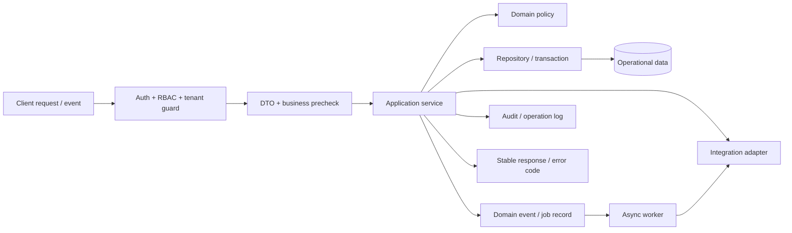
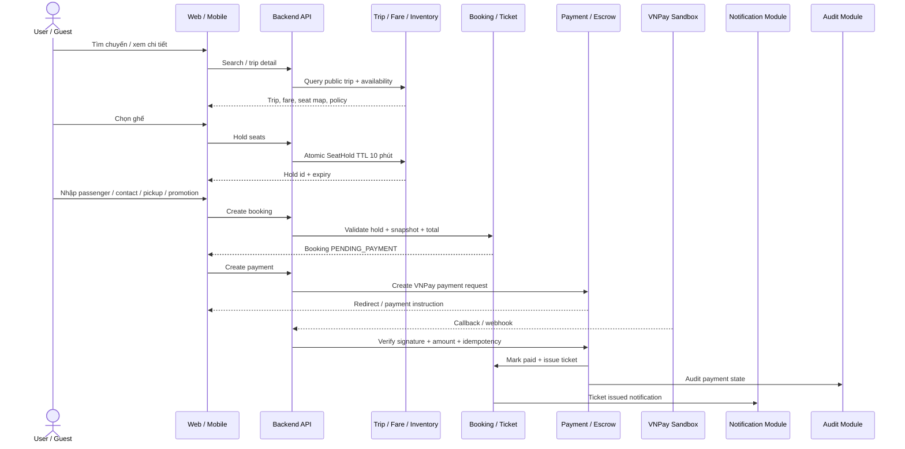
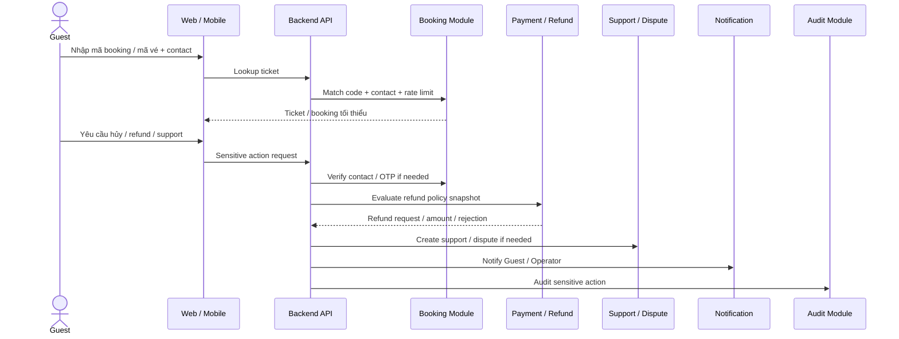
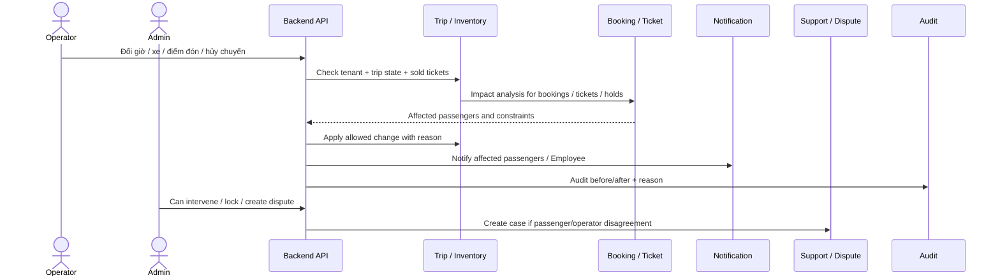
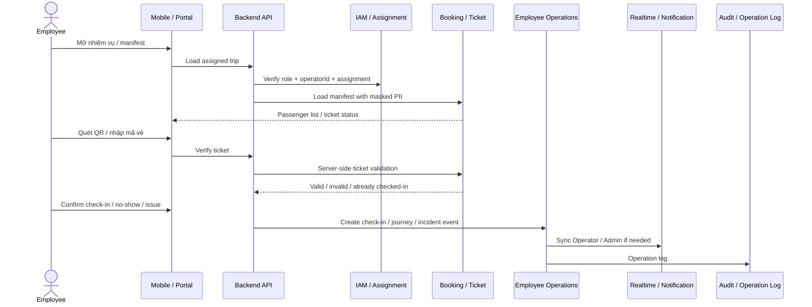
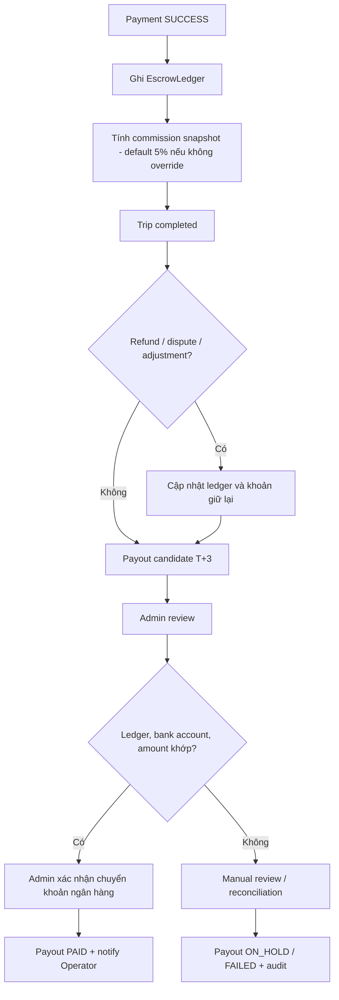
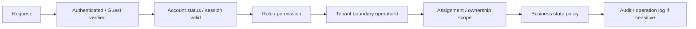

# 02. High Level Design - Hệ thống đặt vé xe khách

## 1. Thông tin tài liệu

### 1.1. Metadata

| Thuộc tính        | Giá trị                                      |
| ----------------- | -------------------------------------------- |
| Tên tài liệu      | High Level Design - Hệ thống đặt vé xe khách |
| Mã tài liệu       | 02-hld-he-thong-dat-ve-xe-khach              |
| Dự án             | Hệ thống đặt vé xe khách                     |
| Phiên bản         | v1.13                                        |
| Trạng thái        | Approved                                     |
| Người viết        | AI Agent                                     |
| Người duyệt       | Nguyễn Hồng Khanh                            |
| Ngày tạo          | 11/05/2026                                   |
| Cập nhật gần nhất | 12/05/2026                                   |

### 1.2. Lịch sử thay đổi

| Phiên bản | Ngày       | Người cập nhật              | Nội dung thay đổi                                                                                                    |
| --------- | ---------- | --------------------------- | -------------------------------------------------------------------------------------------------------------------- |
| v1.13     | 12/05/2026 | AI Agent, Nguyễn Hồng Khanh | Làm sạch trạng thái Approved: đồng bộ SRS v1.20, đóng OQ ở tầng HLD và chuyển chi tiết DB/API/Security/Test/Deploy thành handoff downstream |
| v1.12     | 12/05/2026 | AI Agent                    | Đồng bộ quyết định từ LLD v1.1: DB-authoritative SeatHold, Employee offline giới hạn và S3-compatible file storage   |
| v1.11     | 12/05/2026 | AI Agent                    | Bỏ khái niệm Tech Stack Baseline V1; HLD tham chiếu ADR-009 như khung đánh giá tech stack trong giai đoạn rebuild    |
| v1.10     | 12/05/2026 | AI Agent                    | Di chuyển bảng tech stack đề xuất sang ADR-009; HLD chỉ giữ tham chiếu và ràng buộc triển khai mức cao               |
| v1.9      | 12/05/2026 | AI Agent                    | Bổ sung bảng tech stack đề xuất để reviewer hiệu chỉnh; đồng bộ lại baseline object storage và trạng thái OQ hạ tầng |
| v1.8      | 12/05/2026 | AI Agent                    | Khắc phục lỗi review nội bộ: đồng bộ version, mobile User-only, S3-compatible storage baseline và HLD-OQ statuses    |
| v1.7      | 12/05/2026 | AI Agent                    | Chốt object/file storage dùng S3-compatible adapter; production baseline AWS S3 private bucket, local/dev dùng MinIO |
| v1.6      | 12/05/2026 | AI Agent                    | Đồng bộ mobile passenger app là User-only; Guest checkout / lookup giữ ở Web Marketplace                             |
| v1.5      | 12/05/2026 | AI Agent                    | Tách Web Operator auth và Web Employee auth trong mục 6.2 để làm rõ actor boundary                                   |
| v1.4      | 12/05/2026 | AI Agent, Nguyễn Hồng Khanh | Viết lại toàn bộ mục 6-18 theo SRS v1.19, DOMAIN-MAP và baseline mục 1-5; ghi nhận HLD-OQ còn mở                     |
| v1.3      | 12/05/2026 | AI Agent                    | Rà soát mục lục, giữ mục 1-5 làm baseline và chuẩn hóa tên các mục HLD còn cần thiết                                 |
| v1.2      | 12/05/2026 | AI Agent                    | Đồng bộ mục 1-5 theo SRS v1.19; chuẩn hóa nguồn đầu vào, phạm vi, baseline quyết định và kiến trúc tổng quan         |
| v1.1      | 12/05/2026 | AI Agent, Nguyễn Hồng Khanh | Viết lại mục 5 - Kiến trúc tổng quan theo SRS v1.19 và các quyết định đã chốt                                        |
| v1.0      | 11/05/2026 | AI Agent                    | Tạo bản nháp HLD từ SRS và context hiện tại                                                                          |

### 1.3. Trạng thái sử dụng

Tài liệu này ở trạng thái `Approved` cho phạm vi HLD: boundary kiến trúc, capability, data ownership, integration boundary và các quyết định kiến trúc mức cao của Backend V1. Nội dung v1.13 đã đồng bộ theo SRS v1.20, `DOMAIN-MAP` và LLD v1.2. HLD không thay thế ADR, Database Design, API Specification, Security Design, Test Plan hoặc Deployment & Operation Standard; các chi tiết thuộc tài liệu sau được ghi rõ là handoff downstream, không phải Open Question còn treo của HLD.

---

## 2. Mục lục

1. Thông tin tài liệu
2. Mục lục
3. Giới thiệu
4. Nguồn đầu vào và phạm vi thiết kế
5. Kiến trúc tổng quan
6. Kiến trúc client
7. Kiến trúc backend
8. Boundary capability / module
9. Data ownership mức cao
10. Luồng tích hợp chính
11. Bảo mật và phân quyền mức cao
12. Realtime, queue và background job
13. Tích hợp ngoài
14. Tổng quan triển khai
15. Mapping yêu cầu phi chức năng
16. Quyết định thiết kế
17. Rủi ro kiến trúc và giảm thiểu
18. Quyết định HLD và handoff downstream
19. Phụ lục

Ghi chú: mục 1-18 là HLD v1.13 đã đồng bộ theo SRS v1.20, `DOMAIN-MAP` và LLD v1.2. Mục 18 chỉ giữ quyết định / handoff phát sinh ở tầng HLD, không mở lại các OQ / MQ đã chốt trong SRS §21. Việc giữ hay mở lại tech stack hiện có phải theo ADR-009 và quyết định reviewer.

---

## 3. Giới thiệu

### 3.1. Mục đích tài liệu

Tài liệu này mô tả thiết kế kiến trúc mức cao cho hệ thống đặt vé xe khách theo SRS v1.20. HLD chuyển yêu cầu nghiệp vụ đã chốt thành boundary kiến trúc, capability chính, nguyên tắc dữ liệu, nguyên tắc tích hợp và các ràng buộc vận hành để làm đầu vào cho LLD, Database Design, API Specification, Security Design, UI/UX Flow và Test Plan.

### 3.2. Định vị kiến trúc

Hệ thống là một **managed marketplace** ba bên: Hành khách / Guest, Operator / Employee và Platform Admin. Platform cung cấp công nghệ, kênh phân phối, thanh toán, escrow, payout, dispute resolution, audit và governance; Platform KHÔNG sở hữu xe, KHÔNG thuê tài xế và KHÔNG trực tiếp vận hành chuyến đi.

Kiến trúc v1 ưu tiên:

- Không bán trùng ghế.
- Nhất quán chuỗi booking - ticket - payment - escrow - payout.
- Tenant boundary chặt theo Operator.
- Kiểm soát quyền và audit cho thao tác nhạy cảm.
- Khả năng đối soát payment / refund / payout.
- Khả năng mở rộng capability sau này mà không đổi nghĩa nghiệp vụ đã chốt.

### 3.3. Đối tượng đọc

| Đối tượng    | Mục đích đọc                                                                  |
| ------------ | ----------------------------------------------------------------------------- |
| Người duyệt  | Xác nhận thiết kế không vượt phạm vi SRS v1.20                                |
| Kiến trúc sư | Chốt boundary hệ thống, capability, dữ liệu sở hữu và điểm tích hợp chính     |
| Backend dev  | Hiểu trách nhiệm backend, transaction boundary, queue, audit và adapter       |
| Frontend dev | Hiểu portal boundary, actor flow, trạng thái nghiệp vụ và phụ thuộc API       |
| Mobile dev   | Hiểu phạm vi User / Employee, quyền, check-in, offline / sync ở mức kiến trúc |
| QA / Tester  | Chuẩn bị test strategy theo FR / UC / BR / AC đã trace từ SRS                 |

### 3.4. Phạm vi tài liệu

HLD mô tả kiến trúc mức cao, không thay thế thiết kế chi tiết. Tài liệu này CHỈ chốt các nội dung sau ở mức architecture:

- Boundary giữa Marketplace layer, Operator OS layer và Platform admin layer.
- Capability chính và trách nhiệm mức cao.
- Nguyên tắc dữ liệu sở hữu, snapshot, tenant boundary và audit.
- Luồng tích hợp trọng yếu giữa booking, payment, ticket, refund, escrow, payout, notification, reporting và audit.
- Ràng buộc bảo mật, realtime, queue, provider adapter và deployment overview ở mức cao.

Tài liệu này KHÔNG chốt schema, migration, DTO, endpoint, error catalog, UI screen state, thuật toán nội bộ hoặc test case chi tiết. Các nội dung đó thuộc các tài liệu `03` đến `08`.

---

## 4. Nguồn đầu vào và phạm vi thiết kế

### 4.1. Thứ tự ưu tiên nguồn đầu vào

| Nguồn                                            | Vai trò trong HLD                                                            | Mức ưu tiên |
| ------------------------------------------------ | ---------------------------------------------------------------------------- | ----------- |
| `@vi/SDLC/01-srs-he-thong-dat-ve-xe-khach` v1.20 | Nguồn nghiệp vụ, phạm vi, FR / NFR / UC / BR / AC và quyết định đã chốt      | Cao nhất    |
| `@context/PROJECT-STATE`                         | Trạng thái tài liệu, blocker, quyết định mới và rủi ro đồng bộ               | Cao         |
| `@vi/SDLC/00-quy-chuan-cho-lap-trinh-vien`       | Quy chuẩn SDLC, điều kiện dùng tài liệu để triển khai                        | Cao         |
| `@context/DOMAIN-MAP`                            | Bản đồ capability / module mục tiêu, hỗ trợ đặt boundary                     | Trung bình  |
| `@context/PROJECT-STRUCTURE`                     | Snapshot cấu trúc repo hiện tại; dùng để nhận diện legacy và phạm vi rewrite | Tham khảo   |
| `@context/TECH-STACK`                            | Ràng buộc kỹ thuật hiện có; KHÔNG phải nguồn mở rộng phạm vi nghiệp vụ       | Tham khảo   |

Khi context kỹ thuật mâu thuẫn với SRS v1.20 hoặc quyết định đã chốt trong `PROJECT-STATE`, HLD ưu tiên SRS / PROJECT-STATE và ghi rõ phần còn lại là ràng buộc, handoff downstream hoặc vấn đề cần reviewer quyết định ở tài liệu phù hợp.

### 4.2. Phạm vi thiết kế theo SRS v1.20

| Phạm vi                                                                             | Trạng thái trong HLD v1.13 | Ghi chú thiết kế                                                                                                             |
| ----------------------------------------------------------------------------------- | -------------------------- | ---------------------------------------------------------------------------------------------------------------------------- |
| Marketplace layer                                                                   | Trong phạm vi              | User / Guest search, trip detail, seat hold, booking, VNPay payment, e-ticket, ticket lookup, support, review, dispute entry |
| Operator OS layer                                                                   | Trong phạm vi              | Operator profile, KYC, finance, vehicle, route, trip, fare, inventory, employee, manifest, check-in support, report          |
| Platform admin layer                                                                | Trong phạm vi              | KYC approval, catalog, policy, commission, payout, payment/refund/escrow monitoring, dispute arbitration, audit, reporting   |
| Mobile User                                                                         | Trong phạm vi              | Một mobile codebase, tách mode User; đặt vé, xem vé, notification, support                                                   |
| Mobile Employee                                                                     | Trong phạm vi              | Một mobile codebase, tách mode Employee; nhiệm vụ, manifest, QR check-in, trip status, journey log, incident                 |
| External Operator API / hybrid integration                                          | Ngoài phạm vi v1           | Chỉ thiết kế boundary để không khóa hướng mở rộng, chưa hỗ trợ trong baseline v1                                             |
| Subsidy promotion, interline phức tạp, IoT, payroll, multi-currency, multi-language | Ngoài phạm vi v1           | Không đưa vào module nghiệp vụ v1 nếu không có review SRS mới                                                                |

### 4.3. Baseline quyết định đã chốt

| Chủ đề               | Baseline HLD v1.13                                                                                                                   | Truy vết             |
| -------------------- | ------------------------------------------------------------------------------------------------------------------------------------ | -------------------- |
| Marketplace model    | Managed marketplace trung lập; Operator là tín hiệu dịch vụ chính, Platform bảo chứng giao dịch / hỗ trợ / tranh chấp                | MQ-05, OQ-20         |
| Payment provider     | VNPay Sandbox là provider đầu tiên; vẫn dùng adapter để mở rộng provider sau                                                         | OQ-05                |
| Seat hold            | Giữ ghế mặc định 10 phút cấp Platform, không per-Operator trong v1                                                                   | OQ-06, BR-02         |
| SeatHold consistency | DB-authoritative hybrid: DB giữ invariant cuối cùng cho active hold / booked seat, lock service chỉ là lớp phụ trợ nếu có            | LLD-OP-02            |
| Checkout             | Marketplace v1 ưu tiên thanh toán trước; `PENDING_CONFIRMATION` giữ trong enum cho ngoại lệ / phase sau                              | OQ-07                |
| Guest checkout       | Guest được giữ ghế, tạo booking, thanh toán và tra cứu vé sau xác minh                                                               | BR-21, UC-35         |
| Fare                 | `Fare` / `FareRule` là collection riêng; booking lưu fare snapshot; chưa hỗ trợ segment fare baseline v1                             | OQ-08                |
| OTP / notification   | Email OTP là baseline v1; SMS OTP ngoài phạm vi v1; SMS / push giữ adapter cho notification tương lai                                | OQ-09                |
| Refund policy        | Platform default policy + Operator override do Admin duyệt; booking luôn lưu policy snapshot                                         | OQ-13                |
| Audit                | Audit log v1 lưu MongoDB cùng cluster, append-only, không xóa cứng                                                                   | OQ-14                |
| Reporting            | MongoDB aggregation + async jobs cho báo cáo lớn; chưa tách data warehouse                                                           | OQ-15                |
| Escrow / payout      | Escrow payout T+3 sau chuyến hoàn thành, không ngưỡng tối thiểu, chuyển khoản ngân hàng, Admin xác nhận thủ công                     | MQ-01, OQ-16         |
| Commission           | Default 5% cho Operator mới; Admin có thể override per-Operator bằng rule có hiệu lực                                                | OQ-18                |
| KYC                  | KYC Operator v1 gồm pháp nhân, giấy phép vận tải, đại diện / ủy quyền, tài khoản ngân hàng nhận payout                               | OQ-19                |
| Object storage       | S3-compatible object storage qua FileStorageProvider; production AWS S3 private bucket, local/dev MinIO; DB metadata/object key only | HLD-OQ-01, LLD-OP-04 |
| Employee offline     | Mobile Employee dùng read cache manifest + queued operational actions có giới hạn; không full offline sync                           | HLD-OQ-04, LLD-OP-03 |

### 4.4. Ràng buộc và handoff downstream ở mức HLD

| ID          | Loại      | Nội dung                                                                                                                                           | Tài liệu / tác động nhận                                                                              |
| ----------- | --------- | -------------------------------------------------------------------------------------------------------------------------------------------------- | ----------------------------------------------------------------------------------------------------- |
| HLD-CSTR-01 | Ràng buộc | Backend V1 có một application backend trung tâm phục vụ các client; HLD không yêu cầu microservice.                                                | LLD / API dùng capability boundary nhưng không buộc tách service vật lý.                              |
| HLD-CSTR-02 | Ràng buộc | Operational data store, cache / lock và queue phải theo quyết định ADR-009; hiện trạng repo chỉ là candidate nếu chưa được reviewer xác nhận.      | Database Design và ADR chốt engine / implementation detail; HLD chỉ chốt consistency boundary.        |
| HLD-HO-01   | Handoff   | SMS notification và push notification giữ adapter boundary; object storage target đã chốt S3-compatible/AWS S3/MinIO baseline.                    | API / Security / Deployment chốt chi tiết kênh, token lifecycle, signed URL, retention và scan policy. |
| HLD-HO-02   | Handoff   | Monitoring, logging stack, secret manager, production deployment target và incident runbook thuộc Deployment & Operation Standard.                 | Không chặn HLD; bắt buộc chốt trước staging / production.                                             |

---

## 5. Kiến trúc tổng quan

### 5.1. Mô hình kiến trúc

Hệ thống v1 dùng mô hình **application core theo capability**. HLD không ràng buộc business boundary vào cấu trúc legacy hiện tại; các module triển khai sau phải phục vụ đúng capability và rule của SRS v1.20.

Ở mức triển khai ban đầu, backend CÓ THỂ là modular monolith để giảm độ phức tạp vận hành. Tuy nhiên, các capability search, booking, payment, notification, reporting và audit phải có boundary đủ rõ để tách service hoặc scale độc lập khi có nhu cầu.

```mermaid
flowchart TB
    subgraph Clients[Client channels]
        WebUser[Web User Portal]
        WebOperator[Web Operator Portal]
        WebAdmin[Web Admin Portal]
        Mobile[Mobile App - User / Employee]
    end

    subgraph Platform[Platform application core]
        API[API / Application Core]
        IAM[IAM & Access Control]
        MKT[Marketplace Capability]
        OPS[Operator OS Capability]
        ADM[Platform Admin Capability]
        INV[Trip / Fare / Inventory]
        BTP[Booking / Ticket]
        PAY[Payment / Escrow / Payout]
        TRUST[Support / Review / Dispute]
        NOTI[Notification]
        RPT[Reporting]
        AUD[Audit]
        JOB[Async Job / Reconciliation]
    end

    subgraph Data[Data and consistency]
        Store[(Operational data store)]
        Lock[(Seat hold / lock / cache)]
        FileStore[(File / attachment storage)]
    end

    subgraph External[External systems]
        VNPay[VNPay Sandbox]
        Bank[Bank transfer - manual confirmation]
        Email[Email OTP / Email notification]
        Channel[SMS / Push provider adapter]
        Routing[Routing / distance adapter]
    end

    WebUser --> API
    WebOperator --> API
    WebAdmin --> API
    Mobile --> API

    API --> IAM
    API --> MKT
    API --> OPS
    API --> ADM
    MKT --> INV
    MKT --> BTP
    BTP --> PAY
    BTP --> TRUST
    OPS --> INV
    ADM --> PAY
    ADM --> TRUST
    ADM --> AUD
    PAY --> JOB
    NOTI --> JOB
    RPT --> JOB

    IAM --> Store
    INV --> Store
    BTP --> Store
    PAY --> Store
    TRUST --> Store
    NOTI --> Store
    RPT --> Store
    AUD --> Store
    INV --> Lock
    BTP --> Lock
    OPS --> FileStore
    TRUST --> FileStore

    PAY --> VNPay
    PAY --> Bank
    NOTI --> Email
    NOTI --> Channel
    INV --> Routing
```

### 5.2. Kiến trúc logic theo lớp

| Lớp logic                       | Trách nhiệm chính                                                                                                                                           | Ràng buộc từ SRS v1.20                                                                                                  |
| ------------------------------- | ----------------------------------------------------------------------------------------------------------------------------------------------------------- | ----------------------------------------------------------------------------------------------------------------------- |
| Client channel layer            | Cung cấp UI / flow riêng cho Web User, Web Operator, Web Admin và Mobile User / Employee; không giữ business rule cuối cùng.                                | Mobile một codebase nhưng tách giao diện, session, quyền và luồng theo actor; Guest checkout được hỗ trợ ở Marketplace. |
| API / Application core          | Xác thực, validate, kiểm RBAC / tenant boundary, điều phối use case, quản lý trạng thái nghiệp vụ và trả lỗi ổn định cho client.                            | Backend là điểm kiểm soát cuối cho quyền, trạng thái ghế, booking, ticket, payment, refund và dữ liệu cá nhân.          |
| Domain capability layer         | Chia capability theo nghiệp vụ: IAM, Marketplace, Operator OS, Platform Admin, Trip/Fare/Inventory, Booking/Ticket, Payment/Escrow/Payout, Support/Dispute. | Capability sở hữu dữ liệu và rule rõ; capability khác chỉ thao tác qua service / policy boundary.                       |
| Transaction & consistency layer | Bảo vệ các điểm quyết định: giữ ghế 10 phút, tạo booking, tạo payment, xử lý callback, phát hành ticket, refund, escrow ledger và payout.                   | Không bán trùng ghế; payment / refund / job phải idempotent; booking lưu snapshot bắt buộc.                             |
| Data & policy layer             | Lưu operational data, state history, policy version, booking snapshot, audit append-only, dữ liệu report và attachment.                                     | Dữ liệu Operator phải có tenant boundary; audit v1 lưu MongoDB append-only; không xóa cứng booking / ticket / payment.  |
| Async / realtime layer          | Xử lý hết hạn SeatHold, retry notification, payment callback, reconciliation, reporting lớn, payout candidate, đồng bộ check-in / trạng thái vận hành.      | Reporting dùng aggregation và job bất đồng bộ; job quan trọng phải có trạng thái, lock, retry và khả năng chạy lại.     |
| Integration adapter layer       | Cô lập tích hợp với VNPay Sandbox, email OTP / notification, SMS / push provider tương lai, routing, file storage và quy trình chuyển khoản ngân hàng.      | VNPay Sandbox là payment provider đầu tiên; email OTP là kênh xác thực v1; SMS OTP ngoài phạm vi v1.                    |

### 5.3. Nguyên tắc kiến trúc

| ID          | Nguyên tắc                                                                                                                                                         | Truy vết chính                             |
| ----------- | ------------------------------------------------------------------------------------------------------------------------------------------------------------------ | ------------------------------------------ |
| HLD-PRIN-01 | Platform là trung gian công nghệ và thanh toán; không sở hữu xe, không thuê tài xế, không trực tiếp vận hành chuyến.                                               | SRS §4.1, §4.5, MQ-05                      |
| HLD-PRIN-02 | Backend là nguồn kiểm tra cuối cùng cho xác thực, RBAC, tenant boundary, trạng thái ghế, booking, ticket, payment, refund, payout và audit.                        | SRS §11.4, §14, §15, §17                   |
| HLD-PRIN-03 | Dữ liệu thuộc Operator phải luôn truy vết được về `operatorId` hoặc tenant boundary tương đương; Operator / Employee KHÔNG ĐƯỢC thao tác dữ liệu Operator khác.    | DM-01, BR-08, BR-09                        |
| HLD-PRIN-04 | Ghế trên chuyến là tài nguyên giao dịch; giữ ghế mặc định 10 phút cấp Platform và phải chống bán trùng tại hold, booking, payment và ticket issuance.              | DM-02, BR-01..03, OQ-06                    |
| HLD-PRIN-05 | Booking / ticket / payment / refund / escrow / payout phải truy vết theo một chuỗi giao dịch duy nhất và có mã tham chiếu phục vụ đối soát.                        | DM-03, BR-17, NFR-DATA-03                  |
| HLD-PRIN-06 | Booking phải lưu snapshot tối thiểu về chuyến, Operator, route, stop point, seat, fare, promotion, chính sách hủy / hoàn, hành khách, contact và tổng tiền.        | DM-04, BR-24, BR-26                        |
| HLD-PRIN-07 | Marketplace checkout v1 là luồng thanh toán trước; `PENDING_CONFIRMATION` chỉ là trạng thái dự phòng cho ngoại lệ / phase sau, không mở mặc định cho hành khách.   | BR-04, BR-27, OQ-07                        |
| HLD-PRIN-08 | Payment provider đầu tiên là VNPay Sandbox, nhưng vẫn đi qua adapter; callback / webhook phải xác minh, idempotent và hỗ trợ reconciliation.                       | OQ-05, BR-27..28, NFR-DATA-04              |
| HLD-PRIN-09 | Tiền thanh toán thành công đi vào escrow; commission mặc định 5%; payout v1 xét T+3 sau chuyến hoàn thành, không ngưỡng tối thiểu, Admin xác nhận thủ công.        | MQ-01, OQ-16, OQ-18, BR-30..33             |
| HLD-PRIN-10 | Refund / dispute dùng policy snapshot; Platform Admin là arbiter cuối cùng và mọi refund thủ công / đơn phương phải có quyền, lý do, audit và notification.        | OQ-13, MQ-03, BR-35, BR-49..51             |
| HLD-PRIN-11 | Audit log cho thao tác nhạy cảm là append-only ở v1; không xóa cứng booking, ticket, payment, refund, payout hoặc audit log trong production.                      | OQ-14, BR-58..59, NFR-AUDIT-03             |
| HLD-PRIN-12 | Reporting lớn không được làm chậm search, booking, payment hoặc check-in; ưu tiên aggregation và background job có checkpoint / retry.                             | OQ-15, BR-56, BR-62, NFR-PERF-05           |
| HLD-PRIN-13 | Email OTP là baseline xác thực v1; SMS OTP ngoài phạm vi v1. Notification giữ adapter boundary; file storage dùng S3-compatible adapter với AWS S3/MinIO baseline. | OQ-09, HLD-OQ-01, NFR-COMP-03, NFR-COMP-05 |
| HLD-PRIN-14 | Mọi capability phải trace được về FR / UC / BR liên quan; phần chưa đủ chi tiết sẽ được chốt ở LLD, DB Design, API Spec, Security Design và Test Plan.             | SRS §19.3, `03`..`08`                      |

### 5.4. Kết quả bàn giao từ mục 1-5 cho các mục sau

| Đầu ra kiến trúc                                                                                | Mục sau phải dùng |
| ----------------------------------------------------------------------------------------------- | ----------------- |
| Capability boundary theo Marketplace / Operator OS / Platform Admin                             | Mục 6, 7, 8       |
| Chuỗi nhất quán ghế - booking - ticket - payment - escrow - payout                              | Mục 7, 9, 10, 12  |
| Baseline provider: VNPay Sandbox, email OTP, adapter cho SMS / push, S3-compatible file storage | Mục 12, 13, 14    |
| Tenant boundary, audit append-only, masking và thao tác nhạy cảm                                | Mục 9, 11, 15     |
| Reporting aggregation + async jobs                                                              | Mục 12, 15        |
| Các handoff còn lại về SMS / push provider, monitoring, deployment target                       | Mục 13, 14, 18    |

---

## 6. Kiến trúc client

### 6.1. Nguyên tắc client

Client là kênh thao tác và hiển thị, không phải nơi sở hữu rule cuối cùng. Mọi rule ảnh hưởng tiền, ghế, vé, quyền, tenant, dữ liệu cá nhân, refund, payout hoặc audit phải được enforce ở backend.

| ID         | Nguyên tắc client                                                                                                   | Truy vết                 |
| ---------- | ------------------------------------------------------------------------------------------------------------------- | ------------------------ |
| HLD-CLT-01 | Tách trải nghiệm theo actor: User / Guest, Operator, Employee và Admin không dùng chung surface nghiệp vụ nhạy cảm. | `FR-IAM-*`, `UC-01`      |
| HLD-CLT-02 | Client chỉ dùng dữ liệu public hoặc dữ liệu đã được backend cấp quyền; UI guard không thay thế backend guard.       | `NFR-SEC-03`, `DM-01`    |
| HLD-CLT-03 | Trạng thái ghế, booking, payment, ticket, refund và payout luôn lấy từ server hoặc realtime event đã xác thực.      | `FR-BTP-*`, `NFR-DATA-*` |
| HLD-CLT-04 | Guest flow phải gắn với guest session / contact đã xác minh, không được biến thành lịch sử tài khoản lâu dài.       | `FR-MKT-12`, `UC-35`     |
| HLD-CLT-05 | Dữ liệu cá nhân mặc định hiển thị tối thiểu; số điện thoại hành khách cho Employee phải mask theo `OQ-11`.          | `NFR-PRIV-*`, `OQ-11`    |

### 6.2. Client channel và phạm vi

| Client channel       | Actor chính | Use case chính           | Phạm vi dữ liệu                                                            | Ràng buộc HLD                                                                        |
| -------------------- | ----------- | ------------------------ | -------------------------------------------------------------------------- | ------------------------------------------------------------------------------------ |
| Web Marketplace      | User, Guest | `UC-02..09`, `UC-35`     | Chuyến public, Operator profile, booking của phiên / User, ticket, support | Không hiển thị chuyến chưa mở bán, Operator chưa duyệt hoặc ghế không hợp lệ.        |
| Web Operator auth    | Operator    | `UC-01`                  | Tài khoản Operator, trạng thái hồ sơ, session Operator OS                  | Không dùng chung luồng đăng nhập User; không public reset password nội bộ.           |
| Web Employee auth    | Employee    | `UC-01`                  | Tài khoản Employee do Operator cấp, role và assignment scope               | Không dùng session Operator; đăng nhập xong chỉ vào phạm vi Employee được phân công. |
| Web Operator OS      | Operator    | `UC-10..17`, `UC-33..34` | Hồ sơ, xe, tuyến, chuyến, booking, finance, report thuộc `operatorId`      | Mọi request phải có tenant boundary; export danh sách khách phải theo quyền.         |
| Web Platform admin   | Admin       | `UC-23..30`, `UC-33`     | Dữ liệu toàn hệ thống theo RBAC                                            | Ưu tiên tra cứu, lọc, xử lý ngoại lệ, audit; thao tác nhạy cảm cần re-auth.          |
| Mobile User mode     | User        | `UC-02..09`, `UC-34`     | Search, booking, vé, notification, support theo tài khoản User             | Guest checkout / lookup không nằm trong mobile baseline; giữ ở Web Marketplace.      |
| Mobile Employee mode | Employee    | `UC-18..22`, `UC-34`     | Nhiệm vụ, manifest, check-in, nhật trình, sự cố thuộc phân công            | Chỉ theo assignment scope; check-in phải xác thực server-side.                       |

### 6.3. Web frontend

| Khu vực web                | Vai trò kiến trúc                                                                                                 | Ghi chú thiết kế                                                                                                   |
| -------------------------- | ----------------------------------------------------------------------------------------------------------------- | ------------------------------------------------------------------------------------------------------------------ |
| Public search / trip       | Tìm kiếm, lọc, so sánh, xem chi tiết chuyến và Operator profile.                                                  | Search state có thể cache ở client ngắn hạn, nhưng availability phải kiểm tra lại trước khi giữ ghế.               |
| Booking checkout           | Chọn ghế, giữ ghế, nhập hành khách, chọn điểm đón / trả, áp promotion, thanh toán VNPay redirect và nhận vé.      | UI phải hiển thị TTL SeatHold 10 phút, tổng tiền, fare snapshot và policy hủy / hoàn trước khi tạo payment.        |
| Ticket lookup              | Tra cứu booking / ticket cho Guest bằng mã được phép và contact.                                                  | Thao tác nhạy cảm như hủy / refund / support cần xác minh bổ sung theo `FR-IAM-10`.                                |
| Operator OS workspace      | Quản trị hồ sơ, KYC, xe, route, stop point, trip, fare, inventory, booking, employee, finance, support và report. | Thiết kế theo thao tác lặp lại; danh sách, bộ lọc, bulk/export và cảnh báo thay đổi chuyến đã bán vé là trọng yếu. |
| Admin operations workspace | Duyệt KYC, catalog, policy, commission, payout, payment/refund/reconciliation, dispute, review, report và audit.  | Không thiết kế như landing page; cần bảng dữ liệu, filter mạnh, trạng thái xử lý và audit trail rõ.                |

### 6.4. Mobile app

Mobile v1 dùng một codebase nhưng tách mode theo actor. Việc tách mode phải áp dụng ở routing, session, permission, cache key, notification topic và storage cục bộ.

| Mode     | Trách nhiệm chính                                                                     | Dữ liệu cần ưu tiên đồng bộ                                                  | Ràng buộc đặc biệt                                                                                                                    |
| -------- | ------------------------------------------------------------------------------------- | ---------------------------------------------------------------------------- | ------------------------------------------------------------------------------------------------------------------------------------- |
| User     | Tìm chuyến, đặt vé, thanh toán, xem vé, nhận notification, support / complaint.       | Booking đang chờ thanh toán, ticket hợp lệ, notification bắt buộc.           | Không lưu token / QR raw secret ở nơi không an toàn; Guest checkout / lookup giữ ở Web Marketplace.                                   |
| Employee | Xem nhiệm vụ, manifest, QR check-in, trạng thái hành khách, trạng thái chuyến, sự cố. | Nhiệm vụ được phân công, manifest theo chuyến, trạng thái check-in mới nhất. | Khi mất mạng, hỗ trợ read cache manifest và queue giới hạn check-in / no-show / journey log / incident; server reconcile khi có mạng. |

### 6.5. Client state, realtime và lỗi

| Nhóm state / event               | Cách xử lý ở client                                                                  | Backend contract cần có                                                      |
| -------------------------------- | ------------------------------------------------------------------------------------ | ---------------------------------------------------------------------------- |
| Server state                     | Query theo key có actor / tenant / trip / booking rõ ràng; invalidate theo event.    | API trả version / updatedAt / status ổn định cho dữ liệu biến động.          |
| SeatHold / checkout              | Hiển thị countdown từ expiry server trả về; không tự gia hạn hoặc giả định còn hold. | Endpoint hold / release / create booking phải idempotent theo session.       |
| Payment redirect / callback view | Client chỉ hiển thị trạng thái pending / success / failed / reconciling từ backend.  | Backend xử lý callback provider và expose trạng thái payment đã xác minh.    |
| Realtime update                  | Subscribe theo User / Operator / Employee / Admin scope.                             | Event payload phải tối thiểu, không chứa dữ liệu ngoài quyền người nhận.     |
| Form / validation                | Validate UX ở client, nhưng backend quyết định hợp lệ cuối cùng.                     | API trả error code ổn định để UI map message và flow recovery.               |
| Attachment                       | Upload KYC, dispute, incident, report export theo adapter file storage.              | File policy, size, type, retention và signed URL sẽ do DB/API/Security chốt. |

---

## 7. Kiến trúc backend

### 7.1. Hình thái backend V1

Backend V1 dùng một application backend trung tâm theo mô hình modular application core. HLD không yêu cầu tách microservice ở V1; ưu tiên là boundary nghiệp vụ rõ, transaction point chặt và khả năng tách scale sau này cho search, booking, payment, notification, reporting và audit.

| Thành phần backend             | Trách nhiệm chính                                                                                                 | Ghi chú HLD                                                                  |
| ------------------------------ | ----------------------------------------------------------------------------------------------------------------- | ---------------------------------------------------------------------------- |
| API / Gateway layer            | Nhận HTTP / realtime request, xác thực, rate limit, validate DTO, route đến use case.                             | Không để controller chứa business rule phức tạp.                             |
| Application service layer      | Điều phối use case, kiểm trạng thái, gọi policy, repository, adapter và phát event / job.                         | Là nơi enforce luồng nghiệp vụ đã mô tả trong SRS.                           |
| Domain policy layer            | Rule tính giá, promotion, refund policy, commission, payout condition, tenant permission, state transition.       | Rule có ảnh hưởng tiền / vé phải test độc lập ở LLD/Test Plan.               |
| Repository / data access layer | Truy vấn operational store, atomic update, transaction / lock, index-aware query, soft delete / archival flag.    | Không expose query raw cho controller.                                       |
| Integration adapter layer      | VNPay, email, SMS / push tương lai, routing, storage, bank payout channel.                                        | Provider cụ thể không lan vào domain service.                                |
| Async worker / scheduler       | SeatHold expiry, payment retry / reconciliation, notification retry, report export, payout candidate, audit task. | Job phải có lock, idempotency, checkpoint và trạng thái xử lý.               |
| Audit / observability support  | AuditLog append-only, operation log, job log, integration status, alert cho lỗi nghiêm trọng.                     | Monitoring stack cụ thể là HLD-OQ, nhưng event quan sát là yêu cầu bắt buộc. |

### 7.2. Luồng xử lý chuẩn trong backend

### 7.3. Transaction và consistency boundary

| Boundary nghiệp vụ     | Điểm quyết định backend                                                                | Cơ chế HLD bắt buộc                                                                                                                                        |
| ---------------------- | -------------------------------------------------------------------------------------- | ---------------------------------------------------------------------------------------------------------------------------------------------------------- |
| SeatHold               | User / Guest giữ một hoặc nhiều ghế trên cùng Trip.                                    | DB-authoritative hybrid: DB giữ invariant active hold / booked seat; lock service nếu có chỉ hỗ trợ giảm contention; TTL 10 phút, không tạo hold một phần. |
| Create booking         | Tạo booking từ SeatHold còn hiệu lực.                                                  | Recheck hold, trip, fare, policy, promotion, contact; lưu snapshot bắt buộc.                                                                               |
| Create payment         | Tạo payment cho booking `PENDING_PAYMENT`.                                             | Kiểm booking chưa hết hạn / chưa paid / chưa hủy; amount khớp snapshot; tạo mã payment duy nhất.                                                           |
| Payment callback       | VNPay callback / webhook trả kết quả.                                                  | Verify chữ ký / số tiền / transaction id, xử lý idempotent, đưa `RECONCILING` khi lệch.                                                                    |
| Ticket issuance        | Phát hành ticket sau payment success hoặc luồng xác nhận hợp lệ.                       | Recheck booking / seat, tạo QR token không đoán được, cập nhật seat / booking / ticket atomically.                                                         |
| Refund                 | Hủy / refund theo policy snapshot hoặc quyết định Admin.                               | Check policy, quyền, trạng thái ticket, ledger, audit và notification bắt buộc.                                                                            |
| Escrow / payout        | Ghi nhận tiền giữ hộ, commission, payout candidate T+3 và Admin xác nhận chuyển khoản. | Ledger có reference, không cập nhật payout thành `PAID` nếu chưa có xác nhận thủ công.                                                                     |
| Trip change after sale | Operator / Admin đổi giờ, xe, điểm đón / trả hoặc hủy chuyến đã bán vé.                | Require reason, impact analysis, notification, audit; chặn sửa âm thầm.                                                                                    |
| Employee check-in      | Employee xác thực QR / mã vé và cập nhật trạng thái hành khách.                        | Server-side verification, assignment scope, chống check-in lại, operation log.                                                                             |

### 7.4. Cross-cutting concern

| Concern        | Thiết kế mức cao                                                                                                      |
| -------------- | --------------------------------------------------------------------------------------------------------------------- |
| Authentication | Tách auth flow theo actor: User, Guest verification, Operator, Employee, Admin. Token/session policy chốt ở Security. |
| Authorization  | Guard kiểm role, permission, tenant boundary, assignment scope và object ownership ở backend.                         |
| Validation     | DTO validation cho shape dữ liệu; service / policy kiểm rule nghiệp vụ và state transition.                           |
| Idempotency    | Bắt buộc cho hold, create payment, callback, refund, notification, payout job và report export.                       |
| Rate limiting  | Áp dụng cho login, OTP, search, hold seat, payment creation, ticket lookup và support / dispute attachment upload.    |
| Audit          | Ghi AuditLog cho thao tác nhạy cảm; operation log cho check-in / journey / incident; audit append-only ở MongoDB v1.  |
| Error handling | Business error code ổn định, không lộ dữ liệu nội bộ; client có thể map sang recovery flow.                           |
| Privacy        | Không log plaintext token, OTP, mật khẩu, QR raw secret, dữ liệu thanh toán nhạy cảm hoặc PII ngoài nhu cầu vận hành. |
| Configuration  | Policy như SeatHold TTL, refund policy, commission, payout policy, maintenance state phải có version / history.       |
| Observability  | Có log / metric / alert cho booking, payment, refund, payout, check-in, queue, provider callback và job failure.      |

### 7.5. Adapter boundary

| Adapter             | Provider / trạng thái HLD                                                       | Interface tối thiểu cần có                                                                      |
| ------------------- | ------------------------------------------------------------------------------- | ----------------------------------------------------------------------------------------------- |
| PaymentProvider     | VNPay Sandbox là provider đầu tiên                                              | Create payment, verify callback, map status, query / reconcile transaction, refund hook nếu có. |
| EmailProvider       | Email OTP / email notification là baseline v1                                   | Send OTP, send transactional email, template variables, delivery status.                        |
| SmsProvider         | Provider chưa chốt, SMS OTP ngoài phạm vi v1                                    | Send message, delivery status, retry classification.                                            |
| PushProvider        | Provider chưa chốt                                                              | Register device token, send push, revoke token, delivery status.                                |
| RoutingProvider     | OSRM adapter theo context hiện tại                                              | Distance / duration / route helper, timeout, fallback khi service lỗi.                          |
| FileStorageProvider | S3-compatible object storage; production AWS S3 private bucket, local/dev MinIO | Upload, download signed URL, delete / archive policy, virus/type/size validation hook.          |
| BankPayoutChannel   | V1 chuyển khoản ngân hàng và Admin xác nhận thủ công                            | Record transfer instruction, attach proof/reference, manual confirmation state.                 |

---

## 8. Boundary capability / module

### 8.1. Capability map mục tiêu

Boundary dưới đây lấy `DOMAIN-MAP` làm bản đồ mục tiêu. HLD không coi các module backend hiện tại là source of truth vì dự án đã chọn rewrite strategy.

| Capability HLD            | Target module group theo `DOMAIN-MAP`                                   | Trách nhiệm chính                                                                           | FR / UC chính                                  |
| ------------------------- | ----------------------------------------------------------------------- | ------------------------------------------------------------------------------------------- | ---------------------------------------------- |
| IAM & Access Control      | `iam/`, `auth/`, `user/`, `session/`, `role/`                           | Danh tính, đăng nhập, session, role, permission, account status, re-auth.                   | `FR-IAM-*`, `UC-01`                            |
| Marketplace               | `marketplace/`, `search/`                                               | Search, trip detail, Operator profile public, guest flow, ticket lookup entry.              | `FR-MKT-*`, `UC-02..03`, `UC-35`               |
| Trip / Fare / Inventory   | `trip/`, `trip-seat/`, `seat-hold/`, `fare/`                            | Trip, TripSeat, SeatHold, Fare/FareRule, sale window, inventory lock / block.               | `FR-BTP-01..04`, `FR-OPS-06..13`               |
| Booking & Ticket          | `booking/`, `ticket/`                                                   | Booking, PassengerInfo, Ticket, QR token, booking / ticket state history, snapshot.         | `FR-BTP-05..14`, `UC-04..08`, `UC-20`          |
| Payment / Refund / Escrow | `payment/`, `refund/`, `escrow/`, `reconciliation/`                     | Payment, VNPay callback, refund, escrow ledger, reconciliation.                             | `FR-BTP-07..18`, `UC-06`, `UC-26`              |
| Commission / Payout       | `commission/`, `payout/`                                                | Commission rule, payout policy T+3, payout candidate, manual bank transfer confirmation.    | `FR-ADM-07..08`, `UC-25..26`                   |
| Operator Profile & KYC    | `operator/`, `operator-kyc/`                                            | Operator onboarding, KYC, bank account, status history, public / private profile boundary.  | `FR-OPR-*`, `UC-10..11`, `UC-23`               |
| Transport Resource        | `vehicle/`, `route/`, `stop-point/`                                     | Vehicle, VehicleType, SeatMap, Route, RouteStop, Operator StopPoint proposal.               | `FR-OPS-01..05`, `UC-12..13`                   |
| Promotion                 | `promotion/`                                                            | Platform / Operator promotion, rule, guardrail, redemption, snapshot, report.               | `FR-PROM-*`, `UC-33`                           |
| Employee Operations       | `employee/`, `manifest/`, `check-in/`, `journey-log/`, `incident/`      | Employee account scope, assignment, manifest, check-in, trip status, journey log, incident. | `FR-EMP-*`, `UC-16`, `UC-18..22`               |
| Support / Trust / Dispute | `support/`, `complaint/`, `review/`, `dispute/`, `scorecard/`           | Support ticket, complaint, review, DisputeCase, scorecard, moderation handoff.              | `FR-NSR-*`, `FR-DSP-*`, `UC-09`, `UC-27..28`   |
| Notification              | `notification/`                                                         | Notification event, delivery, preference, retry, channel adapter.                           | `FR-NSR-01..05`, `FR-NSR-14`, `UC-31`          |
| Catalog / Policy          | `catalog/`, `policy/`                                                   | Province, Ward, StopPoint catalog, amenities, content, policy version, maintenance state.   | `FR-ADM-04..06`, `FR-ADM-13..14`               |
| Reporting                 | `reporting/`                                                            | Operator report, Admin report, aggregation, async export.                                   | `FR-NSR-12..13`, `FR-ADM-17`, `UC-17`, `UC-29` |
| Audit                     | `audit/`                                                                | AuditLog append-only, audit query, sensitive operation trail.                               | `FR-ADM-16`, `NFR-AUDIT-*`, `UC-30`            |
| External / Common         | `external/`, `common/`, `database/`, `redis/` hoặc tương đương theo LLD | Provider adapters, guard, pipe, interceptor, cache, lock, queue, config.                    | `NFR-*`, `UC-32`                               |

### 8.2. Quy tắc phụ thuộc giữa capability

| Capability nguồn          | Được phụ thuộc vào                                                                   | Không được làm                                                                                             |
| ------------------------- | ------------------------------------------------------------------------------------ | ---------------------------------------------------------------------------------------------------------- |
| Marketplace               | Search, Trip/Fare/Inventory, Booking/Ticket, Promotion, Notification.                | Không tự sửa Trip/Fare/Inventory; không tự quyết định trạng thái payment.                                  |
| Booking & Ticket          | Trip/Fare/Inventory, Promotion, Payment, Notification, Audit.                        | Không gọi trực tiếp provider payment; không bỏ qua policy snapshot.                                        |
| Payment / Refund / Escrow | Booking/Ticket, Commission/Payout, Notification, Audit.                              | Không phát hành ticket nếu payment chưa verify; không ghi payout không qua ledger.                         |
| Operator OS               | Operator, Transport Resource, Trip/Fare/Inventory, Booking/Ticket, Employee, Report. | Không xem / sửa dữ liệu ngoài `operatorId`; không tự duyệt KYC hoặc override policy chưa được Admin duyệt. |
| Employee Operations       | Employee, Manifest, Booking/Ticket, Trip, Notification, Audit.                       | Không bỏ qua assignment scope; không hiển thị PII đầy đủ nếu không có quyền và lý do.                      |
| Support / Trust / Dispute | Booking/Ticket, Payment/Refund, Operator, Notification, Audit, FileStorage.          | Không tạo refund thủ công nếu không qua quyền Admin / policy; không công khai complaint như review.        |
| Reporting                 | Read data từ Booking, Payment, Trip, Operator, Support, Audit.                       | Không chạy query lớn trên đường nóng của search / booking / payment / check-in.                            |
| Audit                     | Nhận event / command ghi log từ mọi capability.                                      | Không cho module khác sửa / xóa audit log production.                                                      |

### 8.3. Boundary rule bắt buộc

- Mỗi capability phải có owner rõ cho entity và state transition của entity đó.
- Capability khác muốn đổi state phải đi qua application service / domain policy của owner hoặc event command được owner xử lý.
- Dữ liệu tenant phải được lọc ở repository hoặc guard chung; không trông chờ client truyền đúng `operatorId`.
- Shared types chỉ chứa enum, DTO contract hoặc value object chung; không chứa logic phụ thuộc repository / provider.
- API public không expose cấu trúc nội bộ của provider payment, storage hoặc notification.
- Legacy folder hiện có chỉ là tham khảo migration; thiết kế LLD phải chọn cấu trúc target theo capability.

### 8.4. Thứ tự dependency đề xuất cho Backend V1

| Giai đoạn thiết kế / build | Capability nền cần có trước                                     | Lý do                                                                    |
| -------------------------- | --------------------------------------------------------------- | ------------------------------------------------------------------------ |
| Foundation                 | IAM, Catalog, Policy, Audit, Common guard / error / config      | Là nền cho tenant, permission, catalog chuẩn và audit thao tác nhạy cảm. |
| Supply side                | Operator, KYC, Vehicle, Route, StopPoint, Trip, Fare, Inventory | Cần dữ liệu mở bán hợp lệ trước Marketplace search / booking.            |
| Transaction core           | SeatHold, Booking, Ticket, Payment, Notification                | Là luồng tiền / vé trọng yếu cần kiểm soát sớm.                          |
| Operations                 | Employee, Manifest, Check-in, JourneyLog, Incident              | Cần sau khi booking / ticket có state ổn định.                           |
| Finance & Trust            | Refund, Escrow, Commission, Payout, Support, Dispute, Review    | Phụ thuộc payment, ticket, policy và audit.                              |
| Reporting & Admin scale    | Reporting, Reconciliation, Export, Admin monitoring             | Dựa trên dữ liệu giao dịch và job state đã ổn định.                      |

---

## 9. Data ownership mức cao

### 9.1. Nguyên tắc ownership

| ID          | Nguyên tắc dữ liệu                                                                                                 | Áp dụng cho                                                               |
| ----------- | ------------------------------------------------------------------------------------------------------------------ | ------------------------------------------------------------------------- |
| HLD-DATA-01 | Entity có owner capability duy nhất cho state transition chính.                                                    | Trip, SeatHold, Booking, Ticket, Payment, Refund, Payout, Dispute.        |
| HLD-DATA-02 | Dữ liệu thuộc Operator phải có `operatorId` hoặc tenant key tương đương và được enforce ở backend.                 | Operator OS, Employee, Trip, Booking, Ticket, Report, Finance.            |
| HLD-DATA-03 | Booking / Ticket / Payment / Refund / Escrow / Payout phải truy vết theo chuỗi reference thống nhất.               | Đối soát tài chính, dispute, audit, reporting.                            |
| HLD-DATA-04 | Dữ liệu đã áp dụng cho booking phải lưu snapshot và không bị policy / fare / trip mới ghi đè ngược.                | Fare, policy, promotion, trip detail, pickup/drop-off, passenger contact. |
| HLD-DATA-05 | Dữ liệu tiền, vé, audit, KYC, dispute và payment không xóa cứng trong production.                                  | Database Design phải chốt soft delete, archive và retention.              |
| HLD-DATA-06 | Dữ liệu cá nhân chỉ hiển thị / export theo quyền tối thiểu; masking là mặc định cho Employee manifest.             | PassengerInfo, contact, support attachment, report export.                |
| HLD-DATA-07 | AuditLog v1 lưu MongoDB cùng cluster, append-only; tách archive là hướng mở rộng, không phải baseline bắt buộc V1. | `OQ-14`, `NFR-AUDIT-*`.                                                   |

### 9.2. Bảng data ownership

| Nhóm dữ liệu                  | Owner capability                           | Capability đọc / ghi phụ                               | Ghi chú thiết kế                                                                                                   |
| ----------------------------- | ------------------------------------------ | ------------------------------------------------------ | ------------------------------------------------------------------------------------------------------------------ |
| User / Admin / Session        | IAM                                        | Audit, Notification                                    | Không log token, OTP, password; revoke khi khóa tài khoản / đổi quyền.                                             |
| Operator / KYC / BankAccount  | Operator Profile & KYC                     | Admin, Payment/Payout, Reporting, Audit                | Operator phải được duyệt trước khi mở bán; đổi bank account là thao tác nhạy cảm.                                  |
| Catalog chuẩn                 | Catalog / Policy                           | Marketplace, Operator OS, Trip, Search                 | Province, Ward, StopPoint, VehicleType, Amenity do Platform quản lý / duyệt.                                       |
| Vehicle / SeatMap / Route     | Transport Resource                         | Trip, Booking, Employee, Reporting, Audit              | Thay đổi sau khi có vé bán cần impact check và audit.                                                              |
| Trip / TripSeat / Fare        | Trip / Fare / Inventory                    | Marketplace, Booking, Employee, Reporting              | TripSeat là tài nguyên giao dịch; Fare/FareRule là collection riêng.                                               |
| SeatHold                      | Trip / Fare / Inventory + Booking boundary | Marketplace, Booking                                   | TTL 10 phút; trạng thái ACTIVE / CONSUMED / RELEASED / EXPIRED.                                                    |
| Booking / PassengerInfo       | Booking & Ticket                           | Payment, Support, Employee, Reporting, Audit           | Booking lưu snapshot bắt buộc; Guest gắn contact và guest session / verification.                                  |
| Ticket / QR token             | Booking & Ticket                           | Employee, Support, Reporting, Audit                    | QR token không đoán được, xác thực server-side, có thể revoke theo policy.                                         |
| Promotion / Redemption        | Promotion                                  | Booking, Marketplace, Reporting                        | Redemption và promotion snapshot phải lưu vào booking.                                                             |
| Payment / Refund              | Payment / Refund / Escrow                  | Booking, Support, Reporting, Audit, Notification       | VNPay callback / refund phải idempotent; lệch trạng thái vào reconciliation.                                       |
| EscrowLedger / CommissionRule | Payment / Commission                       | Payout, Operator Finance, Admin, Reporting, Audit      | Commission default 5%, override per-Operator theo rule hiệu lực.                                                   |
| Payout                        | Payout                                     | Operator Finance, Admin, Reporting, Audit              | T+3 sau trip completed, không minimum threshold, bank transfer, Admin confirm.                                     |
| EmployeeAssignment / Manifest | Employee Operations                        | Trip, Booking/Ticket, Operator, Notification, Audit    | Employee chỉ theo assignment scope; PII mặc định mask.                                                             |
| JourneyLog / IncidentReport   | Employee Operations                        | Operator, Admin, Support, Reporting, Audit             | Attachment dùng FileStorageProvider trên S3-compatible storage; production AWS S3 private bucket, local/dev MinIO. |
| Support / Complaint / Dispute | Support / Trust / Dispute                  | Booking, Payment, Operator, Admin, Notification, Audit | Guest chỉ truy cập case thuộc booking / ticket đã xác minh.                                                        |
| Review / Scorecard            | Support / Trust / Dispute                  | Marketplace, Operator, Admin, Reporting                | Guest không gửi review v1; scorecard chỉ từ dữ liệu hợp lệ.                                                        |
| Notification / Delivery       | Notification                               | Mọi capability phát event                              | Delivery status theo kênh; preference không tắt notification bắt buộc.                                             |
| AuditLog                      | Audit                                      | Mọi capability ghi, Admin đọc                          | Append-only, query theo actor, module, target, time, result.                                                       |
| Report / Export               | Reporting                                  | Operator, Admin, Notification, FileStorage             | Report lớn chạy async; export file cần storage policy.                                                             |

### 9.3. Nhóm consistency dữ liệu

| Nhóm consistency           | Dữ liệu thuộc nhóm                                                                  | Yêu cầu HLD                                                                                                                          |
| -------------------------- | ----------------------------------------------------------------------------------- | ------------------------------------------------------------------------------------------------------------------------------------ |
| Strong consistency         | TripSeat, SeatHold, Booking create, Payment success, Ticket issue                   | SeatHold dùng DB-authoritative hybrid; DB Design phải cụ thể hóa conditional write / unique invariant / TTL / optional lock service. |
| Idempotent eventual update | Payment callback, refund callback, notification delivery, payout job, report export | Có idempotency key, retry policy, job state và reconciliation path.                                                                  |
| Snapshot immutable         | Booking snapshot, fare snapshot, policy snapshot, commission snapshot               | Không sửa ngược; correction phải qua adjustment / state history có audit.                                                            |
| Derived / read model       | Search result, Operator scorecard, report dashboard, export file                    | Có thể async / cache; không được làm chậm transaction core.                                                                          |
| Append-only trail          | AuditLog, state history, financial ledger, operation log                            | Không xóa cứng; archive / retention chốt ở DB/Operation.                                                                             |

### 9.4. Snapshot và lịch sử trạng thái

| Ngữ cảnh            | Snapshot / history bắt buộc                                                                                   | Downstream cần chốt                              |
| ------------------- | ------------------------------------------------------------------------------------------------------------- | ------------------------------------------------ |
| Booking             | Trip, Operator, route, stop points, seat, fare, promotion, refund policy, passenger, contact, amount.         | `04-Database Design`, `05-API Specification`.    |
| Ticket              | Ticket code, QR token reference, passenger, seat, pickup/drop-off, trip, issue time, status history.          | QR storage / rotation / revoke ở Security và DB. |
| Payment / Refund    | Provider, transaction id, amount, currency VND, callback payload digest, status history, reconciliation note. | VNPay callback contract ở API Spec.              |
| Escrow / Payout     | Ledger line, commission snapshot, refund / adjustment, payout period, bank account snapshot.                  | Ledger model và payout collection ở DB Design.   |
| Policy / Commission | Version, effective time, scope, actor thay đổi, reason, before/after nếu có.                                  | Policy versioning và Admin API.                  |
| Support / Dispute   | Case reference, status transition, actor, evidence, deadline, decision reason.                                | File storage, permission, audit và notification. |

### 9.5. Handoff cho Database Design

Database Design phải chốt tối thiểu: collection / table, index, unique constraint, TTL SeatHold, transaction / lock, idempotency key, reference strategy, ledger model, audit retention, file metadata, soft delete / archive và backup priority. HLD chỉ định nghĩa ownership và consistency class, không thay thế schema.

---

## 10. Luồng tích hợp chính

### 10.1. Search, giữ ghế, booking, thanh toán và phát hành vé

Điểm kiểm soát:

- Availability ở search chỉ là dữ liệu hỗ trợ quyết định; bước hold và create booking phải kiểm tra lại.
- Booking mặc định vào `PENDING_PAYMENT`; `PENDING_CONFIRMATION` chỉ dùng cho ngoại lệ / phase sau.
- Payment success mới được ghi escrow ledger và phát hành ticket.
- Notification lỗi không làm mất quyền tra cứu booking / ticket đã phát hành.

### 10.2. Guest lookup, hủy vé và refund

Điểm kiểm soát:

- Guest chỉ thấy dữ liệu thuộc booking / ticket đã xác minh.
- Hủy / refund dùng policy snapshot, không dùng policy mới áp ngược.
- Refund thủ công hoặc dispute phải có lý do, quyền và audit.

### 10.3. Operator thay đổi chuyến đã bán vé

Điểm kiểm soát:

- Chuyến đã bán vé không được sửa âm thầm.
- Đổi xe phải kiểm khả năng map ghế; không map được thì cần đổi ghế / đổi chuyến / refund / dispute.
- Hủy chuyến phải dừng bán, chặn payment mới và gửi notification bắt buộc.

### 10.4. Employee check-in và vận hành chuyến

Điểm kiểm soát:

- Ticket sai chuyến, đã hủy, đã hoàn, đã check-in hoặc QR không hợp lệ phải bị từ chối.
- Số điện thoại mặc định mask theo `OQ-11`.
- Offline write chỉ được cho phép nếu LLD chốt queue cục bộ, idempotency và reconciliation an toàn.

### 10.5. Escrow, commission, payout và reconciliation

Điểm kiểm soát:

- Ledger phải truy vết được từ booking đến payment, refund, commission và payout.
- Payout v1 không có ngưỡng tối thiểu, dùng T+3 sau chuyến hoàn thành và Admin xác nhận thủ công.
- Đổi tài khoản nhận tiền Operator cần xác minh bổ sung, lý do và audit.

### 10.6. Support, dispute và refund thủ công

| Bước | Mô tả                                                                                                | Capability chính              |
| ---- | ---------------------------------------------------------------------------------------------------- | ----------------------------- |
| 1    | User / Guest đã xác minh tạo support ticket / complaint từ booking, ticket, payment hoặc chuyến.     | Support / Trust               |
| 2    | Hệ thống gắn mã tham chiếu nghiệp vụ, lưu mô tả, attachment, trạng thái và lịch sử trao đổi.         | Support / FileStorage / Audit |
| 3    | Operator phản hồi case thuộc tenant; Admin phân loại, yêu cầu bổ sung minh chứng hoặc leo thang.     | Operator OS / Admin / Dispute |
| 4    | DisputeCase dùng state machine theo SRS, có hạn phản hồi và minh chứng của các bên.                  | Dispute                       |
| 5    | Admin ra quyết định refund / không refund / đổi vé / phương án khác theo policy và audit.            | Admin / Payment / Audit       |
| 6    | Hệ thống cập nhật refund / ledger / booking / ticket nếu có, gửi notification cho các bên liên quan. | Payment / Notification        |

---

## 11. Bảo mật và phân quyền mức cao

### 11.1. Actor boundary

| Actor    | Auth / access baseline                                                                       | Phạm vi dữ liệu                                                                             |
| -------- | -------------------------------------------------------------------------------------------- | ------------------------------------------------------------------------------------------- |
| Guest    | Guest session + contact verification cho booking / ticket lookup và thao tác nhạy cảm.       | Chỉ booking / ticket gắn mã tra cứu và contact đã xác minh.                                 |
| User     | Đăng ký / đăng nhập bằng email hoặc số điện thoại theo baseline email OTP v1.                | Hồ sơ, booking, ticket, support, notification preference của chính mình.                    |
| Operator | Đăng nhập username/password qua Operator OS; không dùng public User auth.                    | Dữ liệu nhà xe theo `operatorId`: hồ sơ, xe, tuyến, chuyến, booking, finance, report.       |
| Employee | Đăng nhập username/password do Operator cấp; role `TICKET_STAFF`, `DRIVER`, `SUPPORT_STAFF`. | Dữ liệu theo `operatorId`, role và assignment scope.                                        |
| Admin    | Tài khoản nội bộ được tạo / quản trị bởi Admin có thẩm quyền.                                | Dữ liệu toàn hệ thống theo RBAC; thao tác nhạy cảm cần audit và re-auth khi policy yêu cầu. |

### 11.2. Authorization stack

Backend phải áp dụng stack này ở mọi API nhạy cảm. UI có thể ẩn nút hoặc màn hình, nhưng không được coi đó là kiểm soát quyền.

### 11.3. Thao tác nhạy cảm

| Nhóm thao tác                           | Actor được phép theo HLD                   | Kiểm soát bắt buộc                                                     |
| --------------------------------------- | ------------------------------------------ | ---------------------------------------------------------------------- |
| Refund thủ công / refund đơn phương     | Admin theo RBAC                            | Re-auth nếu policy yêu cầu, reason, audit, notification Operator/User. |
| Payout xác nhận chuyển khoản            | Admin tài chính theo RBAC                  | Đối chiếu ledger, bank account snapshot, proof/reference, audit.       |
| Đổi tài khoản nhận tiền Operator        | Operator được phép + Admin / policy review | Xác minh bổ sung, warning gần kỳ payout, audit.                        |
| Đổi policy / commission / payout policy | Admin theo RBAC                            | Versioning, effective time, reason, audit, không áp ngược snapshot.    |
| Khóa / mở khóa Operator hoặc tài khoản  | Admin / Operator owner theo phạm vi        | Reason, revoke session, notification, audit.                           |
| Sửa chuyến đã bán vé / hủy chuyến       | Operator / Admin được phép                 | Impact analysis, reason, notification, audit.                          |
| Xem PII đầy đủ hoặc export manifest     | Actor có quyền vận hành hợp lệ             | Mask mặc định, reason khi mở full, audit / operation log.              |
| Tra cứu vé Guest và hủy / refund Guest  | Guest đã xác minh                          | Match code + contact, rate limit, OTP/re-auth cho thao tác nhạy cảm.   |
| Check-in QR / mã vé                     | Employee được phân công                    | Server-side verification, chống replay, operation log.                 |

### 11.4. Privacy và masking

- Số điện thoại hành khách hiển thị cho Employee mặc định dạng `0*** *** 789`.
- Log, audit, report và export không được chứa plaintext token, password, OTP, QR raw secret hoặc dữ liệu thanh toán nhạy cảm.
- Notification không được chứa dữ liệu ngoài quyền người nhận.
- Attachment KYC, dispute, incident và report export phải có access policy rõ ở Security / API / DB.

### 11.5. Handoff cho Security Design

`07-security-permission-design.md` phải chốt permission matrix, session/token model, password/OTP policy, re-auth rule, tenant guard, assignment guard, Guest verification, masking rule, audit rule, rate limit, CSRF/XSS/IDOR/NoSQL Injection controls và secret handling. HLD chỉ chốt boundary và nhóm kiểm soát.

---

## 12. Realtime, queue và background job

### 12.1. Nguyên tắc event và job

| ID         | Nguyên tắc                                                                                                           |
| ---------- | -------------------------------------------------------------------------------------------------------------------- |
| HLD-EVT-01 | Event realtime phục vụ cập nhật UI / vận hành; state cuối cùng vẫn phải query được từ API.                           |
| HLD-EVT-02 | Event payload phải tối thiểu, có scope người nhận, không chứa PII / dữ liệu tài chính ngoài quyền.                   |
| HLD-JOB-01 | Job ảnh hưởng tiền, vé, notification bắt buộc hoặc report export phải có idempotency key, lock, retry và trạng thái. |
| HLD-JOB-02 | Job không được làm đổi state terminal nếu dữ liệu lệch; phải đưa vào `MANUAL_REVIEW` / reconciliation.               |
| HLD-JOB-03 | Reporting lớn, payout candidate, reconciliation và notification retry không chạy trên đường nóng request chính.      |

### 12.2. Realtime event groups

| Event nhóm                       | Source capability              | Người nhận chính                          | Mục đích                                                           |
| -------------------------------- | ------------------------------ | ----------------------------------------- | ------------------------------------------------------------------ |
| Seat / booking / ticket update   | Trip, Booking, Payment         | User / Guest session, Operator            | Cập nhật checkout, booking, vé, manifest và trạng thái thanh toán. |
| Payment / refund status          | Payment / Refund               | User / Guest, Admin, Operator liên quan   | Hiển thị success / failed / reconciling, refund request / result.  |
| Trip operation update            | Trip, Employee Operations      | Operator, Employee, Admin nếu cần         | Đổi chuyến, hủy chuyến, boarding, departed, incident.              |
| Employee assignment              | Employee Operations            | Employee                                  | Nhận chuyến / nhiệm vụ được phân công hoặc thay đổi nhiệm vụ.      |
| Check-in / manifest update       | Employee Operations            | Operator, Admin nếu cần                   | Theo dõi danh sách khách, check-in, no-show, issue.                |
| Support / dispute update         | Support / Dispute              | User / Guest đã xác minh, Operator, Admin | Theo dõi hồ sơ hỗ trợ, yêu cầu minh chứng, quyết định cuối.        |
| Notification preference / system | Notification / Admin           | Actor liên quan                           | Cập nhật kênh thông báo, bảo trì, cảnh báo vận hành.               |
| Job / integration status         | Job / Reconciliation / Adapter | Admin                                     | Theo dõi provider lỗi, job thất bại, retry vượt ngưỡng.            |

### 12.3. Background jobs

| Job                          | Trigger                                  | Kết quả mong muốn                                                         | Kiểm soát bắt buộc                                                  |
| ---------------------------- | ---------------------------------------- | ------------------------------------------------------------------------- | ------------------------------------------------------------------- |
| Expire SeatHold              | TTL 10 phút / scheduler                  | Chuyển SeatHold sang `EXPIRED`, giải phóng TripSeat nếu chưa bán.         | Lock theo trip + seat; không release ghế đã `BOOKED`.               |
| Booking / payment expiry     | Deadline thanh toán / provider timeout   | Chuyển payment / booking hết hạn nếu chưa success.                        | Check trạng thái mới nhất trước khi expire.                         |
| VNPay callback processing    | Callback / webhook                       | Verify và cập nhật payment / booking / ticket / escrow.                   | Idempotency theo provider transaction + payment id.                 |
| Payment reconciliation       | Lịch định kỳ / Admin trigger             | Đồng bộ payment lệch, đưa `RECONCILING` về kết quả đúng hoặc manual.      | Không tự issue ticket nếu amount / signature / booking lệch.        |
| Refund reconciliation        | Lịch định kỳ / Admin trigger             | Đồng bộ refund, ledger và booking / ticket status.                        | Audit và manual review khi lệch tiền.                               |
| Notification delivery retry  | Delivery `FAILED` còn retry budget       | Gửi lại hoặc đánh dấu failed / skipped có kiểm soát.                      | Không gửi trùng notification bắt buộc cho cùng event id.            |
| Report aggregation / export  | Operator / Admin chạy báo cáo lớn        | Tạo report async, lưu trạng thái, thông báo khi hoàn tất.                 | Check quyền tại thời điểm yêu cầu; file export theo storage policy. |
| Scorecard calculation        | Lịch định kỳ / event chuyến hoàn thành   | Cập nhật scorecard từ review hợp lệ, cancel/refund/dispute/check-in data. | Chỉ số thiếu dữ liệu phải hiển thị là chưa đủ dữ liệu.              |
| Payout candidate calculation | T+3 sau Trip `COMPLETED` / Admin trigger | Tạo payout candidate sau commission, refund, adjustment.                  | Không minimum threshold; ledger lệch thì `ON_HOLD` / manual review. |
| Maintenance / cleanup        | Policy vận hành                          | Dọn cache, archive/export nếu policy chốt.                                | Không xóa cứng dữ liệu tiền / vé / audit / KYC trong production.    |

### 12.4. Job state model

Job nền phải dùng state tối thiểu theo SRS: `PENDING`, `RUNNING`, `SUCCEEDED`, `PARTIAL`, `FAILED`, `RETRYING`, `MANUAL_REVIEW`. LLD / DB Design phải chốt cách lưu job record, lock key, retry count, checkpoint, error payload đã che dữ liệu nhạy cảm và quyền chạy lại thủ công.

---

## 13. Tích hợp ngoài

### 13.1. Nguyên tắc tích hợp

- Domain core không phụ thuộc trực tiếp provider SDK; mọi provider đi qua adapter.
- Adapter phải map provider status sang state nội bộ đã chốt trong SRS.
- Callback / webhook phải xác minh nguồn, chữ ký hoặc cơ chế tương đương, có idempotency và lưu dữ liệu phục vụ đối soát.
- Provider lỗi không được làm mất dữ liệu booking, ticket, payment, refund hoặc audit log.
- Provider chưa chốt phải giữ ở adapter boundary và chuyển chi tiết sang tài liệu nhận phù hợp, không giả định trong API / DB. Object/file storage đã chốt target S3-compatible qua FileStorageProvider.

### 13.2. Bảng tích hợp ngoài

| Tích hợp                       | Trạng thái quyết định                | Boundary thiết kế trong HLD                                                                                                                               | Downstream cần chốt                                  |
| ------------------------------ | ------------------------------------ | --------------------------------------------------------------------------------------------------------------------------------------------------------- | ---------------------------------------------------- |
| Payment gateway                | VNPay Sandbox là provider đầu tiên   | `PaymentProvider`: create payment, verify callback, map status, reconcile.                                                                                | API callback, secret, signature, sandbox config.     |
| Email OTP / email notification | Baseline v1                          | `EmailProvider`: OTP, transactional email, template, delivery status.                                                                                     | Provider cụ thể, template, retry policy, rate limit. |
| SMS notification               | Provider chưa chốt; SMS OTP ngoài v1 | `SmsProvider`: message send, delivery status, retry classification.                                                                                       | Có dùng SMS transactional ở V1 launch không.         |
| Push notification              | Provider chưa chốt                   | `PushProvider`: device token registry, send push, revoke token, delivery.                                                                                 | Provider, token lifecycle, mobile permission flow.   |
| Object / file storage          | S3-compatible target đã chốt         | `FileStorageProvider`: KYC, attachment, incident evidence, report export; production AWS S3 private bucket, local/dev MinIO; DB metadata/object key only. | Signed URL TTL, retention, virus/type/size policy.   |
| Routing / distance             | OSRM adapter theo context hiện tại   | `RoutingProvider`: distance, duration, route helper, timeout / fallback.                                                                                  | Data source, refresh, fallback khi OSRM lỗi.         |
| Bank payout channel            | V1 chuyển khoản ngân hàng thủ công   | `BankPayoutChannel`: payout instruction, proof/reference, Admin confirmation.                                                                             | Quy trình file/proof, phân quyền finance, audit.     |
| Monitoring / logging / alert   | Chưa chốt stack                      | Observability adapter / instrumentation contract.                                                                                                         | Stack, metric, alert rule, retention.                |

### 13.3. Integration failure handling

| Nhóm lỗi                     | Hành vi HLD                                                                                                       |
| ---------------------------- | ----------------------------------------------------------------------------------------------------------------- |
| Payment callback trễ / trùng | Verify + idempotency; nếu lệch amount / status thì `RECONCILING`, không phát hành vé trùng.                       |
| Provider payment unavailable | Booking vẫn ở trạng thái chờ / failed theo policy; User / Guest thấy trạng thái rõ và có đường kiểm tra lại.      |
| Notification send failed     | Lưu `NotificationDelivery` failed / retrying; dữ liệu nghiệp vụ vẫn tra cứu được trong hệ thống.                  |
| Storage upload failed        | Không xác nhận KYC / dispute / incident attachment nếu file chưa lưu thành công; cho retry có kiểm soát.          |
| Routing unavailable          | Không làm sai booking; route/duration helper lỗi phải có fallback hoặc thông báo không thể tính tại thời điểm đó. |
| Bank transfer mismatch       | Payout vào `ON_HOLD` / `FAILED` / manual review; không đánh dấu `PAID` nếu Admin chưa xác nhận.                   |

---

## 14. Tổng quan triển khai

### 14.1. Môi trường

| Môi trường | Mục đích                                                | Ghi chú HLD                                                                |
| ---------- | ------------------------------------------------------- | -------------------------------------------------------------------------- |
| Local      | Dev, test thủ công, chạy dependency bằng compose nếu có | Dữ liệu giả lập, provider sandbox/mock, không dùng secret production.      |
| Staging    | Kiểm thử tích hợp trước production                      | Bắt buộc HTTPS, VNPay Sandbox, email sandbox/provider thật tùy cấu hình.   |
| Production | Vận hành thật                                           | Deployment target, monitoring, secret manager và backup policy thuộc `09-deployment-operation-standard.md`. |

### 14.2. Nguồn xử lý quyết định tech stack

HLD không chọn toàn bộ tech stack target trong giai đoạn rebuild tài liệu. ADR-009 trong `10-architecture-decision-record.md` là khung đánh giá / candidate inventory để người duyệt quyết định giữ tech stack hiện có hay mở lại lựa chọn. Riêng object/file storage đã chốt target S3-compatible qua FileStorageProvider theo HLD-OQ-01 / LLD-OP-04. Các thành phần còn lại như framework, database engine, queue engine, observability và deployment target chỉ được coi là đã chốt khi có quyết định `Accepted` hoặc SRS/HLD/LLD đã chốt rõ.

### 14.3. Thành phần triển khai

| Thành phần                         | Vai trò                                                                                     | Ghi chú triển khai                                                                                             |
| ---------------------------------- | ------------------------------------------------------------------------------------------- | -------------------------------------------------------------------------------------------------------------- |
| Web frontend                       | Marketplace, Operator OS, Platform Admin.                                                   | Build theo environment config; không chứa secret provider.                                                     |
| Mobile app                         | User mode và Employee mode; Guest checkout / lookup giữ ở Web Marketplace.                  | Distribution và OTA/update policy chốt ở Deployment doc.                                                       |
| Backend API                        | HTTP API, realtime gateway, auth, application use cases.                                    | Có thể scale ngang nếu session / lock / job được thiết kế đúng.                                                |
| Worker / scheduler                 | SeatHold expiry, payment callback job, notification, reconciliation, payout, report export. | Có lock / retry / state để tránh chạy trùng.                                                                   |
| Operational database               | Lưu dữ liệu nghiệp vụ, state history, audit append-only, ledger.                            | SRS hiện có quyết định liên quan MongoDB cho audit/reporting; ADR-009 cần xác nhận giữ hay mở lại khi rebuild. |
| Cache / lock / queue backend       | SeatHold TTL, lock, cache search ngắn hạn, queue job.                                       | Công nghệ cụ thể phải chốt qua ADR/LLD/Infra; không suy diễn từ hiện trạng repo.                               |
| File storage                       | KYC, attachment, incident evidence, report export.                                          | S3-compatible object storage; production AWS S3 private bucket, local/dev MinIO.                               |
| OSRM / routing service             | Distance / duration / route helper.                                                         | Adapter boundary để thay provider sau.                                                                         |
| External provider                  | VNPay Sandbox, email, SMS/push tương lai, bank payout manual.                               | Secret và callback URL khác nhau theo environment.                                                             |
| Monitoring / logging / alert stack | Log, metric, tracing nếu có, alert lỗi payment/refund/payout/check-in.                      | Stack cụ thể chốt ở `09-deployment-operation-standard.md`.                                                     |

### 14.4. Cấu hình và secret

| Nhóm cấu hình       | Ví dụ                                                           | Ràng buộc HLD                                                               |
| ------------------- | --------------------------------------------------------------- | --------------------------------------------------------------------------- |
| Business policy     | SeatHold TTL 10 phút, refund policy, commission 5%, payout T+3. | Có version / history khi ảnh hưởng giao dịch cũ.                            |
| Provider config     | VNPay sandbox keys, email provider config, callback URL.        | Không commit secret; tách theo environment; rotate được.                    |
| Security config     | Token TTL, refresh policy, rate limit, re-auth policy.          | Security Design chốt chi tiết; backend enforce.                             |
| Job config          | Retry count, backoff, schedule, lock timeout, report threshold. | Job quan trọng phải observable và rerun có kiểm soát.                       |
| Storage / retention | File type, size, retention, archive, signed URL TTL.            | Provider / implementation phải đồng bộ giữa ADR, DB, Security và Operation. |

### 14.5. Production readiness tối thiểu

Trước production, Deployment & Operation Standard phải chốt: HTTPS, domain/callback URL, backup/restore rehearsal, secret manager, log retention, monitoring/alert, incident runbook cho payment/refund/payout/check-in, provider outage handling, migration strategy và tài khoản Admin bootstrap an toàn.

---

## 15. Mapping yêu cầu phi chức năng

| NFR nhóm                                       | Thiết kế HLD đáp ứng                                                                        | Downstream kiểm chứng                                   |
| ---------------------------------------------- | ------------------------------------------------------------------------------------------- | ------------------------------------------------------- |
| `NFR-PERF-01..02` Search / detail              | Search dùng index/cache/read model khi cần; availability phải kiểm lại ở hold / booking.    | DB index, API latency budget, performance test.         |
| `NFR-PERF-03` Chống bán trùng ghế              | SeatHold atomic, TTL 10 phút, recheck trước payment và ticket issuance.                     | DB transaction/lock design, concurrency test.           |
| `NFR-PERF-04`, `NFR-AVAIL-03` Callback / retry | Payment callback xử lý idempotent, retry/reconciliation qua job.                            | VNPay callback API, job test, duplicate callback test.  |
| `NFR-PERF-05`, `NFR-SCALE-05` Reporting        | Report lớn chạy async, aggregation có kiểm soát, export qua job.                            | Reporting query plan, job checkpoint, report test.      |
| `NFR-PERF-06`, `NFR-UX-06` Check-in            | Manifest theo assignment, PII mask, realtime / sync khi có mạng lại theo thiết kế.          | Mobile flow, offline/sync decision, check-in test.      |
| `NFR-AVAIL-01..05` Sẵn sàng                    | Provider outage không làm mất dữ liệu; có maintenance state, retry và reconciliation.       | Deployment runbook, failover/retry test.                |
| `NFR-DATA-*` Nhất quán dữ liệu                 | Snapshot booking, idempotency, reference chain booking-payment-refund-escrow-payout.        | DB schema, ledger test, reconciliation test.            |
| `NFR-SEC-*` Bảo mật                            | Backend enforce auth/RBAC/tenant, rate limit, QR server-side, HTTPS staging/prod.           | Security matrix, API guard test, penetration checklist. |
| `NFR-PRIV-*` Riêng tư                          | Data minimization, masking, log redaction, export control, attachment permission.           | Security/DB retention policy, privacy test.             |
| `NFR-SCALE-*` Mở rộng                          | Capability boundary rõ, worker tách đường nóng, adapter provider, search/report scale path. | LLD module design, load test plan.                      |
| `NFR-COMP-*` Tương thích                       | Web hiện đại, Expo mobile, provider adapter, QR scan server-side.                           | UI/UX flow, mobile device test, QR scan test.           |
| `NFR-MAINT-*` Bảo trì / quan sát               | Module theo capability, API contract rõ, log/monitoring/alert, job state.                   | API Spec, Operation Standard, observability checklist.  |
| `NFR-AUDIT-*` Backup / kiểm toán               | Audit append-only, backup priority cho booking/ticket/payment/refund/escrow/payout/KYC.     | DB backup/restore test, audit query test.               |

---

## 16. Quyết định thiết kế

| ID         | Quyết định HLD                                                                                                                                                                 | Trạng thái / nguồn                          |
| ---------- | ------------------------------------------------------------------------------------------------------------------------------------------------------------------------------ | ------------------------------------------- |
| HLD-DEC-01 | V1 dùng modular application core theo capability; không yêu cầu microservice ở baseline.                                                                                       | Chốt ở HLD dựa trên SRS + `DOMAIN-MAP`.     |
| HLD-DEC-02 | Thiết kế module theo target state của `DOMAIN-MAP`, không lấy folder legacy làm boundary nghiệp vụ.                                                                            | Chốt ở HLD.                                 |
| HLD-DEC-03 | Web có ba surface chính: Marketplace public, Operator OS và Platform Admin; mobile một codebase tách User/Employee mode.                                                       | `OQ-10`, SRS §7, §12.                       |
| HLD-DEC-04 | VNPay Sandbox là payment provider đầu tiên, nhưng domain chỉ phụ thuộc `PaymentProvider` adapter.                                                                              | `OQ-05`.                                    |
| HLD-DEC-05 | Email OTP là baseline xác thực User v1; SMS OTP ngoài phạm vi v1; SMS/push giữ adapter cho notification tương lai.                                                             | `OQ-09`.                                    |
| HLD-DEC-06 | SeatHold TTL mặc định 10 phút ở cấp Platform, không cấu hình riêng per Operator trong v1.                                                                                      | `OQ-06`, `BR-02`.                           |
| HLD-DEC-07 | Checkout Marketplace v1 là pay-first; `PENDING_CONFIRMATION` giữ trong enum cho ngoại lệ / phase sau.                                                                          | `OQ-07`.                                    |
| HLD-DEC-08 | Fare/FareRule là data concept riêng; booking lưu fare snapshot; segment fare ngoài baseline v1.                                                                                | `OQ-08`.                                    |
| HLD-DEC-09 | Refund policy dùng Platform default + Operator override do Admin duyệt; booking lưu policy snapshot.                                                                           | `OQ-13`.                                    |
| HLD-DEC-10 | AuditLog v1 lưu MongoDB cùng cluster, append-only, không xóa cứng production.                                                                                                  | `OQ-14`, `NFR-AUDIT-*`.                     |
| HLD-DEC-11 | Reporting v1 dùng MongoDB aggregation + async jobs cho báo cáo lớn, chưa tách data warehouse.                                                                                  | `OQ-15`.                                    |
| HLD-DEC-12 | Escrow payout T+3 sau chuyến hoàn thành, không ngưỡng tối thiểu, bank transfer, Admin xác nhận thủ công.                                                                       | `OQ-16`, `MQ-01`.                           |
| HLD-DEC-13 | Commission mặc định 5% cho Operator mới, Admin có thể override bằng rule có hiệu lực.                                                                                          | `OQ-18`, `MQ-04`.                           |
| HLD-DEC-14 | File storage dùng S3-compatible adapter; production AWS S3 private bucket, local/dev MinIO; SMS/push provider, monitoring stack và deployment target được chuyển xuống tài liệu nhận phù hợp. | HLD-OQ-01..03, LLD-OP-04, ADR-009.          |
| HLD-DEC-15 | Employee offline hỗ trợ read cache manifest + queued operational actions có giới hạn cho check-in / no-show / journey log / incident; không full offline sync.                 | HLD-OQ-04, LLD-OP-03, `FR-EMP-12`, `BF-07`. |
| HLD-DEC-16 | SeatHold consistency dùng DB-authoritative hybrid; DB giữ invariant active hold / booked seat, lock service nếu có chỉ là lớp phụ trợ giảm contention.                         | LLD-OP-02, `BR-01`, `NFR-DATA-01`.          |

---

## 17. Rủi ro kiến trúc và giảm thiểu

| ID          | Rủi ro                                                                        | Mức độ     | Giảm thiểu ở HLD                                                                                | Downstream cần kiểm      |
| ----------- | ----------------------------------------------------------------------------- | ---------- | ----------------------------------------------------------------------------------------------- | ------------------------ |
| HLD-RISK-01 | Bán trùng ghế khi nhiều User / Guest giữ ghế hoặc payment đồng thời.          | Rất cao    | SeatHold atomic, TTL 10 phút, recheck trước payment / ticket, state history.                    | DB + concurrency test    |
| HLD-RISK-02 | VNPay callback trễ, trùng, giả mạo hoặc lệch số tiền.                         | Rất cao    | Verify callback, idempotency, `RECONCILING`, reconciliation job, không issue ticket khi lệch.   | API + security + test    |
| HLD-RISK-03 | Guest lookup lộ booking / ticket hoặc cho thao tác nhạy cảm sai người.        | Rất cao    | Match code + contact, verification, rate limit, PII tối thiểu, audit sensitive action.          | Security + API test      |
| HLD-RISK-04 | Operator / Employee truy cập dữ liệu Operator khác.                           | Rất cao    | Tenant guard, repository filter, assignment scope, audit/export control.                        | Security matrix          |
| HLD-RISK-05 | Operator chưa KYC đạt vẫn mở bán public.                                      | Rất cao    | Backend enforce Operator approved status trước Trip `OPEN_FOR_SALE`.                            | API/DB state test        |
| HLD-RISK-06 | Sửa chuyến đã bán vé làm sai snapshot, ghế hoặc quyền lợi hành khách.         | Cao        | Impact analysis, reason, notification bắt buộc, audit, không sửa âm thầm.                       | LLD + flow test          |
| HLD-RISK-07 | Đổi xe không map được ghế cũ sang seat map mới.                               | Cao        | Chặn đổi xe nếu không map được; yêu cầu đổi ghế / refund / dispute.                             | DB + UI flow             |
| HLD-RISK-08 | Inventory đa kênh không đồng bộ với ghế bán ngoài Platform.                   | Cao        | Cho khóa ghế thủ công / blocked seat, audit thay đổi inventory.                                 | Operator OS test         |
| HLD-RISK-09 | Refund thủ công hoặc refund đơn phương bị lạm dụng.                           | Rất cao    | RBAC Admin, re-auth theo policy, reason, audit, notification, policy snapshot.                  | Security + audit test    |
| HLD-RISK-10 | Escrow, commission hoặc payout tính sai.                                      | Rất cao    | Ledger reference, commission snapshot, payout T+3, Admin manual confirmation, reconciliation.   | DB ledger + finance test |
| HLD-RISK-11 | Đổi tài khoản nhận tiền Operator gây chuyển tiền sai.                         | Rất cao    | Sensitive action, verification, warning gần kỳ payout, bank account snapshot, audit.            | Security + finance flow  |
| HLD-RISK-12 | Employee xem quá nhiều PII hoặc export manifest không kiểm soát.              | Cao        | Mask mặc định, open-full với quyền/lý do, export permission, operation log.                     | Security + UI test       |
| HLD-RISK-13 | QR ticket bị đoán, sao chép hoặc check-in lại.                                | Cao        | QR token không đoán được, server-side verification, status check, replay prevention.            | Security + mobile test   |
| HLD-RISK-14 | Notification lỗi hoặc gửi trùng thông báo bắt buộc.                           | Cao        | NotificationDelivery state, idempotency theo event, retry có backoff, dữ liệu vẫn tra cứu được. | Job + notification test  |
| HLD-RISK-15 | Job nền chạy trùng gây lệch tiền, vé hoặc report.                             | Cao        | Job lock, checkpoint, idempotency, `MANUAL_REVIEW` khi vượt ngưỡng an toàn.                     | Worker test              |
| HLD-RISK-16 | Reporting làm chậm search / booking / payment / check-in.                     | Trung bình | Async aggregation/export, threshold query, read model/cache nếu cần.                            | Performance test         |
| HLD-RISK-17 | SMS / push provider, monitoring và deployment chưa chốt target ở tài liệu downstream. | Trung bình | Adapter boundary rõ, không hard-code vendor không cần thiết trong domain; Deployment doc chốt trước staging / production. | Infra decision           |
| HLD-RISK-18 | Employee mất mạng trong lúc check-in / cập nhật chuyến.                       | Trung bình | Read cache manifest + queued actions có giới hạn; server authoritative reconcile khi có mạng.   | Mobile LLD + test        |
| HLD-RISK-19 | Audit / backup không đủ khi có tranh chấp hoặc sự cố tài chính.               | Rất cao    | Audit append-only, backup priority cho booking/ticket/payment/refund/escrow/payout/KYC/dispute. | DB + operation           |
| HLD-RISK-20 | Rủi ro pháp lý về vận tải, dữ liệu cá nhân, hóa đơn / thuế.                   | Cao        | HLD ghi nhận cần review pháp chế trước production; không coi SRS/HLD là tư vấn pháp lý.         | Production readiness     |

---

## 18. Quyết định HLD và handoff downstream

### 18.1. Quy tắc xử lý quyết định sau HLD

Các OQ / MQ trong SRS §21 đã chốt và không được mở lại trong HLD. HLD v1.13 không còn Open Question ảnh hưởng trực tiếp đến phạm vi kiến trúc đã duyệt. Nội dung cần chi tiết hơn được chuyển thành handoff cho DB / API / Security / Test / Deployment và phải được chốt ở đúng tài liệu nhận trước khi triển khai phần tương ứng.

### 18.2. Quyết định HLD đã xử lý

| ID        | Câu hỏi / vấn đề cần chốt                                                                                                                                             | Ảnh hưởng                                                                                 | Chủ sở hữu đề xuất | Trạng thái        |
| --------- | --------------------------------------------------------------------------------------------------------------------------------------------------------------------- | ----------------------------------------------------------------------------------------- | ------------------ | ----------------- |
| HLD-OQ-01 | Đã chốt: object/file storage dùng S3-compatible qua FileStorageProvider; production AWS S3 private bucket, local/dev MinIO; DB chỉ lưu metadata/object key.           | DB file metadata, signed URL API, retention, security scan, backup và cost.               | Owner + Infra      | Closed 12/05/2026 |
| HLD-OQ-02 | Đã chốt phạm vi: V1 giữ adapter cho SMS / push; chưa chốt provider cụ thể và SMS OTP vẫn ngoài phạm vi v1.                                                            | Ảnh hưởng Notification API, mobile token registry, template, retry và consent/preference. | Owner + Product    | Closed 12/05/2026 |
| HLD-OQ-03 | Đã xử lý ở tầng HLD: production deployment target, secret manager, monitoring/logging/alert stack và incident runbook là phạm vi bắt buộc của `09-deployment-operation-standard.md`. | Không chặn HLD / DB Design; chặn staging / production readiness nếu tài liệu 09 chưa chốt. | Owner + DevOps     | Closed 12/05/2026 |
| HLD-OQ-04 | Đã chốt: Employee offline dùng read cache manifest + queued operational actions có giới hạn cho check-in / no-show / journey log / incident; không full offline sync. | Mobile LLD, idempotency, conflict resolution, test mất mạng và operation policy.          | Owner + Mobile/BE  | Closed 12/05/2026 |

### 18.3. Handoff kỹ thuật cho tài liệu sau

| Handoff   | Nội dung                                                                                               | Tài liệu phải chốt                                            |
| --------- | ------------------------------------------------------------------------------------------------------ | ------------------------------------------------------------- |
| HLD-HO-03 | Collection / index / transaction / lock / TTL / unique constraint cho SeatHold và TripSeat.            | `04-database-design.md`                                       |
| HLD-HO-04 | VNPay request / callback / webhook contract, error code, idempotency key và reconciliation API.        | `05-api-specification.md`, `07-security-permission-design.md` |
| HLD-HO-05 | Permission matrix chi tiết cho Admin, Operator, Employee role, Guest verification và sensitive action. | `07-security-permission-design.md`                            |
| HLD-HO-06 | Policy versioning, refund calculation, commission override và payout ledger schema.                    | `04-database-design.md`, `05-api-specification.md`            |
| HLD-HO-07 | Notification template catalog, delivery retry policy, preference API và mandatory notification rules.  | `05-api-specification.md`, `06-ui-ux-flow-specification.md`   |
| HLD-HO-08 | Test data, acceptance cases và concurrency / provider failure scenarios.                               | `08-test-plan-acceptance-criteria.md`                         |

---

## 19. Phụ lục

### 19.1. Tài liệu liên quan

- `00-quy-chuan-cho-lap-trinh-vien.md`
- `01-srs-he-thong-dat-ve-xe-khach.md`
- `03-lld-he-thong-dat-ve-xe-khach.md`
- `04-database-design.md`
- `05-api-specification.md`
- `06-ui-ux-flow-specification.md`
- `07-security-permission-design.md`
- `08-test-plan-acceptance-criteria.md`

### 19.2. Quy ước mã trong HLD

- `HLD-CSTR-NN`: Ràng buộc thiết kế.
- `HLD-PRIN-NN`: Nguyên tắc kiến trúc.
- `HLD-CLT-NN`: Nguyên tắc client.
- `HLD-DATA-NN`: Nguyên tắc dữ liệu.
- `HLD-EVT-NN`: Nguyên tắc realtime / event.
- `HLD-JOB-NN`: Nguyên tắc job nền.
- `HLD-DEC-NN`: Quyết định thiết kế.
- `HLD-RISK-NN`: Rủi ro kiến trúc.
- `HLD-OQ-NN`: Câu hỏi HLD đã xử lý / đã chuyển đúng tài liệu nhận.
- `HLD-HO-NN`: Handoff kỹ thuật cần chốt ở tài liệu downstream.
