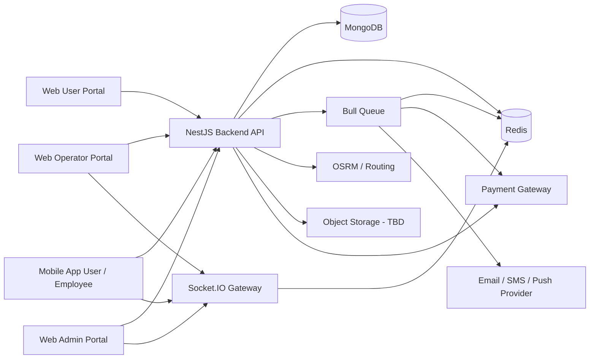
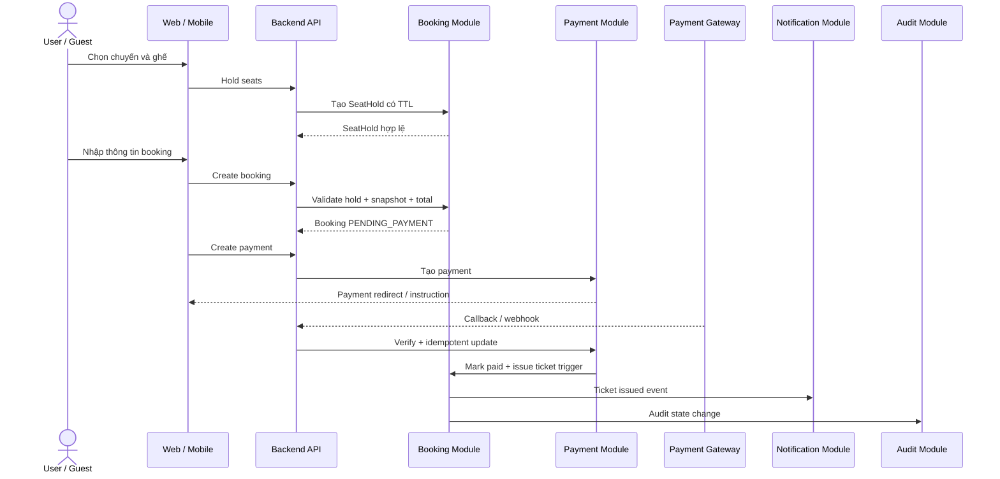
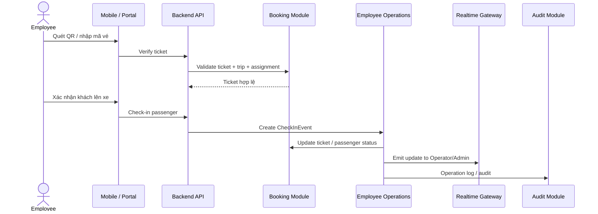
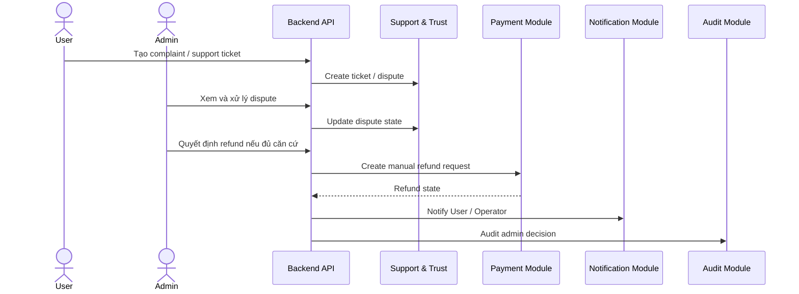

# 02. High Level Design - Hệ thống đặt vé xe khách

## 1. Thông tin tài liệu

### 1.1. Metadata

| Thuộc tính   | Giá trị                                      |
| ------------ | -------------------------------------------- |
| Tên tài liệu | High Level Design - Hệ thống đặt vé xe khách |
| Mã tài liệu  | 02-hld-he-thong-dat-ve-xe-khach              |
| Dự án        | Hệ thống đặt vé xe khách                     |
| Phiên bản    | v0.1                                         |
| Trạng thái   | Draft                                        |
| Người viết   | AI Agent                                     |
| Người duyệt  | Nguyễn Hồng Khanh                            |
| Ngày tạo     | 11/05/2026                                   |

### 1.2. Lịch sử thay đổi

| Phiên bản | Ngày       | Người cập nhật | Nội dung thay đổi                                                                |
| --------- | ---------- | -------------- | -------------------------------------------------------------------------------- |
| v1.0      | 11/05/2026 | AI Agent       | Tạo bản nháp HLD từ SRS `01-srs-he-thong-dat-ve-xe-khach.md` và context hiện tại |

---

## 2. Mục lục

1. Thông tin tài liệu
2. Mục lục
3. Giới thiệu
4. Nguồn đầu vào và phạm vi thiết kế
5. Kiến trúc tổng quan
6. Client architecture
7. Backend architecture
8. Module boundary
9. Data ownership mức cao
10. Luồng tích hợp chính
11. Bảo mật và phân quyền mức cao
12. Realtime, queue và background job
13. Tích hợp ngoài
14. Deployment overview
15. Mapping yêu cầu phi chức năng
16. Quyết định thiết kế tạm thời
17. Rủi ro kiến trúc
18. Open Questions / TBD
19. Phụ lục

---

## 3. Giới thiệu

### 3.1. Mục đích tài liệu

Tài liệu này mô tả thiết kế kiến trúc mức cao cho hệ thống đặt vé xe khách. HLD là cầu nối giữa SRS và các tài liệu thiết kế chi tiết như LLD, Database Design, API Specification, Security Design và UI/UX Flow.

### 3.2. Đối tượng đọc

| Đối tượng    | Mục đích đọc                                                        |
| ------------ | ------------------------------------------------------------------- |
| Kiến trúc sư | Chốt boundary hệ thống, module và tích hợp                          |
| Backend dev  | Hiểu module backend, data ownership, queue, realtime và integration |
| Frontend dev | Hiểu client boundary, portal, auth flow và API dependency           |
| Mobile dev   | Hiểu phạm vi app User / Employee và offline / sync requirement      |
| QA / Tester  | Chuẩn bị test strategy theo module và luồng nghiệp vụ chính         |
| Người duyệt  | Xác nhận thiết kế không vượt phạm vi SRS                            |

### 3.3. Phạm vi tài liệu

Tài liệu này mô tả kiến trúc mức cao, module boundary, trách nhiệm chính, luồng giao tiếp, dữ liệu sở hữu, security boundary và deployment overview.

Tài liệu này KHÔNG mô tả chi tiết schema, migration, DTO, endpoint, UI screen state hoặc thuật toán nội bộ. Các nội dung đó thuộc `03-lld-he-thong-dat-ve-xe-khach.md`, `04-database-design.md`, `05-api-specification.md`, `06-ui-ux-flow-specification.md` và `07-security-permission-design.md`.

---

## 4. Nguồn đầu vào và phạm vi thiết kế

### 4.1. Tài liệu đầu vào

| Mã / File                            | Vai trò trong HLD                                       |
| ------------------------------------ | ------------------------------------------------------- |
| `00-quy-chuan-cho-lap-trinh-vien.md` | Quy chuẩn SDLC và điều kiện dùng tài liệu để triển khai |
| `01-srs-he-thong-dat-ve-xe-khach.md` | Nguồn yêu cầu chính                                     |
| `context/PROJECT-STRUCTURE.md`       | Cấu trúc repo, apps, packages và module hiện tại        |
| `context/TECH-STACK.md`              | Tech stack, framework, thư viện và hạ tầng hiện tại     |

### 4.2. Phạm vi thiết kế trong bản nháp

| Phạm vi                 | Trạng thái trong HLD | Ghi chú                                                |
| ----------------------- | -------------------- | ------------------------------------------------------ |
| Marketplace layer       | Có                   | User / Guest search, booking, payment, ticket, support |
| Operator OS layer       | Có                   | Operator profile, resources, trips, finance, employee  |
| Platform admin layer    | Có                   | KYC, catalog, policy, payment, dispute, audit          |
| Mobile User             | Có                   | Dùng chung app Expo với Employee, tách theo actor      |
| Mobile Employee         | Có                   | Check-in, trip status, journey log, incident report    |
| External Operator API   | Ngoài phạm vi v1     | Theo SRS §6.4                                          |
| Multi-language/currency | Ngoài phạm vi v1     | Theo SRS §6.4 và OQ hiện tại                           |

### 4.3. Giả định thiết kế

| ID        | Giả định                                                                                   | Tác động                                                       |
| --------- | ------------------------------------------------------------------------------------------ | -------------------------------------------------------------- |
| HLD-AS-01 | Backend tiếp tục dùng NestJS module pattern trong `apps/backend/src/modules`.              | Module boundary trong HLD bám theo cấu trúc repo hiện tại      |
| HLD-AS-02 | MongoDB là primary operational database, Redis dùng cho cache / lock / queue support.      | Database Design cần chốt collection, index, transaction / lock |
| HLD-AS-03 | Frontend web dùng Next.js App Router với route group public, operator, admin.              | Client architecture chia theo portal và route boundary         |
| HLD-AS-04 | Mobile dùng Expo một codebase, tách session / UI / quyền theo actor User và Employee.      | Mobile architecture cần auth context và role-based navigation  |
| HLD-AS-05 | Payment provider, notification provider và object storage cụ thể chưa được chốt trong SRS. | HLD chỉ định adapter boundary, không chốt vendor cụ thể        |

---

## 5. Kiến trúc tổng quan

### 5.1. Mô hình kiến trúc

Hệ thống dùng mô hình modular monolith backend ở v1, gồm một NestJS backend phục vụ nhiều client. Các module nghiệp vụ tách boundary rõ để có thể mở rộng sang service riêng sau này nếu tải hoặc yêu cầu vận hành tăng.

### 5.2. Kiến trúc logic theo lớp

| Lớp                    | Trách nhiệm chính                                                                | Công nghệ / thành phần hiện tại                          |
| ---------------------- | -------------------------------------------------------------------------------- | -------------------------------------------------------- |
| Client presentation    | UI, form state, route, hiển thị loading/error/empty, gọi API                     | Next.js, React, Ant Design, Tailwind, Expo               |
| API application layer  | Auth, validation, RBAC, use case orchestration, transaction boundary mức service | NestJS controller / service / guard / pipe / interceptor |
| Domain module layer    | Booking, payment, trip, operator, employee, support, notification, audit         | NestJS modules                                           |
| Persistence layer      | Schema, repository/query, index, state history, soft delete                      | MongoDB + Mongoose                                       |
| Async processing layer | Payment callback retry, notification retry, reporting export, reconciliation     | Bull + Redis                                             |
| Realtime layer         | Trip update, check-in sync, notification realtime, admin/operator monitoring     | Socket.IO                                                |
| Integration layer      | Payment, notification, OSRM, object storage                                      | Adapter pattern, provider TBD                            |

### 5.3. Nguyên tắc kiến trúc

| ID          | Nguyên tắc                                                                                        |
| ----------- | ------------------------------------------------------------------------------------------------- |
| HLD-PRIN-01 | Backend là nguồn kiểm tra cuối cùng cho RBAC, tenant boundary, seat state và payment state.       |
| HLD-PRIN-02 | Controller chỉ xử lý transport, validation sơ bộ và gọi service; business logic nằm trong module. |
| HLD-PRIN-03 | Mọi thao tác tiền, vé, ghế, policy và quyền phải idempotent hoặc có audit/state history phù hợp.  |
| HLD-PRIN-04 | Không hard-code provider thanh toán, notification, object storage khi SRS chưa chốt vendor.       |
| HLD-PRIN-05 | Module có dữ liệu theo Operator phải luôn lọc theo `operatorId` hoặc tenant boundary tương đương. |

---

## 6. Client architecture

### 6.1. Web frontend

| Portal / route group | Actor chính        | Vai trò                                                            |
| -------------------- | ------------------ | ------------------------------------------------------------------ |
| `(public)`           | User, Guest        | Search, trip detail, booking, payment redirect, ticket lookup      |
| `(operator-auth)`    | Operator, Employee | Đăng nhập / xác thực nhóm Operator OS                              |
| `(operator)`         | Operator           | Operator profile, vehicle, route, trip, booking, employee, finance |
| `(admin)`            | Admin              | KYC, catalog, policy, payment/refund, dispute, report, audit       |

### 6.2. Mobile app

| Mode          | Actor    | Chức năng chính                                                           |
| ------------- | -------- | ------------------------------------------------------------------------- |
| User mode     | User     | Search, booking, ticket, notification, support                            |
| Employee mode | Employee | Assigned trips, passenger list, QR check-in, trip status, incident report |

### 6.3. Client state

| Loại state     | Nơi xử lý khuyến nghị               | Ghi chú                                                                       |
| -------------- | ----------------------------------- | ----------------------------------------------------------------------------- |
| Server state   | React Query                         | Booking, ticket, trip, operator, catalog, report                              |
| Local UI state | Component state / Zustand           | Filter, modal, selected seat, stepper state                                   |
| Auth/session   | Zustand + secure storage phù hợp    | Mobile dùng secure storage; web dùng cơ chế token/cookie theo Security Design |
| Form state     | React Hook Form + schema validation | Backend vẫn phải validate lại                                                 |

---

## 7. Backend architecture

### 7.1. Backend layer nội bộ

| Layer                       | Vai trò                                                                             |
| --------------------------- | ----------------------------------------------------------------------------------- |
| Controller / Gateway        | Nhận HTTP / realtime request, gọi guard, pipe, DTO validation và service            |
| Application service         | Điều phối use case, kiểm state, gọi repository, queue, integration adapter          |
| Domain policy / helper      | Tính giá, policy refund, permission check, seat state, commission, payout condition |
| Repository / model          | Truy vấn MongoDB, atomic update, index-aware query, soft delete                     |
| Integration adapter         | Payment, notification, OSRM, object storage                                         |
| Queue processor / scheduler | Retry, reconciliation, notification, reporting export, cleanup expired hold         |

### 7.2. Cross-cutting backend concern

| Concern        | Thiết kế mức cao                                                                          |
| -------------- | ----------------------------------------------------------------------------------------- |
| Authentication | JWT / refresh token theo actor; force revoke khi khóa tài khoản hoặc đổi quyền            |
| Authorization  | Guard kiểm role, permission và tenant boundary ở backend                                  |
| Validation     | DTO + class-validator; rule nghiệp vụ kiểm trong service                                  |
| Rate limiting  | Áp dụng cho login, OTP, search, seat hold, payment, ticket lookup                         |
| Audit          | Ghi AuditLog cho thao tác nhạy cảm, tối thiểu actor, action, target, before/after, reason |
| Logging        | Không log plaintext token, OTP, mật khẩu hoặc dữ liệu thanh toán nhạy cảm                 |
| Error handling | Business error code ổn định; message phù hợp client                                       |

---

## 8. Module boundary

### 8.1. Module nghiệp vụ chính

| Module HLD                   | Backend folder hiện tại / dự kiến                  | Trách nhiệm chính                                                               | Actor dùng chính                |
| ---------------------------- | -------------------------------------------------- | ------------------------------------------------------------------------------- | ------------------------------- |
| Identity & Access Management | `auth`, `users`, `admin`, `operators`, `employees` | Đăng ký, đăng nhập, session, role, permission, account status                   | User, Operator, Employee, Admin |
| Marketplace Search           | `search`, `routes`, `trips`, `stop-points`         | Search chuyến, filter, sort, public trip availability                           | User, Guest                     |
| Transport Resource           | `buses`, `routes`, `stop-points`, `trips`          | Vehicle, VehicleType, SeatMap, Route, Trip, Fare, inventory                     | Operator, Admin                 |
| Booking & Ticket             | `bookings`                                         | SeatHold, Booking, Ticket, QR token, state history                              | User, Guest, Operator, Employee |
| Payment, Escrow & Payout     | `payments` (dự kiến)                               | Payment, refund, escrow ledger, commission, payout, reconciliation              | User, Operator, Admin           |
| Promotion                    | `promotions` (dự kiến)                             | Promotion, rule, redemption, usage limit, report                                | User, Operator, Admin           |
| Employee Operations          | `employees`, `trips`, `bookings`                   | Assignment, passenger list, check-in, trip status, journey log, incident report | Employee, Operator              |
| Support & Trust              | `support` (dự kiến)                                | SupportTicket, Complaint, Review, DisputeCase, OperatorScorecard                | User, Operator, Admin           |
| Notification                 | `notifications` (dự kiến)                          | Notification event, delivery, retry, preference                                 | Hệ thống, mọi actor             |
| Reporting                    | `reporting` (dự kiến)                              | Dashboard, aggregation, async export                                            | Operator, Admin                 |
| Audit                        | `audit` (dự kiến)                                  | AuditLog, query audit, immutable log policy                                     | Admin, hệ thống                 |
| Routing                      | `osrm`                                             | Distance / duration / route helper                                              | Hệ thống                        |

### 8.2. Module phụ thuộc trọng yếu

| Module nguồn        | Phụ thuộc vào                                               | Lý do phụ thuộc                                          |
| ------------------- | ----------------------------------------------------------- | -------------------------------------------------------- |
| Booking & Ticket    | Transport Resource, Payment, Promotion, Notification, Audit | Giữ ghế, tính tiền, phát hành vé, gửi thông báo, ghi log |
| Payment             | Booking & Ticket, Notification, Audit                       | Cập nhật booking/payment/refund, thông báo, truy vết     |
| Employee Operations | Booking & Ticket, Transport Resource, Notification, Audit   | Check-in, trạng thái chuyến, sự cố, đồng bộ vận hành     |
| Support & Trust     | Booking & Ticket, Payment, Operator, Notification, Audit    | Khiếu nại, tranh chấp, review, scorecard                 |
| Reporting           | Booking, Payment, Trip, Operator, Support, Audit            | Dashboard và export                                      |

---

## 9. Data ownership mức cao

| Nhóm dữ liệu                 | Module sở hữu chính         | Module được đọc / ghi phụ                        | Ghi chú thiết kế                               |
| ---------------------------- | --------------------------- | ------------------------------------------------ | ---------------------------------------------- |
| User / Session               | Identity & Access           | Audit, Notification                              | Không lộ token / OTP trong log                 |
| Operator / KYC               | Identity & Access, Operator | Admin, Payment, Reporting                        | Operator phải được duyệt trước khi mở bán      |
| Vehicle / SeatMap            | Transport Resource          | Booking, Employee Operations, Reporting          | Thay đổi sau khi có vé bán phải kiểm policy    |
| Route / StopPoint            | Transport Resource          | Search, Booking, Routing                         | StopPoint chuẩn do Platform quản lý hoặc duyệt |
| Trip / TripSeat              | Transport Resource          | Search, Booking, Employee Operations             | Ghế theo chuyến là tài nguyên giao dịch        |
| SeatHold                     | Booking & Ticket            | Search                                           | Cần TTL / atomic lock                          |
| Booking / Ticket             | Booking & Ticket            | Payment, Support, Employee Operations, Reporting | Lưu snapshot bắt buộc theo SRS                 |
| Payment / Refund             | Payment                     | Booking, Support, Reporting, Audit               | Callback / refund phải idempotent              |
| Escrow / Payout              | Payment                     | Operator, Admin, Reporting                       | Cần ledger và đối soát hai chiều               |
| Review / Complaint / Dispute | Support & Trust             | Operator, Admin, Reporting                       | Attachment cần object storage nếu có           |
| Notification                 | Notification                | Mọi module phát event                            | Delivery status riêng theo kênh                |
| AuditLog                     | Audit                       | Mọi module ghi, Admin đọc                        | Không xóa cứng trong production                |

---

## 10. Luồng tích hợp chính

### 10.1. Luồng đặt vé và thanh toán

### 10.2. Luồng check-in

### 10.3. Luồng dispute / refund thủ công

---

## 11. Bảo mật và phân quyền mức cao

| Chủ đề           | Thiết kế mức cao                                                                   |
| ---------------- | ---------------------------------------------------------------------------------- |
| Actor boundary   | User, Guest, Operator, Employee, Admin có auth flow và permission scope riêng      |
| Tenant boundary  | Operator và Employee chỉ truy cập dữ liệu theo `operatorId` và assignment scope    |
| Admin access     | Admin có quyền toàn hệ thống theo RBAC; thao tác nhạy cảm cần audit và re-auth     |
| Sensitive action | Refund, payout, đổi bank account, đổi policy, khóa Operator, sửa chuyến đã bán vé  |
| Data masking     | Số điện thoại / dữ liệu cá nhân chỉ hiển thị đầy đủ khi có quyền và lý do vận hành |
| Token / session  | Session có TTL, refresh policy, revoke khi khóa tài khoản hoặc đổi quyền           |
| QR ticket        | QR token không đoán được, xác thực server-side, có thể revoke / rotate             |

Chi tiết permission matrix, threat control, re-auth rule và audit rule sẽ được chốt trong `07-security-permission-design.md`.

---

## 12. Realtime, queue và background job

### 12.1. Realtime event

| Event nhóm              | Người nhận chính      | Mục đích                                             |
| ----------------------- | --------------------- | ---------------------------------------------------- |
| Booking / ticket update | User, Operator        | Cập nhật trạng thái booking, ticket, danh sách khách |
| Trip operation update   | Operator, Admin       | Cập nhật trạng thái chuyến, check-in, sự cố          |
| Employee assignment     | Employee              | Nhận nhiệm vụ / chuyến được phân công                |
| Dispute update          | User, Operator, Admin | Theo dõi trạng thái tranh chấp                       |
| System maintenance      | Mọi actor liên quan   | Thông báo bảo trì / gián đoạn                        |

### 12.2. Background job

| Job                         | Trigger                      | Kết quả mong muốn                                   |
| --------------------------- | ---------------------------- | --------------------------------------------------- |
| Expire SeatHold             | TTL / scheduler              | Giải phóng ghế giữ quá hạn                          |
| Payment callback retry      | Callback lỗi / timeout       | Xử lý lại an toàn, idempotent                       |
| Payment reconciliation      | Lịch định kỳ / admin trigger | Đồng bộ lệch trạng thái payment                     |
| Refund reconciliation       | Lịch định kỳ / admin trigger | Đồng bộ lệch trạng thái refund                      |
| Notification delivery retry | Gửi thông báo thất bại       | Retry hoặc đánh dấu lỗi có kiểm soát                |
| Reporting export            | Báo cáo lớn                  | Tạo file bất đồng bộ và thông báo khi hoàn tất      |
| Payout calculation          | Kỳ T+N / admin trigger       | Tính tiền đủ điều kiện payout sau commission/refund |
| Audit archive               | Retention policy - TBD       | Archive log theo chính sách dữ liệu                 |

---

## 13. Tích hợp ngoài

| Tích hợp          | Trạng thái quyết định | Boundary thiết kế trong HLD                                      |
| ----------------- | --------------------- | ---------------------------------------------------------------- |
| Payment gateway   | TBD                   | Adapter `PaymentProvider`, verify callback, idempotency key      |
| Email provider    | TBD                   | Adapter `EmailProvider`, retry qua queue                         |
| SMS provider      | TBD                   | Adapter `SmsProvider`, OTP / ticket / trip update                |
| Push notification | TBD                   | Adapter `PushProvider`, mobile token registry                    |
| Object storage    | TBD                   | Adapter `FileStorageProvider` cho KYC, attachment, report export |
| OSRM              | Có trong repo Docker  | Routing adapter qua `osrm` module                                |

---

## 14. Deployment overview

### 14.1. Môi trường

| Môi trường | Mục đích                           | Ghi chú                                       |
| ---------- | ---------------------------------- | --------------------------------------------- |
| Local      | Dev, test thủ công, docker-compose | MongoDB, Redis, OSRM local theo repo          |
| Staging    | Kiểm thử tích hợp trước production | Cần provider sandbox cho payment/notification |
| Production | Vận hành thật                      | Cần HTTPS, backup, monitoring, secret manager |

### 14.2. Thành phần triển khai

| Thành phần                 | Vai trò                                               |
| -------------------------- | ----------------------------------------------------- |
| Backend API                | HTTP API, WebSocket gateway, queue producer           |
| Queue worker               | Payment, notification, reconciliation, reporting jobs |
| MongoDB                    | Operational database                                  |
| Redis                      | Cache, lock, queue backend                            |
| Web frontend               | Public, Operator, Admin portal                        |
| Mobile app                 | User / Employee app                                   |
| OSRM service               | Routing / distance helper                             |
| Monitoring / logging stack | TBD, cần chốt trước production                        |

---

## 15. Mapping yêu cầu phi chức năng

| NFR nhóm    | Thiết kế HLD đáp ứng                                                           |
| ----------- | ------------------------------------------------------------------------------ |
| Hiệu năng   | Search cache/index, async reporting, queue cho callback/notification           |
| Sẵn sàng    | Retry job, reconciliation, trạng thái bảo trì, không phụ thuộc provider đơn lẻ |
| Dữ liệu     | Snapshot booking, idempotent payment/refund, tenant boundary theo Operator     |
| Bảo mật     | JWT, RBAC, backend ownership check, rate limit, audit, QR token server-side    |
| Riêng tư    | Mask dữ liệu cá nhân, giới hạn export/log, truy cập tối thiểu                  |
| Mở rộng     | Modular monolith, module boundary rõ, có thể tách service theo tải sau này     |
| UX vận hành | Realtime update, mobile check-in, báo cáo bất đồng bộ                          |
| Quan sát    | Audit log, operation log, job status, integration status                       |
| Sao lưu     | MongoDB backup, ưu tiên booking/ticket/payment/refund/audit/KYC                |

---

## 16. Quyết định thiết kế tạm thời

| ID         | Quyết định tạm thời                                                                                   | Lý do / nguồn                                      |
| ---------- | ----------------------------------------------------------------------------------------------------- | -------------------------------------------------- |
| HLD-DEC-01 | V1 dùng modular monolith backend với NestJS modules, chưa tách microservice.                          | Phù hợp repo hiện tại và giảm độ phức tạp vận hành |
| HLD-DEC-02 | Redis dùng cho seat hold lock/cache và Bull queue backend.                                            | Phù hợp tech stack hiện tại                        |
| HLD-DEC-03 | Payment / notification / storage dùng adapter boundary, vendor cụ thể để `OPEN QUESTION`.             | SRS chưa chốt provider                             |
| HLD-DEC-04 | Reporting lớn xử lý bất đồng bộ, không chặn luồng booking/payment/check-in.                           | Theo NFR performance và vận hành                   |
| HLD-DEC-05 | Audit là cross-cutting module bắt buộc cho thao tác tiền, vé, ghế, quyền, policy và tenant-sensitive. | Theo SRS BR/NFR                                    |

---

## 17. Rủi ro kiến trúc

| ID          | Rủi ro                                                   | Mức độ     | Giảm thiểu ở HLD                                                  |
| ----------- | -------------------------------------------------------- | ---------- | ----------------------------------------------------------------- |
| HLD-RISK-01 | Bán trùng ghế do race condition                          | Rất cao    | Atomic SeatHold, Redis lock/TTL, kiểm lại trước payment/ticket    |
| HLD-RISK-02 | Callback payment trễ hoặc trùng                          | Cao        | Idempotency, reconciliation job, trạng thái `RECONCILING`         |
| HLD-RISK-03 | Operator truy cập dữ liệu Operator khác                  | Rất cao    | Tenant boundary guard + repository filter theo `operatorId`       |
| HLD-RISK-04 | Employee xem quá nhiều dữ liệu hành khách                | Cao        | Assignment scope, data masking, audit/operation log               |
| HLD-RISK-05 | Reporting làm chậm hệ thống giao dịch chính              | Trung bình | Async export, read model/cache nếu cần                            |
| HLD-RISK-06 | Provider payment/notification/storage chưa chốt          | Cao        | Adapter boundary, chưa hard-code vendor                           |
| HLD-RISK-07 | Mục 13 SRS chưa đồng bộ giữa danh sách UC và chi tiết UC | Cao        | Chưa dùng UC chi tiết chưa đồng bộ làm nguồn duy nhất cho LLD/API |

---

## 18. Open Questions / TBD

| ID        | Câu hỏi                                                                    | Tác động đến HLD / tài liệu sau                                      |
| --------- | -------------------------------------------------------------------------- | -------------------------------------------------------------------- |
| HLD-OQ-01 | SRS chính thức sẽ dùng bộ UC chi tiết nào cho `UC-25..UC-35`?              | Ảnh hưởng module Admin, Notification, Promotion, Guest ticket lookup |
| HLD-OQ-02 | Payment provider đầu tiên là gì?                                           | Ảnh hưởng Payment adapter, callback, API spec                        |
| HLD-OQ-03 | Thời gian giữ ghế chính thức và scope cấu hình là global hay per Operator? | Ảnh hưởng Booking, Redis lock, UI timer, test case                   |
| HLD-OQ-04 | V1 có hỗ trợ thanh toán sau / `PENDING_CONFIRMATION` không?                | Ảnh hưởng Booking state, Operator workflow, API/UI                   |
| HLD-OQ-05 | Fare model dùng route-level, trip-level hay fare rule riêng?               | Ảnh hưởng Database Design và Pricing service                         |
| HLD-OQ-06 | Chính sách refund cấu hình per Operator hay Platform default + override?   | Ảnh hưởng Policy module, payment/refund, dispute                     |
| HLD-OQ-07 | Audit log lưu trong MongoDB chính hay storage riêng?                       | Ảnh hưởng Audit module, retention, report                            |
| HLD-OQ-08 | Reporting dùng aggregation trực tiếp hay read model riêng?                 | Ảnh hưởng Reporting architecture                                     |
| HLD-OQ-09 | Object storage provider dùng cho KYC, attachment, report export là gì?     | Ảnh hưởng FileStorage adapter và Security Design                     |

---

## 19. Phụ lục

### 19.1. Tài liệu liên quan

- `00-quy-chuan-cho-lap-trinh-vien.md`
- `01-srs-he-thong-dat-ve-xe-khach.md`
- `03-lld-he-thong-dat-ve-xe-khach.md` (sẽ viết)
- `04-database-design.md` (sẽ viết)
- `05-api-specification.md` (sẽ viết)
- `06-ui-ux-flow-specification.md` (sẽ viết)
- `07-security-permission-design.md` (sẽ viết)
- `08-test-plan-acceptance-criteria.md` (sẽ viết)

### 19.2. Quy ước mã trong HLD

- `HLD-AS-NN`: Giả định thiết kế.
- `HLD-PRIN-NN`: Nguyên tắc kiến trúc.
- `HLD-DEC-NN`: Quyết định thiết kế tạm thời.
- `HLD-RISK-NN`: Rủi ro kiến trúc.
- `HLD-OQ-NN`: Câu hỏi mở của HLD.
