# 03. Low Level Design - Hệ thống đặt vé xe khách

## 1. Thông tin tài liệu

### 1.1. Metadata

| Thuộc tính        | Giá trị                                     |
| ----------------- | ------------------------------------------- |
| Tên tài liệu      | Low Level Design - Hệ thống đặt vé xe khách |
| Mã tài liệu       | 03-lld-he-thong-dat-ve-xe-khach             |
| Dự án             | Hệ thống đặt vé xe khách                    |
| Phiên bản         | v1.1                                        |
| Trạng thái        | Approved                                    |
| Người viết        | AI Agent, Nguyễn Hồng Khanh                 |
| Người duyệt       | Nguyễn Hồng Khanh                           |
| Ngày tạo          | 11/05/2026                                  |
| Cập nhật gần nhất | 12/05/2026                                  |

### 1.2. Lịch sử thay đổi

| Phiên bản | Ngày       | Người cập nhật              | Nội dung thay đổi                                                                                        |
| --------- | ---------- | --------------------------- | -------------------------------------------------------------------------------------------------------- |
| v1.1      | 12/05/2026 | AI Agent                    | Chốt LLD-OP-02..04: SeatHold DB-authoritative hybrid, Employee offline giới hạn và S3-compatible storage |
| v1.0      | 12/05/2026 | AI Agent, Nguyễn Hồng Khanh | Viết lại LLD theo SRS v1.19, HLD v1.11, DOMAIN-MAP và ADR-009; bỏ giả định tech stack đã chốt            |
| v0.1      | 11/05/2026 | AI Agent                    | Tạo bản nháp LLD từ SRS, HLD và context repo                                                             |

### 1.3. Trạng thái sử dụng

Tài liệu này ở trạng thái `Draft`. LLD v1.1 mô tả thiết kế chi tiết theo capability và nghiệp vụ để chuẩn bị cho Backend V1. LLD đã chốt chiến lược SeatHold, phạm vi offline Employee và object storage target, nhưng KHÔNG tự chốt framework, database engine, queue engine hoặc deployment target. Các quyết định tech stack còn lại phải theo ADR-009, `PROJECT-STATE` và review của người duyệt trước khi code.

---

## 2. Mục lục

1. Thông tin tài liệu
2. Mục lục
3. Giới thiệu
4. Nguồn đầu vào và phạm vi LLD
5. Nguyên tắc thiết kế chi tiết
6. Cấu trúc logical module
7. Cross-cutting design
8. Thiết kế module chi tiết
9. Thiết kế use case trọng yếu
10. State transition và consistency rule
11. Adapter contract
12. Error handling và response behavior
13. Audit, logging và observability hook
14. Handoff cho DB / API / Security / Test
15. Thứ tự triển khai Backend V1
16. Rủi ro thiết kế chi tiết
17. Open Points / TBD
18. Phụ lục

---

## 3. Giới thiệu

### 3.1. Mục đích

Tài liệu này chuyển SRS v1.19 và HLD v1.12 thành thiết kế chi tiết mức application service, domain policy, repository boundary, state transition, idempotency, adapter contract và job behavior. LLD là đầu vào cho lập trình viên backend, Database Design, API Specification, Security Design và Test Plan.

### 3.2. Cách đọc tài liệu

- Tên module trong LLD là **logical module** theo capability, không phải cam kết framework hoặc folder cuối cùng.
- Nếu ADR-009 sau này chốt giữ stack hiện tại, logical module có thể map sang module/controller/service/repository tương ứng của framework được chọn.
- Nếu ADR-009 mở lại tech stack, LLD vẫn giữ nguyên rule nghiệp vụ, state transition, transaction boundary và adapter contract.
- Nội dung chưa có đủ quyết định được ghi là `LLD-OP-*` hoặc `LLD-TBD-*`, không được biến thành code assumption.

### 3.3. Tài liệu tham chiếu

| Tài liệu                                   | Vai trò trong LLD                                                     |
| ------------------------------------------ | --------------------------------------------------------------------- |
| `01-srs-he-thong-dat-ve-xe-khach.md` v1.19 | Nguồn nghiệp vụ chính: FR, NFR, UC, BR, state và decisions log        |
| `02-hld-he-thong-dat-ve-xe-khach.md` v1.12 | Boundary kiến trúc, capability, data ownership, integration và HLD-OQ |
| `context/DOMAIN-MAP.md`                    | Mapping capability / entity / actor sang target module groups         |
| `context/PROJECT-STATE.md`                 | Trạng thái quyết định mới nhất, blocker và Open Questions sau SRS     |
| `10-architecture-decision-record.md` v0.4  | ADR-009 về khung đánh giá tech stack trong rebuild                    |
| `04-database-design.md`                    | Handoff schema, index, transaction, lock, retention                   |
| `05-api-specification.md`                  | Handoff endpoint, DTO, response, webhook, realtime                    |
| `07-security-permission-design.md`         | Handoff auth, RBAC, tenant, masking, rate limit, threat control       |
| `08-test-plan-acceptance-criteria.md`      | Handoff test case, dữ liệu test, concurrency và provider failure      |

---

## 4. Nguồn đầu vào và phạm vi LLD

### 4.1. Thứ tự ưu tiên nguồn

| Ưu tiên | Nguồn                        | Quy tắc áp dụng                                                                                  |
| ------- | ---------------------------- | ------------------------------------------------------------------------------------------------ |
| 1       | SRS v1.19                    | Không được thay đổi nghĩa FR / UC / BR / state đã chốt.                                          |
| 2       | `PROJECT-STATE`              | Dùng để biết quyết định mới sau SRS; khi context mâu thuẫn, ưu tiên file này.                    |
| 3       | HLD v1.12                    | Dùng để giữ capability boundary, data ownership, integration boundary và HLD-OQ.                 |
| 4       | ADR v0.4                     | Dùng để tránh chốt ngầm tech stack khi ADR còn `Deferred` / `Proposed`.                          |
| 5       | `DOMAIN-MAP`                 | Dùng để đặt tên module target; nếu stale so với HLD / PROJECT-STATE thì ghi OP hoặc sửa context. |
| 6       | DB / API / Security skeleton | Chỉ dùng làm nháp handoff, không coi là quyết định cuối.                                         |

### 4.2. Phạm vi trong LLD v1.1

| Nhóm thiết kế              | Trong phạm vi | Ghi chú                                                                             |
| -------------------------- | ------------- | ----------------------------------------------------------------------------------- |
| Application service        | Có            | Mô tả input, validation, orchestration, transaction boundary và event.              |
| Domain policy              | Có            | Giá, promotion, refund, commission, payout, permission, state transition.           |
| Repository boundary        | Có            | Chốt owner, query intent, lock / idempotency requirement; không chốt engine cụ thể. |
| Adapter contract           | Có            | Payment, notification, file storage, routing, bank payout channel.                  |
| Background job             | Có            | Trigger, idempotency, retry, lock, checkpoint, manual review.                       |
| Error behavior             | Có            | Nhóm error code và recovery behavior.                                               |
| Schema field chi tiết      | Không         | Thuộc `04-database-design.md`.                                                      |
| Endpoint / DTO chi tiết    | Không         | Thuộc `05-api-specification.md`.                                                    |
| Permission matrix chi tiết | Không         | Thuộc `07-security-permission-design.md`.                                           |
| Test case chi tiết         | Không         | Thuộc `08-test-plan-acceptance-criteria.md`.                                        |
| Tech stack target          | Không         | Thuộc ADR-009 / ADR quyết định sau review.                                          |

### 4.3. Baseline quyết định bắt buộc từ SRS / HLD

| Chủ đề               | Baseline LLD phải tuân thủ                                                                                                                                  | Truy vết                   |
| -------------------- | ----------------------------------------------------------------------------------------------------------------------------------------------------------- | -------------------------- |
| Marketplace model    | Managed marketplace, Platform không vận hành xe trực tiếp.                                                                                                  | `MQ-05`, HLD-DEC-01        |
| Guest flow           | Guest checkout / lookup chỉ ở Web Marketplace; mobile passenger app dành cho User đăng ký / đăng nhập.                                                      | `BR-21`, `UC-35`, HLD §6.2 |
| SeatHold             | TTL 10 phút cấp Platform; không per-Operator trong v1.                                                                                                      | `OQ-06`, `BR-02`           |
| SeatHold consistency | DB-authoritative hybrid: operational DB giữ invariant cuối cùng cho active hold / booked seat; lock service chỉ hỗ trợ giảm tranh chấp nếu có.              | `LLD-OP-02`, `BR-01`       |
| Checkout             | Pay-first; `PENDING_CONFIRMATION` không mở mặc định cho passenger checkout v1.                                                                              | `OQ-07`, `BR-04`           |
| Payment              | VNPay Sandbox là provider đầu tiên, qua adapter.                                                                                                            | `OQ-05`, `BR-63`           |
| Employee offline     | Mobile Employee dùng read cache manifest + queued operational actions có giới hạn cho check-in / no-show / journey log / incident; không full offline sync. | `LLD-OP-03`, `FR-EMP-12`   |
| Object/file storage  | Dùng S3-compatible storage qua `FileStorageProvider`; production baseline AWS S3 private bucket, local/dev MinIO; DB chỉ lưu metadata/object key.           | `LLD-OP-04`, `HLD-OQ-01`   |
| Audit                | AuditLog v1 append-only trong operational store theo SRS; retention chi tiết chuyển DB / Operation.                                                         | `OQ-14`, `BR-58..59`       |
| Reporting            | Aggregation + async job cho report lớn.                                                                                                                     | `OQ-15`, `BR-56`, `BR-62`  |
| Payout               | T+3 sau Trip `COMPLETED`, không minimum threshold, bank transfer, Admin confirm thủ công.                                                                   | `OQ-16`, `BR-32`           |
| Commission           | Default 5% cho Operator mới; Admin override bằng rule hiệu lực.                                                                                             | `OQ-18`, `BR-31`           |
| Employee roles       | `TICKET_STAFF`, `DRIVER`, `SUPPORT_STAFF`.                                                                                                                  | `OQ-04`, `BR-43`           |
| Phone masking        | Mặc định giữ 1 số đầu và 3 số cuối, ví dụ `0*** *** 789`.                                                                                                   | `OQ-11`, `BR-19`           |

### 4.4. Ràng buộc và quyết định hạ tầng liên quan

| ID        | Nội dung                                                                                                                  | Cách xử lý trong LLD                                                                       |
| --------- | ------------------------------------------------------------------------------------------------------------------------- | ------------------------------------------------------------------------------------------ |
| LLD-AS-01 | Backend V1 có một application backend trung tâm theo HLD-AS-01.                                                           | Thiết kế theo application core; không yêu cầu microservice.                                |
| LLD-AS-02 | Framework / database / queue target chưa được ADR `Accepted`.                                                             | Dùng thuật ngữ logical, tránh hard-code `NestJS`, `MongoDB`, `Redis`, `Bull` như baseline. |
| LLD-AS-03 | Object storage target đã chốt ở LLD-OP-04, còn lifecycle, scan policy và signed URL TTL chốt ở DB/API/Security/Operation. | Domain chỉ phụ thuộc `FileStorageProvider`; không public bucket/public-read.               |
| LLD-AS-04 | Offline Employee đã chốt mức read cache + queued operational actions có giới hạn.                                         | Không hỗ trợ full offline sync; server vẫn là nguồn quyết định cuối.                       |

---

## 5. Nguyên tắc thiết kế chi tiết

| ID          | Nguyên tắc                                                                                                                                            | Truy vết                           |
| ----------- | ----------------------------------------------------------------------------------------------------------------------------------------------------- | ---------------------------------- |
| LLD-PRIN-01 | Controller / delivery layer không chứa business rule chính; mọi rule tiền, vé, ghế, quyền, tenant và audit nằm ở application service / domain policy. | HLD §7                             |
| LLD-PRIN-02 | Mỗi command/query nghiệp vụ phải trace được về FR / UC / BR / NFR.                                                                                    | SRS §10..§19                       |
| LLD-PRIN-03 | Mọi mutation phải đi qua guard stack: auth / guest verification, account status, RBAC, tenant, assignment, business state, audit nếu nhạy cảm.        | SRS §15, HLD §11                   |
| LLD-PRIN-04 | SeatHold, create booking, payment callback, ticket issuance, refund, payout và notification bắt buộc phải idempotent.                                 | `BR-01`, `BR-27`, `BR-54`, `BR-62` |
| LLD-PRIN-05 | Không phát hành ticket nếu payment chưa được xác minh hoặc booking không ở trạng thái hợp lệ.                                                         | `BR-04`, `BR-28`                   |
| LLD-PRIN-06 | Booking lưu snapshot; policy / fare / promotion mới không áp ngược vào booking cũ.                                                                    | `DM-04`, `BR-07`, `BR-24`          |
| LLD-PRIN-07 | Dữ liệu Operator enforce bằng tenant boundary tại backend, không phụ thuộc client truyền đúng `operatorId`.                                           | `DM-01`, `BR-08`                   |
| LLD-PRIN-08 | Employee enforce thêm assignment scope và role, PII mặc định mask.                                                                                    | `BR-09`, `BR-19`, `BR-44`          |
| LLD-PRIN-09 | Audit log và operation log phải ghi kết quả thao tác, kể cả khi thao tác nhạy cảm bị từ chối.                                                         | `BR-57..58`, `NFR-AUDIT-*`         |
| LLD-PRIN-10 | Provider không lan vào domain core; domain chỉ biết adapter interface và state nội bộ.                                                                | `BR-63`, HLD §13                   |
| LLD-PRIN-11 | Job nền quan trọng phải có lock, retry, checkpoint, error classification và manual review path.                                                       | `BR-62`, HLD §12                   |
| LLD-PRIN-12 | Error code phải ổn định cho UI recovery; message không làm lộ thông tin nhạy cảm.                                                                     | `NFR-UX-03`, `NFR-SEC-*`           |

---

## 6. Cấu trúc logical module

### 6.1. Pattern logical module

| Thành phần logical  | Trách nhiệm                                                                                           | Không làm                                            |
| ------------------- | ----------------------------------------------------------------------------------------------------- | ---------------------------------------------------- |
| Delivery handler    | Nhận request / callback / realtime message, gọi guard, parse DTO, trả response.                       | Không chứa rule chính, không gọi provider trực tiếp. |
| Application service | Điều phối use case, gọi policy, repository, adapter, audit, event/job.                                | Không để lộ implementation provider cho caller.      |
| Domain policy       | Tính toán và quyết định nghiệp vụ thuần: state transition, refund, promotion, commission, permission. | Không truy cập trực tiếp transport/request.          |
| Repository port     | Định nghĩa query/mutation cần thiết, atomic operation, idempotency lookup.                            | Không expose query raw ngoài module owner.           |
| Adapter port        | Định nghĩa hợp đồng với provider ngoài hoặc hạ tầng phụ trợ.                                          | Không chứa business decision của domain.             |
| Event/job handler   | Xử lý async, retry, timeout, reconciliation, notification, report.                                    | Không bỏ qua idempotency hoặc lock.                  |
| Audit hook          | Ghi audit/operation log cho thao tác nhạy cảm.                                                        | Không ghi secret, OTP, token, QR raw secret.         |

### 6.2. Target module groups

| Logical module group      | Module con                                                                                       | Owner dữ liệu chính                                              | Trace                                          |
| ------------------------- | ------------------------------------------------------------------------------------------------ | ---------------------------------------------------------------- | ---------------------------------------------- |
| IAM & Access              | Auth, UserProfile, Session, RolePermission, GuestVerification                                    | User, AdminAccount, OperatorAccount, EmployeeAccount, Session    | `FR-IAM-*`, `UC-01`                            |
| Marketplace               | Search, TripDetail, PublicOperatorProfile, GuestTicketLookup                                     | Public read model, guest session reference                       | `FR-MKT-*`, `UC-02..03`, `UC-35`               |
| Operator Profile & KYC    | OperatorProfile, KycDocument, BankAccount, OperatorStatus                                        | OperatorProfile, KYC, BankAccount                                | `FR-OPR-*`, `UC-10..11`, `UC-23`               |
| Catalog / Policy          | Catalog, StopPointApproval, PolicyVersion, MaintenanceState                                      | Province, Ward, StopPoint, VehicleType, Amenity, Policy          | `FR-ADM-04..06`, `UC-24..25`                   |
| Transport Resource        | Vehicle, SeatMap, Route, RouteStop                                                               | Vehicle, SeatMap, Route                                          | `FR-OPS-01..05`, `UC-12..13`                   |
| Trip / Fare / Inventory   | Trip, TripSeat, SeatHold, Fare, FareRule                                                         | Trip, TripSeat, SeatHold, Fare                                   | `FR-OPS-06..13`, `FR-BTP-01..04`, `UC-14`      |
| Booking & Ticket          | Booking, PassengerInfo, Ticket, TicketQrToken                                                    | Booking, Ticket, BookingStatusHistory                            | `FR-BTP-05..14`, `UC-05..08`                   |
| Payment / Refund / Escrow | Payment, Refund, EscrowLedger, Reconciliation                                                    | Payment, Refund, EscrowLedger, ReconciliationRecord              | `FR-BTP-07..18`, `UC-06`, `UC-26`, `UC-32`     |
| Commission / Payout       | CommissionRule, Payout, PayoutReview                                                             | CommissionRule, Payout                                           | `FR-ADM-07..08`, `BR-31..33`                   |
| Promotion                 | Promotion, PromotionRule, Redemption                                                             | Promotion, PromotionRedemption                                   | `FR-PROM-*`, `UC-33`                           |
| Employee Operations       | EmployeeAccount, Assignment, Manifest, CheckIn, JourneyLog, Incident                             | EmployeeAssignment, CheckInEvent, JourneyLog, IncidentReport     | `FR-EMP-*`, `UC-16`, `UC-18..22`               |
| Support / Trust           | SupportTicket, Complaint, DisputeCase, Review, Scorecard                                         | SupportTicket, Complaint, Review, DisputeCase, OperatorScorecard | `FR-NSR-*`, `FR-DSP-*`, `UC-09`, `UC-27..28`   |
| Notification              | Notification, Delivery, Preference, Template                                                     | Notification, NotificationDelivery, NotificationPreference       | `FR-NSR-01..05`, `FR-NSR-14`, `UC-31`, `UC-34` |
| Reporting                 | OperatorReport, AdminReport, ExportJob                                                           | ReportJob, ExportFile metadata                                   | `FR-NSR-12..13`, `FR-ADM-17`, `UC-17`, `UC-29` |
| Audit                     | AuditLog, AuditQuery, PolicyChangeLog                                                            | AuditLog, state history reference                                | `FR-ADM-16`, `UC-30`, `NFR-AUDIT-*`            |
| External / Common         | PaymentProvider, NotificationProvider, FileStorageProvider, RoutingProvider, Lock, Queue, Config | Không sở hữu domain entity                                       | `BR-63`, HLD §13                               |

### 6.3. Dependency rule giữa module

| Module nguồn              | Được gọi                                                                     | Không được gọi / sửa trực tiếp                     |
| ------------------------- | ---------------------------------------------------------------------------- | -------------------------------------------------- |
| Marketplace               | Trip read, Fare read, SeatHold command, Booking command, Promotion validate. | Không tự sửa TripSeat / Payment / Ticket.          |
| Trip / Inventory          | Transport Resource, Fare, Policy, Audit.                                     | Không tạo booking hoặc payment.                    |
| Booking & Ticket          | SeatHold owner, Promotion, Payment, Notification, Audit.                     | Không gọi trực tiếp VNPay hoặc thay payout ledger. |
| Payment / Refund / Escrow | Booking/Ticket, Commission/Payout, Provider adapter, Audit.                  | Không sửa TripSeat ngoài command đã định nghĩa.    |
| Operator OS               | Operator, Transport, Trip, Booking read, Employee, Reporting.                | Không đọc tenant khác, không duyệt KYC.            |
| Employee Operations       | IAM/Assignment, Manifest, Ticket verification, Audit/Operation log.          | Không xử lý refund, payout, policy.                |
| Support / Dispute         | Booking, Payment/Refund, Operator, FileStorage, Notification, Audit.         | Không tự refund nếu chưa qua Admin / policy.       |
| Reporting                 | Read repository/query model, ExportJob, FileStorage.                         | Không chạy query lớn trên đường nóng transaction.  |
| Audit                     | Nhận audit event / command từ mọi module.                                    | Không cho module khác sửa/xóa audit log.           |

---

## 7. Cross-cutting design

### 7.1. Request / command pipeline

```mermaid
flowchart LR
    A[Request / Callback / Job] --> B[Normalize context]
    B --> C[Auth or Guest verification]
    C --> D[Account status / session]
    D --> E[RBAC / permission]
    E --> F[Tenant / ownership / assignment]
    F --> G[DTO validation]
    G --> H[Business precheck]
    H --> I[Application service]
    I --> J[Policy + repository + adapter]
    J --> K[Event / job / audit]
    K --> L[Stable response / state]
```

### 7.2. Actor context

| Field logical    | Bắt buộc khi                      | Nguồn                             | Ghi chú                                                     |
| ---------------- | --------------------------------- | --------------------------------- | ----------------------------------------------------------- |
| `actorType`      | Mọi request không public          | Session / verified guest context  | `User`, `Guest`, `Operator`, `Employee`, `Admin`, `System`. |
| `actorId`        | Actor đã xác thực                 | Session                           | Guest có thể dùng `guestSessionId` thay `actorId`.          |
| `operatorId`     | Operator / Employee / tenant data | Account hoặc assignment           | Không lấy từ client làm source of truth.                    |
| `roleCodes`      | Operator / Employee / Admin       | Permission store                  | Employee role nằm trong tập đã chốt.                        |
| `assignmentIds`  | Employee operations               | Assignment module                 | Bắt buộc cho manifest / check-in / trip status.             |
| `requestId`      | Mọi request/job                   | Gateway hoặc hệ thống sinh        | Dùng cho log correlation.                                   |
| `idempotencyKey` | Mutation rủi ro cao               | Header / command / provider event | Bắt buộc cho hold, booking, payment, refund, ticket, job.   |

### 7.3. Validation layer

| Layer                  | Kiểm tra                                               | Ví dụ                                         |
| ---------------------- | ------------------------------------------------------ | --------------------------------------------- |
| DTO validation         | Format, required field, enum, range, size.             | Ngày đi không trong quá khứ, số ghế > 0.      |
| Permission validation  | Actor, role, tenant, assignment, ownership.            | Operator chỉ thấy booking thuộc `operatorId`. |
| State validation       | Trạng thái hiện tại cho phép action.                   | Ticket `VALID` mới được check-in.             |
| Policy validation      | Rule nghiệp vụ có version/effective time.              | Refund theo policy snapshot.                  |
| Consistency validation | Lock, unique, idempotency, snapshot match.             | Seat chưa `BOOKED` khi tạo hold.              |
| Provider validation    | Chữ ký, amount, provider transaction, callback status. | VNPay callback amount khớp payment.           |

### 7.4. Idempotency model

| Nghiệp vụ             | Key logical                                                | Kết quả khi gọi lại cùng key                                                                                         |
| --------------------- | ---------------------------------------------------------- | -------------------------------------------------------------------------------------------------------------------- |
| SeatHold              | Actor/session + trip + seat list + client key              | Trả lại hold còn hiệu lực hoặc trạng thái đã expire/release; DB invariant không cho active hold / booked seat trùng. |
| Create booking        | SeatHold id + actor/session + client key                   | Trả booking đã tạo nếu input snapshot tương thích; từ chối nếu mismatch.                                             |
| Create payment        | Booking id + method + client key                           | Trả payment hiện có nếu còn hợp lệ; không tạo payment mới cho booking đã paid/expired/cancelled.                     |
| Payment callback      | Provider transaction id + payment id + payload digest      | Chỉ xử lý state transition một lần; callback trễ/lệch vào reconciliation.                                            |
| Ticket issuance       | Booking id + passenger/seat item id                        | Không tạo trùng ticket.                                                                                              |
| Refund request        | Booking/ticket/payment + reason scope + actor + client key | Trả refund request hiện có hoặc từ chối nếu state đổi.                                                               |
| Notification delivery | Event id + recipient + channel + template version          | Không gửi trùng notification bắt buộc cho cùng event.                                                                |
| Payout candidate      | Operator + payout period + ledger checkpoint               | Không tạo payout trùng kỳ.                                                                                           |
| Job rerun             | Job type + scope + checkpoint                              | Chỉ xử lý phần chưa hoàn tất hoặc idempotent update.                                                                 |

### 7.5. Event và job rule

| Loại event/job              | Trigger                             | Handler chính                 | Bắt buộc                                                                                               |
| --------------------------- | ----------------------------------- | ----------------------------- | ------------------------------------------------------------------------------------------------------ |
| `SeatHoldExpired`           | TTL hoặc scheduler                  | Inventory / SeatHold          | Dựa vào DB state cuối cùng, có thể dùng lock service để tránh chạy trùng; không release ghế đã booked. |
| `PaymentCallbackReceived`   | VNPay callback/webhook              | Payment                       | Verify, idempotency, state transition, audit.                                                          |
| `TicketIssued`              | Payment success / booking confirmed | Booking/Ticket + Notification | Tạo ticket idempotent, gửi notification.                                                               |
| `TripChangedAfterSale`      | Operator/Admin đổi trip đã có vé    | Trip + Notification + Support | Impact analysis, reason, notification, audit.                                                          |
| `RefundRequested`           | User/Guest/Admin yêu cầu hoàn       | Refund                        | Policy snapshot, sensitive control, audit.                                                             |
| `DisputeStateChanged`       | Admin/system đổi dispute            | Dispute + Notification        | Lưu actor, reason, evidence, deadline.                                                                 |
| `PayoutCandidateDue`        | T+3 sau trip completed              | Payout                        | Ledger checkpoint, manual review path.                                                                 |
| `ReportExportRequested`     | Operator/Admin export lớn           | Reporting                     | Permission at request time, async export, file policy.                                                 |
| `NotificationDeliveryRetry` | Delivery failed còn retry budget    | Notification                  | Không gửi trùng mandatory notification.                                                                |

---

## 8. Thiết kế module chi tiết

### 8.1. IAM & Access

| Service logical          | Trách nhiệm                                                                      | Command / query chính                                                                  |
| ------------------------ | -------------------------------------------------------------------------------- | -------------------------------------------------------------------------------------- |
| AuthService              | Đăng ký / đăng nhập User, đăng nhập Operator / Employee / Admin theo cổng riêng. | `registerUser`, `loginUser`, `loginOperator`, `loginEmployee`, `loginAdmin`, `logout`. |
| SessionService           | Tạo, refresh, revoke session, quản lý multi-device theo policy.                  | `createSession`, `refreshSession`, `revokeSession`, `forceLogoutByAccount`.            |
| ReAuthService            | Xác thực lại thao tác nhạy cảm.                                                  | `requireSensitiveConfirmation`, `verifySensitiveConfirmation`.                         |
| GuestVerificationService | Xác minh Guest bằng mã booking/ticket + contact + OTP/email nếu cần.             | `verifyGuestLookup`, `verifyGuestSensitiveAction`.                                     |
| PermissionService        | Resolve role/permission và scope.                                                | `canPerform`, `assertTenantScope`, `assertAssignmentScope`.                            |

Rule bắt buộc:

- User auth dùng email hoặc số điện thoại theo SRS; email OTP là baseline xác minh v1, SMS OTP ngoài scope v1.
- Operator / Employee không được đăng nhập bằng public User flow.
- Admin không tự đăng ký hoặc reset password qua luồng public.
- Tài khoản bị khóa, đổi mật khẩu, thu hồi quyền hoặc phát hiện rủi ro phải revoke session.
- Login fail, rate limit hit, tenant violation và re-auth fail phải ghi security log.

### 8.2. Marketplace / Search / Public detail

| Service logical              | Trách nhiệm                                                         | Query / command chính                                 |
| ---------------------------- | ------------------------------------------------------------------- | ----------------------------------------------------- |
| TripSearchService            | Search chuyến theo điểm đi/đến/ngày/số khách, filter, sort.         | `searchTrips`.                                        |
| TripDetailService            | Trả chi tiết chuyến, seat map public, fare, pickup/dropoff, policy. | `getTripDetail`.                                      |
| PublicOperatorProfileService | Trả profile Operator, scorecard, review hợp lệ.                     | `getPublicProfile`.                                   |
| GuestTicketLookupService     | Tra cứu vé cho Guest sau khi match code + contact.                  | `lookupTicket`, `requestSensitiveActionVerification`. |

Rule bắt buộc:

- Search chỉ trả trip của Operator đã đủ điều kiện bán, trip `OPEN_FOR_SALE`, chưa hết thời gian bán online và còn ghế phù hợp.
- Availability trong search/detail chỉ là dữ liệu hỗ trợ; SeatHold phải kiểm tra lại.
- Mobile passenger app không có Guest checkout / lookup; Guest flow thuộc Web Marketplace.
- Guest lookup rate limit theo mã và contact; không tiết lộ mã có tồn tại khi contact sai.

### 8.3. Operator Profile & KYC

| Service logical           | Trách nhiệm                                                 | Command / query chính                                                        |
| ------------------------- | ----------------------------------------------------------- | ---------------------------------------------------------------------------- |
| OperatorOnboardingService | Tạo hồ sơ tham gia, trạng thái hồ sơ.                       | `submitOperatorProfile`, `resubmitKyc`.                                      |
| KycDocumentService        | Upload metadata KYC, liên kết file qua FileStorageProvider. | `createUploadIntent`, `attachKycDocument`, `markDocumentScanStatus`.         |
| OperatorStatusService     | Admin duyệt/từ chối/yêu cầu bổ sung/khóa/mở khóa.           | `approveOperator`, `rejectOperator`, `requestKycSupplement`, `lockOperator`. |
| BankAccountService        | Tạo/đổi tài khoản nhận tiền với sensitive control.          | `submitBankAccountChange`, `approveBankAccountChange`.                       |

Rule bắt buộc:

- Operator chưa KYC đạt hoặc bị khóa không được mở bán public.
- Đổi tài khoản nhận tiền là thao tác nhạy cảm: re-auth, lý do, audit, warning nếu gần kỳ payout.
- File KYC không lưu binary trong operational DB; DB chỉ lưu metadata/object key theo storage decision.

### 8.4. Catalog / Policy

| Service logical          | Trách nhiệm                                                | Command / query chính                                              |
| ------------------------ | ---------------------------------------------------------- | ------------------------------------------------------------------ |
| CatalogService           | Quản lý province, ward, stop point, vehicle type, amenity. | `createCatalogItem`, `updateCatalogItem`, `deactivateCatalogItem`. |
| StopPointProposalService | Operator đề xuất stop point, Admin duyệt/từ chối.          | `submitStopPointProposal`, `approveStopPointProposal`.             |
| PolicyService            | Policy hủy/hoàn, giữ ghế, ngừng bán, data policy.          | `createPolicyVersion`, `activatePolicyVersion`, `getPolicyAt`.     |
| CommissionPolicyService  | Rule commission default và override.                       | `createCommissionRule`, `resolveCommissionRule`.                   |

Rule bắt buộc:

- Policy thay đổi phải có version, effective time, actor, reason và audit.
- Booking cũ dùng policy snapshot, không dùng policy mới áp ngược.
- Catalog chuẩn do Platform quản lý; Operator có thể đề xuất hoặc dùng dữ liệu riêng theo scope được duyệt.

### 8.5. Transport Resource

| Service logical         | Trách nhiệm                                         | Command / query chính                                       |
| ----------------------- | --------------------------------------------------- | ----------------------------------------------------------- |
| VehicleService          | Quản lý vehicle thuộc Operator.                     | `createVehicle`, `updateVehicle`, `setVehicleStatus`.       |
| SeatMapService          | Quản lý seat map, seat code, layout, compatibility. | `createSeatMap`, `updateSeatMap`, `validateSeatMapForTrip`. |
| RouteService            | Quản lý route và route stop.                        | `createRoute`, `updateRoute`, `validateRouteStops`.         |
| VehicleAssignmentPolicy | Kiểm tra xung đột xe / thời gian quay đầu.          | `assertVehicleAvailableForTrip`.                            |

Rule bắt buộc:

- Vehicle / SeatMap / Route luôn tenant-scoped.
- Đổi xe cho trip đã bán vé phải kiểm map seat map mới với vé đã bán.
- Không cho mở bán trip nếu thiếu route, vehicle/seat map, fare, pickup/dropoff hợp lệ.

### 8.6. Trip / Fare / Inventory / SeatHold

| Service logical   | Trách nhiệm                                            | Command / query chính                                                |
| ----------------- | ------------------------------------------------------ | -------------------------------------------------------------------- |
| TripService       | Tạo/cập nhật/mở bán/khóa/hủy trip.                     | `createTrip`, `updateTrip`, `openForSale`, `lockSale`, `cancelTrip`. |
| FareService       | Tạo fare/fare rule, resolve giá tại thời điểm booking. | `createFareRule`, `resolveFareForTrip`.                              |
| TripSeatService   | Quản lý trạng thái ghế theo trip.                      | `initializeTripSeats`, `blockSeat`, `releaseSeat`, `markBooked`.     |
| SeatHoldService   | Giữ ghế TTL 10 phút, release, consume, expire.         | `holdSeats`, `releaseHold`, `consumeHold`, `expireHold`.             |
| TripImpactService | Phân tích ảnh hưởng khi đổi trip đã bán vé.            | `analyzeTripChangeImpact`.                                           |

Rule bắt buộc:

- SeatHold chốt theo chiến lược DB-authoritative hybrid: operational DB là nguồn quyết định cuối cho active hold / booked seat; lock service nếu có chỉ dùng để giảm contention.
- SeatHold phải atomic theo trip + danh sách ghế; nếu một ghế không giữ được thì không tạo hold một phần.
- Hold gắn actor/session, `expiresAt`, seat list, trip, pickup/dropoff nếu cần và idempotency key.
- Booking chỉ được tạo từ SeatHold `ACTIVE` còn hạn và thuộc actor/session.
- Khi SeatHold hết hạn, ghế được release nếu chưa `BOOKED` hoặc `BLOCKED`.
- Fare snapshot được lấy tại thời điểm create booking; fare mới không sửa booking cũ.

### 8.7. Booking & Ticket

| Service logical       | Trách nhiệm                                   | Command / query chính                                                   |
| --------------------- | --------------------------------------------- | ----------------------------------------------------------------------- |
| BookingService        | Tạo booking, snapshot, trạng thái booking.    | `createBookingFromHold`, `expireBooking`, `markPaid`, `confirmBooking`. |
| BookingPricingService | Tính tổng tiền, phí, giảm giá, refund basis.  | `calculateBookingTotal`, `validatePriceSnapshot`.                       |
| TicketService         | Phát hành ticket, cập nhật ticket state.      | `issueTickets`, `cancelTicket`, `markCheckedIn`, `markNoShow`.          |
| TicketQrService       | Sinh, revoke, verify QR token server-side.    | `createQrToken`, `verifyQrToken`, `revokeQrToken`.                      |
| BookingLookupService  | User/Guest/Operator/Admin tra cứu theo scope. | `getBookingForActor`, `getTicketForActor`.                              |

Rule bắt buộc:

- Booking ban đầu của passenger checkout là `PENDING_PAYMENT`.
- `PENDING_CONFIRMATION` chỉ dùng khi flow ngoại lệ được bật rõ, không mặc định public checkout.
- Booking lưu snapshot tối thiểu: trip, Operator, route, stop point, seat, fare, promotion, refund policy, passenger, contact, amount.
- Ticket chỉ phát hành sau payment `SUCCESS` hoặc confirmation hợp lệ theo flow đã chốt.
- QR token không đoán được, không chứa raw business data đáng tin, verify server-side.

### 8.8. Payment / Refund / Escrow / Reconciliation

| Service logical        | Trách nhiệm                                                 | Command / query chính                                       |
| ---------------------- | ----------------------------------------------------------- | ----------------------------------------------------------- |
| PaymentService         | Tạo payment, map trạng thái provider, expose payment state. | `createPayment`, `getPaymentStatus`, `expirePayment`.       |
| PaymentCallbackService | Xử lý callback/webhook VNPay idempotent.                    | `handleProviderCallback`.                                   |
| EscrowLedgerService    | Ghi ledger khi payment/refund/adjustment/payout.            | `recordPaymentSuccess`, `recordRefund`, `recordPayoutHold`. |
| RefundService          | Tạo, duyệt, xử lý refund tự động/thủ công.                  | `requestRefund`, `approveRefund`, `markRefundResult`.       |
| ReconciliationService  | Đối soát payment/refund/payout và chạy lại job.             | `reconcilePayment`, `reconcileRefund`, `rerunJobScope`.     |

Rule bắt buộc:

- Không tạo payment nếu booking expired/cancelled/paid hoặc SeatHold không hợp lệ.
- Payment callback phải verify chữ ký, booking/payment id, amount VND, provider transaction id và idempotency.
- Payment success cập nhật payment, booking, TripSeat, ticket và escrow trong một consistency boundary phù hợp với DB decision.
- Callback trễ, trùng, amount lệch, provider status lệch hoặc booking state không khớp phải vào `RECONCILING` / manual review, không issue ticket tự động.
- Refund dùng policy snapshot; refund thủ công cần Admin permission, re-auth nếu policy yêu cầu, reason và audit.

### 8.9. Commission / Payout

| Service logical             | Trách nhiệm                                           | Command / query chính                                         |
| --------------------------- | ----------------------------------------------------- | ------------------------------------------------------------- |
| CommissionService           | Resolve commission default 5% hoặc override hiệu lực. | `resolveCommission`, `snapshotCommissionForBooking`.          |
| PayoutEligibilityService    | Tính khoản đủ điều kiện T+3 sau trip completed.       | `calculatePayoutCandidate`.                                   |
| PayoutReviewService         | Admin review, hold, confirm bank transfer.            | `reviewPayout`, `markReadyToTransfer`, `confirmBankTransfer`. |
| PayoutReconciliationService | Đối soát payout lệch hoặc thất bại.                   | `reconcilePayout`, `markOnHold`.                              |

Rule bắt buộc:

- Payout v1 không có minimum threshold.
- Chỉ đánh dấu `PAID` khi Admin xác nhận chuyển khoản ngân hàng thành công.
- Payout phải trừ commission, refund, adjustment và khoản giữ lại.
- Ledger lệch, refund/dispute chưa đóng hoặc bank account cần xác minh thì payout vào `ON_HOLD` / manual review.

### 8.10. Promotion

| Service logical            | Trách nhiệm                                                 | Command / query chính                                                           |
| -------------------------- | ----------------------------------------------------------- | ------------------------------------------------------------------------------- |
| PromotionService           | Tạo/sửa/tạm dừng/kết thúc promotion Platform hoặc Operator. | `createPromotion`, `updatePromotion`, `pausePromotion`, `endPromotion`.         |
| PromotionPolicyService     | Kiểm tra guardrail Operator và rule áp dụng.                | `assertCanManagePromotion`, `validatePromotionRule`.                            |
| PromotionRedemptionService | Validate khi áp vào booking, lưu redemption và snapshot.    | `applyPromotion`, `reserveRedemption`, `commitRedemption`, `releaseRedemption`. |

Rule bắt buộc:

- Promotion chỉ áp dụng khi còn hiệu lực, đúng scope, đúng điều kiện và còn lượt dùng.
- Operator promotion không được ảnh hưởng ngoài tenant.
- Promotion đã áp vào booking phải lưu snapshot và redemption record; rule mới không sửa giao dịch cũ.
- Subsidy promotion ngoài baseline v1.

### 8.11. Employee Operations / Manifest / Check-in

| Service logical        | Trách nhiệm                                                        | Command / query chính                                         |
| ---------------------- | ------------------------------------------------------------------ | ------------------------------------------------------------- |
| EmployeeAccountService | Operator tạo/khóa/mở tài khoản Employee, gán role.                 | `createEmployee`, `updateEmployeeRole`, `lockEmployee`.       |
| AssignmentService      | Phân công Employee vào trip/nhiệm vụ.                              | `assignEmployeeToTrip`, `removeAssignment`, `getAssignments`. |
| ManifestService        | Trả danh sách hành khách theo assignment và masking.               | `getManifest`, `searchPassengerInManifest`.                   |
| CheckInService         | Verify ticket và ghi check-in/no-show/passenger status.            | `verifyTicket`, `checkInPassenger`, `markNoShow`.             |
| JourneyLogService      | Ghi trạng thái chuyến, nhật trình, delay.                          | `updateTripOperationStatus`, `createJourneyLog`.              |
| IncidentService        | Ghi báo cáo sự cố, attachment metadata.                            | `createIncidentReport`, `attachIncidentEvidence`.             |
| OfflineSyncService     | Nhận queued operational actions có giới hạn khi Employee mất mạng. | `syncQueuedOperation`, `resolveConflict`.                     |

Rule bắt buộc:

- Employee phải thuộc đúng Operator và đúng assignment scope.
- Manifest mặc định mask số điện thoại; mở full cần quyền và lý do.
- QR/mã vé verify server-side; ticket sai chuyến, cancelled, refunded, checked-in hoặc invalid bị từ chối.
- Offline baseline là read cache manifest + queued operational actions có giới hạn cho check-in / no-show / journey log / incident. Không queue refund, payment, payout, policy, trip structural change hoặc thao tác ngoài assignment.
- Mỗi queued operation phải có local operation id, server idempotency key, timestamp, assignment snapshot và conflict policy.

### 8.12. Support / Complaint / Dispute / Review / Scorecard

| Service logical      | Trách nhiệm                                                    | Command / query chính                                              |
| -------------------- | -------------------------------------------------------------- | ------------------------------------------------------------------ |
| SupportTicketService | User/Guest tạo và theo dõi ticket hỗ trợ.                      | `createSupportTicket`, `replySupportTicket`, `closeSupportTicket`. |
| ComplaintService     | Complaint gắn booking/ticket/trip/payment.                     | `createComplaint`, `triageComplaint`.                              |
| DisputeService       | State machine dispute, evidence, decision.                     | `createDispute`, `requestEvidence`, `resolveDispute`.              |
| ReviewService        | User review hợp lệ sau trip completed.                         | `createReview`, `moderateReview`.                                  |
| ScorecardService     | Tính scorecard từ review, cancel/refund/dispute/check-in data. | `recalculateScorecard`.                                            |
| AttachmentService    | Tạo upload intent và liên kết attachment evidence.             | `createAttachmentUploadIntent`, `confirmAttachmentUploaded`.       |

Rule bắt buộc:

- Guest chỉ tham gia support/complaint/dispute sau khi xác minh booking/ticket.
- Guest không được gửi review trong v1.
- Mỗi state transition của dispute lưu actor, before/after, reason, evidence và deadline nếu có.
- Admin là arbiter cuối cùng; quyết định refund/no refund/đổi vé/adjustment phải audit.
- Attachment chỉ được xác nhận khi file upload thành công và vượt policy scan/type/size.

### 8.13. Notification

| Service logical               | Trách nhiệm                                     | Command / query chính                                  |
| ----------------------------- | ----------------------------------------------- | ------------------------------------------------------ |
| NotificationEventService      | Nhận event nghiệp vụ và tạo notification.       | `createNotificationFromEvent`.                         |
| NotificationPreferenceService | Quản lý preference không bắt buộc.              | `updatePreference`, `resolveAllowedChannels`.          |
| NotificationTemplateService   | Resolve template theo loại event/kênh/ngôn ngữ. | `renderTemplate`.                                      |
| NotificationDeliveryService   | Gửi qua email / SMS / push / in-app adapter.    | `sendDelivery`, `retryDelivery`, `markDeliveryResult`. |

Rule bắt buộc:

- Notification bắt buộc về bảo mật, vé, thanh toán, đổi/hủy chuyến và dispute không được tắt hoàn toàn.
- Notification không chứa OTP/token/password/payment sensitive data hoặc dữ liệu ngoài quyền.
- Với Guest, chỉ dùng contact đã lưu trong booking.
- Gửi lỗi không làm mất khả năng tra cứu dữ liệu nghiệp vụ trong hệ thống.

### 8.14. Reporting / Export

| Service logical       | Trách nhiệm                                                                       | Command / query chính                                  |
| --------------------- | --------------------------------------------------------------------------------- | ------------------------------------------------------ |
| OperatorReportService | Báo cáo doanh thu, vé bán, lấp đầy, hủy/hoàn, Employee.                           | `getOperatorDashboard`, `requestOperatorExport`.       |
| AdminReportService    | Báo cáo toàn hệ thống theo thời gian, Operator, route, payment, complaint, audit. | `getAdminDashboard`, `requestAdminExport`.             |
| ExportJobService      | Chạy report lớn, tạo file export, notification kết quả.                           | `createExportJob`, `runExportJob`, `expireExportFile`. |

Rule bắt buộc:

- Report query phải enforce actor scope tại thời điểm request.
- Query lớn chạy async; không làm chậm search/booking/payment/check-in.
- Export nhạy cảm phải mask khi cần, ghi audit/export log và dùng FileStorageProvider.

### 8.15. Audit

| Service logical     | Trách nhiệm                                  | Command / query chính                        |
| ------------------- | -------------------------------------------- | -------------------------------------------- |
| AuditService        | Ghi audit append-only cho thao tác nhạy cảm. | `recordAuditEvent`.                          |
| OperationLogService | Ghi log vận hành check-in/journey/incident.  | `recordOperationEvent`.                      |
| AuditQueryService   | Admin truy xuất audit theo quyền.            | `searchAuditLogs`, `getAuditTrailForTarget`. |

Rule bắt buộc:

- Audit log không chứa plaintext secret, OTP, token, QR raw secret hoặc dữ liệu thanh toán nhạy cảm.
- Audit ghi cả thao tác thành công và bị từ chối nếu thuộc nhóm nhạy cảm.
- Export audit là thao tác nhạy cảm, cần quyền, scope và audit ngược.

---

## 9. Thiết kế use case trọng yếu

### 9.1. UC-01 - Xác thực theo actor

| Bước | Xử lý LLD                                                 | Guard / policy            |
| ---- | --------------------------------------------------------- | ------------------------- |
| 1    | Nhận login/register/reset theo đúng cổng actor.           | Route/channel guard.      |
| 2    | Validate input và chống enumeration bằng message ổn định. | DTO + rate limit.         |
| 3    | Resolve account theo actor type; kiểm trạng thái account. | Account status policy.    |
| 4    | Verify credential / OTP / password theo policy actor.     | Auth policy.              |
| 5    | Tạo session/token và login history.                       | Session policy.           |
| 6    | Trả actor context tối thiểu và redirect/surface hợp lệ.   | Actor boundary.           |
| 7    | Revoke session khi account lock/reset/right revoked.      | Session revoke job/event. |

Exception chính: sai portal actor, account locked, credential fail, OTP expired, public reset bị dùng cho Admin/Operator/Employee, refresh token invalid.

### 9.2. BF-01 - Thiết lập Operator và mở bán chuyến

| Bước | Xử lý LLD                                                                             | Module owner           |
| ---- | ------------------------------------------------------------------------------------- | ---------------------- |
| 1    | Operator gửi hồ sơ, KYC metadata và bank account.                                     | Operator / KYC         |
| 2    | File KYC upload qua FileStorageProvider, DB lưu metadata/object key.                  | KYC / Attachment       |
| 3    | Admin duyệt/từ chối/yêu cầu bổ sung, ghi reason/audit.                                | Admin / OperatorStatus |
| 4    | Operator cấu hình vehicle, seat map, route, stop point, fare.                         | Transport / Fare       |
| 5    | TripService validate route, vehicle, seat map, fare, pickup/dropoff, Operator status. | Trip / Policy          |
| 6    | `openForSale` tạo TripSeat nếu cần và chuyển `OPEN_FOR_SALE`.                         | Trip / Inventory       |
| 7    | Operator phân công Employee; assignment enforce role và xung đột lịch.                | Employee / Assignment  |

Chặn mở bán nếu Operator chưa approved, vehicle/driver conflict, seat map invalid, fare missing, stop point chưa hợp lệ, trip time invalid hoặc sale window không hợp lệ.

### 9.3. UC-02..03 - Search và trip detail

| Bước | Xử lý LLD                                                                                                 |
| ---- | --------------------------------------------------------------------------------------------------------- |
| 1    | Normalize điểm đi/đến theo catalog, ngày đi, số khách.                                                    |
| 2    | Query trip public theo `OPEN_FOR_SALE`, Operator approved, sale window còn hiệu lực.                      |
| 3    | Filter theo seat availability đủ số khách, pickup/dropoff hợp lệ, route phù hợp.                          |
| 4    | Trả kết quả public: Operator, giờ, giá từ fare public, tiện ích, ghế còn lại tương đối, scorecard hợp lệ. |
| 5    | Detail reload state mới nhất của trip, fare, policy, seat map public.                                     |
| 6    | Trước khi hold, SeatHoldService recheck lại trạng thái ghế và trip.                                       |

### 9.4. UC-04 - SeatHold

| Bước | Xử lý LLD                                                                                                                                                                 |
| ---- | ------------------------------------------------------------------------------------------------------------------------------------------------------------------------- |
| 1    | Validate actor là User hoặc Guest session Web Marketplace; trip đang `OPEN_FOR_SALE`.                                                                                     |
| 2    | Validate seat list cùng trip, không duplicate, số lượng khớp passenger count.                                                                                             |
| 3    | Validate sale window, pickup/dropoff, TripSeat không `BOOKED`, `BLOCKED`, hold active của actor khác.                                                                     |
| 4    | Tạo hold theo DB-authoritative hybrid: ghi điều kiện/atomic vào nguồn dữ liệu chính, có thể bọc bằng lock service ngắn hạn; nếu bất kỳ ghế lỗi thì rollback/toàn bộ fail. |
| 5    | Lưu SeatHold `ACTIVE`, `expiresAt = now + 10 phút`, actor/session, idempotency key.                                                                                       |
| 6    | Phát realtime event seat update theo scope tối thiểu.                                                                                                                     |
| 7    | Job expire chuyển SeatHold `EXPIRED` và release TripSeat nếu chưa consumed/booked.                                                                                        |

Error trọng yếu: `SEAT_NOT_AVAILABLE`, `SEAT_HOLD_CONFLICT`, `TRIP_NOT_FOR_SALE`, `HOLD_LIMIT_EXCEEDED`, `IDEMPOTENCY_CONFLICT`.

### 9.5. UC-05 - Create booking

| Bước | Xử lý LLD                                                                |
| ---- | ------------------------------------------------------------------------ |
| 1    | Validate SeatHold `ACTIVE`, chưa hết hạn, thuộc actor/session.           |
| 2    | Validate passenger info, contact, pickup/dropoff, note, number of seats. |
| 3    | Resolve fare, promotion, policy snapshot và tính tổng tiền VND.          |
| 4    | Validate promotion và reserve/commit redemption trong boundary phù hợp.  |
| 5    | Tạo booking `PENDING_PAYMENT`, booking code duy nhất, snapshot bắt buộc. |
| 6    | Consume SeatHold; TripSeat vẫn không được bán cho actor khác.            |
| 7    | Ghi booking status history và event `BookingCreated`.                    |

Nếu input thay đổi so với idempotency call trước, trả `IDEMPOTENCY_CONFLICT` thay vì sửa booking ngầm.

### 9.6. UC-06 - Create payment và VNPay callback

| Phase            | Xử lý LLD                                                                                                                     |
| ---------------- | ----------------------------------------------------------------------------------------------------------------------------- |
| Create payment   | Kiểm booking `PENDING_PAYMENT`, chưa expired/cancelled/paid, amount khớp snapshot, SeatHold đã consumed hợp lệ.               |
| Provider request | Gọi `PaymentProvider.createPaymentRequest`, lưu payment `INITIATED` / `PROCESSING`, provider request reference.               |
| Callback receive | Delivery handler chỉ normalize và enqueue/dispatch callback processing.                                                       |
| Callback verify  | Verify signature/source, payment id, booking id, amount, currency VND, provider transaction id.                               |
| Success          | Idempotent update payment `SUCCESS`, booking `PAID` -> issue tickets -> booking `CONFIRMED`, TripSeat `BOOKED`, EscrowLedger. |
| Failure/expired  | Update payment `FAILED` / `EXPIRED`; nếu booking hết hạn thì release theo policy.                                             |
| Reconcile        | Callback lệch/trễ/trùng/amount mismatch vào `RECONCILING` và tạo reconciliation record.                                       |

### 9.7. UC-07 / UC-35 - Vé điện tử và Guest lookup

| Bước | Xử lý LLD                                                                              |
| ---- | -------------------------------------------------------------------------------------- |
| 1    | TicketService sinh ticket code duy nhất cho từng passenger/seat.                       |
| 2    | TicketQrService tạo QR token không đoán được; lưu token reference/hash theo DB design. |
| 3    | User xem vé theo ownership; Guest xem bằng booking/ticket code + contact verified.     |
| 4    | Response không trả QR raw secret ngoài payload hiển thị cần thiết; không log QR raw.   |
| 5    | Guest sensitive action như cancel/refund/support cần verification bổ sung.             |

### 9.8. UC-08 - Hủy vé / refund

| Bước | Xử lý LLD                                                                                                               |
| ---- | ----------------------------------------------------------------------------------------------------------------------- |
| 1    | Validate actor ownership hoặc Guest đã xác minh; Admin path theo RBAC.                                                  |
| 2    | Load booking/ticket/payment/trip và policy snapshot.                                                                    |
| 3    | Check ticket chưa `CHECKED_IN`, chưa `REFUNDED`, trip chưa completed hoặc không quá hạn theo policy.                    |
| 4    | Tính refund amount, fee, non-refundable amount theo snapshot.                                                           |
| 5    | Yêu cầu re-auth nếu thao tác nhạy cảm theo policy.                                                                      |
| 6    | Cập nhật ticket/booking state và tạo refund request idempotent.                                                         |
| 7    | Nếu refund tự động được bật và đủ điều kiện, gọi RefundProvider/payment adapter; nếu không, chuyển Admin manual review. |
| 8    | Cập nhật ledger, notification, audit khi có kết quả.                                                                    |

### 9.9. BF-06 - Operator đổi / hủy chuyến đã bán vé

| Bước | Xử lý LLD                                                                                           |
| ---- | --------------------------------------------------------------------------------------------------- |
| 1    | Validate Operator/Admin permission, tenant, trip state.                                             |
| 2    | Actor nhập reason; TripImpactService tính affected bookings, tickets, holds, payments.              |
| 3    | Với đổi xe, kiểm seat map mapping; không map được thì chặn hoặc chuyển flow đổi ghế/refund/dispute. |
| 4    | Với hủy chuyến, khóa bán ngay, chặn payment mới, hủy hold còn active nếu phù hợp.                   |
| 5    | Cập nhật trip state/data bằng state transition hợp lệ.                                              |
| 6    | Gửi notification bắt buộc cho hành khách, Operator, Employee; lỗi gửi vẫn giữ dữ liệu tra cứu.      |
| 7    | Tạo support/dispute/refund path nếu hành khách bị ảnh hưởng cần xử lý.                              |

### 9.10. UC-18..22 - Employee manifest, check-in, journey, incident

| Bước | Xử lý LLD                                                                                       |
| ---- | ----------------------------------------------------------------------------------------------- |
| 1    | Employee đăng nhập đúng Employee surface.                                                       |
| 2    | AssignmentService trả nhiệm vụ theo operatorId, role, assignment.                               |
| 3    | ManifestService trả passenger list thuộc trip được giao, phone masked mặc định.                 |
| 4    | CheckInService verify QR/mã vé server-side, ticket đúng trip và state hợp lệ.                   |
| 5    | Ghi check-in/no-show/passenger status idempotent theo ticket + trip + employee + operation key. |
| 6    | JourneyLog/Incident ghi trạng thái chuyến, nhật trình, sự cố, attachment metadata.              |
| 7    | Sync realtime cho Operator/Admin nếu có quyền và event cần thiết.                               |

Offline branch:

- Client luôn được read cache manifest theo assignment gần nhất.
- Client được queue giới hạn các operation vận hành: check-in, no-show, passenger status, journey log và incident draft. Attachment incident chỉ upload khi có mạng.
- Mỗi operation phải gửi `localOperationId`, `baseVersion`, `occurredAt`, `employeeId`, `assignmentId`, `ticketId/tripId`; server quyết định accept/reject/conflict.
- Nếu ticket / trip đã ở terminal state hoặc assignment không còn hợp lệ khi sync, server từ chối operation và ghi conflict để Operator/Admin xử lý.

### 9.11. UC-27 - Dispute và refund thủ công

| Bước | Xử lý LLD                                                                                              |
| ---- | ------------------------------------------------------------------------------------------------------ |
| 1    | Tạo DisputeCase từ support/complaint/booking/ticket/payment hoặc Admin command.                        |
| 2    | Validate scope: Guest/User/Operator chỉ thấy case liên quan; Admin theo RBAC.                          |
| 3    | Admin yêu cầu evidence, đặt deadline, chuyển `WAITING_USER_EVIDENCE` hoặc `WAITING_OPERATOR_RESPONSE`. |
| 4    | Các bên gửi response/attachment qua FileStorageProvider và AttachmentService.                          |
| 5    | Admin review, chuyển `UNDER_REVIEW` / `ESCALATED` khi cần.                                             |
| 6    | Admin quyết định refund/no refund/đổi vé/adjustment; ghi reason, audit, notification.                  |
| 7    | Nếu refund, RefundService và EscrowLedgerService cập nhật trạng thái tiền.                             |

### 9.12. BF-09 - Escrow, commission, payout

| Bước | Xử lý LLD                                                                        |
| ---- | -------------------------------------------------------------------------------- |
| 1    | Payment success tạo escrow ledger line và commission snapshot.                   |
| 2    | Refund/dispute/adjustment cập nhật ledger line đối ứng.                          |
| 3    | Sau trip `COMPLETED`, job kiểm T+3 và ledger checkpoint.                         |
| 4    | PayoutEligibilityService tạo candidate nếu không có hold/blocker.                |
| 5    | Admin review ledger, bank account snapshot, amount và proof/reference.           |
| 6    | Admin xác nhận chuyển khoản ngân hàng, Payout `PAID`, ghi audit và notification. |
| 7    | Lệch tiền hoặc dữ liệu thiếu -> `ON_HOLD` / `MANUAL_REVIEW`.                     |

### 9.13. UC-31..32 - Notification, job và reconciliation

| Bước | Xử lý LLD                                                                                        |
| ---- | ------------------------------------------------------------------------------------------------ |
| 1    | Domain service phát domain event sau state change commit hoặc tạo outbox/job record tương đương. |
| 2    | NotificationEventService resolve recipient, mandatory flag, template, channel.                   |
| 3    | DeliveryService gửi qua provider adapter; ghi delivery state và retry budget.                    |
| 4    | Job nền có lock/scope/checkpoint; không chạy trùng.                                              |
| 5    | Reconciliation so sánh internal state với provider/ledger/job result.                            |
| 6    | Dữ liệu lệch hoặc vượt ngưỡng an toàn chuyển `MANUAL_REVIEW`.                                    |

---

## 10. State transition và consistency rule

### 10.1. Trip state

| From                     | To hợp lệ     | Actor / trigger              | Rule                                                                  |
| ------------------------ | ------------- | ---------------------------- | --------------------------------------------------------------------- |
| DRAFT                    | OPEN_FOR_SALE | Operator                     | Operator approved, route/vehicle/seat map/fare/pickup/dropoff hợp lệ. |
| OPEN_FOR_SALE            | SOLD_OUT      | System                       | Không còn ghế bán online hợp lệ.                                      |
| SOLD_OUT                 | OPEN_FOR_SALE | System / Operator            | Ghế được release hoặc inventory được mở hợp lệ.                       |
| OPEN_FOR_SALE / SOLD_OUT | LOCKED        | Operator / Admin             | Có lý do vận hành/rủi ro; chặn booking/payment mới.                   |
| LOCKED                   | OPEN_FOR_SALE | Operator / Admin             | Điều kiện bán hợp lệ trở lại.                                         |
| OPEN_FOR_SALE / LOCKED   | CANCELLED     | Operator / Admin             | Có reason, impact analysis, notification/refund path.                 |
| OPEN_FOR_SALE            | BOARDING      | Employee / Operator          | Trong phạm vi vận hành, assignment hợp lệ.                            |
| BOARDING                 | DEPARTED      | Employee                     | Driver/assigned role cập nhật.                                        |
| DEPARTED                 | IN_PROGRESS   | Employee / System            | Chuyến đang chạy.                                                     |
| IN_PROGRESS              | COMPLETED     | Employee / Operator / System | Kết thúc chuyến, dùng làm mốc review/payout.                          |
| Any active               | INCIDENT      | Employee / Operator / Admin  | Sự cố cần theo dõi; không nhất thiết terminal.                        |

### 10.2. TripSeat / SeatHold

| Entity   | From                | To         | Rule                                               |
| -------- | ------------------- | ---------- | -------------------------------------------------- |
| TripSeat | AVAILABLE           | HOLDING    | SeatHold atomic thành công.                        |
| TripSeat | HOLDING             | AVAILABLE  | Hold released/expired, chưa booked/blocked.        |
| TripSeat | HOLDING             | BOOKED     | Booking paid/confirmed và ticket issued.           |
| TripSeat | AVAILABLE / HOLDING | BLOCKED    | Operator/Admin block hoặc bán ngoài kênh có audit. |
| TripSeat | BOOKED              | CHECKED_IN | Ticket check-in thành công.                        |
| SeatHold | ACTIVE              | CONSUMED   | Create booking thành công.                         |
| SeatHold | ACTIVE              | RELEASED   | Actor release hoặc đổi ghế.                        |
| SeatHold | ACTIVE              | EXPIRED    | TTL 10 phút hết hạn.                               |

### 10.3. Booking / Ticket / Payment

| Entity  | Transition                                                     | Rule                                                   |
| ------- | -------------------------------------------------------------- | ------------------------------------------------------ |
| Booking | PENDING_PAYMENT -> PAID                                        | Payment callback success verified.                     |
| Booking | PAID -> CONFIRMED                                              | Ticket issuance thành công.                            |
| Booking | PENDING_PAYMENT -> EXPIRED                                     | Payment deadline/hold hết hạn, chưa success.           |
| Booking | PENDING_PAYMENT / CONFIRMED -> CANCELLED / PARTIALLY_CANCELLED | Cancel theo policy hoặc Admin decision.                |
| Booking | CONFIRMED -> REFUND_PENDING -> REFUNDED / REFUND_FAILED        | Refund request/result.                                 |
| Ticket  | VALID -> CHECKED_IN                                            | Employee verify server-side và confirm.                |
| Ticket  | VALID -> CANCELLED / REFUNDED                                  | Cancel/refund theo policy.                             |
| Ticket  | VALID -> NO_SHOW / USED                                        | Vận hành chuyến hoàn tất theo rule.                    |
| Payment | INITIATED -> PROCESSING                                        | Provider request created.                              |
| Payment | PROCESSING -> SUCCESS                                          | Callback verified amount/signature/status.             |
| Payment | PROCESSING -> FAILED / EXPIRED / CANCELLED                     | Provider/user/system result.                           |
| Payment | Any non-terminal -> RECONCILING                                | Lệch provider/internal hoặc callback không đủ tin cậy. |

### 10.4. Refund / Payout / Dispute / Job

| Entity        | Transition                                                                    | Rule                                             |
| ------------- | ----------------------------------------------------------------------------- | ------------------------------------------------ |
| Refund        | REQUESTED -> APPROVED                                                         | Policy/Admin đủ căn cứ.                          |
| Refund        | APPROVED -> PROCESSING -> SUCCESS                                             | Provider/manual refund success và ledger update. |
| Refund        | REQUESTED / APPROVED -> REJECTED                                              | Không đủ điều kiện, có reason.                   |
| Refund        | PROCESSING -> FAILED                                                          | Provider/manual failure, cần reconciliation.     |
| Payout        | PENDING_REVIEW -> ON_HOLD                                                     | Ledger/refund/dispute/bank account có blocker.   |
| Payout        | PENDING_REVIEW -> READY_TO_TRANSFER -> TRANSFERRING -> PAID                   | Admin review và xác nhận bank transfer.          |
| DisputeCase   | OPEN -> WAITING_USER_EVIDENCE / WAITING_OPERATOR_RESPONSE / UNDER_REVIEW      | Admin triage.                                    |
| DisputeCase   | UNDER_REVIEW / ESCALATED -> RESOLVED_REFUND / RESOLVED_NO_REFUND -> CLOSED    | Admin decision + notification.                   |
| BackgroundJob | PENDING -> RUNNING -> SUCCEEDED / PARTIAL / FAILED / RETRYING / MANUAL_REVIEW | Lock, checkpoint, retry và error classification. |

### 10.5. Consistency boundary

| Boundary        | Consistency class   | LLD requirement                                                                                                                              |
| --------------- | ------------------- | -------------------------------------------------------------------------------------------------------------------------------------------- |
| SeatHold        | Strong              | DB-authoritative hybrid: DB giữ invariant active hold / booked seat; lock service là lớp phụ trợ contention, không phải nguồn đúng sai cuối. |
| Booking create  | Strong              | Validate hold, create booking, consume hold, reserve promotion trong boundary nhất quán.                                                     |
| Payment success | Strong + idempotent | Payment, booking, TripSeat, ticket, escrow phải không lệch khi callback trùng/trễ.                                                           |
| Refund result   | Strong + idempotent | Refund, ticket/booking, ledger cập nhật nhất quán hoặc vào reconciliation.                                                                   |
| Payout          | Ledger-based        | Payout chỉ từ ledger checkpoint, không tính từ dữ liệu volatile.                                                                             |
| Notification    | Eventual idempotent | Gửi lỗi không làm rollback nghiệp vụ đã commit.                                                                                              |
| Reporting       | Derived eventual    | Có thể stale ngắn hạn; không ảnh hưởng transaction core.                                                                                     |
| Audit           | Append-only         | Ghi sau/bên cạnh mutation; fail audit cho thao tác nhạy cảm phải được phân loại nghiêm trọng.                                                |

---

## 11. Adapter contract

### 11.1. PaymentProvider

| Method logical         | Input tối thiểu                                                          | Output tối thiểu                                                 | Rule                                              |
| ---------------------- | ------------------------------------------------------------------------ | ---------------------------------------------------------------- | ------------------------------------------------- |
| `createPaymentRequest` | payment code, booking code, amount VND, return URL, callback URL, expiry | provider URL/instruction, provider ref                           | Không nhận dữ liệu thẻ nhạy cảm.                  |
| `verifyCallback`       | raw payload/header, configured secret/public key                         | verified result, provider transaction id, amount, status, digest | Bắt buộc trước state update.                      |
| `queryTransaction`     | provider transaction id/payment code                                     | provider status, amount, timestamp                               | Dùng cho reconciliation.                          |
| `requestRefund`        | refund code, payment ref, amount, reason                                 | provider refund ref/status                                       | Nếu provider không hỗ trợ thì chuyển manual path. |

### 11.2. Notification adapters

| Adapter       | Baseline quyết định                                                                     | Contract                                                             |
| ------------- | --------------------------------------------------------------------------------------- | -------------------------------------------------------------------- |
| EmailProvider | Email OTP / email notification là baseline v1 ở mức yêu cầu; provider cụ thể chưa chốt. | send, delivery status, template variables, retry classification.     |
| SmsProvider   | V1 giữ adapter; SMS OTP ngoài scope v1.                                                 | send message, classify failure, delivery status nếu provider hỗ trợ. |
| PushProvider  | Provider chưa chốt.                                                                     | register/revoke device token, send push, classify delivery.          |
| InAppProvider | Nội bộ hệ thống.                                                                        | create in-app notification, mark read/unread.                        |

### 11.3. FileStorageProvider

| Method logical        | Input                                                           | Output                                                              | Rule                                                                     |
| --------------------- | --------------------------------------------------------------- | ------------------------------------------------------------------- | ------------------------------------------------------------------------ |
| `createUploadIntent`  | purpose, owner scope, content type, size, checksum if available | upload URL/token or server upload instruction, object key candidate | S3-compatible target; production AWS S3 private bucket, local/dev MinIO. |
| `confirmUploaded`     | object key, checksum, size, content type, scan status           | file metadata id / status                                           | Không confirm nếu thiếu file hoặc scan/type/size fail.                   |
| `createSignedReadUrl` | object key, actor context, purpose, ttl                         | short-lived signed URL or proxy token                               | Không public bucket/public-read theo mặc định.                           |
| `deleteOrArchive`     | object key, retention class, reason                             | archival marker/status                                              | Không xóa cứng KYC/dispute/audit-related file nếu policy chưa cho phép.  |

### 11.4. RoutingProvider

| Method logical             | Input                                 | Output                         | Rule                                                                            |
| -------------------------- | ------------------------------------- | ------------------------------ | ------------------------------------------------------------------------------- |
| `estimateDistanceDuration` | stop point coordinates / route points | distance, duration, confidence | Lỗi routing không được làm sai booking; chỉ hỗ trợ hiển thị/validation khi cần. |
| `validateRouteGeometry`    | route stops                           | valid/invalid, warning         | Timeout/fallback phải rõ trong API behavior.                                    |

### 11.5. BankPayoutChannel

| Method logical            | Input                                                 | Output                        | Rule                                |
| ------------------------- | ----------------------------------------------------- | ----------------------------- | ----------------------------------- |
| `createPayoutInstruction` | payout id, bank account snapshot, amount, ledger refs | instruction/proof placeholder | V1 vẫn là bank transfer thủ công.   |
| `confirmManualTransfer`   | Admin actor, proof/reference, amount, time            | payout result                 | Chỉ Admin có quyền; audit bắt buộc. |

---

## 12. Error handling và response behavior

### 12.1. Nguyên tắc lỗi

- Error code ổn định, message cho UI rõ nhưng không lộ dữ liệu nhạy cảm.
- Lỗi permission/ownership/tenant không tiết lộ resource có tồn tại hay không nếu actor không có quyền.
- Lỗi provider phải phân loại retryable / non-retryable / manual review.
- Mutation idempotent gọi lại phải trả kết quả cũ nếu input tương thích, không tạo bản ghi trùng.

### 12.2. Error catalog cấp LLD

| Nhóm       | Code gợi ý                                                                                                | Recovery behavior                                          |
| ---------- | --------------------------------------------------------------------------------------------------------- | ---------------------------------------------------------- |
| Auth       | `AUTH_INVALID_CREDENTIALS`, `AUTH_ACCOUNT_LOCKED`, `AUTH_SESSION_EXPIRED`, `AUTH_REAUTH_REQUIRED`         | Đăng nhập lại, xác minh lại hoặc liên hệ admin theo actor. |
| Permission | `PERMISSION_DENIED`, `TENANT_SCOPE_VIOLATION`, `ASSIGNMENT_SCOPE_VIOLATION`                               | Không retry tự động; UI ẩn/khóa action.                    |
| Validation | `VALIDATION_FAILED`, `INVALID_DATE_RANGE`, `INVALID_CONTACT`, `INVALID_FILE_TYPE`                         | Client sửa input.                                          |
| Trip       | `TRIP_NOT_FOR_SALE`, `TRIP_SALE_CLOSED`, `TRIP_CHANGE_CONFLICT`, `SEAT_MAP_MAPPING_FAILED`                | Reload state hoặc chuyển hỗ trợ/refund.                    |
| SeatHold   | `SEAT_NOT_AVAILABLE`, `SEAT_HOLD_CONFLICT`, `SEAT_HOLD_EXPIRED`, `SEAT_HOLD_NOT_OWNED`                    | Chọn ghế khác hoặc tạo hold mới.                           |
| Booking    | `BOOKING_EXPIRED`, `BOOKING_INVALID_STATE`, `BOOKING_SNAPSHOT_MISMATCH`, `BOOKING_NOT_FOUND_OR_FORBIDDEN` | Reload booking hoặc chuyển lookup/support.                 |
| Promotion  | `PROMOTION_INVALID`, `PROMOTION_EXPIRED`, `PROMOTION_USAGE_LIMIT_REACHED`, `PROMOTION_SCOPE_DENIED`       | Bỏ promotion hoặc chọn mã khác.                            |
| Payment    | `PAYMENT_INVALID_STATE`, `PAYMENT_AMOUNT_MISMATCH`, `PAYMENT_INVALID_CALLBACK`, `PAYMENT_RECONCILING`     | Hiển thị trạng thái chờ/đối soát; không retry mù.          |
| Refund     | `REFUND_POLICY_DENIED`, `REFUND_ALREADY_PROCESSED`, `REFUND_RECONCILING`, `REFUND_MANUAL_REVIEW_REQUIRED` | Chuyển support/Admin flow.                                 |
| Ticket     | `TICKET_INVALID`, `TICKET_ALREADY_CHECKED_IN`, `TICKET_CANCELLED`, `QR_TOKEN_INVALID`                     | Từ chối check-in hoặc hướng dẫn hỗ trợ.                    |
| File       | `FILE_UPLOAD_FAILED`, `FILE_SCAN_PENDING`, `FILE_SCAN_REJECTED`, `FILE_ACCESS_DENIED`                     | Retry upload hoặc chờ scan.                                |
| Job        | `JOB_ALREADY_RUNNING`, `JOB_CHECKPOINT_CONFLICT`, `JOB_MANUAL_REVIEW_REQUIRED`                            | Admin xem job state.                                       |
| Provider   | `PROVIDER_UNAVAILABLE`, `PROVIDER_TIMEOUT`, `PROVIDER_RESPONSE_INVALID`                                   | Retry theo policy hoặc manual review.                      |

### 12.3. Response behavior theo luồng nhạy cảm

| Ngữ cảnh               | Response chính                                                            | Không được                                        |
| ---------------------- | ------------------------------------------------------------------------- | ------------------------------------------------- |
| Guest lookup sai       | Lỗi chung mã/contact không hợp lệ.                                        | Không nói booking code tồn tại nhưng contact sai. |
| Payment callback lệch  | Acknowledge theo contract provider nếu cần, internal state `RECONCILING`. | Không phát hành ticket.                           |
| Refund manual required | Trả trạng thái chờ xử lý / cần Admin review.                              | Không hứa hoàn tiền thành công.                   |
| Notification failed    | Trả nghiệp vụ chính đã lưu và delivery state nếu actor có quyền.          | Không rollback ticket/payment đã hợp lệ.          |
| Tenant violation       | `PERMISSION_DENIED` hoặc equivalent.                                      | Không trả dữ liệu resource ngoài tenant.          |

---

## 13. Audit, logging và observability hook

### 13.1. Audit bắt buộc

| Sự kiện                                      | Loại log                          | Field tối thiểu                                                         |
| -------------------------------------------- | --------------------------------- | ----------------------------------------------------------------------- |
| Login fail / account locked / session revoke | Security log                      | actor type, identifier masked, result, reason, IP/device nếu có.        |
| Đổi bank account Operator                    | Audit                             | actor, operatorId, before/after masked, reason, re-auth result.         |
| KYC decision                                 | Audit                             | adminId, operatorId, decision, reason, document refs.                   |
| Mở bán / khóa / hủy trip                     | Audit / operation log             | actor, operatorId, tripId, before/after, reason, affected count.        |
| SeatHold conflict bất thường                 | Operational log                   | tripId, seat codes, actor/session, requestId.                           |
| Payment callback                             | Payment log + audit khi state đổi | paymentId, provider transaction, amount, status, digest, result.        |
| Refund thủ công                              | Audit                             | adminId, booking/payment/refund ids, amount, reason, re-auth result.    |
| Payout confirm                               | Audit                             | adminId, payoutId, amount, bank snapshot ref, proof/reference.          |
| Xem/export PII đầy đủ                        | Audit / access log                | actor, target scope, reason, fields accessed/exported.                  |
| Check-in / no-show                           | Operation log                     | employeeId, tripId, ticketId, result, timestamp, source online/offline. |
| Dispute decision                             | Audit                             | adminId, disputeId, decision, reason, evidence refs.                    |
| Job rerun / reconciliation                   | Job log + audit nếu Admin trigger | actor/system, job type, scope, checkpoint, result, error summary.       |

### 13.2. Observability event tối thiểu

| Nhóm metric/log                            | Mục đích                           |
| ------------------------------------------ | ---------------------------------- |
| Search latency / error                     | Kiểm NFR-PERF-01.                  |
| SeatHold conflict / expiry / success rate  | Phát hiện double-booking risk.     |
| Booking conversion / expiry                | Theo dõi checkout.                 |
| Payment callback success/fail/reconcile    | Theo dõi provider và tiền.         |
| Ticket issuance failure                    | Phát hiện lệch payment-ticket.     |
| Refund / payout manual review count        | Kiểm soát tài chính.               |
| Tenant violation / permission denied spike | Phát hiện rủi ro bảo mật.          |
| Notification delivery fail/retry           | Theo dõi provider và template lỗi. |
| Job duration / retry / manual review       | Kiểm soát background worker.       |
| Check-in latency / offline queued count    | Kiểm vận hành tại bến / trên xe.   |

---

## 14. Handoff cho DB / API / Security / Test

### 14.1. Handoff cho Database Design

| Chủ đề DB cần chốt      | Nguồn LLD          | Ghi chú                                                                                                        |
| ----------------------- | ------------------ | -------------------------------------------------------------------------------------------------------------- |
| SeatHold lock strategy  | §9.4, §10.2        | Cụ thể hóa DB-authoritative hybrid: conditional write / unique active invariant / TTL / optional lock service. |
| Booking snapshot schema | §8.7, §9.5         | Field snapshot tối thiểu theo `BR-24`.                                                                         |
| Payment idempotency     | §8.8, §9.6         | Provider transaction, callback digest, reconciliation record.                                                  |
| Ticket QR storage       | §8.7, §9.7         | Hash/reference, revoke policy, no raw secret in logs.                                                          |
| Ledger model            | §8.8, §8.9, §9.12  | Escrow, commission, refund, adjustment, payout checkpoint.                                                     |
| Attachment metadata     | §8.3, §8.12, §11.3 | Object key, owner, purpose, size/type/checksum/scan/retention.                                                 |
| Audit retention         | §13                | Append-only, query indexes, export policy.                                                                     |
| Report/export job       | §8.14, §9.13       | Job state, checkpoint, file metadata.                                                                          |

### 14.2. Handoff cho API Specification

| API contract cần chốt                                 | Nguồn LLD                    |
| ----------------------------------------------------- | ---------------------------- |
| Actor-specific auth endpoints và session response     | §8.1, §9.1                   |
| Search/detail/hold/booking/payment/ticket lookup flow | §8.2, §8.6, §8.7, §9.3..§9.7 |
| VNPay callback/webhook và reconciliation API          | §8.8, §9.6, §11.1            |
| Guest verification và sensitive action flow           | §8.1, §8.2, §9.7, §9.8       |
| Operator OS trip/resource/employee APIs               | §8.3..§8.6, §8.11            |
| Employee manifest/check-in/journey/incident APIs      | §8.11, §9.10                 |
| Support/dispute/review/attachment APIs                | §8.12, §9.11, §11.3          |
| Notification preference/delivery state APIs           | §8.13                        |
| Error code format và idempotency header               | §7.4, §12                    |

### 14.3. Handoff cho Security Design

| Chủ đề bảo mật cần chốt                                 | Nguồn LLD         |
| ------------------------------------------------------- | ----------------- |
| Token/session model, TTL, refresh, revoke, multi-device | §7.2, §8.1        |
| Re-auth policy cho sensitive action                     | §8.1, §9.8, §13.1 |
| Tenant guard và assignment guard                        | §7.1, §8.11       |
| Guest verification + rate limit                         | §8.2, §9.7        |
| PII masking và export control                           | §8.11, §13        |
| QR token generation/verification/revoke                 | §8.7, §9.7        |
| File access signed URL/proxy và scan policy             | §11.3             |
| Provider callback verification                          | §11.1             |

### 14.4. Handoff cho Test Plan

| Test group       | Scenario bắt buộc                                                                         |
| ---------------- | ----------------------------------------------------------------------------------------- |
| Concurrency      | Nhiều User/Guest hold cùng ghế; chỉ một hold thành công.                                  |
| Booking/payment  | Callback success/fail/trễ/trùng/amount mismatch.                                          |
| Ticket           | Không phát hành trùng ticket; QR invalid/replay/already checked-in.                       |
| Tenant           | Operator/Employee không truy cập dữ liệu Operator khác.                                   |
| Guest            | Lookup sai mã/contact không lộ dữ liệu; sensitive action cần verification.                |
| Refund/dispute   | Policy snapshot, manual refund, dispute decision, ledger update.                          |
| Payout           | T+3, no minimum threshold, ON_HOLD khi ledger lệch.                                       |
| Notification     | Mandatory không tắt, retry không gửi trùng.                                               |
| Employee offline | Read cache manifest + queued operational actions có giới hạn; test conflict khi sync lại. |
| Reporting/export | Query lớn chạy async, export nhạy cảm audit.                                              |

---

## 15. Thứ tự triển khai Backend V1

| Giai đoạn           | Module / capability                                                                 | Điều kiện xong                                             |
| ------------------- | ----------------------------------------------------------------------------------- | ---------------------------------------------------------- |
| 1. Foundation       | IAM, Common guard, error, audit hook, config, catalog seed, policy version skeleton | Actor context, tenant guard, audit/event pattern sẵn sàng. |
| 2. Supply side      | Operator/KYC, Vehicle, SeatMap, Route, StopPoint, Fare, Trip                        | Operator approved có thể tạo trip hợp lệ và mở bán.        |
| 3. Inventory core   | TripSeat, SeatHold, hold expiry job, seat realtime event                            | Chống hold/bán trùng theo DB-authoritative hybrid đã chốt. |
| 4. Transaction core | Booking, Ticket, Payment, VNPay adapter, escrow ledger, notification ticket         | Pay-first checkout phát hành vé an toàn.                   |
| 5. Post-booking     | Guest lookup, cancel/refund request, support/complaint entry                        | User/Guest có đường sau mua.                               |
| 6. Operations       | Employee, Assignment, Manifest, Check-in, JourneyLog, Incident                      | Employee vận hành chuyến theo assignment.                  |
| 7. Finance/admin    | Refund manual, dispute, commission, payout, reconciliation                          | Admin xử lý tiền/tranh chấp và payout.                     |
| 8. Reporting/scale  | Operator/Admin report, export job, scorecard                                        | Báo cáo async, không làm chậm core.                        |

Không bắt đầu code transaction core trước khi `04-database-design.md` cụ thể hóa DB-authoritative hybrid cho SeatHold bằng schema, index/unique invariant, TTL, transaction/conditional write và concurrency test tương ứng.

---

## 16. Rủi ro thiết kế chi tiết

| ID          | Rủi ro                                                              | Mức độ     | Giảm thiểu trong LLD                                                               |
| ----------- | ------------------------------------------------------------------- | ---------- | ---------------------------------------------------------------------------------- |
| LLD-RISK-01 | LLD bị hiểu là đã chốt tech stack dù ADR-009 còn mở.                | Cao        | Dùng logical module và ghi `LLD-OP-01`.                                            |
| LLD-RISK-02 | DB Design cụ thể hóa sai DB-authoritative hybrid gây bán trùng ghế. | Rất cao    | Bắt buộc schema/index/conditional write và concurrency test theo `LLD-OP-02`.      |
| LLD-RISK-03 | Payment callback idempotency thiếu làm phát hành vé/trừ tiền trùng. | Rất cao    | Callback digest, provider transaction, reconciliation path.                        |
| LLD-RISK-04 | Guest lookup lộ vé/booking.                                         | Rất cao    | Match code + contact, rate limit, response không tiết lộ tồn tại.                  |
| LLD-RISK-05 | Operator/Employee vượt tenant/assignment.                           | Rất cao    | Guard stack + repository scope + test tenant boundary.                             |
| LLD-RISK-06 | Offline Employee queued write làm sai check-in khi conflict.        | Cao        | Giới hạn operation được queue, server authoritative reconcile, conflict log.       |
| LLD-RISK-07 | File KYC/dispute bị public hoặc retention sai.                      | Cao        | S3-compatible private bucket, signed URL ngắn hạn, metadata-only DB, access audit. |
| LLD-RISK-08 | Ledger/payout tính từ snapshot sai hoặc thiếu adjustment.           | Rất cao    | Ledger checkpoint, manual review, DB model phải chốt.                              |
| LLD-RISK-09 | Notification lỗi bị coi là lỗi nghiệp vụ chính.                     | Trung bình | Eventual delivery; dữ liệu vẫn tra cứu được.                                       |
| LLD-RISK-10 | Reporting query làm chậm checkout/check-in.                         | Trung bình | Async export/job threshold.                                                        |

---

## 17. Open Points, quyết định đã chốt và TBD

### 17.1. Open Points đã xử lý

| ID        | Open Point                                                                                                                                                               | Tác động                                                                  | Owner đề xuất      | Trạng thái        |
| --------- | ------------------------------------------------------------------------------------------------------------------------------------------------------------------------ | ------------------------------------------------------------------------- | ------------------ | ----------------- |
| LLD-OP-01 | Đã chốt: mở lại lựa chọn tech stack sau khi DB/API/Security đủ rõ; hiện trạng repo không tự động là target implementation.                                               | Quyết định folder/file pattern, framework convention, test strategy.      | Owner + Tech Lead  | Closed 12/05/2026 |
| LLD-OP-02 | Đã chốt: SeatHold dùng DB-authoritative hybrid; DB giữ invariant cuối cùng, lock service chỉ là lớp phụ trợ giảm contention.                                             | Chống bán trùng ghế, booking/payment consistency, concurrency test.       | Backend + DB       | Closed 12/05/2026 |
| LLD-OP-03 | Đã chốt: Employee offline dùng read cache manifest + queued operational actions có giới hạn cho check-in / no-show / journey log / incident.                             | Mobile LLD, conflict handling, test mất mạng.                             | Owner + Mobile/BE  | Closed 12/05/2026 |
| LLD-OP-04 | Đã chốt: object/file storage dùng S3-compatible qua `FileStorageProvider`; production AWS S3 private bucket, local/dev MinIO; DB metadata/object key only.               | KYC, attachment, incident evidence, report export, signed URL, retention. | Owner + Infra      | Closed 12/05/2026 |
| LLD-OP-05 | Đã chốt: session/token/re-auth/rate limit chi tiết chốt ở Security Design theo actor, không mở thêm actor/flow ở LLD.                                                    | Security Design, API contract, mobile secure storage.                     | Security + Backend | Closed 12/05/2026 |
| LLD-OP-06 | Đã chốt: email provider và template workflow chốt ở Notification/API; SMS/push giữ adapter theo HLD-OQ-02, không bật transactional ở V1 nếu reviewer không mở lại scope. | Notification API, retry, template, consent/preference.                    | Product + Backend  | Closed 12/05/2026 |

### 17.2. TBD chuyển xuống tài liệu sau

| ID         | TBD                                                                               | Tài liệu nhận                         |
| ---------- | --------------------------------------------------------------------------------- | ------------------------------------- |
| LLD-TBD-01 | Field schema, index, TTL, unique constraint, transaction, lock, migration.        | `04-database-design.md`               |
| LLD-TBD-02 | Endpoint path, DTO, pagination, webhook, realtime event payload, error response.  | `05-api-specification.md`             |
| LLD-TBD-03 | Permission matrix chi tiết, token storage, CSRF/XSS/IDOR/NoSQL injection control. | `07-security-permission-design.md`    |
| LLD-TBD-04 | UI state, empty/error/recovery flow, mobile offline UX.                           | `06-ui-ux-flow-specification.md`      |
| LLD-TBD-05 | Test case, test data, concurrency, provider outage, security negative test.       | `08-test-plan-acceptance-criteria.md` |
| LLD-TBD-06 | Monitoring stack, alert rule, runbook, backup/restore, deployment target.         | `09-deployment-operation-standard.md` |

---

## 18. Phụ lục

### 18.1. Quy ước mã trong LLD

- `LLD-PRIN-NN`: Nguyên tắc thiết kế chi tiết.
- `LLD-AS-NN`: Giả định thiết kế chi tiết.
- `LLD-OP-NN`: Open Point cần người duyệt hoặc tài liệu sau chốt.
- `LLD-TBD-NN`: Nội dung còn phải đặc tả ở tài liệu downstream.
- `LLD-RISK-NN`: Rủi ro thiết kế chi tiết.

### 18.2. Traceability nhanh

| LLD section | SRS / HLD trace chính                     |
| ----------- | ----------------------------------------- |
| §6          | SRS §9, §10, HLD §8, DOMAIN-MAP           |
| §7          | SRS §11, §15, §17, HLD §7, §11, §12       |
| §8          | SRS §10, §13, §14, HLD §8, §9             |
| §9          | SRS §16, HLD §10                          |
| §10         | SRS §17                                   |
| §11         | SRS §7.6, §8.3, `BR-63`, HLD §13          |
| §12         | SRS `NFR-UX-03`, `NFR-SEC-*`, API handoff |
| §13         | SRS `BR-58..59`, `NFR-AUDIT-*`, HLD §11   |
| §14         | Downstream docs `04`..`08`                |
