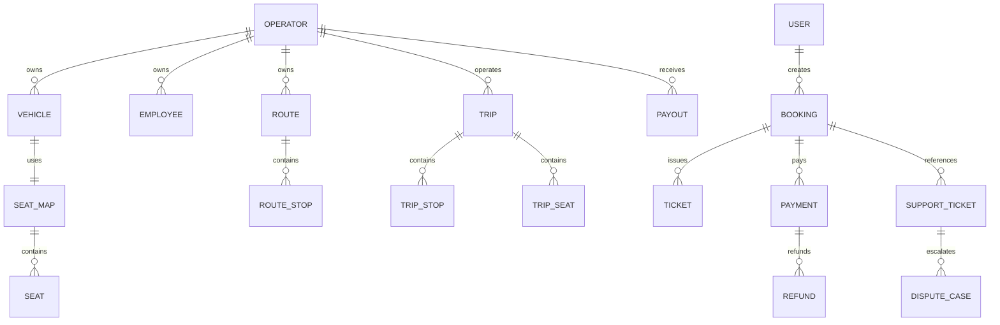

# 04. Database Design - Hệ thống đặt vé xe khách

## 1. Thông tin tài liệu

### 1.1. Metadata

| Thuộc tính   | Giá trị                          |
| ------------ | -------------------------------- |
| Tên tài liệu | Database Design                  |
| Mã tài liệu  | 04-database-design               |
| Dự án        | Hệ thống đặt vé xe khách         |
| Phiên bản    | v0.2                             |
| Trạng thái   | Draft                            |
| Người viết   | AI Agent                         |
| Người duyệt  | Nguyễn Hồng Khanh                |
| Ngày tạo     | 11/05/2026                       |

### 1.2. Lịch sử thay đổi

| Phiên bản | Ngày       | Người cập nhật | Nội dung thay đổi                                   |
| --------- | ---------- | -------------- | --------------------------------------------------- |
| v0.2      | 12/05/2026 | AI Agent       | Đồng bộ quyết định LLD: SeatHold DB-authoritative hybrid và S3-compatible file storage |
| v0.1      | 11/05/2026 | AI Agent       | Tạo bản nháp Database Design từ SRS/HLD             |

---

## 2. Mục lục

1. Thông tin tài liệu
2. Mục lục
3. Giới thiệu
4. Nguyên tắc dữ liệu
5. Nhóm collection
6. Quan hệ dữ liệu mức cao
7. Index và constraint
8. Transaction, lock và idempotency
9. Retention, archive và soft delete
10. Migration strategy
11. Open Questions / TBD

---

## 3. Giới thiệu

Tài liệu này mô tả thiết kế dữ liệu mức database cho hệ thống. Bản nháp này định hướng collection, ownership, index, constraint, lock và transaction boundary; chi tiết field sẽ được hoàn thiện sau khi các OQ về payment, fare, refund, payout và KYC được chốt.

---

## 4. Nguyên tắc dữ liệu

| ID | Nguyên tắc |
| -- | ---------- |
| DB-PRIN-01 | Dữ liệu theo Operator phải có `operatorId` hoặc tenant boundary tương đương. |
| DB-PRIN-02 | Booking, Ticket, Payment, Refund, EscrowLedger và Payout phải truy vết hai chiều. |
| DB-PRIN-03 | Booking và Ticket phải lưu snapshot dữ liệu tại thời điểm mua. |
| DB-PRIN-04 | Không xóa cứng dữ liệu giao dịch/audit trong production. |
| DB-PRIN-05 | Index phải phục vụ query chính: search trip, tenant query, booking lookup, reconciliation, reporting. |

---

## 5. Nhóm collection

| Nhóm | Collection dự kiến | Chủ sở hữu module | Ghi chú |
| ---- | ------------------ | ----------------- | ------- |
| Identity | `users`, `admins`, `operators`, `employees`, `sessions`, `roles`, `permissions` | Identity & Access | Có account status và session revoke |
| Operator KYC | `operator_profiles`, `kyc_documents`, `bank_accounts`, `operator_status_histories` | Operator | File KYC dùng S3-compatible storage qua metadata/object key |
| Catalog | `provinces`, `wards`, `stop_points`, `vehicle_types`, `amenities` | Admin/Catalog | Dữ liệu chuẩn Platform |
| Transport | `vehicles`, `seat_maps`, `seats`, `routes`, `route_stops`, `trips`, `trip_stops`, `trip_seats`, `fares`, `fare_rules` | Transport Resource | Fare model còn TBD |
| Booking | `seat_holds`, `bookings`, `passenger_infos`, `tickets`, `ticket_qr_tokens`, `booking_status_histories` | Booking & Ticket | SeatHold cần TTL/lock |
| Promotion | `promotions`, `promotion_rules`, `promotion_redemptions`, `promotion_usage_limits` | Promotion | Snapshot vào booking |
| Payment | `payments`, `refunds`, `escrow_ledgers`, `commission_rules`, `payouts`, `reconciliation_records` | Payment | Ledger cần thiết kế kỹ trước tiền thật |
| Operation | `employee_assignments`, `check_in_events`, `journey_logs`, `incident_reports` | Employee Operations | Offline/sync cần version hoặc conflict policy |
| Support | `support_tickets`, `complaints`, `reviews`, `dispute_cases`, `attachments`, `operator_scorecards` | Support & Trust | Attachment dùng S3-compatible storage qua metadata/object key |
| Notification | `notifications`, `notification_deliveries`, `notification_preferences` | Notification | Delivery retry theo kênh |
| Audit | `audit_logs`, `policy_versions`, `policy_snapshots` | Audit | Có thể tách storage nếu cần |

---

## 6. Quan hệ dữ liệu mức cao

---

## 7. Index và constraint

| Collection | Index / constraint dự kiến | Mục đích |
| ---------- | -------------------------- | -------- |
| `users` | unique email/phone theo policy | Đăng ký/đăng nhập |
| `operators` | unique business identifier TBD, status index | KYC và quản trị |
| `employees` | `{ operatorId, username }` unique | Employee login trong tenant |
| `vehicles` | `{ operatorId, plateNumber }` unique | Tránh trùng xe trong Operator |
| `trip_seats` | `{ tripId, seatCode }` unique | Trạng thái ghế theo chuyến |
| `seat_holds` | TTL index `expiresAt`, `{ tripId, seatCode, status }` | Giữ ghế và tự hết hạn |
| `bookings` | unique `bookingCode`, `{ userId, createdAt }`, `{ operatorId, status }` | Tra cứu, lịch sử, tenant query |
| `tickets` | unique `ticketCode`, unique QR token hash | Vé và check-in |
| `payments` | unique `paymentCode`, unique provider transaction id nếu có | Idempotency callback |
| `refunds` | unique `refundCode`, `{ paymentId, status }` | Đối soát hoàn tiền |
| `escrow_ledgers` | `{ bookingId, paymentId }`, `{ operatorId, createdAt }` | Ledger và payout |
| `audit_logs` | `{ actorId, createdAt }`, `{ targetType, targetId }` | Truy xuất audit |

---

## 8. Transaction, lock và idempotency

| Nghiệp vụ | Cơ chế bắt buộc | Ghi chú |
| --------- | --------------- | ------- |
| SeatHold | DB-authoritative hybrid: conditional write / unique active invariant / TTL, có thể thêm lock service ngắn hạn | DB giữ nguồn đúng sai cuối; lock service không thay thế invariant dữ liệu |
| Create booking | Kiểm SeatHold và tạo booking trong boundary nhất quán | Không tạo booking nếu hold hết hạn |
| Payment callback | Idempotency theo payment id/provider transaction id | Không ghi tiền trùng |
| Ticket issuance | Idempotent theo booking item / passenger / seat | Không tạo trùng ticket |
| Refund | Idempotency theo refund request/provider refund id | Không hoàn tiền trùng |
| Payout | Ledger-based calculation | Cần chống payout trùng |

---

## 9. Retention, archive và soft delete

| Dữ liệu | Chính sách nháp |
| ------- | --------------- |
| Booking, ticket, payment, refund | Không xóa cứng trong production; soft delete/archive theo policy |
| Audit log | Không sửa, không xóa cứng; retention TBD |
| KYC document | Lưu theo quy định pháp lý và hợp đồng; retention TBD |
| Notification delivery | Lưu trạng thái gửi để tra soát; retention TBD |
| Session | Có TTL/revoke; có thể archive login history |

---

## 10. Migration strategy

| Giai đoạn | Nội dung |
| --------- | -------- |
| DB-MIG-01 | Chốt schema và enum target từ SRS/HLD/LLD trước khi tạo migration. |
| DB-MIG-02 | Tạo index cho tenant query, search, booking lookup, payment reconciliation. |
| DB-MIG-03 | Seed catalog tối thiểu: tỉnh/thành, stop point mẫu, vehicle type, admin account. |
| DB-MIG-04 | Backfill trạng thái từ code hiện tại sang enum target nếu có dữ liệu cũ. |
| DB-MIG-05 | Kiểm rollback cho migration enum/index quan trọng. |

---

## 11. Open Questions / TBD

| ID | Câu hỏi | Tác động |
| -- | ------- | -------- |
| DB-OQ-01 | ĐÃ CHỐT (12/05/2026): SeatHold dùng DB-authoritative hybrid; DB giữ invariant cuối cùng, lock service nếu có chỉ hỗ trợ giảm contention. | Schema, index, transaction/conditional write và concurrency test |
| DB-OQ-02 | Fare model gắn Route, Trip hay FareRule riêng? | Collection và index |
| DB-OQ-03 | EscrowLedger double-entry hay ledger đơn? | Payment/payout correctness |
| DB-OQ-04 | AuditLog lưu MongoDB hay storage riêng? | Retention, cost, query |
| DB-OQ-05 | ĐÃ CHỐT (12/05/2026): object storage dùng S3-compatible qua FileStorageProvider; production AWS S3 private bucket, local/dev MinIO; DB chỉ lưu metadata/object key. | Attachment schema, signed URL, retention, scan policy |
