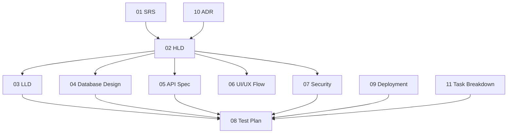

# 11. Project Task Breakdown - Hệ thống đặt vé xe khách

## 1. Thông tin tài liệu

### 1.1. Metadata

| Thuộc tính   | Giá trị                          |
| ------------ | -------------------------------- |
| Tên tài liệu | Project Task Breakdown           |
| Mã tài liệu  | 11-project-task-breakdown        |
| Dự án        | Hệ thống đặt vé xe khách         |
| Phiên bản    | v0.1                             |
| Trạng thái   | Draft                            |
| Người viết   | AI Agent                         |
| Người duyệt  | Nguyễn Hồng Khanh                |
| Ngày tạo     | 11/05/2026                       |

### 1.2. Lịch sử thay đổi

| Phiên bản | Ngày       | Người cập nhật | Nội dung thay đổi                         |
| --------- | ---------- | -------------- | ----------------------------------------- |
| v0.1      | 11/05/2026 | AI Agent       | Tạo bản nháp Project Task Breakdown       |

---

## 2. Mục lục

1. Thông tin tài liệu
2. Mục lục
3. Giới thiệu
4. Quy ước task
5. Dependency tổng quan
6. Task theo giai đoạn tài liệu
7. Task theo module triển khai
8. Definition of Done
9. Rủi ro kế hoạch
10. Open Questions / TBD

---

## 3. Giới thiệu

Tài liệu này chia nhỏ công việc từ SDLC sang task triển khai, kiểm thử và nghiệm thu. Bản nháp này chưa thay thế issue tracker chính thức.

---

## 4. Quy ước task

| Trường | Ý nghĩa |
| ------ | ------- |
| Task ID | `TASK-<GROUP>-NNN` |
| Nguồn | FR/UC/NFR/BR/tài liệu liên quan |
| Owner | BE/FE/Mobile/QA/DevOps/Reviewer |
| Dependency | Task hoặc tài liệu cần hoàn thành trước |
| Status | Draft / Ready / In Progress / Blocked / Done |
| DoD | Điều kiện hoàn thành |

---

## 5. Dependency tổng quan

---

## 6. Task theo giai đoạn tài liệu

| Task ID | Task | Nguồn | Owner | Dependency | Status |
| ------- | ---- | ----- | ----- | ---------- | ------ |
| TASK-DOC-001 | Đồng bộ SRS mục 13 với danh sách UC-01..UC-35 | SRS §12-13 | Reviewer/AI Agent | None | Draft |
| TASK-DOC-002 | Chốt OQ payment provider, seat hold TTL, payment-after, fare model | SRS §24 | Reviewer | TASK-DOC-001 | Draft |
| TASK-DOC-003 | Review và hoàn thiện HLD | 02 HLD | Reviewer/Architect | TASK-DOC-001 | Draft |
| TASK-DOC-004 | Hoàn thiện LLD module booking/payment/check-in | 03 LLD | Architect/BE | TASK-DOC-003 | Draft |
| TASK-DOC-005 | Hoàn thiện Database Design collection/index/lock | 04 DB | BE/Architect | TASK-DOC-002 | Draft |
| TASK-DOC-006 | Hoàn thiện API contract critical flows | 05 API | BE/FE/Mobile | TASK-DOC-004, TASK-DOC-005 | Draft |
| TASK-DOC-007 | Hoàn thiện UI/UX flow cho User/Operator/Employee/Admin | 06 UI/UX | FE/Mobile/Reviewer | TASK-DOC-003 | Draft |
| TASK-DOC-008 | Hoàn thiện Security permission matrix và threat control | 07 Security | BE/Security | TASK-DOC-003 | Draft |
| TASK-DOC-009 | Hoàn thiện Test Plan traceability | 08 Test | QA | TASK-DOC-004..008 | Draft |
| TASK-DOC-010 | Hoàn thiện Deployment/Operation runbook | 09 Ops | DevOps/BE | TASK-DOC-003 | Draft |

---

## 7. Task theo module triển khai

### 7.1. Foundation

| Task ID | Task | Nguồn | Owner | Dependency | Status |
| ------- | ---- | ----- | ----- | ---------- | ------ |
| TASK-FND-001 | Pin Node/npm hoặc ghi rõ version strategy | TECH-STACK | DevOps | None | Draft |
| TASK-FND-002 | Chuẩn hóa config/env validation | 09 Ops | BE | TASK-FND-001 | Draft |
| TASK-FND-003 | Thiết lập logging/request id/error format | 05 API, 09 Ops | BE | TASK-FND-002 | Draft |
| TASK-FND-004 | Thiết lập audit module base | 07 Security | BE | TASK-FND-003 | Draft |

### 7.2. IAM

| Task ID | Task | Nguồn | Owner | Dependency | Status |
| ------- | ---- | ----- | ----- | ---------- | ------ |
| TASK-IAM-001 | Hoàn thiện actor-specific login flow | FR-IAM-* | BE/FE/Mobile | TASK-FND-003 | Draft |
| TASK-IAM-002 | RBAC và tenant boundary guard | FR-IAM-06, SEC | BE | TASK-IAM-001 | Draft |
| TASK-IAM-003 | Session revoke/force logout/multi-device policy | FR-IAM-13..16 | BE | TASK-IAM-001 | Draft |
| TASK-IAM-004 | Admin/Operator/Employee account management | FR-IAM-04..08 | BE/FE | TASK-IAM-002 | Draft |

### 7.3. Transport resource

| Task ID | Task | Nguồn | Owner | Dependency | Status |
| ------- | ---- | ----- | ----- | ---------- | ------ |
| TASK-TRN-001 | Vehicle/VehicleType/SeatMap schema và API | FR-OPS-01..03 | BE/FE | TASK-DOC-005, TASK-DOC-006 | Draft |
| TASK-TRN-002 | Route/StopPoint schema và API | FR-OPS-04..05 | BE/FE | TASK-TRN-001 | Draft |
| TASK-TRN-003 | Trip/Fare/Inventory schema và API | FR-OPS-06..13 | BE/FE | TASK-TRN-002 | Draft |
| TASK-TRN-004 | Search index/cache cho trip | FR-MKT-01..04 | BE/FE | TASK-TRN-003 | Draft |

### 7.4. Booking, payment, ticket

| Task ID | Task | Nguồn | Owner | Dependency | Status |
| ------- | ---- | ----- | ----- | ---------- | ------ |
| TASK-BTP-001 | SeatHold lock/TTL implementation | FR-BTP-01..03 | BE | TASK-TRN-003, TASK-DOC-002 | Draft |
| TASK-BTP-002 | Booking snapshot và total calculation | FR-BTP-05..06 | BE/FE | TASK-BTP-001 | Draft |
| TASK-BTP-003 | Payment provider adapter và callback | FR-BTP-07..09 | BE | TASK-DOC-002, TASK-BTP-002 | Draft |
| TASK-BTP-004 | Ticket issuance và QR token | FR-BTP-10..11 | BE/FE/Mobile | TASK-BTP-003 | Draft |
| TASK-BTP-005 | Cancel/refund request flow | FR-BTP-12..14 | BE/FE | TASK-BTP-004 | Draft |
| TASK-BTP-006 | Escrow ledger, commission, payout base | FR-BTP-15..17 | BE/FE | TASK-BTP-003 | Draft |

### 7.5. Operator, Employee, Admin, Trust

| Task ID | Task | Nguồn | Owner | Dependency | Status |
| ------- | ---- | ----- | ----- | ---------- | ------ |
| TASK-OPR-001 | Operator onboarding/KYC/profile | FR-OPR-01..06 | BE/FE | TASK-IAM-004 | Draft |
| TASK-OPR-002 | Operator finance dashboard | FR-OPR-07..09 | BE/FE | TASK-BTP-006 | Draft |
| TASK-EMP-001 | Employee assignment/passenger list | FR-EMP-01..06 | BE/Mobile | TASK-IAM-004, TASK-TRN-003 | Draft |
| TASK-EMP-002 | QR check-in và trip status | FR-EMP-07..13 | BE/Mobile | TASK-BTP-004, TASK-EMP-001 | Draft |
| TASK-ADM-001 | Admin KYC/catalog/policy | FR-ADM-02..09 | BE/FE | TASK-IAM-004 | Draft |
| TASK-ADM-002 | Admin payment/refund/dispute/audit | FR-ADM-10..17, FR-DSP-* | BE/FE | TASK-BTP-005, TASK-FND-004 | Draft |
| TASK-TRUST-001 | Review/support/complaint/dispute workflow | FR-NSR-06..11, FR-DSP-* | BE/FE | TASK-BTP-004 | Draft |

### 7.6. Notification, reporting, operation

| Task ID | Task | Nguồn | Owner | Dependency | Status |
| ------- | ---- | ----- | ----- | ---------- | ------ |
| TASK-NSR-001 | Notification event + delivery retry | FR-NSR-01..05 | BE | TASK-FND-003 | Draft |
| TASK-NSR-002 | Notification preference | FR-NSR-14 | BE/FE/Mobile | TASK-NSR-001 | Draft |
| TASK-RPT-001 | Operator reporting | FR-NSR-12 | BE/FE | TASK-BTP-006 | Draft |
| TASK-RPT-002 | Admin reporting | FR-NSR-13 | BE/FE | TASK-RPT-001 | Draft |
| TASK-OPS-001 | Deployment pipeline/staging smoke test | 09 Ops | DevOps/BE | TASK-FND-001 | Draft |

---

## 8. Definition of Done

| Nhóm task | DoD tối thiểu |
| --------- | ------------- |
| Backend | FR/UC linked, DTO validation, service logic, schema/index, RBAC/ownership, error code, tests |
| Frontend | API contract linked, loading/error/empty/permission state, responsive, form validation |
| Mobile | Secure token storage, offline/sync state nếu có, permission state, E2E critical flow |
| Database | Schema/index reviewed, migration/rollback, seed data nếu cần |
| Security | RBAC/ownership test, audit log, no sensitive logging |
| QA | Test case, evidence, regression, critical pass |
| DevOps | Config/secret, deployment checklist, monitoring, rollback |

---

## 9. Rủi ro kế hoạch

| Rủi ro | Tác động | Giảm thiểu |
| ------ | -------- | ---------- |
| SRS mục 13 chưa đồng bộ UC-25..UC-35 | Sai task/API/UI | Chốt TASK-DOC-001 trước |
| Payment provider chưa chốt | Chặn callback/API/test | Chốt OQ trước TASK-BTP-003 |
| SeatHold lock chưa chốt | Rủi ro bán trùng ghế | Ưu tiên DB/LLD concurrency |
| Fare/refund/payout policy chưa chốt | Sai schema và tính tiền | Chốt OQ với Reviewer |
| Thiếu Security Design chi tiết | Rủi ro IDOR/tenant leak | Hoàn thiện 07 trước triển khai quyền |

---

## 10. Open Questions / TBD

| ID | Câu hỏi | Tác động |
| -- | ------- | -------- |
| TASK-OQ-01 | Issue tracker chính thức là GitHub Issues, Linear hay công cụ khác? | Task sync |
| TASK-OQ-02 | Ưu tiên release MVP là Marketplace trước hay Operator OS trước? | Sprint plan |
| TASK-OQ-03 | Ai là owner từng nhóm BE/FE/Mobile/QA/DevOps? | Assignment |
| TASK-OQ-04 | Có cần chia milestone theo module hay theo end-to-end flow? | Roadmap |
